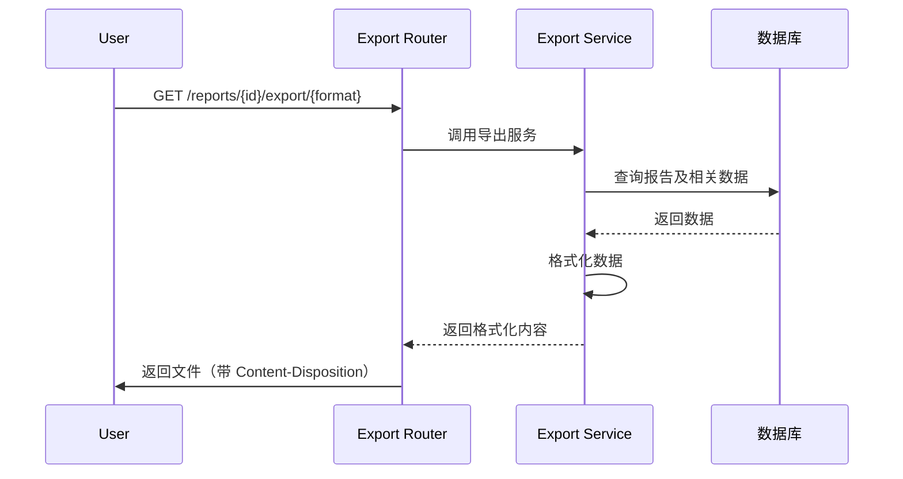

# FUN-004: 报告导出功能 (Report Export)

## 1. 功能概述

- **功能 ID**: FUN-004
- **功能名称**: 报告导出功能
- **业务目标**: 支持将测试报告导出为多种格式（JSON、Markdown、CSV），便于离线查看和数据分析
- **触发角色**: 用户（通过 Web UI 或 API）
- **前置条件**: 后端服务正常运行，存在测试报告数据

## 2. 接口定义 (API)

### 2.1 导出单个报告为 JSON

- **路径**: `GET /reports/{report_id}/export/json`
- **响应类型**: `application/json`
- **下载文件名**: `report_{report_id}.json`

**响应数据结构**:
```json
{
  "report": {
    "id": 1,
    "report_name": "Report for case_xxx",
    "status": "FINISHED",
    "final_score": 95.0,
    "created_at": "2026-02-24T05:35:44.537597",
    "updated_at": "2026-02-24T05:35:44.537597",
    "output_path": null
  },
  "result": {
    "final_score": 95,
    "result": "PASS",
    "summary": "...",
    "details": {...}
  },
  "plan": {
    "id": 1,
    "name": "PL1",
    "description": "..."
  },
  "case": {
    "case_id": "case_xxx",
    "name": "java",
    "source_code_path": "...",
    "wiki_path": "...",
    "yaml_path": "..."
  }
}
```

### 2.2 导出单个报告为 Markdown

- **路径**: `GET /reports/{report_id}/export/markdown`
- **响应类型**: `text/markdown`
- **下载文件名**: `report_{report_id}.md`

**Markdown 内容结构**:
```markdown
# {报告名称}

## 基本信息
- 报告 ID
- 状态
- 最终得分
- 创建/更新时间
- 测试计划/案例

## 案例文件
- 源代码路径
- Wiki 文档路径
- 配置文件路径

## 评估结果详情
### Stage 1: 结构覆盖度评估
### Stage 1.5: 解释对齐评估
### Stage 2: 工程价值评估
### Stage 3: 风险评分

## 原始数据
```json
{完整 JSON 结果}
```
```

### 2.3 导出单个报告为 CSV

- **路径**: `GET /reports/{report_id}/export/csv`
- **响应类型**: `text/csv`
- **下载文件名**: `report_{report_id}.csv`

**CSV 列**:
```
report_id,report_name,plan_id,plan_name,case_id,case_name,status,final_score,created_at,
stage1_judgement,stage1_5_judgement,stage2_judgement,stage3_base_score,stage3_risk_deduction
```

### 2.4 导出整个 Plan 的所有报告为 JSON

- **路径**: `GET /reports/plan/{plan_id}/export/json`
- **响应类型**: `application/json`
- **下载文件名**: `plan_{plan_id}_reports.json`

**响应数据结构**:
```json
{
  "plan": {
    "id": 1,
    "name": "PL1",
    "description": "...",
    "created_at": "...",
    "updated_at": "..."
  },
  "summary": {
    "total_reports": 10,
    "completed": 8,
    "failed": 2,
    "running": 0,
    "average_score": 92.5,
    "max_score": 98.0,
    "min_score": 85.0
  },
  "reports": [
    {
      "id": 1,
      "report_name": "...",
      "status": "FINISHED",
      "final_score": 95.0,
      "created_at": "...",
      "case_name": "java"
    }
  ]
}
```

### 2.5 导出整个 Plan 的所有报告为 Markdown

- **路径**: `GET /reports/plan/{plan_id}/export/markdown`
- **响应类型**: `text/markdown`
- **下载文件名**: `plan_{plan_id}_reports.md`

**Markdown 内容结构**:
```markdown
# Plan {id}: {name} - 测试报告汇总

## 计划信息

## 汇总统计
- 总报告数
- 已完成/失败/进行中
- 平均分/最高分/最低分

## 报告列表
| ID | 报告名称 | 案例 | 状态 | 得分 | 创建时间 |

## 各案例详细结果
### 1. {case_name}
- 报告名称
- 状态
- 得分
- 关键评估结果
```

### 2.6 导出整个 Plan 的所有报告为 CSV

- **路径**: `GET /reports/plan/{plan_id}/export/csv`
- **响应类型**: `text/csv`
- **下载文件名**: `plan_{plan_id}_reports.csv`

### 2.7 批量导出指定报告为 CSV

- **路径**: `POST /reports/export/csv`
- **Content-Type**: `application/json`
- **响应类型**: `text/csv`
- **下载文件名**: `reports_export.csv`

**请求参数**: `[report_id1, report_id2, ...]`

## 3. 业务逻辑流程

### 3.1 导出流程图



### 3.2 Markdown 导出核心规则

1. **Stage 结果解析**:
   - 从 result JSON 中提取各阶段评估结果
   - 显示 judgement、confidence、reasoning

2. **格式化要求**:
   - 使用 Mermaid 语法绘制流程图（如果数据支持）
   - 代码块使用语法高亮
   - 时间格式化为可读格式

### 3.3 CSV 导出核心规则

1. **字段提取**:
   - 从嵌套的 JSON 结果中提取各阶段 judgement 和分数
   - 关联查询 plan 和 case 的名称

2. **空值处理**:
   - NULL 值显示为空字符串
   - 数字保留两位小数

### 3.4 事务与一致性

- 导出是只读操作，不需要事务
- 使用数据库快照读取，确保数据一致性

## 4. 数据模型 (Data)

### 4.1 涉及表结构

主要使用现有表：
- `test_reports`: 报告数据
- `test_plans`: 计划数据
- `test_cases`: 案例数据

### 4.2 数据查询

**单个报告导出**:
```sql
SELECT * FROM test_reports WHERE id = ?
SELECT * FROM test_plans WHERE id = ?
SELECT * FROM test_cases WHERE case_id = ?
```

**Plan 导出**:
```sql
SELECT * FROM test_reports WHERE plan_id = ?
SELECT * FROM test_plans WHERE id = ?
```

### 4.3 索引建议

- `test_reports.plan_id`: 加速 Plan 导出查询
- `test_reports.case_id`: 加速案例报告查询

## 5. 非功能性需求

### 5.1 安全性

- **鉴权**: 当前无鉴权机制
- **数据访问控制**: 确保用户只能导出有权限的报告
- **文件路径安全**: 下载文件名使用参数化，防止路径遍历

### 5.2 性能要求

- **QPS**: 预期 50 QPS
- **响应时间**: 
  - 单个报告导出：< 500ms
  - Plan 导出（10 个报告）: < 2s
- **缓存策略**: 
  - 导出的文件可临时缓存（TTL: 300s）
  - 大 Plan 导出可考虑异步生成

### 5.3 日志与监控

**关键日志埋点**:
- 导出请求（记录格式和大小）
- 导出失败（记录错误原因）
- 大文件导出（> 10MB）

**报警指标**:
- 导出失败率 > 10%
- 导出响应时间 P95 > 5s
- 内存使用率突增

## 6. 待确认项 (TBD)

1. **导出格式扩展**: 是否需要支持 PDF、Excel 格式？
2. **异步导出**: 大 Plan 导出是否需要异步任务 + 通知？
3. **自定义模板**: 是否需要支持自定义 Markdown 模板？
4. **批量限制**: 单次导出报告数量是否需要限制（如最多 100 个）？
5. **导出历史**: 是否需要记录导出历史（谁、何时、导出了什么）？
6. **数据脱敏**: 是否需要支持敏感数据脱敏导出？
