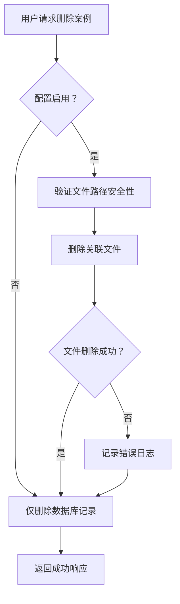
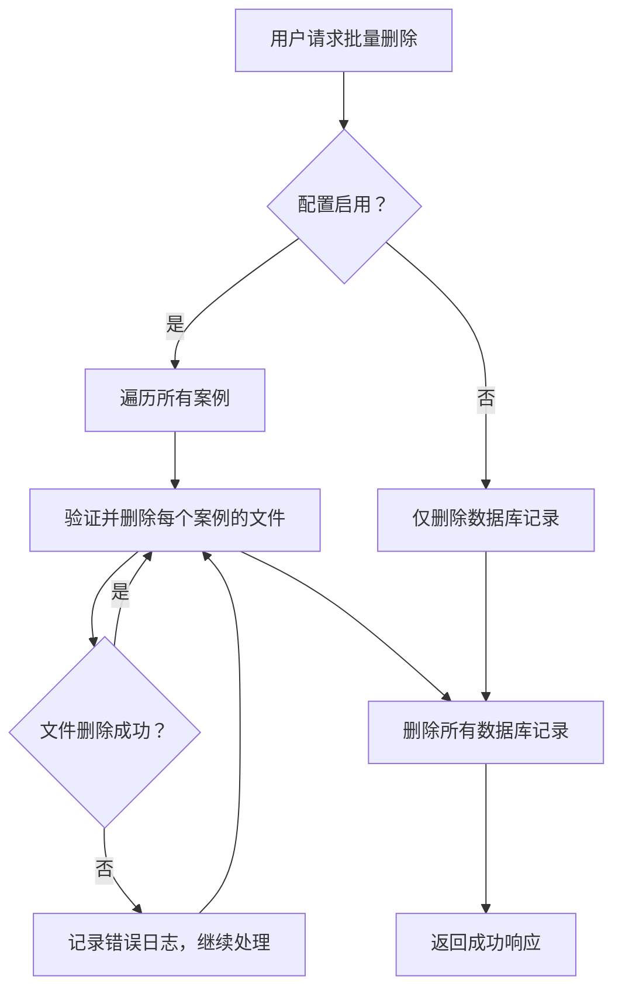

# FUN-006: 删除文件配置 (Delete File Config)

## 1. 功能概述

- **功能 ID**: FUN-006
- **功能名称**: 删除文件配置
- **业务目标**: 提供配置项控制删除测试案例时是否同步删除关联文件
- **触发角色**: 系统管理员（通过环境变量配置）
- **前置条件**: 后端服务正常运行

## 2. 配置项定义

### 2.1 DELETE_CASE_FILES_SYNC

| 属性 | 值 |
|------|-----|
| 类型 | 布尔值 |
| 默认值 | `false` |
| 环境变量 | `DELETE_CASE_FILES_SYNC` |
| 影响范围 | 全局 |

**行为说明**:
- `false`（默认）: 删除案例时仅删除数据库记录，保留关联文件
- `true`: 删除案例时同时删除数据库记录和关联文件（source_code_path, wiki_path, yaml_path）

## 3. 需求定义 (Requirements)

### Requirement: 配置项控制文件同步删除
系统应提供配置项 `DELETE_CASE_FILES_SYNC` 控制删除案例时是否同步删除关联文件。

#### Scenario: 配置项启用时删除案例
- **WHEN** `DELETE_CASE_FILES_SYNC=true` 且用户删除案例
- **THEN** 系统应删除数据库记录和关联的文件（source_code_path, wiki_path, yaml_path）

#### Scenario: 配置项禁用时删除案例
- **WHEN** `DELETE_CASE_FILES_SYNC=false`（默认值）且用户删除案例
- **THEN** 系统仅删除数据库记录，保留文件

#### Scenario: 配置项未设置时使用默认值
- **WHEN** 配置项 `DELETE_CASE_FILES_SYNC` 未设置
- **THEN** 系统应使用默认值 `false`（不删除文件）

### Requirement: 文件删除失败处理
文件删除操作失败时不应影响数据库删除，但应记录错误日志。

#### Scenario: 文件删除失败
- **WHEN** 文件删除操作因权限不足或文件不存在而失败
- **THEN** 系统应记录 ERROR 日志，但继续删除数据库记录

#### Scenario: 文件路径验证
- **WHEN** 文件路径不在 `data/cases/` 目录下
- **THEN** 系统应跳过该文件的删除并记录警告日志

### Requirement: 批量删除文件清理
批量删除案例时应根据配置项决定是否删除所有关联文件。

#### Scenario: 批量删除启用文件清理
- **WHEN** `DELETE_CASE_FILES_SYNC=true` 且用户批量删除多个案例
- **THEN** 系统应删除所有案例的数据库记录和关联文件

#### Scenario: 批量删除部分文件删除失败
- **WHEN** 批量删除时部分案例的文件删除失败
- **THEN** 系统应记录每个失败案例的错误日志，继续处理其他案例

## 4. 业务逻辑流程

### 4.1 单个案例删除流程



### 4.2 批量案例删除流程



### 4.3 核心规则

1. **路径安全验证**: 仅删除 `data/cases/` 目录下的文件
2. **错误隔离**: 文件删除失败不影响数据库删除操作
3. **日志记录**: 所有文件删除操作都应记录日志
4. **默认行为**: 配置未设置时默认不删除文件（向后兼容）

## 5. 非功能性需求

### 5.1 安全性

- **路径遍历防护**: 严格验证文件路径在 `data/cases/` 目录下
- **权限检查**: 删除文件前检查文件系统权限
- **操作审计**: 记录所有文件删除操作日志

### 5.2 日志与监控

**关键日志埋点**:
- 配置项启用/禁用状态
- 文件删除成功/失败
- 路径验证失败（潜在安全问题）

**日志级别**:
- INFO: 成功删除文件、配置状态
- WARNING: 文件不存在、路径不在安全目录内
- ERROR: 权限不足、删除失败

## 6. 配置示例

### 6.1 开发环境（保留文件）

```bash
# .env
DELETE_CASE_FILES_SYNC=false
```

### 6.2 生产环境（同步删除）

```bash
# .env
DELETE_CASE_FILES_SYNC=true
```

## 7. 相关功能

- **FUN-001**: 测试案例管理 - 删除案例接口受此配置影响
- **配置管理**: 通过环境变量管理配置
