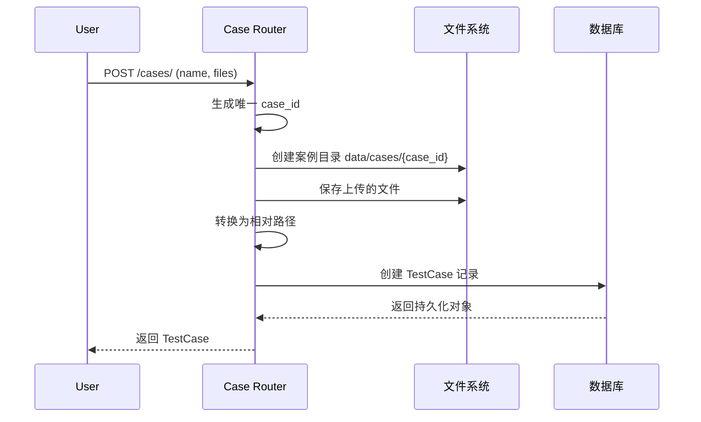

# FUN-001: 测试案例管理 (Case Management)

## 1. 功能概述

- **功能 ID**: FUN-001
- **功能名称**: 测试案例管理
- **业务目标**: 提供测试案例的 CRUD 操作，支持上传源代码、Wiki 文档和配置文件，为评估系统提供输入数据
- **触发角色**: 用户（通过 Web UI 或 API）
- **前置条件**: 后端服务正常运行，数据库可用

## 2. 接口定义 (API)

### 2.1 创建测试案例

- **路径**: `POST /cases/`
- **Content-Type**: `multipart/form-data`

**请求参数**:
| 字段 | 类型 | 必填 | 说明 |
|------|------|------|------|
| name | string | 是 | 案例名称 |
| source_code | file | 否 | 源代码文件 |
| wiki | file | 否 | Wiki 文档文件 |
| yaml_file | file | 否 | 配置文件 |

**响应数据**:
| 字段 | 类型 | 说明 |
|------|------|------|
| case_id | string | 案例唯一标识（自动生成） |
| name | string | 案例名称 |
| source_code_path | string | 源代码文件路径 |
| wiki_path | string | Wiki 文档路径 |
| yaml_path | string | 配置文件路径 |
| id | integer | 数据库主键 ID |
| created_at | datetime | 创建时间 |
| updated_at | datetime | 更新时间 |

**错误码**:
| Code | 含义 | 处理建议 |
|------|------|----------|
| 400 | 请求参数错误 | 检查必填字段 |
| 413 | 文件过大 | 文件大小不超过 16MB |
| 415 | 不支持的文件类型 | 检查文件扩展名 |
| 500 | 服务器内部错误 | 检查文件存储权限 |

### 2.2 获取案例列表

- **路径**: `GET /cases/`

**请求参数**:
| 字段 | 类型 | 必填 | 说明 |
|------|------|------|------|
| skip | integer | 否 | 跳过的记录数（默认 0） |
| limit | integer | 否 | 限制返回的记录数（默认 100） |
| order_by | string | 否 | 排序方式（created_at_desc/created_at_asc/name_asc/name_desc） |

**响应数据**: `TestCase[]`（数组）

### 2.3 获取单个案例

- **路径**: `GET /cases/{case_id}`

**请求参数**:
| 字段 | 类型 | 必填 | 说明 |
|------|------|------|------|
| case_id | string | 是 | 案例 ID（路径参数） |

**响应数据**: `TestCase` 对象

**错误码**:
| Code | 含义 | 处理建议 |
|------|------|----------|
| 404 | Case not found | 检查 case_id 是否正确 |

### 2.4 更新案例

- **路径**: `PUT /cases/{case_id}`
- **Content-Type**: `application/json`

**请求参数**:
| 字段 | 类型 | 必填 | 说明 |
|------|------|------|------|
| name | string | 否 | 案例名称 |
| source_code_path | string | 否 | 源代码路径 |
| wiki_path | string | 否 | Wiki 路径 |
| yaml_path | string | 否 | 配置文件路径 |

### 2.5 更新案例文件

- **路径**: `POST /cases/{case_id}/update_files`
- **Content-Type**: `multipart/form-data`

**请求参数**:
| 字段 | 类型 | 必填 | 说明 |
|------|------|------|------|
| name | string | 否 | 案例名称 |
| source_code | file | 否 | 源代码文件 |
| wiki | file | 否 | Wiki 文档文件 |
| yaml_file | file | 否 | 配置文件 |

### 2.6 删除案例

- **路径**: `DELETE /cases/{case_id}`

**错误码**:
| Code | 含义 | 处理建议 |
|------|------|----------|
| 404 | Case not found | 检查 case_id 是否正确 |

### 2.7 批量删除案例

- **路径**: `DELETE /cases/`
- **Content-Type**: `application/json`

**请求参数**: `["case_id1", "case_id2", ...]`

### 2.8 运行案例

- **路径**: `POST /cases/{case_id}/run`

**响应数据**:
| 字段 | 类型 | 说明 |
|------|------|------|
| case_id | string | 案例 ID |
| result | object | 评估结果（包含 final_score、result 等） |
| report_id | integer | 生成的报告 ID |

## 3. 业务逻辑流程

### 3.1 创建案例流程图

### 3.2 核心规则

1. **case_id 生成规则**: `case_{uuid4().hex[:8]}`，确保唯一性
2. **文件存储路径**: `data/cases/{case_id}/`
3. **路径存储规则**: 数据库中存储相对路径（相对于项目根目录）
4. **文件安全验证**:
   - 允许的文件扩展名：`.txt`, `.md`, `.java`, `.py`, `.js`, `.ts`, `.sql`, `.yaml`, `.yml`, `.json`
   - 最大文件大小：16MB

### 3.3 事务与一致性

- 数据库操作使用 SQLAlchemy 会话管理
- 文件上传失败时，已上传的文件不会自动回滚（需要手动清理）
- 删除案例时，仅删除数据库记录，不删除文件（需要额外实现）

## 4. 数据模型 (Data)

### 4.1 涉及表结构

**test_cases 表**:
| 字段 | 类型 | 约束 | 说明 |
|------|------|------|------|
| id | INTEGER | PRIMARY KEY, AUTOINCREMENT | 主键 |
| case_id | VARCHAR | UNIQUE, NOT NULL, INDEX | 案例唯一标识 |
| name | VARCHAR | NOT NULL, INDEX | 案例名称 |
| source_code_path | VARCHAR | NULLABLE | 源代码路径 |
| wiki_path | VARCHAR | NULLABLE | Wiki 文档路径 |
| yaml_path | VARCHAR | NULLABLE | 配置文件路径 |
| created_at | DATETIME | DEFAULT CURRENT_TIMESTAMP | 创建时间 |
| updated_at | DATETIME | DEFAULT CURRENT_TIMESTAMP | 更新时间 |

### 4.2 数据变更

- **创建**: 插入新记录，自动生成 case_id 和 timestamps
- **更新**: 更新指定字段，自动更新 updated_at
- **删除**: 物理删除记录

### 4.3 索引建议

- `case_id`: 唯一索引（已有）
- `name`: 普通索引（已有）
- `created_at`: 建议添加索引用于排序优化

## 5. 非功能性需求

### 5.1 安全性

- **鉴权**: 当前无鉴权机制，建议添加 JWT 或 API Key 认证
- **文件上传安全**:
  - 限制文件扩展名（白名单机制）
  - 限制文件大小（16MB）
  - 文件存储在独立目录，禁止直接访问
- **SQL 注入防护**: 使用 SQLAlchemy ORM 参数化查询

### 5.2 性能要求

- **QPS**: 预期 100 QPS
- **响应时间**: 
  - 简单查询（GET）: < 100ms
  - 文件上传（POST）: < 2s（取决于文件大小）
- **缓存策略**: 案例列表可考虑添加 Redis 缓存（TTL: 60s）

### 5.3 日志与监控

**关键日志埋点**:
- 案例创建成功/失败
- 文件上传失败（记录文件名和大小）
- 案例删除操作

**报警指标**:
- 文件上传失败率 > 5%
- API 响应时间 P95 > 1s
- 数据库连接池使用率 > 80%

## 6. 待确认项 (TBD)

1. **文件清理机制**: 删除案例时是否同步删除文件？建议添加配置项控制
2. **文件版本管理**: 更新文件时是否需要保留历史版本？
3. **批量上传**: `/cases/batch` 接口未实现完整逻辑，需要补充
4. **大文件处理**: 超过 16MB 的文件是否需要支持分片上传？
5. **鉴权机制**: 是否需要添加用户认证和权限控制？
6. **审计日志**: 是否需要记录所有操作的审计日志？
