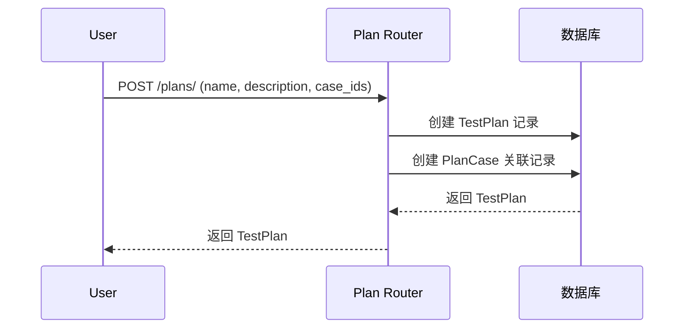
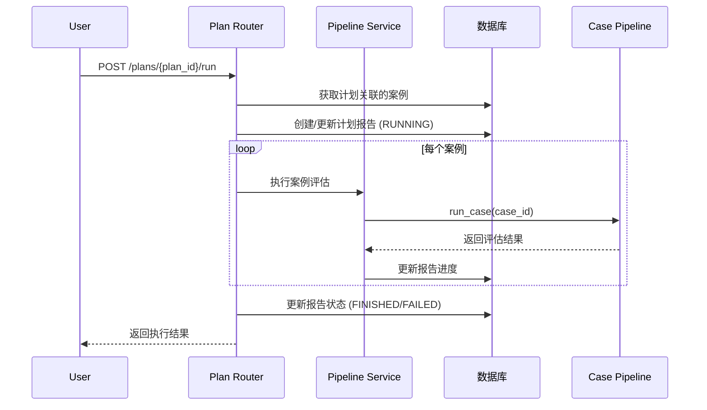

# FUN-002: 测试计划管理 (Plan Management)

## 1. 功能概述

- **功能 ID**: FUN-002
- **功能名称**: 测试计划管理
- **业务目标**: 提供测试计划的 CRUD 操作，支持将多个测试案例组织成计划，批量执行评估
- **触发角色**: 用户（通过 Web UI 或 API）
- **前置条件**: 后端服务正常运行，数据库可用，至少存在一个测试案例

## 2. 接口定义 (API)

### 2.1 创建测试计划

- **路径**: `POST /plans/`
- **Content-Type**: `application/json`

**请求参数**:
| 字段 | 类型 | 必填 | 说明 |
|------|------|------|------|
| name | string | 是 | 计划名称 |
| description | string | 否 | 计划描述 |
| case_ids | string[] | 否 | 关联的案例 ID 列表 |

**响应数据**:
| 字段 | 类型 | 说明 |
|------|------|------|
| id | integer | 计划 ID |
| name | string | 计划名称 |
| description | string | 计划描述 |
| created_at | datetime | 创建时间 |

### 2.2 获取计划列表

- **路径**: `GET /plans/`

**请求参数**:
| 字段 | 类型 | 必填 | 说明 |
|------|------|------|------|
| skip | integer | 否 | 跳过的记录数（默认 0） |
| limit | integer | 否 | 限制返回的记录数（默认 100） |
| order_by | string | 否 | 排序方式 |

### 2.3 获取单个计划

- **路径**: `GET /plans/{plan_id}`

**错误码**:
| Code | 含义 | 处理建议 |
|------|------|----------|
| 404 | Plan not found | 检查 plan_id 是否正确 |

### 2.4 更新计划

- **路径**: `PUT /plans/{plan_id}`
- **Content-Type**: `application/json`

**请求参数**:
| 字段 | 类型 | 必填 | 说明 |
|------|------|------|------|
| name | string | 否 | 计划名称 |
| description | string | 否 | 计划描述 |
| case_ids | string[] | 否 | 关联的案例 ID 列表 |

### 2.5 删除计划

- **路径**: `DELETE /plans/{plan_id}`

### 2.6 批量删除计划

- **路径**: `DELETE /plans/`
- **Content-Type**: `application/json`

**请求参数**: `[plan_id1, plan_id2, ...]`

### 2.7 运行计划

- **路径**: `POST /plans/{plan_id}/run`

**响应数据**:
| 字段 | 类型 | 说明 |
|------|------|------|
| plan_id | integer | 计划 ID |
| result | object | 执行结果（包含 average_score、results 等） |
| report_id | integer | 生成的汇总报告 ID |

**执行流程**:
1. 获取计划关联的所有案例
2. 创建计划报告（状态：RUNNING）
3. 依次执行每个案例
4. 更新报告状态和分数
5. 返回执行结果

## 3. 业务逻辑流程

### 3.1 创建计划流程图

### 3.2 运行计划流程图

### 3.3 核心规则

1. **计划 - 案例关联**: 通过 `plan_cases` 中间表实现多对多关系
2. **运行状态跟踪**: 
   - RUNNING: 计划正在执行
   - FINISHED: 所有案例执行成功
   - PARTIAL_SUCCESS: 部分案例执行成功
   - FAILED: 所有案例执行失败
3. **分数计算**: 平均分 = 所有成功案例分数之和 / 成功案例数量

### 3.4 事务与一致性

- 创建计划时，计划和关联记录在同一个事务中
- 运行计划时，每个案例独立执行，单个失败不影响其他案例
- 报告状态更新使用乐观锁（通过 updated_at 字段）

## 4. 数据模型 (Data)

### 4.1 涉及表结构

**test_plans 表**:
| 字段 | 类型 | 约束 | 说明 |
|------|------|------|------|
| id | INTEGER | PRIMARY KEY, AUTOINCREMENT | 主键 |
| name | VARCHAR | NOT NULL, INDEX | 计划名称 |
| description | TEXT | NULLABLE | 计划描述 |
| created_at | DATETIME | DEFAULT CURRENT_TIMESTAMP | 创建时间 |
| updated_at | DATETIME | DEFAULT CURRENT_TIMESTAMP | 更新时间 |

**plan_cases 表** (中间表):
| 字段 | 类型 | 约束 | 说明 |
|------|------|------|------|
| id | INTEGER | PRIMARY KEY, AUTOINCREMENT | 主键 |
| plan_id | INTEGER | FOREIGN KEY -> test_plans.id | 计划 ID |
| case_id | VARCHAR | FOREIGN KEY -> test_cases.case_id | 案例 ID |

### 4.2 数据变更

- **创建计划**: 插入 test_plans，批量插入 plan_cases
- **更新计划**: 更新 test_plans，先删除后插入 plan_cases
- **删除计划**: 先删除 plan_cases，再删除 test_plans

### 4.3 索引建议

- `test_plans.name`: 普通索引（已有）
- `plan_cases.plan_id`: 外键索引（建议添加）
- `plan_cases.case_id`: 外键索引（建议添加）

## 5. 非功能性需求

### 5.1 安全性

- **鉴权**: 当前无鉴权机制，建议添加
- **数据验证**: 
  - 检查 case_ids 是否存在
  - 检查计划名称唯一性（可选）
- **SQL 注入防护**: 使用 SQLAlchemy ORM

### 5.2 性能要求

- **QPS**: 预期 50 QPS
- **响应时间**: 
  - 简单查询：< 100ms
  - 运行计划：取决于案例数量和评估耗时
- **并发控制**: 同一计划不能同时运行多次（需要实现分布式锁）

### 5.3 日志与监控

**关键日志埋点**:
- 计划创建/删除
- 计划开始执行
- 每个案例执行结果
- 计划执行完成（包含成功率）

**报警指标**:
- 计划执行失败率 > 20%
- 单个案例执行超时 > 5 分钟
- 计划报告状态长时间为 RUNNING

## 6. 待确认项 (TBD)

1. **并发执行**: 是否需要支持同一计划并发运行多次？
2. **定时任务**: 是否需要支持定时自动执行计划？
3. **通知机制**: 计划执行完成后是否需要邮件/消息通知？
4. **执行历史**: 是否需要保留每次执行的完整历史记录？
5. **案例顺序**: 计划中的案例执行顺序是否需要用户指定？
6. **超时控制**: 单个案例或整个计划是否需要超时限制？
