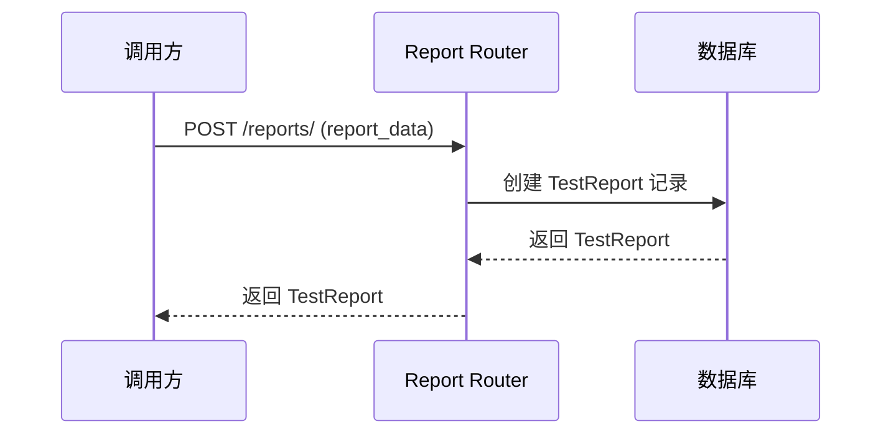
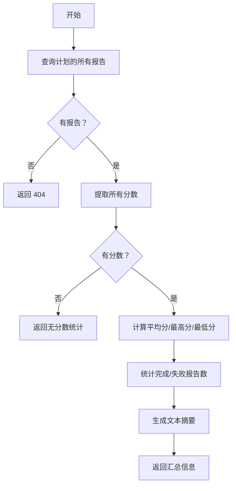

# FUN-003: 测试报告管理 (Report Management)

## 1. 功能概述

- **功能 ID**: FUN-003
- **功能名称**: 测试报告管理
- **业务目标**: 提供测试报告的 CRUD 操作，记录和展示案例/计划的评估结果
- **触发角色**: 用户（查询）、系统（自动创建）
- **前置条件**: 后端服务正常运行，数据库可用

## 2. 接口定义 (API)

### 2.1 创建报告

- **路径**: `POST /reports/`
- **Content-Type**: `application/json`

**请求参数**:
| 字段 | 类型 | 必填 | 说明 |
|------|------|------|------|
| report_name | string | 是 | 报告名称 |
| plan_id | integer | 否 | 关联的计划 ID |
| case_id | string | 否 | 关联的案例 ID |
| status | string | 否 | 状态（PENDING/RUNNING/FINISHED/FAILED/PARTIAL_SUCCESS） |
| final_score | number | 否 | 最终分数 |
| result | string | 否 | JSON 格式的详细结果 |
| output_path | string | 否 | 输出文件路径 |

**响应数据**: `TestReport` 对象

### 2.2 获取报告列表

- **路径**: `GET /reports/`

**请求参数**:
| 字段 | 类型 | 必填 | 说明 |
|------|------|------|------|
| skip | integer | 否 | 跳过的记录数（默认 0） |
| limit | integer | 否 | 限制返回的记录数（默认 100） |
| order_by | string | 否 | 排序方式 |

### 2.3 获取单个报告

- **路径**: `GET /reports/{report_id}`

**错误码**:
| Code | 含义 | 处理建议 |
|------|------|----------|
| 404 | Report not found | 检查 report_id 是否正确 |

### 2.4 更新报告

- **路径**: `PUT /reports/{report_id}`
- **Content-Type**: `application/json`

### 2.5 删除报告

- **路径**: `DELETE /reports/{report_id}`

### 2.6 批量删除报告

- **路径**: `DELETE /reports/`
- **Content-Type**: `application/json`

**请求参数**: `[report_id1, report_id2, ...]`

### 2.7 获取计划汇总

- **路径**: `GET /reports/plan/{plan_id}/summary`

**响应数据**:
| 字段 | 类型 | 说明 |
|------|------|------|
| plan_id | integer | 计划 ID |
| total_reports | integer | 总报告数 |
| completed_reports | integer | 完成的报告数 |
| failed_reports | integer | 失败的报告数 |
| average_score | number | 平均分 |
| max_score | number | 最高分 |
| min_score | number | 最低分 |
| summary | string | 文本摘要 |

**错误码**:
| Code | 含义 | 处理建议 |
|------|------|----------|
| 404 | No reports found for this plan | 该计划没有报告 |

## 3. 业务逻辑流程

### 3.1 报告创建流程图



### 3.2 计划汇总计算流程



### 3.3 核心规则

1. **报告类型**:
   - 案例报告：关联 case_id，记录单个案例的评估结果
   - 计划报告：关联 plan_id，记录整个计划的执行汇总

2. **状态流转**:
   ```
   PENDING -> RUNNING -> FINISHED
                        -> FAILED
                        -> PARTIAL_SUCCESS
   ```

3. **分数计算**:
   - 仅统计 status = FINISHED 的报告
   - 忽略 final_score 为 NULL 的记录

### 3.4 事务与一致性

- 报告创建使用独立事务
- 计划汇总计算是只读操作，不需要事务
- 批量删除使用单个事务，要么全部删除，要么全部不删除

## 4. 数据模型 (Data)

### 4.1 涉及表结构

**test_reports 表**:
| 字段 | 类型 | 约束 | 说明 |
|------|------|------|------|
| id | INTEGER | PRIMARY KEY, AUTOINCREMENT | 主键 |
| report_name | VARCHAR | NOT NULL, INDEX | 报告名称 |
| plan_id | INTEGER | FOREIGN KEY -> test_plans.id | 计划 ID |
| case_id | VARCHAR | FOREIGN KEY -> test_cases.case_id | 案例 ID |
| status | VARCHAR | INDEX | 状态 |
| final_score | FLOAT | NULLABLE | 最终分数 |
| result | TEXT | NULLABLE | JSON 格式结果 |
| output_path | VARCHAR | NULLABLE | 输出路径 |
| created_at | DATETIME | DEFAULT CURRENT_TIMESTAMP | 创建时间 |
| updated_at | DATETIME | DEFAULT CURRENT_TIMESTAMP | 更新时间 |

### 4.2 数据变更

- **创建**: 插入新记录
- **更新**: 更新状态、分数、结果等字段
- **删除**: 物理删除记录

### 4.3 索引建议

- `report_name`: 普通索引（已有）
- `status`: 普通索引（已有）
- `plan_id`: 外键索引（建议添加）
- `case_id`: 外键索引（建议添加）
- `created_at`: 建议添加索引用于排序优化

## 5. 非功能性需求

### 5.1 安全性

- **鉴权**: 当前无鉴权机制
- **数据验证**: 
  - 检查 plan_id/case_id 是否存在（外键约束）
  - 验证 status 的枚举值
- **SQL 注入防护**: 使用 SQLAlchemy ORM

### 5.2 性能要求

- **QPS**: 预期 200 QPS（读多写少）
- **响应时间**: 
  - 简单查询：< 50ms
  - 计划汇总：< 200ms
- **缓存策略**: 
  - 计划汇总结果可缓存（TTL: 300s）
  - 报告列表可缓存（TTL: 60s）

### 5.3 日志与监控

**关键日志埋点**:
- 报告创建（特别是失败报告）
- 计划汇总查询
- 批量删除操作

**报警指标**:
- 报告创建失败率 > 5%
- 计划汇总查询超时 > 1s
- 数据库存储空间不足

## 6. 待确认项 (TBD)

1. **报告归档**: 是否需要定期归档旧报告？
2. **结果压缩**: result 字段较大时是否需要压缩存储？
3. **全文搜索**: 是否需要支持报告内容的全文搜索？
4. **报告模板**: 是否需要支持自定义报告模板？
5. **数据保留**: 报告的保留策略是什么（永久/定期清理）？
6. **实时推送**: 是否需要 WebSocket 推送报告状态变更？
