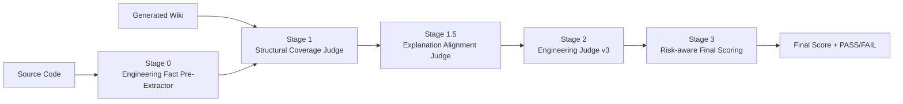
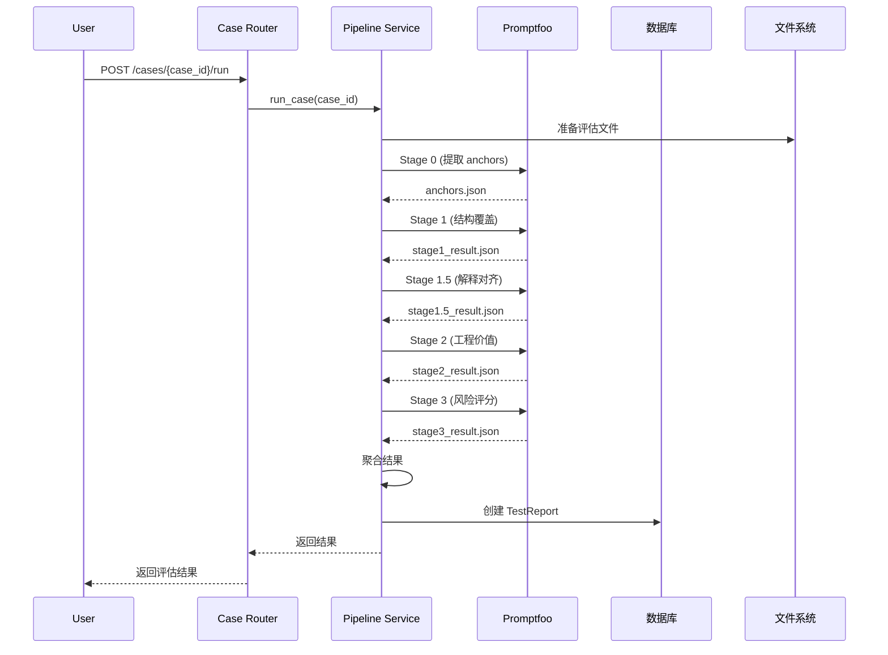

# FUN-005: 评估流水线 (Evaluation Pipeline)

## 1. 功能概述

- **功能 ID**: FUN-005
- **功能名称**: 评估流水线
- **业务目标**: 执行维基百科事实准确性评估，通过多阶段评估流程判断生成的工程文档是否提供了有价值的工程见解
- **触发角色**: 用户（运行案例/计划）、系统（定时任务）
- **前置条件**: 
  - 后端服务正常运行
  - promptfoo 已安装并配置
  - Ollama 服务运行（使用本地大语言模型）
  - 测试案例已上传（包含源代码和 Wiki 文档）

## 2. 接口定义 (API)

### 2.1 运行单个案例

- **路径**: `POST /cases/{case_id}/run`

**请求参数**:
| 字段 | 类型 | 必填 | 说明 |
|------|------|------|------|
| case_id | string | 是 | 案例 ID（路径参数） |

**响应数据**:
| 字段 | 类型 | 说明 |
|------|------|------|
| case_id | string | 案例 ID |
| result | object | 评估结果 |
| result.success | boolean | 是否成功 |
| result.result.final_score | number | 最终分数 |
| result.result.result | string | PASS/FAIL |
| result.result.summary | string | 评估摘要 |
| result.result.details | object | 详细评估结果 |
| report_id | integer | 生成的报告 ID |

**错误码**:
| Code | 含义 | 处理建议 |
|------|------|----------|
| 404 | Case not found | 检查 case_id |
| 500 | Pipeline execution failed | 检查 promptfoo 配置和模型服务 |

### 2.2 运行计划

- **路径**: `POST /plans/{plan_id}/run`

**响应数据**:
| 字段 | 类型 | 说明 |
|------|------|------|
| plan_id | integer | 计划 ID |
| result | object | 执行结果汇总 |
| result.total_cases | integer | 总案例数 |
| result.completed_cases | integer | 完成的案例数 |
| result.average_score | number | 平均分 |
| result.results | array | 每个案例的结果 |
| report_id | integer | 汇总报告 ID |

## 3. 业务逻辑流程

### 3.1 五阶段评估流程



### 3.2 各阶段详细说明

#### Stage 0: 工程事实预提取
- **输入**: 源代码
- **输出**: engineering_anchors.json（工程级锚点和事实）
- **工具**: promptfoo + YAML 配置
- **目的**: 为后续评估提供上下文

#### Stage 1: 结构覆盖度评估
- **输入**: engineering_anchors, source_code, wiki_md
- **判断**: Wiki 是否"严重脱离代码结构"
- **输出**: 
  - judgement: PASS/FAIL
  - confidence: 0-1
  - reasoning: 评估理由

#### Stage 1.5: 解释对齐评估
- **输入**: Stage 1 结果 + 额外上下文
- **判断**: Wiki 的解释是否来自代码、合理抽象、没有编造
- **输出**: 同 Stage 1

#### Stage 2: 工程价值评估
- **输入**: 前两阶段结果 + 完整上下文
- **评估维度**:
  - 理解支持度 (Comprehension Support)
  - 工程实用性 (Engineering Usefulness)
  - 解释合理性 (Explanation Reasonableness)
  - 抽象质量 (Abstraction Quality)
  - 伪造风险 (Fabrication Risk)
- **输出**: 综合判断 + 详细评分

#### Stage 3: 风险评分
- **输入**: 前三阶段结果
- **计算**: 
  - 基础分数（0-100）
  - 风险扣分（根据伪造类型和严重程度）
  - 最终分数 = 基础分数 - 风险扣分
- **输出**: final_score, PASS/FAIL

### 3.3 案例运行流程



### 3.4 核心规则

1. **文件路径处理**:
   - 使用绝对路径调用 promptfoo
   - 结果保存到 `data/output/{case_id}/`

2. **错误处理**:
   - 任一阶段失败，整个评估失败
   - 记录详细的错误日志
   - 返回友好的错误消息

3. **超时控制**:
   - 单个阶段超时：5 分钟
   - 整个案例超时：20 分钟

4. **结果聚合**:
   ```json
   {
     "success": true,
     "case_id": "case_xxx",
     "result": {
       "final_score": 95,
       "result": "PASS",
       "summary": "评估摘要",
       "details": {
         "comprehension_support": "HIGH",
         "engineering_usefulness": "HIGH",
         "explanation_reasonableness": "HIGH",
         "abstraction_quality": "GOOD",
         "fabrication_risk": "LOW"
       },
       "engineering_action": {
         "level": "PRIMARY_REFERENCE",
         "description": "可作为主要参考文档",
         "recommended_action": "可直接用于理解、调试和修改代码"
       }
     },
     "output_path": "data/output/case_xxx/final_score.json"
   }
   ```

### 3.5 事务与一致性

- 评估过程是无状态的，失败可重试
- 报告创建使用独立事务
- 评估结果文件原子写入（先写临时文件，再重命名）

## 4. 数据模型 (Data)

### 4.1 涉及表结构

**test_reports 表** (复用):
- 存储评估结果
- result 字段包含完整的五阶段评估 JSON

### 4.2 文件结构

```
data/
├── cases/
│   └── {case_id}/
│       ├── source_code.xxx
│       └── wiki.md
└── output/
    └── {case_id}/
        ├── anchors.json
        ├── stage1.json
        ├── stage1.5.json
        ├── stage2.json
        ├── stage3.json
        └── final_score.json
```

### 4.3 索引建议

- `test_reports.case_id`: 加速案例报告查询
- `test_reports.status`: 加速运行状态查询

## 5. 非功能性需求

### 5.1 安全性

- **命令注入防护**: 
  - promptfoo 命令参数使用数组形式传递
  - 禁止使用 shell=True
- **文件访问控制**: 限制访问 data 目录内的文件
- **模型服务隔离**: Ollama 服务运行在本地，不暴露到外网

### 5.2 性能要求

- **单次评估耗时**: 
  - Stage 0: 30-60 秒
  - Stage 1: 15-30 秒
  - Stage 1.5: 15-30 秒
  - Stage 2: 30-60 秒
  - Stage 3: 15-30 秒
  - 总计：2-4 分钟
- **并发限制**: 同时最多运行 4 个案例评估
- **资源使用**: 
  - CPU: < 80%
  - 内存：< 4GB per evaluation

### 5.3 日志与监控

**关键日志埋点**:
- 每个阶段的开始和结束时间
- promptfoo 命令执行输出
- 评估结果摘要
- 错误堆栈

**报警指标**:
- 评估失败率 > 20%
- 平均评估时间 > 5 分钟
- Ollama 服务不可用
- 磁盘空间不足（输出目录）

## 6. 待确认项 (TBD)

1. **模型配置**: 使用哪个 Ollama 模型？参数量多大？
2. **评估阈值**: PASS/FAIL 的分数阈值是多少？
3. **重试机制**: 评估失败是否自动重试？重试几次？
4. **结果缓存**: 相同输入是否需要缓存结果？
5. **人工复核**: 是否需要支持人工复核和修正评估结果？
6. **评估版本**: 如何管理评估逻辑的版本升级？
7. **多语言支持**: 是否支持非英文/中文的 Wiki 评估？
8. **自定义规则**: 是否支持用户自定义评估规则？
