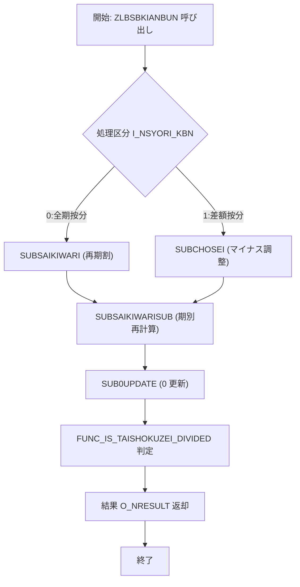
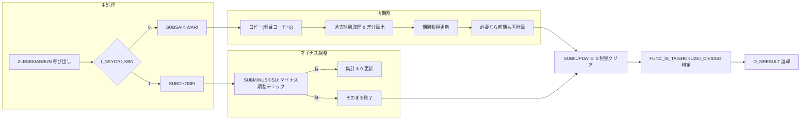

# 📄 ZLBSBKIANBUN.SQL – 計算期別内訳作成プロシージャ  

**ファイルパス**: `D:\code-wiki\projects\big\test_big_7\ZLBSBKIANBUN.SQL`  

---  

## 目次
1. [概要](#概要)  
2. [変更履歴](#変更履歴)  
3. [定数・型定義](#定数・型定義)  
4. [主要変数](#主要変数)  
5. [主要プロシージャ・関数](#主要プロシージャ・関数)  
6. [処理フロー概観](#処理フロー概観)  
7. [設計上のポイント・留意点](#設計上のポイント・留意点)  
8. [関連テーブル・ビュー](#関連テーブル・ビュー)  
9. [UML/フローチャート](#umlフローチャート)  
10. [リンク集](#リンク集)  

---  

## 概要
`ZLBSBKIANBUN` は **国民健康保険税（ZLB）** の「計算期別内訳」を作成するストアドプロシージャです。  
- 入力パラメータで処理区分、基準日、通知書番号、算定団体コード、世帯番号、実行区分などを受け取り、  
- 医療・介護・支援・子ども子育て支援金（KDM）それぞれの **全体税額・退職税額** を期別に算出・更新します。  
- 税額試算（実行区分＝2）の場合は退職税額を除外します。  

> **対象読者**: 新規開発者、保守担当者、税額計算ロジックを理解したいエンジニア  

---  

## 変更履歴
| 日付 | 担当者 | 内容 |
|------|--------|------|
| 2023/08/03 | ZCZL.LIUCHENYU | 初版作成 |
| 2024/02/29 | ZCZL.HAODAPENG | WizLIFE 2次開発対応（バージョン 0.3.000.000） |
| 2025/05/20 | jcbc.zei | QA14706 対応（バージョン ZLB_1.0.304.000） |
| 2025/08/11 | ZCZL.WANGMINGYANG | 子ども子育て支援金対応（バージョン 1.1.200.000） |

---  

## 定数・型定義
### 型（レコード・テーブル）
| 型名 | 内容 |
|------|------|
| `MTZEIGAKUR2` | 税額レコード（全体・退職・医療・介護・支援・子ども） |
| `MTKIBETSUR` | 期別レコード（物理期別・論理期別） |
| `MTKIBETSU` | `MTKIBETSUR` のインデックステーブル |
| `MTNUMARRAY4` / `MTNUMARRAY10` | 数値配列（4桁・10桁） |

### 定数（処理区分・科目コード等）
| 定数 | 値 | 意味 |
|------|----|------|
| `C_NOK` | 0 | 正常終了 |
| `C_NERR` | 1 | 異常終了 |
| `C_NSYORI_ZENKI` | 0 | 全期按分 |
| `C_NSYORI_SABUN` | 1 | 差額按分 |
| `C_NSHU_ZEN` | 0 | 全体処理 |
| `C_NSHU_TAI` | 1 | 退職処理 |
| `C_NKAMOKU_BASE` | 15 | 科目コード（作成元） |
| `C_NKAMOKU_NEW` | 0 | 科目コード（新規分） |
| `C_NKAMOKUS_FUTU` | 1 | 科目詳細コード：普通 |
| `C_NKAMOKUS_TOKU` | 2 | 科目詳細コード：特徴 |
| `C_NBATCH` | 0 | バッチ実行 |
| `C_NONLINE` | 1 | オンライン即時/期割 |
| `C_NTEST` | 2 | オンライン税額試算 |
| `c_NHASU_*` / `c_NHASU_KBN_*` | -3〜0 / 0〜3 | 端数処理区分 |

---  

## 主要変数
| 変数 | 型 | 用途 |
|------|----|------|
| `NLRTN` | NUMBER | 戻り値（正常/異常） |
| `VLMSG` | NVARCHAR2(100) | エラーメッセージ |
| `NLIRY_ABTAI_ZEI` 〜 `NLKAI_ABGAI_ZEI` | NUMBER(10) | 按分対象・外の医療・介護税額 |
| `NLFUKA_*` 系列 | NUMBER(10) | 計算期別の税額（医療・介護・全体・退職） |
| `MLZENZEI` 〜 `MLZEIGAKU` | `MTNUMARRAY10` | 税額配列（全体・医療・介護・支援・子ども） |
| `MLKIBETSU` | `MTKIBETSU` | 期別情報テーブル |
| `IZANTEIKIWAI_JCONS` など | PLS_INTEGER | フラグ類（按分・調整） |
| `NW*` 系列 | NUMBER | ループ・集計用一時変数（例: `NWZEIGAKU` = 税額差分） |

---  

## 主要プロシージャ・関数
| 名称 | 種別 | 主な役割 |
|------|------|----------|
| **`SUBSAIKIWARISUB`** | プロシージャ | 期別税額の再計算・差分調整（医療・介護・支援・子ども） |
| **`FUNCRKIBETSU_MAE`** | 関数 | 指定論理期別の直前期別取得（再計算時に使用） |
| **`SUBCHOSEI`** | プロシージャ | マイナス期割の検出・集計・0 へのリセット、再期割ロジック全体 |
| **`SUB0UPDATE`** | プロシージャ | 計算期別が 0 の場合に対象列を 0 に更新 |
| **`SUBMINUSKISU`** | プロシージャ | マイナス期割（税額が不整合）をカウント |
| **`FUNC_IS_TAISHOKUZEI_DIVIDED`** | 関数 | 退職税額が按分されているか判定 |
| **`SUBSAIKIWARI`** | プロシージャ | 再期割（マイナス調整）全体フロー：コピー → 再読込み → 調整 → 更新 |
| **`SUBSAIKIWARISUB`**（内部呼び出し） | プロシージャ | 再期割後の最終期別税額算出ロジック |

---  

## 処理フロー概観

### 主なステップ
1. **入力検証・定数設定**  
2. **マイナス期割チェック** (`SUBMINUSKISU`) → 0 なら `SUBCHOSEI` へ。  
3. **再期割ロジック** (`SUBSAIKIWARI`)  
   - 期別データコピー（科目コード＝0）  
   - 期別税額を過去・現在・将来の期で調整  
   - 必要に応じて 1 期前も含め再計算  
4. **期別税額再計算** (`SUBSAIKIWARISUB`)  
   - 医療・介護・支援・子どもそれぞれの全体・退職税額を算出  
   - `UPDATE ZLBTKIBETSU_CAL` で期別テーブルに反映  
5. **0 更新** (`SUB0UPDATE`) → 全体・退職が 0 の列をクリア  
6. **退職税額按分判定** (`FUNC_IS_TAISHOKUZEI_DIVIDED`) → 呼び出し元へフラグ返却  

---  

## 設計上のポイント・留意点
| 項目 | 内容 | 推奨改善 |
|------|------|----------|
| **可読性** | コメントは日本語だが、変数名が略称で意味が不明瞭（例: `NLRTN`, `NWZEIGAKU`） | 変数名にプレフィックス＋意味を付与（例: `v_return_code`） |
| **エラーハンドリング** | `WHEN OTHERS THEN` で `NLRTN`/`VLMSG` に設定し `RETURN` するが、呼び出し側でのチェックが散在 | 共通エラーハンドラプロシージャ化し、スタックトレースを残す |
| **SQL インジェクション** | 文字列結合でエラーメッセージ生成 → ログ出力は安全だが、将来的に動的 SQL が増える可能性 | バインド変数使用を徹底 |
| **パフォーマンス** | `SELECT SUM(...)` が多数あり、同一テーブルに対して何度も走る | 集計を一括で取得し、PL/SQL で分配することで I/O を削減 |
| **子ども支援金対応** | 2025/08/11 追加分が散在（`KDM_*`） | `KDM` 系列を別モジュールに切り出し、拡張しやすくする |
| **テスト容易性** | 大量の `UPDATE` が単体で実行されるため、テストが困難 | トランザクション制御（`SAVEPOINT/ROLLBACK`）でテスト用ラッパーを作成 |
| **ドキュメント** | 変更履歴はコメントに埋め込まれているが、外部 Wiki と同期が取れない | CI パイプラインでコメント抽出 → Wiki 自動生成スクリプトを導入 |

---  

## 関連テーブル・ビュー
| テーブル | 主なカラム | 用途 |
|----------|------------|------|
| `ZLBTKIBETSU_CAL` | `KAMOKU_CD`, `KAMOKUS_CD`, `KOKU_SETAI_NO`, `RONRIKIBETSU`, `ZEN_ZEIGAKU`, `TAI_ZEIGAKU`, `IR_ZEN_ZEIGAKU` など | 期別税額の保管テーブル（本プロシージャの全更新対象） |
| `ZLBTJOKEN` | （未使用） | 将来的にエラーログや処理結果を格納する想定テーブル |

---  

## UML/フローチャート

---  

## リンク集
| 内容 | リンク |
|------|--------|
| プロシージャ `ZLBSBKIANBUN` 本体 | [ZLBSBKIANBUN](http://localhost:3000/projects/big/wiki?file_path=D:/code-wiki/projects/big/test_big_7/ZLBSBKIANBUN.SQL) |
| 期別テーブル `ZLBTKIBETSU_CAL` 定義 | [ZLBTKIBETSU_CAL](http://localhost:3000/projects/big/wiki?file_path=テーブル定義/ZLBTKIBETSU_CAL.sql) |
| 子ども子育て支援金仕様書 | [子ども子育て支援金仕様](http://localhost:3000/projects/big/wiki?file_path=仕様書/子ども子育て支援金.md) |
| エラーハンドラ共通化案 | [エラーハンドラ設計](http://localhost:3000/projects/big/wiki?file_path=設計/エラーハンドラ.md) |

---  

### 最後に
このプロシージャは **税額の正確性** と **期別の整合性** を保つために多層的なロジックが組み込まれています。  
保守時は「**マイナス期割の有無**」と「**退職税額の按分**」を最優先で確認し、変更が必要な場合は **定数・型定義** の影響範囲を必ず把握した上で実装してください。  

> **Tip**: 変更履歴はコメントに埋め込まれているので、Git のコミットメッセージと合わせて管理すると、将来的なトレーサビリティが向上します。  