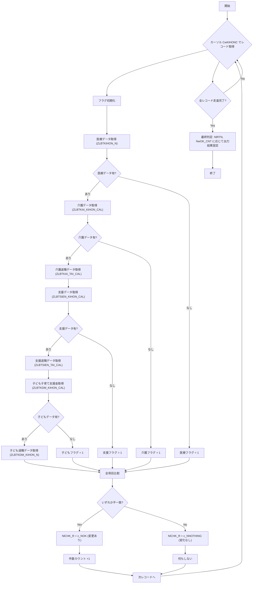

# 📚 Code Wiki – `ZLBSBUPCHK.SQL`（子ども子育て支援金対応版）

> **対象読者**  
> 新しくこのモジュールを担当する開発者、または保守・改修を行うエンジニア向けに、コードの全体像・主要ロジック・設計上のポイントを日本語でまとめました。  

---

## 目次
1. [ファイル概要](#概要)  
2. [主要テーブル・カラム一覧](#テーブル)  
3. [フラグ変数と意味](#フラグ)  
4. [主要プロシージャ](#プロシージャ)  
   - `subChkGennen`（過年度課税計算用）  
   - `subChkGennen2`（現年度課税計算用）  
5. [ロジックフロー（Mermaid）](#フロー)  
6. [子ども子育て支援金（KDM）追加ポイント](#KDM)  
7. [エラーハンドリングと例外処理](#エラー)  
8. [設計上の考慮点・改善余地](#設計)  
9. [リンク集（Wiki 参照）](#リンク)  

---

<a name="概要"></a>
## 1. ファイル概要
- **ファイル種別**：PL/SQL パッケージボディ（`ZLBSBUPCHK`）  
- **主目的**：  
  - 既存の計算結果（医療・介護・支援）と新しく取得した計算結果を比較し、変更があればフラグ `NlCHK_R` に `c_NOK`（変更あり）を設定。  
  - 変更が無い場合は `c_NNOTHING`（変化なし）を設定。  
  - 変更が無いかつ出力対象が無い場合は `c_NOK`（エラー）や `c_NERR`（例外）を返す。  
- **追加機能**：`2025/08/11` に子ども子育て支援金（KDM）対応ロジックが追加された。  

---

<a name="テーブル"></a>
## 2. 主要テーブル・カラム一覧
| テーブル | 用途 | 主なカラム（抜粋） |
|---|---|---|
| `ZLBTKIHON_CAL` / `ZLBTKIHON_N` | 計算（医療）基本・退職データ | `SEKISAN`, `GENDO_CHOKA`, `GENGAKU_KEI`, `NENZEI`, `KINTO_CNT`, `GENZAI_CNT`, `SHOTOKU` |
| `ZLBTKAI_KIHON_CAL` / `ZLBTKAI_KIHON_N` | 計算（介護）基本・退職データ | 同上 |
| `ZLBTSIEN_KIHON_CAL` / `ZLBTSIEN_KIHON_N` | 計算（支援）基本・退職データ | 同上 |
| `ZLBTKDM_KIHON_CAL` / `ZLBTKDM_KIHON_N` | **子ども子育て支援金（KDM）** 基本・退職データ | `SEKISAN`, `GENDO_CHOKA`, `GENGAKU_KEI`, `NENZEI`, `NUSHI_KOJIN_NO`, `KINTO_CNT`, `GENZAI_CNT`, `SHINKOKU_KBN`, `SHOTOKU`, `KINTO_CNT_KDM18` |
| `ZLBTKIBETSU_CAL` / `ZLBTKIBETSU_N` | 期別（年度）データ比較用 | `KAMOKU_CD` など |
| `ZLBTEXT_CAL` / `ZLBTEXT_N` | 旧被扶養者・失業者区分 | `H_KBN` |
| `ZLBTTOKU_KIHON_CAL` / `ZLBTTOKU_KIHON_N` | 計算対象者（特徴） | `JOTAI_KBN` |
| `ZLBTKIHON_CAL` 以外の `DELETE` 対象テーブル | 変更が無い場合に削除される対象 | `ZLBTKIHON_CAL`, `ZLBTTAI_CAL`, `ZLBTKAI_KIHON_CAL`, `ZLBTKAI_TAI_CAL`, `ZLBTSIEN_KIHON_CAL`, `ZLBTSIEN_TAI_CAL`, `ZLBTKDM_KIHON_CAL`（子ども） など |

> **備考**：`SYS_TANMATSU_NO` は「システム単位番号」＝バッチ実行単位を示すキー。

---

<a name="フラグ"></a>
## 3. フラグ変数と意味
| 変数 | 型 | 意味 |
|---|---|---|
| `NwIRY_FLG` | NUMBER(1) | 医療データ有無（0＝有、1＝無） |
| `NwKAI_FLG` | NUMBER(1) | 介護データ有無 |
| `NwSIEN_FLG` | NUMBER(1) | 支援データ有無 |
| `NwKDM_FLG` | NUMBER(1) | **子ども子育て支援金データ有無**（2025 追加） |
| `NlCHK_R` | NUMBER | 変更判定結果：`c_NOK`（変更あり） / `c_NNOTHING`（変化なし） |
| `NlRTN` | NUMBER | エラーコード：`c_NERR`（例外）  |
| `NwOK_CNT` | NUMBER | 変更対象件数カウント（最終的に出力対象があるか判定） |

---

<a name="プロシージャ"></a>
## 4. 主要プロシージャ

### 4.1 `subChkGennen`（過年度課税計算用）

1. **カーソル `CwKIHONC`** で `ZLBTKIHON_CAL`（計算結果）を全件走査。  
2. 各レコードについて **フラグ初期化**（`NwIRY_FLG`, `NwKAI_FLG`, `NwSIEN_FLG`, `NwKDM_FLG`）と **データ取得**（医療・介護・支援・子ども）を実施。  
3. **比較ロジック**  
   - すべての項目（税額・限度超過・減額・年税・均等人数・現在人数・所得）を **現行テーブル** と **新規テーブル** の値で比較。  
   - いずれかが不一致、または `NwKDM` が追加された場合は `NlCHK_R := c_NOK`。  
4. **削除処理**（変更が無い場合）  
   - `ZLBTKIHON_CAL` から対象レコードを `i_VTANMATSU_NO` に紐付く全テーブルへ `DELETE`。  
   - 子ども支援金テーブル `ZLBTKDM_KIHON_CAL` も同様に削除対象に含める。  
5. **ループ終了後**：`NwOK_CNT` が 0 なら `c_NNOTHING`、1 以上なら `c_NOK` を `NlCHK_R` に設定。  

### 4.2 `subChkGennen2`（現年度課税計算用）

- `subChkGennen` と同様の流れだが、**比較対象が `ZLBTKIHON_N`（最新）** になる点が異なる。  
- 追加された **子ども子育て支援金（KDM）** の取得・比較ロジックが **`BEGIN … EXCEPTION`** ブロックで実装されている。  
- **医療・介護・支援** の取得失敗時に `NwIRY_FLG`, `NwKAI_FLG`, `NwSIEN_FLG`, `NwKDM_FLG` を `1` に設定し、以降の比較はスキップ。  

> 両プロシージャは **同一ロジック** を年度ごとに分割しているだけで、フラグや比較項目は完全に一致します。

---

<a name="フロー"></a>
## 5. ロジックフロー（Mermaid）



---

<a name="KDM"></a>
## 6. 子ども子育て支援金（KDM）追加ポイント

### 6.1 変数・フラグ
- `NwKDM_FLG`：子どもデータの有無（0＝有、1＝無）  
- `NwKDMKIHONC_…` 系列：**計算子ども基本取得データ**（当年度）  
- `NwKDMKIHONN_…` 系列：**賦課子ども基本取得データ**（最新）  

### 6.2 取得ロジック
```plsql
-- 計算子ども基本取得（当年度）
SELECT NVL(SEKISAN,0), NVL(GENDO_CHOKA,0), …, NVL(KINTO_CNT_KDM18,0)
INTO NwKDMKIHONC_…
FROM ZLBTKDM_KIHON_CAL
WHERE … AND SYS_TANMATSU_NO = i_VTANMATSU;
```
- `NO_DATA_FOUND` → `NwKDM_FLG := 1`（子どもデータなし）  
- 例外 → `c_NERR` でバッチ全体を中断  

### 6.3 賦課子どもデータ取得（最新）
```plsql
SELECT NVL(SEKISAN,0), …, NVL(KINTO_CNT_KDM18,0)
INTO NwKDMKIHONN_…
FROM ZLBTKDM_KIHON_N
WHERE …;
```
- 同様に `NO_DATA_FOUND` → `NwKDM_FLG := 1`  

### 6.4 比較条件への組み込み
```plsql
IF NwIRY_FLG = 0 AND NwKAI_FLG = 0 AND NwSIEN_FLG = 0 AND NwKDM_FLG = 0 THEN
    -- 医療・介護・支援・子ども全てデータが揃っているケース
    IF  (医療・介護・支援の比較) OR
        NwKDMKIHONC_SEKISAN != NwKDMKIHONN_SEKISAN OR
        NwKDMKIHONC_GENDO_CHOKA != NwKDMKIHONN_GENDO_CHOKA OR
        … (全項目) …
        NwKDMKIHONC_KINTO_CNT_KDM18 != NwKDMKIHONN_KINTO_CNT_KDM18
    THEN
        NlCHK_R := c_NOK;   -- 変更あり
    END IF;
END IF;
```
- **ポイント**：子どもデータが **0 件**（`NwKDM_FLG = 1`）の場合は、医療・介護・支援だけの比較にフォールバックし、`c_NOK` が立たないようにしている。  

### 6.5 削除処理への追加
```plsql
-- 計算子ども基本削除（当年度・翌年度共通）
DELETE FROM ZLBTKDM_KIHON_CAL
WHERE KOKU_SETAI_NO = … AND SYS_TANMATSU_NO = i_VTANMATSU;
```
- 変更が無いレコードは **子どもテーブル** も同様に削除対象に含めることで、データの整合性を保つ。  

---

<a name="エラー"></a>
## 5. エラーハンドリングと例外処理

| 例外箇所 | 例外捕捉 | 設定される変数 |
|---|---|---|
| `SELECT` 系（医療・介護・支援・子ども） | `WHEN OTHERS` | `NlRTN := c_NERR`、`VlMSG := 'subChkGennen… 出力判定' || SQLERRM` |
| `SELECT` 系（介護・支援） | `WHEN NO_DATA_FOUND` | 該当フラグ (`NwKAI_FLG`, `NwSIEN_FLG`) を `1` に設定 |
| `DELETE` 系 | `WHEN OTHERS` | 同上（バッチ全体を中断） |
| プロシージャ全体の `EXCEPTION` ブロック | `WHEN OTHERS` | `NlRTN := c_NERR`、`VlMSG` に例外メッセージを格納 |

- **設計意図**：例外が発生したら即座にバッチを停止し、呼び出し側にエラーコード `c_NERR` を返す。  
- **注意点**：`EXIT;` は `FOR` ループから抜けるだけでなく、プロシージャ全体の実行も中断される点に留意してください。

---

<a name="設計"></a>
## 6. 設計上の考慮点・改善余地

| 項目 | 現状 | 推奨改善策 |
|---|---|---|
| **変数命名** | `Nw*`, `Rw*` のプレフィックスで区別しているが、意味が暗号的。 | コメントで「IRY＝医療、KAI＝介護、SIEN＝支援, KDM＝子ども」等を統一的に記載し、変数定義部にまとめる。 |
| **定数管理** | `c_NKAMOKU_CD` などは暗黙的に外部で定義されている。 | パッケージヘッダーに `CONSTANT` 定義を明示し、`c_` プレフィックスで統一すると可読性が向上。 |
| **例外処理の重複** | 各 `SELECT` 毎に同じ `WHEN OTHERS` が書かれている。 | 共通例外ハンドラ（`PROCEDURE raise_error(p_msg VARCHAR2)`）を作り、`EXCEPTION WHEN OTHERS THEN raise_error('subChkGennen2 出力判定' || SQLERRM);` の形に集約。 |
| **削除ロジック** | 変更が無いレコードを大量に `DELETE` しているが、`DELETE` が失敗した場合のリカバリが未実装。 | `DELETE` 前にバックアップテーブルへ `INSERT /*+ APPEND */` しておくか、`SAVEPOINT`/`ROLLBACK TO SAVEPOINT` を利用して安全にロールバックできるようにする。 |
| **子ども支援金ロジック** | `NwKDM_*` 系列が大量に追加され、比較条件が長くなりがち。 | 子どもロジックだけを別プロシージャ `compareKDM` に切り出し、`IF NwKDM_FLG = 0 THEN compareKDM; END IF;` とすれば、メインロジックがすっきりする。 |
| **テスト容易性** | カーソル走査中に多数の `SELECT` が散在し、単体テストが困難。 | データ取得部分を `FUNCTION get_... (p_key ...) RETURN <record_type>` に分離し、モックテーブルでテストしやすくする。 |
| **パフォーマンス** | 1 件のレコードごとに 10 以上の `SELECT` が走る。 | 必要なカラムをまとめて取得できるビューや `JOIN` を作成し、1 回の `SELECT` で取得できるようにリファクタリング。 |

---

<a name="リンク"></a>
## 7. リンク集（Wiki 参照）

| 項目 | Wiki へのリンク（例） |
|---|---|
| テーブル定義（`ZLBTKIHON_CAL` など） | `[ZLBTKIHON_CAL テーブル定義](http://your-wiki.local/ZLBTKIHON_CAL)` |
| 定数一覧（`c_NOK`, `c_NNOTHING`, `c_NERR`） | `[定数一覧 - ZLBSBUPCHK](http://your-wiki.local/constants/ZLBSBUPCHK)` |
| 子ども子育て支援金要件（KDM） | `[子ども子育て支援金（KDM）要件](http://your-wiki.local/kdm_requirements)` |
| バッチ実行フロー全体 | `[課税計算バッチ全体フロー](http://your-wiki.local/batch_overview)` |

> **※ 上記 URL は例です。実際のプロジェクト Wiki の URL に置き換えてご利用ください。**  

---

## まとめ
- `ZLBSBUPCHK.SQL` は **計算結果の差分検知** と **不要レコードの削除** を担う重要バッチロジックです。  
- 2025 年に追加された **子ども子育て支援金（KDM）** のフラグ・テーブル・比較項目は、他の医療・介護・支援ロジックと同様のパターンで実装されていますが、**フラグ管理・削除対象テーブル** が増えている点に注意が必要です。  
- エラーハンドリングは一貫して `c_NERR` に集約されているものの、**例外処理の重複** と **削除失敗時のリカバリ** が課題です。  
- 今後の保守・改修では、**変数・定数の整理、例外ハンドラの共通化、SQL の統合** を中心にリファクタリングを検討すると、可読性・テスト容易性・パフォーマンスが大幅に向上します。  

--- 

*このドキュメントは `ZLBSBUPCHK.SQL` の最新（子ども子育て支援金対応）版を対象に作成しています。変更履歴や追加要件はコメント `-- 2025/08/11 ZCZL.HEJIAQI …` を参照してください。*  