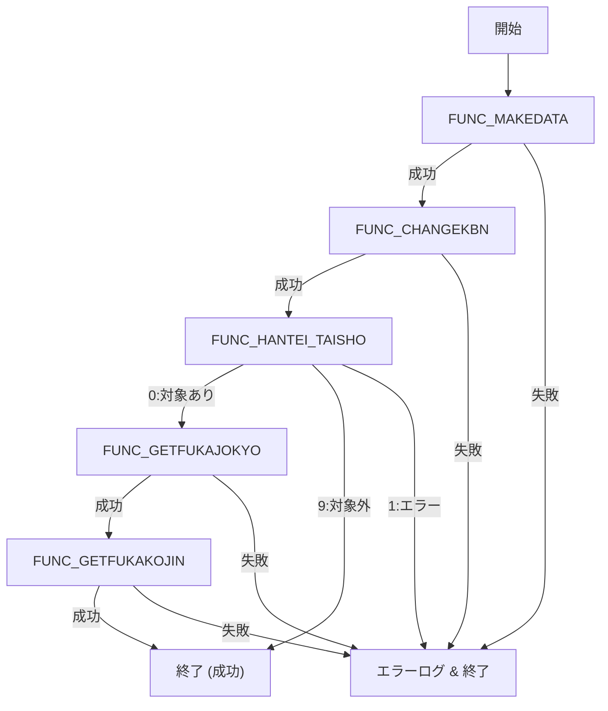

# 📘 ZLBSCSGKHHT パッケージ（賦課状況中間ワーク作成）

> **対象読者**  
> - 本モジュールを初めて触る開発者  
> - 保守・改修を行うエンジニア  
> - テスト・レビュー担当者  

---

## 目次

1. [概要](#概要)  
2. [主要コンポーネント一覧](#主要コンポーネント一覧)  
3. [主要ロジックの流れ](#主要ロジックの流れ)  
4. [関数・手続き詳細](#関数手続き詳細)  
5. [エラーハンドリング方針](#エラーハンドリング方針)  
6. [拡張・改善ポイント](#拡張改善ポイント)  
7. [フローダイアグラム（Mermaid）](#フローダイアグラム)  
8. [関連 Wiki リンク](#関連-wiki-リンク)  

---

## 概要

`ZLBSCSGKHHT` は **賦課状況の中間ワーク情報** を生成する PL/SQL パッケージです。  
主な処理は次の通りです。

| フェーズ | 内容 |
|----------|------|
| **① 計算個人ワークテーブル作成** | `FUNC_MAKEDATA` で `ZLBWKOJIN_CAL_SKH` をリセットし、`ZLBTKOJIN_CAL` のデータをコピー |
| **② 各月資格区分変換** | `FUNC_CHANGEKBN` が `ZLBSKCALCGKBN`（外部プロシージャ）を呼び出し、資格区分を算出 |
| **③ 制限対象候補世帯判定** | `FUNC_HANTEI_TAISHO` が対象世帯の有無・重複登録をチェックし、必要なら `ZLBWSEIGENKOHO_SETAI` に登録 |
| **④ 賦課状況中間ワーク作成** | `FUNC_GETFUKAJOKYO` が計算基本・賦課基本を比較し、増減フラグを算出 (`PROC_SETJOKYO_ZOGEN_FLG`) → 中間テーブルへ登録 (`FUNC_INSERT_WK_FUKAJOKYO`) |
| **⑤ 賦課個人中間ワーク作成** | `FUNC_GETFUKAKOJIN`（本ファイルでは省略）を呼び出し、個人レベルの中間データを生成 |

全体は **メインブロック** で順次呼び出し、エラーがあれば即座にログ出力し `o_NRTN = 1` で終了します。

---

## 主要コンポーネント一覧

| コンポーネント | 種別 | 主な役割 |
|----------------|------|----------|
| `FUNC_MAKEDATA` | 関数 | 計算個人ワークテーブル `ZLBWKOJIN_CAL_SKH` の初期化・データコピー |
| `FUNC_CHANGEKBN` | 関数 | `ZLBSKCALCGKBN`（外部ロジック）を呼び出し、資格区分変換を実行 |
| `FUNC_HANTEI_TAISHO` | 関数 | 制限対象候補世帯の有無・重複チェック、必要なら `ZLBWSEIGENKOHO_SETAI` に登録 |
| `FUNC_GETFUKAJOKYO` | 関数 | 計算基本と賦課基本の比較 → 増減フラグ算出 → 中間テーブルへ登録 |
| `PROC_SETJOKYO_ZOGEN_FLG` | 手続き | 各項目の増減フラグ（`ZO`/`GEN`）を算出し、共通増減フラグも設定 |
| `FUNC_INSERT_WK_FUKAJOKYO` | 関数 | `PROC_SETJOKYO_ZOGEN_FLG` の結果を `ZLBW_FUKAJOKYO`（中間テーブル）へ INSERT |
| `FUNC_GETFUKAKOJIN` | 関数 | （本ファイル外）個人レベルの中間ワーク作成 |
| `ZLBSKCALCGKBN` | 外部プロシージャ | 月別資格区分の実装ロジック（本パッケージ外） |

---

## 主要ロジックの流れ

1. **ログ取得** → `KKBTJLOG` から最新ステップ番号取得  
2. **個人ワークテーブル作成** → `FUNC_MAKEDATA`  
3. **資格区分変換** → `FUNC_CHANGEKBN`（カーソルで `ZLBWKOJIN_CAL_SKH` を走査）  
4. **制限対象候補世帯判定** → `FUNC_HANTEI_TAISHO`  
   - 0: 正常 → 次へ  
   - 9: 対象外（対象世帯なし） → 終了（`o_NRTN = 0`）  
   - 1: エラー → ログ出力・終了  
5. **賦課状況中間ワーク作成** → `FUNC_GETFUKAJOKYO`  
   - 計算基本・賦課基本を `FUNC_MAKESQL_KIHON` で取得  
   - `PROC_SETJOKYO_ZOGEN_FLG` で増減フラグ算出  
   - `FUNC_INSERT_WK_FUKAJOKYO` で中間テーブルへ登録  
6. **賦課個人中間ワーク作成** → `FUNC_GETFUKAKOJIN`（外部）  
7. **最終ステータス設定** → `o_NRTN` に 0（成功）/1（失敗）を格納  

---

## 関数・手続き詳細

### 1. `FUNC_MAKEDATA`

```plsql
FUNCTION FUNC_MAKEDATA RETURN NUMBER IS
  VERROR NVARCHAR2(256);
BEGIN
  NRTN := KKAPK3000.FTRUNCATE('ZLBWKOJIN_CAL_SKH', VERROR);
  IF NRTN <> 0 THEN
    VMSG := '計算個人ワークテーブルの初期化に失敗しました（FUNC_MAKEDATA)';
    PROCLOGOUT(1, VMSG);
    RETURN 1;
  END IF;
  INSERT INTO ZLBWKOJIN_CAL_SKH SELECT * FROM ZLBTKOJIN_CAL;
  RETURN 0;
EXCEPTION
  WHEN OTHERS THEN
    VMSG := '計算個人ワークテーブル作成でエラーが発生しました（FUNC_MAKEDATA）';
    PROCLOGOUT(1, VMSG || '　SQLエラー：' || SQLERRM);
    RETURN 1;
END;
```

- **目的**：作業テーブル `ZLBWKOJIN_CAL_SKH` を空にし、最新の計算個人データをコピー。  
- **失敗時**：`KKAPK3000.FTRUNCATE` がエラー → ログ出力 → `1` を返す。

### 2. `FUNC_CHANGEKBN`

```plsql
FUNCTION FUNC_CHANGEKBN RETURN NUMBER IS
  CURSOR CKOJIN IS
    SELECT JKC.* FROM ZLBWKOJIN_CAL_SKH JKC, ZLBTKANWA_TAISHO_TMP JKT
    WHERE JKC.KOKU_SETAI_NO = JKT.KOKU_SETAI_NO
      AND JKC.KOJIN_NO = JKT.KOJIN_NO
      AND JKC.SYS_TANMATSU_NO = I_VMASIN_NO;
BEGIN
  FOR CRKOJIN IN CKOJIN LOOP
    -- ログ情報取得
    NLOG_NENDO_BUN       := CRKOJIN.NENDO_BUN;
    NLOG_KOKU_SETAI_NO   := CRKOJIN.KOKU_SETAI_NO;
    NLOG_SANTEIDANTAI_CD := CRKOJIN.SANTEIDANTAI_CD;
    NLOG_KOJIN_NO        := CRKOJIN.KOJIN_NO;
    -- 外部プロシージャ呼び出し
    ZLBSKCALCGKBN(...);
    IF NRTN <> 0 THEN
      VMSG := '各月資格区分変換処理の実行でエラーが発生しました（FUNC_CHANGEKBN）';
      PROCLOGOUT(1, VMSG);
      RETURN 1;
    END IF;
  END LOOP;
  RETURN 0;
EXCEPTION
  WHEN OTHERS THEN
    VMSG := '各月資格区分変換処理の実行でエラーが発生しました（FUNC_CHANGEKBN）';
    PROCLOGOUT(1, VMSG);
    RETURN 1;
END;
```

- **ポイント**  
  - カーソルで対象レコードを走査し、外部ロジック `ZLBSKCALCGKBN` に委譲。  
  - `C_NTAISHO_KBN = 1` → 更新対象は `ZLBWKOJIN_CAL_SKH`。  
- **エラーハンドリング**：外部呼び出しが失敗したら即座にログ出力し `1` を返す。

### 3. `FUNC_HANTEI_TAISHO`

- **概要**：制限対象候補世帯かどうかを判定し、対象であれば `ZLBWSEIGENKOHO_SETAI` に登録。  
- **主要ロジック**  
  1. `ZLBTKIHON_CAL` から対象年度範囲の件数取得 (`NK_CNT`)。  
  2. 件数が 0 → `RETURN 9`（対象外）。  
  3. キー情報取得 → グローバル変数 `NK_*` に格納。  
  4. `ZLBTJOKEN` から不均一課税・主課税条件取得。  
  5. `ZLBTKIHON_N`（最新賦課基本）で件数取得 (`NF_CNT`)。  
  6. `ZLBWSEIGENKOHO_SETAI` に同一世帯が既に登録されているか確認 (`NS_CNT`)。  
  7. 未登録なら `INSERT`。  

- **戻り値**  
  - `0` : 正常に登録／対象外で処理継続  
  - `9` : 対象世帯が存在しない（上位ロジックでスキップ）  
  - `1` : 例外発生  

### 4. `FUNC_GETFUKAJOKYO`

- **概要**：計算基本テーブルと賦課基本テーブルを比較し、増減フラグを算出して中間テーブルへ保存。  
- **手順**  
  1. `FUNC_MAKESQL_KIHON` で動的 SQL を生成し、以下のテーブルからレコード取得  
     - `ZLBTKIHON_CAL`（計算基本）  
     - `ZLBTSIEN_KIHON_CAL`（計算支援基本）  
     - `ZLBTKDM_KIHON_CAL`（**子ども基本**）※ 2025/08/11 追加  
     - `ZLBTKAI_KIHON_CAL`（計算介護基本）  
     - 同名の `*_N`（最新賦課基本）  
  2. `PROC_SETJOKYO_ZOGEN_FLG` に全レコードを渡し、増減フラグ (`ZO`/`GEN`) と共通増減フラグを算出。  
  3. `FUNC_INSERT_WK_FUKAJOKYO` で `ZLBW_FUKAJOKYO`（中間テーブル）へ INSERT。  

- **エラーハンドリング**：各 `EXECUTE IMMEDIATE` が失敗したらログ出力し `1` を返す。

### 5. `PROC_SETJOKYO_ZOGEN_FLG`

- **入力**  
  - 計算基本レコード群 (`i_RKIHON_CAL`, `i_RSIEN_KIHON_CAL`, `i_RKDM_KIHON_CAL`, `i_RKAI_KIHON_CAL`)  
  - 賦課基本レコード群 (`i_RKIHON_N`, `i_RSIEN_KIHON_N`, `i_RKDM_KIHON_N`, `i_RKAI_KIHON_N`)  
- **出力**  
  - 各増減フラグレコード (`o_RKIHON_ZOGENFLG`, `o_RSIEN_KIHON_ZOGENFLG`, `o_RKDM_FUKA_FLG`, `o_RKAI_KIHON_ZOGENFLG`)  
  - 共通増減フラグ (`o_NJOKYO_ZO_FLG`, `o_NJOKYO_GEN_FLG`)  

- **ロジック**  
  - **増フラグ** (`ZO`)：`FUNC_COMPARE_ZO` 系関数で「計算 > 賦課」か判定。  
  - **減フラグ** (`GEN`)：`FUNC_COMPARE_GEN` 系関数で「計算 < 賦課」か判定。  
  - **共通増減フラグ**：全増減フラグの OR 結果を `NKYOTSU_ZO_FLG` / `NKYOTSU_GEN_FLG` に格納。  

> **注**：子ども基本 (`RKDM_*`) が 2025/08/11 に追加され、同様の増減比較が実装されています。

### 6. `FUNC_INSERT_WK_FUKAJOKYO`

- **役割**：`PROC_SETJOKYO_ZOGEN_FLG` の結果を `ZLBW_FUKAJOKYO` に INSERT。  
- **戻り値**：`0` 正常、`1` エラー（例外は `PROCLOGOUT` でログ出力）。

---

## エラーハンドリング方針

| 階層 | 手段 | ログ出力例 |
|------|------|------------|
| **関数内部** | `EXCEPTION WHEN OTHERS` → `PROCLOGOUT(1, VMSG)` | `賦課状況の中間ワーク情報作成でエラーが発生しました（FUNC_GETFUKAJOKYO）` |
| **メインブロック** | `WHEN OTHERS` → `PROCLOGOUT` → `o_NRTN := 1` | `ZLBSCSGKHHT　賦課決定期間の制限対象候補世帯判定処理でエラーが発生しました` |
| **戻り値** | `0` 正常、`1` エラー、`9` 対象外（`FUNC_HANTEI_TAISHO`） | 上位ロジックは `IF NRTN = 0 THEN … ELSIF NRTN = 9 THEN …` で分岐 |

- **一貫性**：全ての関数は **数値** を返すことで呼び出し側が即座に成功/失敗を判定できる。  
- **ログ**：`PROCLOGOUT` は共通ロギングユーティリティ（第1引数はログレベル）で、エラーメッセージに **年度・世帯番号・算定団体コード** を必ず付与。

---

## 拡張・改善ポイント

| 項目 | 現状 | 推奨改善 |
|------|------|----------|
| **子ども基本の追加** | 2025/08/11 にハードコーディングで `RKDM_*` 系が増加 | - テーブル定義をメタデータ化し、動的に増減フラグロジックを生成<br>- 追加項目が増えてもコード変更を最小化 |
| **増減比較ロジック** | `FUNC_COMPARE_ZO` / `FUNC_COMPARE_GEN` 系は個別関数呼び出し | - 共通比較ユーティリティ `FUNC_COMPARE(flag_type, calc_val, charge_val)` に統合し、テスト容易性向上 |
| **例外情報** | `SQLERRM` のみ出力 | - スタックトレース (`DBMS_UTILITY.FORMAT_ERROR_BACKTRACE`) を併記し、デバッグコスト削減 |
| **トランザクション管理** | 各関数は暗黙的にコミットなし | - `BEGIN ... EXCEPTION ... END;` の外側で **明示的トランザクション** を制御し、途中失敗時のロールバックを保証 |
| **テスト容易性** | 動的 SQL が文字列結合で構築 | - `DBMS_SQL` のバインド変数利用に切り替え、SQL インジェクション防止とパラメータテストの自動化 |
| **ログレベル** | 常に `PROCLOGOUT(1, …)`（エラーレベル） | - `PROCLOGOUT(0, …)`（情報）や `2`（警告）を使い分け、運用時のログ量調整 |

---

## フローダイアグラム（Mermaid）



---

## 関連 Wiki リンク

| 項目 | Wiki URL（例） |
|------|----------------|
| `FUNC_COMPARE_ZO` 系関数 | `[FUNC_COMPARE_ZO](http://localhost:3000/projects/big/wiki?file_path=path/to/compare_functions.sql)` |
| `ZLBSKCALCGKBN`（外部プロシージャ） | `[ZLBSKCALCGKBN](http://localhost:3000/projects/big/wiki?file_path=path/to/ZLBSKCALCGKBN.sql)` |
| `PROCLOGOUT`（共通ロガー） | `[PROCLOGOUT](http://localhost:3000/projects/big/wiki?file_path=path/to/logger.sql)` |
| `KKAPK3000.FTRUNCATE`（テーブル削除ユーティリティ） | `[FTRUNCATE](http://localhost:3000/projects/big/wiki?file_path=path/to/ftruncate.sql)` |
| `ZLBTJOKEN`（システム条件テーブル） | `[ZLBTJOKEN](http://localhost:3000/projects/big/wiki?file_path=path/to/ZLBTJOKEN.sql)` |
| `ZLBWSEIGENKOHO_SETAI`（制限対象候補世帯テーブル） | `[ZLBWSEIGENKOHO_SETAI](http://localhost:3000/projects/big/wiki?file_path=path/to/ZLBWSEIGENKOHO_SETAI.sql)` |

> **※ URL はプロジェクトのローカル Wiki サーバーを想定しています。実際のパスに合わせて修正してください。**

---

### まとめ

- `ZLBSCSGKHHT` は **賦課状況の中間データ生成** を担う中心的パッケージ。  
- 処理は **個人ワーク作成 → 資格区分変換 → 制限対象判定 → 増減フラグ算出 → 中間テーブル登録** の流れで構成。  
- エラーハンドリングは全体で統一されており、失敗時は即座にログ出力し `o_NRTN = 1` で終了。  
- 2025/08/11 の子ども子育て支援金対応追加により、`RKDM_*` 系が増えている点が今後の拡張ポイント。  

このドキュメントをベースに、**コードレビュー**・**テストケース作成**・**新機能追加** の際に参照してください。 🚀