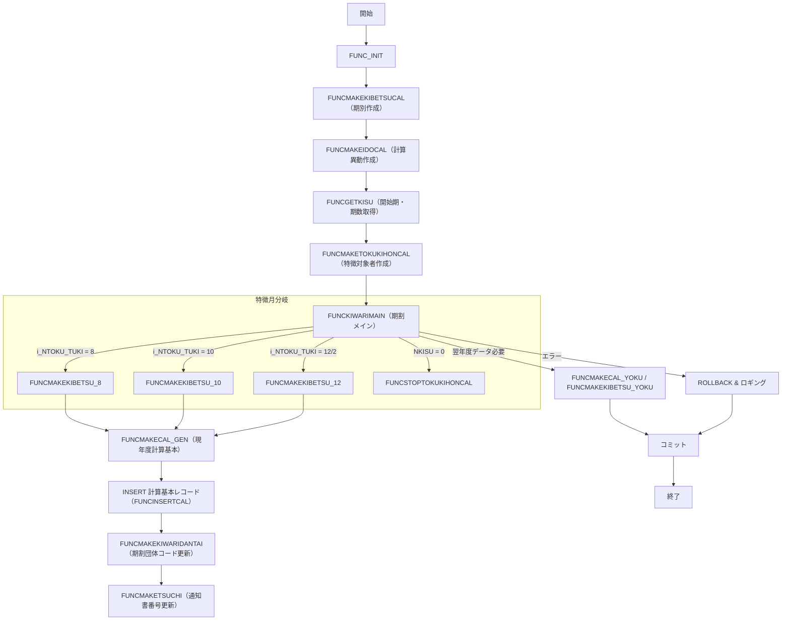

# 📚 ZLBSKCALKWTKST パッケージ（期割・計算ロジック）  
*プロジェクト：`big` / ファイルパス：`test_big_7/ZLBSKCALKWTKST.SQL`*  

---  

## 目次
1. [概要](#概要)  
2. [主要コンポーネント一覧](#主要コンポーネント一覧)  
3. [処理フロー（全体）](#処理フロー全体)  
4. [主要関数の詳細](#主要関数の詳細)  
   - [FUNCINSERTCAL](#funcinsertcal)  
   - [FUNCUPDATEKINGAKU / FUNCUPDATECAL](#funcupdatekingaku--funcupdatecal)  
   - [FUNCMAKECAL\_YOKU / FUNCMAKECAL\_GEN](#funcmakecal_yoku--funcmakecal_gen)  
   - [FUNCSTOPTOKUKIHONCAL](#funcstoptokukihoncal)  
   - [FUNCMAKEKIBETSU\_10 / 12 / 8](#funcmakekibetsu_10--12--8)  
   - [FUNCKIWARIMAIN](#funckiwarimain)  
   - [FUNC_INIT](#func_init)  
5. [子ども子育て支援金（KDM）拡張ポイント](#子ども子育て支援金kdm拡張ポイント)  
6. [設計上の留意点・改善余地](#設計上の留意点改善余地)  
7. [エラーハンドリングとロギング](#エラーハンドリングとロギング)  
8. [データベーステーブル概要（参照テーブル）](#データベーステーブル概要参照テーブル)  
9. [マーメイド図：期割処理全体フロー](#マーメイド図期割処理全体フロー)  

---  

## 概要
`ZLBSKCALKWTKST` は、**国民健康保険（国保）世帯の期割計算** を行う PL/SQL パッケージです。  
- **期割** とは、年度内の税額（医療・介護・支援・子ども）を期（論理期）ごとに均等に割り振る仕組みです。  
- 本パッケージは **現年度・翌年度** の期割レコード作成、計算基本テーブルへの書き込み、特徴（特定月開始）ロジック、子ども子育て支援金（KDM）拡張を統合しています。  

> **対象読者**：新規参入エンジニア、保守担当者、機能追加を検討する開発者向けに、**「なぜ」このロジックが必要か** を中心に解説します。  

---  

## 主要コンポーネント一覧
| コンポーネント | 種別 | 主な役割 |
|---|---|---|
| `FUNCINSERTCAL` | 関数 | 計算基本（医療・介護・支援・子ども）レコードの **INSERT** |
| `FUNCUPDATEKINGAKU` | 関数 | 指定テーブルの **金額更新**（均等割・積算税・年税） |
| `FUNCUPDATECAL` | 関数 | 1回の呼び出しで **医療・介護・支援・子ども** の全テーブルを更新 |
| `FUNCMAKECAL_YOKU` | 関数 | **翌年度** の計算基本作成（現年度データをコピー） |
| `FUNCMAKECAL_GEN` | 関数 | **現年度** の計算基本作成（新規／継続の特徴に応じた金額算出） |
| `FUNCSTOPTOKUKIHONCAL` | 関数 | 現年度の **特徴中止**（継続・新規のフラグに応じて削除/更新） |
| `FUNCMAKEKIBETSU_10` / `12` / `8` | 関数 | **特徴月**（10,12,2,8）ごとの **期別レコード作成** ロジック |
| `FUNCKIWARIMAIN` | 関数 | 期割処理の **エントリーポイント**。特徴月判定・期別作成・翌年度作成を統括 |
| `FUNC_INIT` | 関数 | 初期化処理（論理期別算出、補助情報取得、端末番号取得） |
| メインブロック | PL/SQL ブロック | パッケージ全体の実行フロー（初期化 → 期割作成 → 計算異動 → コミット/ロールバック） |

---  

## 処理フロー（全体）

1. **初期化** (`FUNC_INIT`)  
   - 特徴月・普徴月の論理期別番号 (`NTOKU_KIBETSU`, `NFUTU_KIBETSU`) を算出。  
   - 更正日、世帯主個人番号、期割団体コード、翌年度通知書番号を取得。  

2. **計算期別作成** (`FUNCMAKEKIBETSUCAL`)  
   - 期割テーブル `ZLBTKIBETSU_CAL` の **現年度** データを削除し、必要に応じて再作成。  

3. **計算異動作成** (`FUNCMAKEIDOCAL`)  
   - 異動テーブル `ZLBT...` 系列に対し、現年度・翌年度の異動情報を生成。  

4. **開始期・期割期数取得** (`FUNCGETKISU`)  

5. **計算特徴対象者作成** (`FUNCMAKETOKUKIHONCAL`)  

6. **期割メイン** (`FUNCKIWARIMAIN`)  
   - **特徴月** (`i_NTOKU_TUKI`) に応じて `FUNCMAKEKIBETSU_10/12/8` を呼び出し、期別レコードを生成。  
   - **現年度計算基本** (`FUNCMAKECAL_GEN`) を実行し、金額を算出・INSERT。  
   - **翌年度作成** が必要なら `FUNCMAKECAL_YOKU` / `FUNCMAKEKIBETSU_YOKU` を実行。  

7. **期割団体コード更新** (`FUNCMAKEKIWARIDANTAI`)  
8. **通知書番号更新** (`FUNCMAKETSUCHI`)（必要時）  

9. **コミット／ロールバック** と **ロギング**（エラー時）  

---  

## 主要関数の詳細  

### `FUNCINSERTCAL`
- **目的**：`ZLBTKIHON_CAL` 系列に対し、**計算基本レコード**（医療・介護・支援・子ども）を **INSERT** する。  
- **入力**：年度・年度分・各税額（医療、介護、支援、子ども）  
- **ロジック**  
  1. `RwSIENKIHON_CAL`（支援基本）に全項目を 0 で初期化し、引数で受け取った金額だけを設定。  
  2. `IF i_NwCHOTEI_NENDO = i_NNENDO` で **現年**／**翌年** の通知書番号を分岐。  
  3. `DELETE` → `INSERT` の **Upsert** パターンで既存レコードを上書き。  
  4. 同様に **退職**、**介護退職**、**支援退職**、**子ども**（KDM）テーブルへもレコード作成。  
- **拡張ポイント**：子ども支援金 (`KDM`) のフィールドは `KDM_ZEN_ZEIGAKU` 系列が追加されている。  

### `FUNCUPDATEKINGAKU` / `FUNCUPDATECAL`
- **FUNCUPDATEKINGAKU**  
  - 任意テーブル（医療・介護・支援・子ども）に対し、**均等割・積算税・年税** を **加算** する汎用 UPDATE。  
  - `i_NwCHOTEI_NENDO` が現在年度かどうかで通知書番号を切り替える。  

- **FUNCUPDATECAL**  
  - `FUNCUPDATEKINGAKU` を **医療・介護・支援・子ども** の全テーブルに対して呼び出すラッパー。  
  - **子ども** の金額更新は `i_NwKDM_ZEI` パラメータで実装。  

### `FUNCMAKECAL_YOKU` / `FUNCMAKECAL_GEN`
- **FUNCMAKECAL_YOKU**（翌年度作成）  
  - 前年度の計算基本データを取得し、**翌年度** 用に `i_NNENDO+1`、`i_NNENDO_BUN+1` で `FUNCINSERTCAL` を呼び出す。  
  - 期割テーブル `ZLBTKIBETSU_CAL` の **現年度分**（4〜9 期）を参照し、残期数に応じた金額算出ロジックを実装。  

- **FUNCMAKECAL_GEN**（現年度作成）  
  - **特徴月** が 8,10,12,2 のいずれかの場合に呼び出され、**特徴開始**／**継続** のフラグ (`NwJOTAI_KBN`) に応じて金額算出。  
  - **全体税額** = 医療 + 介護 + 支援 + 子ども（KDM）  
  - **未徴収金額** を残期数 (`NKISU`) で割り、**均等割** を算出。  
  - **端数処理**：300円未満は次期へ繰り越し、300円以上は 100円単位で調整。  
  - **特徴開始不可**（`BwSTOP = TRUE`）の場合は `FUNCSTOPTOKUKIHONCAL` で対象レコードを **中止** または **削除**。  

### `FUNCSTOPTOKUKIHONCAL`
- **目的**：特徴が **中止** になるケースで、`ZLBTTOKU_KIHON_CAL`（特徴対象者テーブル）を **更新**（中止フラグ）または **削除**。  
- **ロジック**  
  1. `JOTAI_KBN` が `c_NJOTAI_CONTINUE`（継続）なら `c_NJOTAI_OVER`（中止）に更新し、終了月・期別・中止事由をセット。  
  2. `c_NJOTAI_NEW`（新規）ならレコードを **DELETE**。  
  3. 翌年度分の特徴対象者は **無条件削除**。  
  4. `ZLBTTOKU_IDO_CAL` の中止事由も更新。  

### `FUNCMAKEKIBETSU_10` / `12` / `8`
- **共通点**  
  - **特徴月** に応じた **期別レコード**（`ZLBTKIBETSU_CAL`）を作成。  
  - `FUNCGETCAL` で **現年度の計算基本**（医療・介護・支援・子ども）を取得。  
  - `NwZEN_KIWARI` / `NwTAI_KIWARI` を **全体税額** と **退職税額** の **期割対象額** として算出。  

- **10月 (`FUNCMAKEKIBETSU_10`)**  
  - `NKISU`（残期数）に応じて **均等割** を算出。  
  - **端数** が 300円以上の場合は 100円単位で調整し、**徴収不可** になると `BwSTOP = TRUE`。  
  - `INSERT` 前に **同一期のレコード削除**（冪等性確保）。  

- **12月／2月 (`FUNCMAKEKIBETSU_12`)**  
  - **特徴開始月が 12/2** の場合、**前期**（4〜9 期）と **納期到来期**、**納期未到来期** の金額を合算し、**未徴収金額** を算出。  
  - **特徴開始不可** の場合は `ZLBTTOKU_KIHON_CAL` を **削除**。  
  - 12月は **9 期**、2月は **11 期** のレコードを作成。  

- **8月 (`FUNCMAKEKIBETSU_8`)**  
  - 前年度の **賦課基本** を取得し、**期割係数**（`NKIWARIKEISU`）は 6（または 4）に設定。  
  - `NwZEN_KIWARI` に **子ども支援金** (`RKDMKIHONN.NENZEI`) を加算。  
  - `INSERT` 時に `KDM_ZEN_ZEIGAKU` フィールドを 0 で初期化（子ども支援金は別途 `FUNCMAKECAL_GEN` で処理）。  

### `FUNCKIWARIMAIN`
- **エントリーポイント**（パッケージ実行時に呼び出される）。  
- **フロー**  
  1. `i_NTOKU_TUKI`（特徴月）に応じて **期別作成関数** を分岐。  
  2. `NKISU = 0`（残期数なし）なら **特徴中止** (`FUNCSTOPTOKUKIHONCAL`)。  
  3. `i_NTOKU_TUKI` が 10,12,2 → `FUNCMAKEKIBETSU_10/12`、`FUNCMAKECAL_GEN`。  
  4. `i_NTOKU_TUKI = 8` → `FUNCMAKEKIBETSU_8`、`FUNCMAKECAL_GEN`。  
  5. `i_NTOKU_TUKI` が 104,106,108（翌年期） → 翌年度の **期別作成** と **計算基本作成**。  
  6. `FUNCMAKEKIWARIDANTAI`（期割団体コード更新）と `FUNCMAKETSUCHI`（通知書番号更新）を実行。  
  7. `BwJIKKO`（翌年度データ作成フラグ）に応じて `o_NFUTU`（結果コード）を設定。  

### `FUNC_INIT`
- **初期化**  
  - **特徴論理期別** (`NTOKU_KIBETSU`) と **普徴論理期別** (`NFUTU_KIBETSU`) を算出。  
  - **更正日** (`NKOSEIBI`) を引数またはシステム日付で設定。  
  - **世帯主個人番号** (`NwKOJIN_NO`) を取得し、`ZLBTTOKU_HOSOKU` から最新保護情報 (`RTOKUHOSOKU`) を取得。  
  - **期割団体コード** (`NKIWARIDANTAI_CD`) を `FUNCGETKIWARIDANTAI` で取得。  
  - **翌年度通知書番号** (`NYOKU_TSUCHI_NO`) を `ZLBTKIHON_CAL` から取得。  

---  

## 子ども子育て支援金（KDM）拡張ポイント
- **追加フィールド**（`ZLBTKIBETSU_CAL`、`ZLBTKIHON_CAL` 系列）  
  - `KDM_ZEN_ZEIGAKU`、`KDM_ZEN_FNKSNGAKU`（子ども全体税額・不能欠損額）  
  - `KDM_KIWARI`（子ども均等割額）  
- **金額算出に組み込む箇所**  
  - `NwZEN_KIWARI`、`NwZEN_ZEIGAKU` の算出時に `RKDMKIHONN.NENZEI`（子ども全体税額）を **加算**。  
  - `FUNCMAKEKIBETSU_8`、`FUNCMAKEKIBETSU_10/12` でも `KDM` の金額を考慮した **残期数計算** が行われる。  
- **コメント**：`2025/08/11 ZCZL.LISHUAI ADD` としてコードにマークが付いている箇所が拡張ポイントです。  

---  

## 設計上の留意点・改善余地
| 項目 | 現状 | 改善提案 |
|---|---|---|
| **ハードコーディング** | `c_NKAMOKU_CD`、`c_NKAMOKUS_CD2` など定数はパッケージ外部で定義されているが、**テーブル名・カラム名** が文字列で埋め込まれている。 | 定数テーブルまたは設定テーブルに集約し、変更時の影響範囲を縮小。 |
| **エラーハンドリング** | 各関数で `WHEN OTHERS THEN` → `c_IRETNG`、`VERROR` に文字列結合。スタックトレースが失われがち。 | `RAISE_APPLICATION_ERROR` でエラーコード・メッセージを統一し、呼び出し側で一元管理。 |
| **ロジックの重複** | `FUNCMAKEKIBETSU_10` と `FUNCMAKEKIBETSU_12` の **端数調整**、**徴収不可判定** がほぼ同一。 | 共通ロジックをサブルーチン化（例：`CALC_KIWARI`）し、テスト容易性を向上。 |
| **トランザクション粒度** | メインブロックで **全体コミット**。エラーが起きた場合は全ロールバック。 | 大規模バッチの場合は **部分コミット**（例：期別ごと）を検討し、リカバリコスト削減。 |
| **パフォーマンス** | `DELETE FROM ZLBTKIBETSU_CAL` が大量レコードに対して頻繁に実行。 | `MERGE` で **UPSERT** に置き換える、またはパーティションテーブルで対象期間だけ削除。 |
| **子ども支援金の拡張** | KDM 関連フィールドは **0** で初期化し、別途 `FUNCMAKECAL_GEN` で更新。 | KDM 用の **専用関数**（例：`FUNCUPDATEKDM`）を作り、ロジック分離。 |

---  

## エラーハンドリングとロギング
- **エラーコード**  
  - `c_IRETOK` : 正常終了  
  - `c_IRETNG` : 異常終了（内部エラー）  
- **エラーメッセージ** は `VERROR` に文字列結合し、**パッケージ名・国保世帯番号** を必ず付与。  
- **ロギング**  
  - `KKBPK5551.FSETOLOG`（端末番号ベース）または `KKBPK5551.FSETBLOG`（外部システム番号ベース）へ出力。  
  - `SQLCODE` が 0 の場合は **アプリケーションエラー**、それ以外は **SQL例外** として区別。  

---  

## データベーステーブル概要（参照テーブル）

| テーブル | 主なカラム | 用途 |
|---|---|---|
| `ZLBTKIHON_CAL` | `KOKU_SETAI_NO`, `SANTEIDANTAI_CD`, `CHOTEI_NENDO`, `NENDO_BUN`, `TSUCHI_NO`, `R_NO` | 計算基本（医療） |
| `ZLBTTAI_CAL` | 同上 | 計算退職（医療） |
| `ZLBTKAI_KIHON_CAL` | 同上 | 計算基本（介護） |
| `ZLBTKAI_TAI_CAL` | 同上 | 計算退職（介護） |
| `ZLBTSIEN_KIHON_CAL` | 同上 | 計算基本（支援） |
| `ZLBTSIEN_TAI_CAL` | 同上 | 計算退職（支援） |
| `ZLBTKDM_KIHON_CAL` | `KDM_ZEN_ZEIGAKU` など | **子ども子育て支援金**（新規追加） |
| `ZLBTKIBETSU_CAL` | `KAMOKU_CD`, `KAMOKUS_CD`, `RONRIKIBETSU`, `ZEN_ZEIGAKU`, `TAI_ZEIGAKU`, `KDM_ZEN_ZEIGAKU` | 期別レコード（特徴月ごとの均等割結果） |
| `ZLBTTOKU_KIHON_CAL` | `JOTAI_KBN`, `SHUNYO_TUKI`, `SHUNYO_KIBETSU` | 特徴対象者（開始・継続・中止） |
| `ZLBTTOKU_HOSOKU` | `TOKU_KOJIN_NO`, `SAKUSEI_BI` | 世帯主保護情報（最新） |
| `ZLBTTOKU_IDO_CAL` | `CHUSHI_JIYU` | 計算異動の中止事由 |
| `ZLBTTOKU_HOSOKU` | `TOKU_KOJIN_NO`, `SAKUSEI_BI` | 世帯主保護情報取得用 |
| `ZLBTSHUNO` | `SHUNOGAKU`, `TAI_ZEIGAKU`, `ZEN_ZEIGAKU` | 期割未納金額（納期未到来期） |

> **備考**：テーブル構造はパッケージ外部で管理されているため、変更時は必ず **DDL 変更履歴** と **パッケージ定数** の整合性を確認してください。  

---  

## マーメイド図：期割処理全体フロー

---  

### まとめ
- 本パッケージは **特徴月**（8,10,12,2）に応じた **期割金額算出** と **計算基本テーブルへの書き込み** を一括で実行します。  
- **子ども子育て支援金（KDM）** の拡張は、全体税額算出に `RKDMKIHONN.NENZEI` を加算し、期別テーブルに `KDM_ZEN_ZEIGAKU` 系列を保持する形で実装されています。  
- 主要ロジックは **残期数 (`NKISU`)** と **未徴収金額** の割り算に依存しており、端数調整や徴収不可判定が多数の分岐で実装されています。  
- 設計上は **重複ロジックの抽象化**、**エラーハンドリングの統一**、**トランザクション粒度の見直し** が次期リファクタリングのポイントです。  

> **次のステップ**：  
1. まずは `FUNC_INIT` → `FUNCKIWARIMAIN` の流れをデバッグモードで追い、実際にどのテーブルが更新されるかを確認。  
2. 子ども支援金（KDM）関連のテストケースを追加し、`FUNCMAKECAL_GEN` の金額合算ロジックが正しく反映されているか検証。  
3. 重複ロジックを共通化し、ユニットテストを作成して回帰リスクを低減させる。  

---  

*このドキュメントはコードの読解と保守・拡張を支援することを目的としています。質問や追加要件があれば遠慮なくお問い合わせください。*  