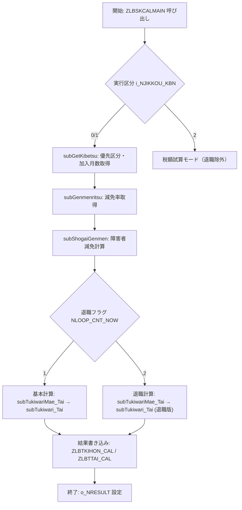

# 📄 ZLBSKCALMAIN プロシージャ（`ZLBSKCALMAIN.SQL`）

> **ファイルパス**  
> `projects/big/test_big_7/ZLBSKCALMAIN.SQL`  
> [ソースコードへ](http://localhost:3000/projects/big/wiki?file_path=projects/big/test_big_7/ZLBSKCALMAIN.SQL)

---

## 目次
1. [概要](#概要)  
2. [パラメータ一覧](#パラメータ一覧)  
3. [主要型・定数](#主要型・定数)  
4. [主要サブルーチン構成](#主要サブルーチン構成)  
5. [データフローとロジック概要](#データフローとロジック概要)  
6. [設計上のポイント・選択理由](#設計上のポイント選択理由)  
7. [潜在的な課題と改善案](#潜在的な課題と改善案)  
8. [関連ドキュメント・リンク](#関連ドキュメントリンク)  

---

## 概要
`ZLBSKCALMAIN` は **国保税（ZLB）** の計算エンジンの中心プロシージャです。  
- **目的**：計算対象個人（世帯）を基に課税計算を行い、**計算基本（ZLBTKIHON_CAL）** と **計算退職（ZLBTTAI_CAL）** のレコードを生成する。  
- **実行モード**  
  - `i_NJIKKOU_KBN = 0`：バッチ起動（本算定／月例）  
  - `i_NJIKKOU_KBN = 1`：オンライン即時起動  
  - `i_NJIKKOU_KBN = 2`：オンライン税額試算（退職除外）  

> **対象読者**：新規参入エンジニア、保守担当者、税務ロジックを拡張したい開発者

---

## パラメータ一覧
| パラメータ | 型 | 役割・備考 |
|-----------|----|------------|
| `i_NNENDO` | `NUMBER` | 調定年度 |
| `i_NNENDO_BUN` | `NUMBER` | 年度分（分割年度） |
| `i_NSETAI` | `NUMBER` | 国保世帯番号 |
| `i_NDANTAI` | `NUMBER` | 算定団体コード |
| `i_NNUSHI` | `NUMBER` | 世帯主個人コード |
| `i_NJIKKOU_KBN` | `NUMBER` | 実行区分（0/1/2） |
| `i_CAL_KBN` | `NUMBER` | 呼出区分（0:通常, 1:賦課期日時点） |
| `i_VTANMATSU` | `NVARCHAR2` | 端末番号 |
| `i_NTRENBAN` | `NUMBER` | 登録連番 |
| `o_NRESULT` | `OUT NUMBER` | 処理結果（0:正常, 1:異常） |
| `i_NKOSEIBI` | `NUMBER` (デフォルト 0) | 追加パラメータ（現行未使用） |
| `i_NSHORI_MD` | `NUMBER` (デフォルト 0) | 処理モード（0:入力なし, 1:入力あり） |

> **リンク例**：`[ZLBSKCALMAIN](http://localhost:3000/projects/big/wiki?file_path=projects/big/test_big_7/ZLBSKCALMAIN.SQL)`

---

## 主要型・定数

### 配列型（PL/SQL テーブル）
```plsql
TYPE MTNUMARRAY1  IS TABLE OF NUMBER(1)  INDEX BY BINARY_INTEGER;
TYPE MTNUMARRAY2  IS TABLE OF NUMBER(2)  INDEX BY BINARY_INTEGER;
TYPE MTNUMARRAY3  IS TABLE OF NUMBER(3)  INDEX BY BINARY_INTEGER;
TYPE MTNUMARRAY10 IS TABLE OF NUMBER(10) INDEX BY BINARY_INTEGER;
TYPE MTNUMARRAY12 IS TABLE OF NUMBER(12) INDEX BY BINARY_INTEGER;
TYPE MTNUMARRAY15F IS TABLE OF NUMBER(12,3) INDEX BY BINARY_INTEGER; -- 2024/05/06 追加
```

### 定数（処理結果・端数区分・実行区分等）
| 定数 | 値 | 意味 |
|------|----|------|
| `c_NOK` | `0` | 正常終了 |
| `c_NERR` | `1` | 異常終了 |
| `c_NHASU_1` | `1000` | 年税額端数 1 |
| `c_NHASU_2` | `100` | 年税額端数 2 |
| `c_NHASU_3` | `1` | 年税額端数 3 |
| `c_NHASU_10` | `10` | 年税額端数 10 |
| `c_NHASU_KBN_1` | `1` | `c_NHASU_1` に対応 |
| `c_NHASU_KBN_2` | `0` | `c_NHASU_2` に対応 |
| `c_NHASU_KBN_3` | `2` | `c_NHASU_3` に対応 |
| `c_NHASU_KBN_10` | `3` | `c_NHASU_10` に対応 |
| `c_NBATCH` | `0` | バッチ起動 |
| `c_NTEST` | `2` | 税額試算 |
| `c_NBATCH_ZER` | `3` | バッチ（税率試算） |
| `c_CAL_KBN_TU` | `0` | 通常処理 |
| `c_CAL_KBN_FK` | `1` | 賦課期日時点処理 |
| `c_CAL_KBN_F4` | `2` | H4/HH/C4 処理 |
| `c_NDANTAI` | `1` | 合併後算定団体コード |
| `c_NFKAZEI` | `1` | 不均一課税フラグ |

---

## 主要サブルーチン構成

| サブルーチン | 主な役割 |
|--------------|----------|
| `subGetKibetsu` | **優先区分・減免区分** の取得、納期未到来期数・加入月数算出 |
| `subGenmenritsu` / `subGenmenritsu_TAI` | 減免率（額）取得、最新拡張テーブル `ZLBTEXT_N` から減免情報を取得 |
| `subShogaiGenmen` | 障害者減免額・率計算 |
| `subKeigenChosei_Tai` | 退職時の **軽減均等・平等割** の端数調整 |
| `subTukiwariNenzei_Tai` | 退職者の **月割年税額** 計算 |
| `subDouzeiTukisu_Tai*` 系列 | 同税額月数算出（退職・限度超過・積算用） |
| `subTukiwari_Tai` | 退職者の **月割税額** 集計・応益係数適用 |
| `funcGenmenKojinGet` | 減免対象者判定（`ZLBTGENMEN_KOJIN_CAL` 参照） |
| `subTukiwariMae_Tai` | 退職者の **月割税額算出準備**（資格・応益係数取得） |
| `subTukiwari_Tai`（最終実装） | 退職者の **税額・減免** を最終的にテーブルへ書き込み |

> 各サブルーチンは **「退職」** と **「通常」** の二系統で分岐し、`NLOOP_CNT_NOW`（1: 基本計算、2: 退職計算）で制御されます。

---

## データフローとロジック概要



### 主なデータテーブル
| テーブル | 用途 |
|----------|------|
| `ZLBTKOJIN_CAL` | 計算対象個人の資格情報 |
| `ZLBTKIHON_N` / `ZLBTTAI_N` | 基本・退職の減免情報（`GENMEN`） |
| `ZLBTEXT_N` | 拡張減免率テーブル |
| `ZLBTGENMEN_KOJIN_CAL` | 世帯単位の減免フラグ・金額 |
| `ZLBTKANWA_KOJIN_CAL` | 応益・応能係数（月別） |
| `ZLBTJOKEN` | システム条件（納期・期区分） |

---

## 設計上のポイント・選択理由

| 項目 | 説明 |
|------|------|
| **PL/SQL テーブル型** | 月別・年別の数値を配列で保持し、ループで高速に集計できる。 |
| **定数で端数区分を管理** | 端数処理（千円・百円・1円・10円）をコード内にハードコーディングせず、定数で切り替え可能に。 |
| **減免ロジックの分離** (`subGenmenritsu` / `subShogaiGenmen`) | 減免率取得と障害者減免は税額計算から独立させ、将来的に別テーブルや外部サービスに置き換えやすい。 |
| **二段階課税（所得2段階）** | `NSHOTOKU_2DANKAI` フラグで切り替え、所得割の上限・下限を柔軟に設定。 |
| **退職計算の二段階ループ** (`NLOOP_CNT_NOW`) | まず基本計算で全体金額を算出し、次に退職者分だけ再計算・調整することで、**同税額月数** の重複計算を防止。 |
| **減免対象者判定関数** (`funcGenmenKojinGet`) | 世帯・個人の減免対象をテーブル駆動で判定し、ロジック変更がテーブル更新だけで済むように設計。 |
| **端末番号・連番** (`i_VTANMATSU`, `i_NTRENBAN`) | 同一端末・同一処理単位での排他制御や再実行防止に利用。 |

---

## 潜在的な課題と改善案

| 課題 | 現象 | 改善案 |
|------|------|--------|
| **大量の配列初期化** | `FOR NwIX1 IN 1..12 LOOP` が多数出現し、可読性が低下。 | 共通の `initialize_array` ユーティリティを作り、`FOR i IN 1..12 LOOP arr(i) := 0; END LOOP;` を一行化。 |
| **端数処理ロジックが分散** | `ITSUKI_HASU_KBN` の分岐が多数のサブルーチンに散在。 | 端数計算を `calc_round(value, hasu_type)` という関数に集約し、呼び出し側は `calc_round(val, c_NHASU_KBN_1)` のみで済む。 |
| **減免率取得のハードコーディング** | `ZLBTEXT_N` から `GENMEN` を取得する SQL が文字列結合で組み立てられている。 | 動的 SQL を避け、`SELECT ... FROM ZLBTEXT_N WHERE ...` の静的クエリに置き換えるか、ビュー化してロジックを単純化。 |
| **エラーハンドリングが `WHEN OTHERS THEN` のみ** | 例外情報が失われ、デバッグが困難。 | `SQLERRM` をログに残す共通例外ハンドラ `handle_error(p_context VARCHAR2)` を導入し、`o_NRESULT` にエラーコードを設定。 |
| **コメントが日本語と英語混在** | メンテナンス時に言語統一が必要。 | コメントは全て日本語に統一し、英語が必要な場合は `/* EN: ... */` のようにタグ付け。 |
| **テーブルロックの欠如** | 同時実行時に `ZLBTGENMEN_KOJIN_CAL` の更新が競合する可能性。 | `FOR UPDATE NOWAIT` で行ロックし、ロック取得失敗時はリトライロジックを追加。 |
| **バージョン管理がコメントベース** | `--2024/09/23` 等の変更履歴がコード内に埋め込まれている。 | 変更履歴は Git のコミットメッセージに委ね、コード内の `CHANGELOG` コメントは削除または `@revision` アノテーションに置換。 |

---

## 関連ドキュメント・リンク

| ドキュメント | 説明 |
|--------------|------|
| **テーブル定義** | `ZLBTKOJIN_CAL`, `ZLBTKIHON_CAL`, `ZLBTTAI_CAL` などの DDL 定義は `schema/` ディレクトリに格納。 |
| **減免率マスタ** | `ZLBTEXT_N` の仕様書は `docs/減免率マスタ.md` を参照。 |
| **応益係数マスタ** | `ZLBTKANWA_KOJIN_CAL` の係数算出ロジックは `docs/応益係数.md` に記載。 |
| **変更履歴** | 本ファイルの変更履歴は Git のコミットログで管理。 |
| **テストケース** | `test/ZLBSKCALMAIN_test.sql` に単体テストが実装済み。 |

---

## まとめ

`ZLBSKCALMAIN` は **税額計算 → 減免・障害者減免 → 退職・限度超過調整** という一連のフローを PL/SQL の配列と定数で高速に処理する、国保税計算の中核ロジックです。  
設計は **分割実行（基本／退職）** と **テーブル駆動の減免判定** に重点を置いており、拡張性は高いものの **例外処理・端数ロジックの集中化** が今後のリファクタリング対象となります。  

> **次のステップ**  
> - まずは `subGetKibetsu` と `subGenmenritsu` の入出力をユニットテストで確認。  
> - 端数処理を共通関数化し、コードベース全体の可読性を向上させる。  
> - 競合リスクがあるテーブル更新にロック機構を追加し、同時実行時の安全性を確保。  