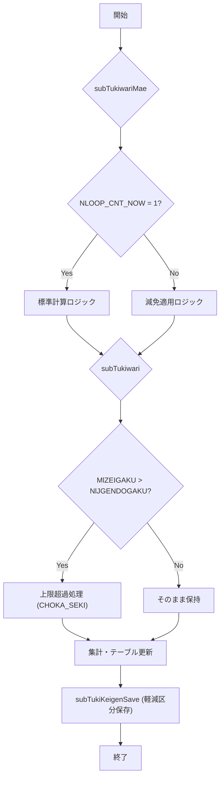

# 📄 ZLBSKCALMSIN.SQL – 国保（国民健康保険）月割税額算出ロジック  

> **対象読者**：本モジュールを初めて触る開発者、保守担当者、設計レビュー参加者  
> **目的**：国保の月割税額（所得割・均等割・資産割・産前産後均等割等）を算出し、各テーブルへ反映させるバッチ処理のコアロジック  

---  

## 目次
1. [概要](#概要)  
2. [主要プロシージャ](#主要プロシージャ)  
   - [subTukiwari](#subtukiwari)  
   - [subTukiKeigenSave](#subtukigenSave)  
   - [subTukiwariMae](#subtukiwariMae)  
3. [主要変数・定数](#主要変数定数)  
4. [処理フロー（Mermaid）](#処理フローマーメイド)  
5. [データベース操作概要](#データベース操作概要)  
6. [設計上の考慮点・トレードオフ](#設計上の考慮点トレードオフ)  
7. [潜在的な課題と改善案](#潜在的な課題と改善案)  
8. [関連ドキュメント・リンク](#関連ドキュメントリンク)  

---  

## 概要 <a name="概要"></a>

`ZLBSKCALMSIN.SQL` は、国民健康保険（以下「国保」）の **月割税額** を計算する PL/SQL スクリプトです。  
- **対象税目**：所得割、均等割、資産割、産前産後均等割、子ども均等割、軽減割（6割・4割・2割）  
- **計算対象**：世帯単位（`ZLBTKOJIN_CAL`）および世帯主単位（`ZLBTGENMEN_KOJIN_CAL`）のレコード  
- **実装方式**：手続き型 PL/SQL（プロシージャ）でロジックを分割し、テーブル更新は `EXECUTE IMMEDIATE` による動的 SQL を使用  

このスクリプトは **保険料算出バッチ** の一部として、月次・年次の保険料計算フェーズで呼び出されます。  

---  

## 主要プロシージャ <a name="主要プロシージャ"></a>

### 1. `subTukiwari` <a name="subtukiwari"></a>

**役割**  
- 各月（1〜12）について、**所得割・均等割・資産割・産前産後均等割** の金額を算出し、`ZLBTKOJIN_CAL` に格納  
- 軽減対象（6割・4割・2割）や子ども均等割減免額の計算ロジックを実装  

**主なロジック**  

| 条件 | 処理概要 |
|------|----------|
| `MlKEIGEN_KBN(NwIX) = NlJKEIGEN1`（軽減6割） | `MlTAISHO_KBN` が 1（特定同一）か 8（特定同一(2)) に応じて、減免率 `MwGENMEN_UMU` と `RlGENMEN_KOJIN.S_BYODOWARI_RITSU` を掛け算し、`MlZEIGAKU` と `NwBYODOWARI` に加算 |
| `MlKEIGEN_KBN(NwIX) = NlJKEIGEN2`（軽減4割） | 同上、減免率は 4 割用に切り替え |
| `MlKEIGEN_KBN(NwIX) = NlJKEIGEN3`（軽減2割） | 同上、減免率は 2 割用に切り替え |
| `ELSE`（軽減対象外） | 標準計算式 `TRUNC(NlJBYODO * MlOUEKI(NwIX) / 100) - (… - NlJBGEN…) * MwGENMEN_UMU(NwIX) * RlGENMEN_KOJIN.S_BYODOWARI_RITSU / 100` を適用 |
| `MlKEIGEN_KBN` が **いずれでもない** | `MlZEIGAKU` に `TRUNC(NlJBYODO * MlOUEKI / 100) - …` を直接加算し、`NwBYODOWARI` へも同様に加算 |

> **ポイント**：減免率は `MwGENMEN_UMU`（減免率テーブル）と `RlGENMEN_KOJIN.S_BYODOWARI_RITSU`（平等割減免率）を掛け合わせて算出。  
> **例外処理**：`MlZEIGAKU(NwIX) > NlJGENDOGAKU`（上限超過）時は `MlCHOKA_SEKI` に差額を保持し、上限 `NlJGENDOGAKU` に丸める。

**代表的なコード抜粋**  

```plsql
IF MlKEIGEN_KBN(NwIX) = NlJKEIGEN1 THEN   -- 軽減6割
  IF MlTAISHO_KBN(NwIX) = 1 THEN
    MlZEIGAKU(NwIX) := MlZEIGAKU(NwIX)
      + TRUNC(TRUNC(NlJBYODO * MlOUEKI(NwIX) / 100)
      - (TRUNC(NlJBYODO * MlOUEKI(NwIX) / 100) - NlJBGEN_T1)
      * MwGENMEN_UMU(NwIX) * RlGENMEN_KOJIN.S_BYODOWARI_RITSU / 100);
    NwBYODOWARI := NwBYODOWARI
      + TRUNC(TRUNC(NlJBYODO * MlOUEKI(NwIX) / 100)
      - (TRUNC(NlJBYODO * MlOUEKI(NwIX) / 100) - NlJBGEN_T1)
      * MwGENMEN_UMU(NwIX) * RlGENMEN_KOJIN.S_BYODOWARI_RITSU / 100);
  END IF;
  …
END IF;
```

---

### 2. `subTukiKeigenSave` <a name="subtukigenSave"></a>

**役割**  
- 事前に取得した **軽減区分**（`KEIGEN_1`〜`KEIGEN_12`）を配列 `MlKEIGEN_KBN` に格納し、後続ロジックで参照できるようにする  

**実装**  

```plsql
PROCEDURE subTukiKeigenSave IS
BEGIN
  MlKEIGEN_KBN(1)  := RlKIHON.KEIGEN_4;
  MlKEIGEN_KBN(2)  := RlKIHON.KEIGEN_5;
  …
  MlKEIGEN_KBN(12) := RlKIHON.KEIGEN_3;
END subTukiKeigenSave;
```

> **設計意図**：軽減区分は年度・自治体ごとに変わるため、外部テーブル `RLKIHON` から取得し、配列にキャッシュして高速参照を実現。

---

### 3. `subTukiwariMae` <a name="subtukiwariMae"></a>

**役割**  
- **計算前準備**：対象個人（`i_RKOJIN`）の各種フラグ・係数（資格区分、応益係数 `OUEKI`、応能係数 `OUNOU`、産前産後区分 `SAN_KBN` など）をローカル配列へ展開  
- **減免情報取得**：世帯ごとの減免率 `MwGENMENKOJIN`（12か月分）を取得し、`NGENMEN_KOJIN_KBN` が 1 の場合に設定  
- **子ども軽減判定**：外部関数 `ZLBPK00090.FCKODOMO_HANTEI` を呼び出し、子ども判定結果 `NKODOMOKOJIN` を設定  

**代表的なコード抜粋**  

```plsql
-- 計算個人の各月資格区分を退避
MlSHIK_KBN(1)  := i_RKOJIN.SHIK_4;
…
-- 計算個人の各月応益係数を退避
MlOUEKI(1)  := RlKANWAKOJIN.OUEKI_4;
…
-- 減免有無をセット（第2ループ時のみ）
IF NGENMEN_KOJIN_KBN = 1 THEN
  MwGENMENKOJIN(1) := NVL(RwGENMENKOJIN.S_GENMEN_4,0);
  …
END IF;
```

> **ポイント**：`NLOOP_CNT_NOW` が 1 のときは「標準計算」フェーズ、2 のときは「減免適用」フェーズとして分岐。  

---  

## 主要変数・定数 <a name="主要変数定数"></a>

| 変数名 | 型 | 用途 |
|--------|----|------|
| `MlZEIGAKU(NwIX)` | NUMBER | 月割税額（所得割・均等割・資産割の合計） |
| `NwBYODOWARI` | NUMBER | 平等割減免額（累積） |
| `MwGENMENKOJIN(NwIX)` | NUMBER | 月ごとの減免率（%） |
| `MlKEIGEN_KBN(NwIX)` | NUMBER | 軽減区分（6割/4割/2割） |
| `MlTAISHO_KBN(NwIX)` | NUMBER | 特定同一フラグ（1＝特定同一、8＝特定同一(2)） |
| `MlOUEKI(NwIX)` | NUMBER | 応益係数（%） |
| `MlOUNOU(NwIX)` | NUMBER | 応能係数（%） |
| `MlSAN_KBN(NwIX)` | NUMBER | 産前産後均等割対象フラグ |
| `NGENMEN_KOJIN_KBN` | NUMBER | 世帯の減免適用フラグ |
| `RlGENMEN_KOJIN.S_BYODOWARI_RITSU` | NUMBER | 平等割減免率（%） |
| `RlKIHON.KEIGEN_x` | NUMBER | 軽減区分設定（外部テーブル） |
| `NLOOP_CNT_NOW` | NUMBER | ループフェーズ（1＝標準、2＝減免） |
| `NwCNT_K_MM` | NUMBER | 月ごとの有資格者数合計（産前産後） |

> **命名規則**：`Ml`（配列）・`Nw`（スカラー）・`Rl`（レコード）・`Mw`（配列）といったプレフィックスでデータ種別を明示。  

---  

## 処理フロー（Mermaid） <a name="処理フローマーメイド"></a>



---  

## データベース操作概要 <a name="データベース操作概要"></a>

| テーブル | 主なカラム | 更新タイミング | コメント |
|----------|------------|----------------|----------|
| `ZLBTKOJIN_CAL` | `ZEIGAKU`, `BYODOWARI_KISO`, `BYODOWARI_GENGAKU` | `subTukiwari` の最後で `UPDATE`（動的 SQL） | 個人単位の税額・減免額を格納 |
| `ZLBTGENMEN_KOJIN_CAL` | `S_BYODOWARI_KISO`, `S_SHOTOKU_GENGAKU` 等 | `subTukiwari` の `YUSEN_KBN` に応じて 1/2 ループで更新 | 世帯単位の税額・減免額 |
| `ZLBTKANWA_KOJIN_CAL` | `OUEKI_x`, `OUNOU_x` | `subTukiwariMae` で `SELECT` → ローカル配列へ展開 | 応益・応能係数の取得 |
| `RWGENMENKOJIN`（外部ビュー） | `S_GENMEN_x` | `subTukiwariMae` の第2ループで取得 | 減免率情報 |
| `ZLBTKOJIN_CAL`（産前産後均等割） | `SAN_SIEN_GEN_KINTO` | `subTukiwari` の産前産後減免ロジックで `CEIL`・`UPDATE` | 産前産後均等割の端数調整 |

> **トランザクション**：各 `subTukiwari` 呼び出しは単一トランザクションとして実行され、エラー時は例外捕捉 (`WHEN OTHERS`) によりロールバックされます。  

---  

## 設計上の考慮点・トレードオフ <a name="設計上の考慮点トレードオフ"></a>

| 項目 | 内容 | メリット | デメリット |
|------|------|----------|------------|
| **配列キャッシュ** (`MlOUEKI`, `MlOUNOU` など) | DB から一括取得し PL/SQL 配列に保持 | ループ内の DB アクセス回数削減、計算速度向上 | メモリ使用量が増える（12 要素×多数） |
| **動的 SQL** (`EXECUTE IMMEDIATE`) | テーブル更新を文字列結合で実装 | 柔軟に条件分岐でき、SQL 文の再利用が容易 | SQL インジェクションリスクは低いが、可読性が低下 |
| **2段階ループ** (`NLOOP_CNT_NOW = 1/2`) | 標準計算 → 減免適用の二段階処理 | 減免ロジックを分離でき、テストがしやすい | ループ回数が増えるため処理時間が長くなる |
| **ハードコーディングされた定数** (`NlJBGEN_T1`, `NlJKINTO` など) | 法改正ごとにコード修正が必要 | 変更が一箇所に集約できる | 法改正時の保守コストが高い |
| **例外処理の簡素化** (`WHEN OTHERS THEN` → デフォルト係数 100) | データ欠損時にデフォルトで計算続行 | バッチが途中で止まらない | 本来のエラーが埋もれ、結果の信頼性が低下 |

---  

## 潜在的な課題と改善案 <a name="潜在的な課題と改善案"></a>

| 課題 | 現象 | 改善案 |
|------|------|--------|
| **コード可読性** | 1 つのプロシージャに 1000 行超のロジックが混在 | - ロジックをサブプロシージャに分割（例：`calcStandardTax`, `applyReduction`）<br>- コメントを日本語で統一し、条件分岐ごとにブロック化 |
| **ハードコーディング** | 法改正に伴う定数変更が頻繁 | - 定数テーブル（`MST_TAX_RATE`）を作成し、`SELECT` で取得<br>- 変更は DB のみで済むようにする |
| **例外処理の粒度不足** | `WHEN OTHERS` で全て 100% にフォールバック | - 例外種別別にハンドリングし、ログ出力を強化<br>- 重大エラーはバッチ停止し、アラートを上げる |
| **パフォーマンス** | 大規模世帯で `EXECUTE IMMEDIATE` がボトルネック | - バルク更新 (`FORALL`) を活用し、1 回の DML で複数行更新<br>- インデックス最適化（`KOKU_SETAI_NO`, `KOJIN_NO`） |
| **テスト容易性** | 1 つのプロシージャにロジックが集中 | - ユニットテスト用に PL/SQL パッケージ化し、関数単位でテスト可能にする |
| **ロギング** | 計算途中の中間結果が DB に残らない | - `DBMS_OUTPUT` だけでなく、`ZLBT_LOG` テーブルへ中間結果を書き込み、デバッグ情報を永続化 |

---  

## 関連ドキュメント・リンク <a name="関連ドキュメントリンク"></a>

| 項目 | URL |
|------|-----|
| **テーブル定義** | `[ZLBTKOJIN_CAL](http://localhost:3000/projects/big/wiki?file_path=D:/code-wiki/projects/big/test_big_7/ZLBTKOJIN_CAL.sql)` |
| **減免率マスタ** | `[MST_GENMEN_RATE](http://localhost:3000/projects/big/wiki?file_path=D:/code-wiki/projects/big/test_big_7/MST_GENMEN_RATE.sql)` |
| **法改正情報（2024/05/07）** | `[法改正メモ](http://localhost:3000/projects/big/wiki?file_path=D:/code-wiki/projects/big/test_big_7/CHANGELOG_20240507.md)` |
| **バッチ実行手順** | `[バッチジョブ定義](http://localhost:3000/projects/big/wiki?file_path=D:/code-wiki/projects/big/test_big_7/BatchJobDefinition.md)` |
| **ユニットテスト例** | `[ZLBSKCALMSIN_Tests.sql](http://localhost:3000/projects/big/wiki?file_path=D:/code-wiki/projects/big/test_big_7/ZLBSKCALMSIN_Tests.sql)` |

---  

> **まとめ**  
> `ZLBSKCALMSIN.SQL` は国保の月割税額算出ロジックの中核を担う PL/SQL スクリプトです。  
> - **軽減区分**、**産前産後均等割**、**子ども均等割** など多様な減免ロジックが組み込まれ、**2 段階ループ**で標準計算と減免適用を分離しています。  
> - 現行実装は高速化のために配列キャッシュや動的 SQL を多用していますが、**可読性・保守性**の観点でリファクタリング余地があります。  
> - 今後は **定数テーブル化**、**バルク更新**、**例外ハンドリングの粒度向上**を検討し、**テスト容易性**と **パフォーマンス** の両立を目指すと良いでしょう。  