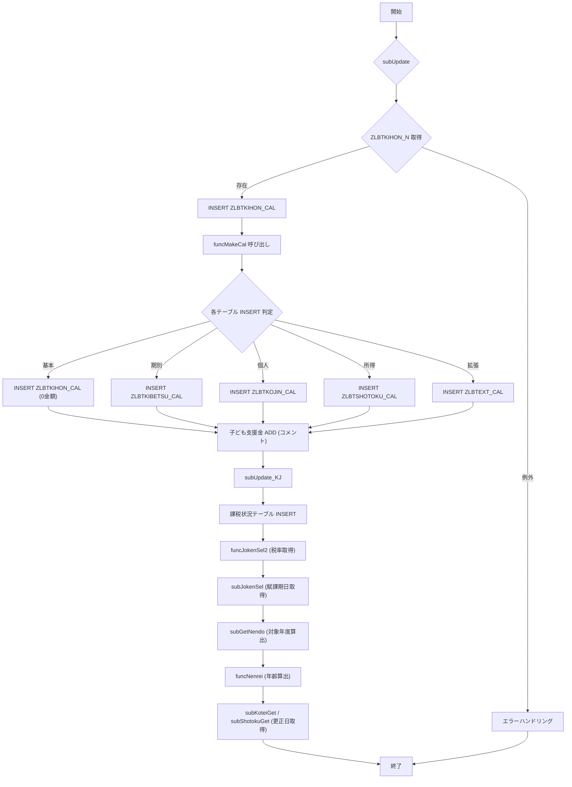

# 📘 ZLBSKCALPACK.SQL – コードウィキ

> **ファイルパス**  
> `D:\code-wiki\projects\big\test_big_7\ZLBSKCALPACK.SQL`  
> **対象プロジェクト** `big`  

---

## 目次
1. [概要](#概要)  
2. [主要プロシージャ・関数一覧](#主要プロシージャ・関数一覧)  
3. [処理フロー図](#処理フロー図)  
4. [子ども子育て支援金対応の追加ポイント](#子ども子育て支援金対応の追加ポイント)  
5. [エラーハンドリング方針](#エラーハンドリング方針)  
6. [設計上の決定事項・トレードオフ](#設計上の決定事項・トレードオフ)  
7. [改善・リファクタリング候補](#改善・リファクタリング候補)  
8. [関連 Wiki へのリンク例](#関連-wiki-へのリンク例)  

---

## 概要
`ZLBSKCALPACK.SQL` は、国保（国民健康保険）に関わる **計算テーブル（CAL）** の生成・更新ロジックを PL/SQL で実装したバッチスクリプトです。  
主に次の流れで処理が行われます。

1. **計算基本取得**（`subUpdate`）  
2. **計算テーブル（基本・期別・個人・所得・拡張）** の **INSERT**（存在しなければ 0 金額・0 区分で作成）  
3. **子ども子育て支援金** などの新制度対応が随時 **ADD** コメントで差分追加  
4. **システム条件取得**（税率・不均一課税・賦課期日）  
5. **年齢算出・更正日取得** などの補助ロジック  

> **対象読者**  
> - 新規参画エンジニア  
> - バッチ保守担当者  
> - 税率・制度変更に伴う改修者  

---

## 主要プロシージャ・関数一覧

| 名称 | 種別 | 主な引数 | 目的 | 主な処理 |
|------|------|----------|------|----------|
| `subUpdate` | PROCEDURE | `i_NKOKU_SETAI_NO` (世帯番号) | 計算基本テーブル `ZLBTKIHON_CAL` へ中間データを挿入 | `ZLBTKIHON_N` から取得 → `ZLBTKIHON_CAL` へ INSERT、例外時は `c_NERR` で終了 |
| `subUpdate2` | PROCEDURE | `i_NKOKU_SETAI_NO` | 計算基本テーブル `ZLBTTOKU_KIHON_CAL` へ中間データを挿入 | `ZLBTKIHON_N` → `ZLBTTOKU_KIHON_CAL` |
| `subUpdate_KJ` | PROCEDURE | `i_NKOKU_SETAI_NO` | 課税状況用テーブル（KJ）へ同様の中間データを挿入 | `ZLBTKIHON_N` → `ZLBTKIHON_KJ` など |
| `funcMakeCal` | FUNCTION | `i_NKOKU_SETAI_NO` | **計算テーブル群（基本・期別・個人・所得・拡張）** を **0 金額・0 区分** で作成 | 1. `ZLBTKIHON_N` カーソルで世帯ごとにループ 2. 各テーブル (`ZLBTKIHON_CAL`, `ZLBTKOJIN_CAL`, `ZLBTSHOTOKU_CAL` …) へ `INSERT`（存在チェック後） 3. 子ども支援金関連カラムの `ADD` が散在 |
| `funcJokenSel2` | FUNCTION | `i_NwDANTAI` (算定団体) | **税率・制度パラメータ** を `ZLBTJOKEN` から取得 | `SHOTOKU_IRY` など多数の税率変数へ格納 |
| `subJokenSel` | PROCEDURE | なし | **賦課期日・不均一課税・基礎控除** を取得 | `FUKAKIJITSU`, `FUKI_KAZEI`, `KISOKOJO` |
| `subGetNendo` | PROCEDURE | なし | **対象年度**（増額・減額対象）を算出 | `KANENDO_TAISHO_ZO/GEN` から算出 |
| `funcNenrei` | FUNCTION | `i_NTANJO` (誕生日) | 年齢算出（外部関数 `KKAPK0020.FAgeGet` 呼び出し） | 0 以上なら年齢、そうでなければ 0 |
| `subKoteiGet` | PROCEDURE | 複数（個人番号・更正日等） | **固定資産更正日** を取得し、必要に応じて `io_NJIYU`/`io_NKOSEI` を更新 | `ZLBTKOJIN_N` から資産割取得、`ZEBTFKAZEIKIHON` 系テーブルで更正日比較 |
| `subShotokuGet` | PROCEDURE | `i_NKOJIN_NO` | **所得更正日** を取得 | `ZABTIDORUIKEI` と `ZABTTABUMON` 系テーブルから最大 `IDO_BI` を取得 |

> **注**：全プロシージャは `EXCEPTION WHEN OTHERS THEN` で例外捕捉し、エラーメッセージ `VlMSG` とエラーコード `c_NERR` を設定して `EXIT` します。  

---

## 処理フロー図

---

## 子ども子育て支援金対応の追加ポイント

| 追加日 | 変更箇所 | 主なカラム・ロジック |
|--------|----------|----------------------|
| **2025/08/11** (ZCZL.LIUHUAJUN) | `subUpdate`、`funcMakeCal`、`funcJokenSel2`、`subKoteiGet` など多数 | - `KDM_18_KBN`、`KDM_SHOTOKU_WARI`、`KDM_SHISAN_WARI` など子ども関連税率カラムを `NVL(...,0)` で取得 - `ZLBTKDM_KIHON_CAL`、`ZLBTKDM_KIHON_KJ` へ子ども基本・課税情報の **0金額レコード** 挿入 - `ZLBTKDM_KIHON_N` から子ども年税額取得ロジック追加 |
| **2025/12/02** (ZCZL.LIUYANG) | `funcMakeCal` の子ども基本テーブル | - 子ども均等割軽減額（未就学児）`KDM_KODOMO_KEIGEN_KITO`、子ども均等割額 `KDM_KINTO`、子ども18歳以上均等割額 `KDM_KINTO18` カラムを追加 |
| **2024/05/07** (ZCZL.ZHANGLEI) | `funcMakeCal` の支援・介護・医療テーブル | - `SAN_*` 系カラム（産前産後支援）を追加し、マージ作業に備える |

> **ポイント**  
> - 追加はすべて **コメント `--2025/08/11 ... ADD START/END`** で囲まれているため、差分抽出が容易です。  
> - 子ども関連カラムは **`NVL(...,0)`** で取得し、既存ロジックに影響を与えないように設計されています。  

---

## エラーハンドリング方針

| 位置 | エラーハンドリング | 返却値・副作用 |
|------|-------------------|----------------|
| `subUpdate`、`subUpdate2`、`subUpdate_KJ` | `EXCEPTION WHEN OTHERS THEN` → `NlRTN := c_NERR`、`VlMSG` にエラーメッセージ | 呼び出し側は `c_NERR` で処理中断 |
| `funcMakeCal` 各 `INSERT` ブロック | 同上、`EXIT` でループ脱出 | 部分的に成功したレコードはコミット済み（自動コミットは無いが、同一トランザクション内） |
| `funcJokenSel2`、`subJokenSel` | 例外捕捉 → `VlMSG`、`RETURN(c_NERR)` | 呼び出し側はエラーコードで判定 |
| `subKoteiGet`、`subShotokuGet` | 例外捕捉 → `NULL`（無視）または `NwKOSEI := 0` | 更正日取得失敗時はデフォルト 0 で続行 |

> **設計意図**：バッチ処理は **部分的に成功** したデータを残す方針（ロールバックは行わない）。エラーはログに残し、後続処理は可能な限り続行する。

---

## 設計上の決定事項・トレードオフ

| 項目 | 内容 | メリット | デメリット |
|------|------|----------|------------|
| **INSERT 前の存在チェック** | `SELECT COUNT(*)` → 0 の場合のみ `INSERT` | 重複防止、冪等性確保 | 2 回の DB アクセスでパフォーマンス低下 |
| **エラーハンドリングの一括化** | 各ブロックで `WHEN OTHERS THEN` → 共通変数 `c_NERR` | 実装がシンプル、エラーログ統一 | エラー原因が曖昧になる（スタックトレースが失われる） |
| **子ども支援金の差分追加方式** | コメントで `ADD START/END` を使用し、`NVL` でデフォルト 0 | 既存ロジックへの影響最小化、差分管理が容易 | コメントが増えると可読性が低下、将来的にコード肥大化 |
| **固定資産・所得更正日の取得ロジック** | 複数テーブル (`ZEBTFKAZEIKIHON` 系) で最大日付取得 | 正確な更正日判定が可能 | テーブルが分散し、SQL が長くなる |
| **年齢算出の外部関数呼び出し** (`KKAPK0020.FAgeGet`) | ロジックを外部に委譲 | 再利用性、テスト容易 | 外部依存が増える（デプロイ時の注意） |

---

## 改善・リファクタリング候補

1. **バルク INSERT へ置き換え**  
   - 現在は 1 行ずつ `INSERT` → `FOR` ループで実行。`INSERT /*+ APPEND */ SELECT ... FROM ... WHERE NOT EXISTS` に変更すれば DB アクセス回数を削減。

2. **共通エラーハンドラの抽出**  
   - PL/SQL パッケージ内に `PROCEDURE raise_error(p_msg VARCHAR2)` を作り、`EXCEPTION` 部分を統一すればメンテナンス性向上。

3. **子ども支援金カラムのテーブル分割**  
   - 子ども関連カラムは頻繁に変更されるため、**サブテーブル**（例: `ZLBTKDM_KIHON_EXT`）に切り出すとスキーマ変更が楽になる。

4. **パラメータ化された `NVL` 取得**  
   - `NVL(SHOTOKU_KDM,0)` のようにハードコーディングせず、**設定テーブル**でデフォルト値を管理すると、制度変更時のコード修正が不要。

5. **ロギングフレームワーク導入**  
   - 現在は `VlMSG` 文字列にエラーメッセージを格納 → **標準ロギングパッケージ**（例: `UTL_FILE` + `DBMS_APPLICATION_INFO`）へ統合し、ログレベル（INFO/ERROR）を付与。

---

## 関連 Wiki へのリンク例

| 機能 | Wiki リンク |
|------|-------------|
| 計算テーブル作成ロジック | `[funcMakeCal](http://localhost:3000/projects/big/wiki?file_path=D:/code-wiki/projects/big/test_big_7/ZLBSKCALPACK.SQL)` |
| 子ども子育て支援金対応 | `[子ども支援金追加](http://localhost:3000/projects/big/wiki?file_path=D:/code-wiki/projects/big/test_big_7/ZLBSKCALPACK.SQL#子ども子育て支援金対応の追加ポイント)` |
| エラーハンドリング方針 | `[エラーハンドリング](http://localhost:3000/projects/big/wiki?file_path=D:/code-wiki/projects/big/test_big_7/ZLBSKCALPACK.SQL#エラーハンドリング方針)` |

---

## まとめ

- **`ZLBSKCALPACK.SQL`** は国保計算バッチの中核であり、**冪等性** と **例外耐性** を重視した実装です。  
- **子ども子育て支援金** の追加はコメントで差分管理され、既存ロジックに最小限の影響で拡張されています。  
- 将来的な **パフォーマンス改善** と **コード可読性向上** のため、バルク処理・共通エラーハンドラ・テーブル分割を検討してください。  

> **次のステップ**  
> 1. 現行バッチの実行時間を測定し、ボトルネックを特定。  
> 2. 上記リファクタリング候補のうち、**バルク INSERT** と **共通エラーハンドラ** の実装を優先。  
> 3. 子ども支援金カラムのスキーマ変更が頻繁になる場合は、サブテーブル化の設計レビューを実施。  

--- 

*このドキュメントは Code Wiki プロジェクトの標準テンプレートに沿って作成されました。*