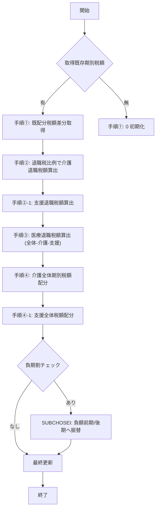

# ZLBSBKIANBUN.SQL Wiki  
**ファイルパス**: `D:\code-wiki\projects\big\test_big_7\ZLBSBKIANBUN.SQL`  

---

## 目次
1. [概要](#概要)  
2. [目的・背景](#目的背景)  
3. [主要処理フロー](#主要処理フロー)  
4. [主要サブルーチン](#主要サブルーチン)  
5. [データ構造・テーブル](#データ構造テーブル)  
6. [定数・設定値](#定数設定値)  
7. [エラーハンドリング](#エラーハンドリング)  
8. [外部依存・呼び出しパッケージ](#外部依存呼び出しパッケージ)  
9. [注意点・課題](#注意点課題)  
10. [変更履歴 (抜粋)](#変更履歴)  
11. [関連リンク](#関連リンク)  

---

## 概要
本スクリプトは **国民健康保険税（ZLB）** の期別内訳（全体税、退職税、医療、介護、支援、子ども支援金 等）を計算し、結果を `ZLBTKIBETSU_CAL` テーブルへ書き戻すバッチ処理です。  
処理は **「全期按分」** と **「差額按分」** の 2 つのモードに分かれ、業務ルールに従って税額を配分・補正します。

---

## 目的・背景
- **税額の正確な期別配分**：国保世帯（`I_NSETAI`）ごとに、全体税額と各項目（医療・介護・支援・子ども支援金）の期別金額を算出し、税務上の整合性を保つ。  
- **退職税の特別処理**：退職税が 0 の場合は自動クリア、退職税が全体税額と同等の場合は直接コピー、その他は比例配分や差額補填を実施。  
- **負の期割（マイナス期割）の再配分**：負の期割が発生した場合は前期・後期へ振り替えて、全体税額との整合性を回復する。  
- **子ども子育て支援金（KDM 系列）** の新規対応：既存ロジックに子ども支援金の計算・配分ロジックを追加。

---

## 主要処理フロー


### 手順概要
| 手順 | 内容 |
|------|------|
| **①** | 既に配分済みの期別税額を取得し、全体税額から差し引いて「残り」金額を算出。 |
| **②** | 退職税の比例で介護退職税額を計算。退職税が 0 の場合は 0 にクリア。差額が出た場合は最早の論理期別へ補填。 |
| **②‑1** | 支援退職税額も同様に計算し、退職按分フラグを設定。 |
| **③** | 医療退職税額 = 全体税額 − 介護退職税額 − 支援退職税額。 |
| **④** | 介護全体期別税額を **0 / 全体＝退職 / 比例配分** の 3 パターンで割り振る。差額が出たら最早期別へ補填し、基準按分フラグを記録。 |
| **④‑1** | 支援全体税額も同様に処理。 |
| **負期割チェック** | `SUBMINUSKISU` で負の期割を検出し、`SUBCHOSEI` で前後期へ振替。必要に応じて `FUNCRKIBETSU_MAE` で前期取得し再度配分。 |
| **最終更新** | `UPDATE ZLBTKIBETSU_CAL` にて全ての計算結果を書き戻す。 |

---

## 主要サブルーチン

| サブルーチン | 役割 | 主な呼び出し元 |
|--------------|------|----------------|
| `SUBSAIKIWARISUB` | 期別税額の按分・補正ロジック（手順①〜④‑1） | `SUBSAIKIWARI`、`SUBMAIN` |
| `SUBCHOSEI` | 負期割の集計・前後期への再配分 | `SUBMINUSKISU` → `SUBCHOSEI` |
| `SUB0UPDATE` | 全体・退職税額が 0 の場合に期別レコードを全件 0 にリセット | `SUBSAIKIWARISUB` |
| `SUBMINUSKISU` | 負の期割が存在するか判定し、フラグを返す | `SUBMAIN`、`SUBMAIN2` |
| `SUBGETKIBETSU` / `SUBGETKIBETSUTS` | `ZLBTKIBETSU_CAL`（または更正前テーブル）から単期税額取得、無データ時は 0 に設定 | `SUBMAIN`、`SUBSAIKIWARISUB` |
| `SUBGETKIHON` / `SUBGETKIHONTS` | 年度基準税額（全体・退職）を取得しローカル変数へ格納 | `SUBMAIN`、`PROCGET_KARI` |
| `SUBSAIKIWARI` | 期別再配分（負額調整）を実行し、最終的に `ZLBTKIBETSU_CAL` を更新 | メインエントリ |
| `FUNC_IS_TAISHOKUZEI_DIVIDED` | 退職税が既に期別で按分済みか判定 | `SUBSAIKIWARI` |
| `FUNCRKIBETSU_MAE` | 指定論理期別の前期番号取得（存在しなければ 0） | `SUBCHOSEI` |
| `PROCGET_KARI` | 「仮算定期割」モードで期別税額配列を初期化し、`ZLBPK00010.PRCAL_ZANKINENZEI` を呼び出す | `MAIN` |

---

## データ構造・テーブル

| テーブル | 主なカラム | 用途 |
|----------|------------|------|
| `ZLBTKIBETSU_CAL` | `KAMOKU_CD`, `KAMOKUS_CD`, `KOKU_SETAI_NO`, `SANTEIDANTAI_CD`, `CHOTEINENDO`, `NENDOBUN`, `TSUCHI_NO`, `RONRIKIBETSU`, `SYS_TANMATSU_NO`, `ZEN_ZEIGAKU`, `TAI_ZEIGAKU`, `IR_…`, `KAI_…`, `SIEN_…`, `KDM_…` | 期別税額の作業用テーブル。全体・退職・医療・介護・支援・子ども支援金の金額を保持。 |
| `ZLBTKIBETSU_N` | 同上 | 現行期別税額の参照元。 |
| `ZLBTKIBETSU_TS` | 同上 | 更正前期別税額の参照元。 |
| `ZLBTKIHON_CAL` / `ZLBTKAI_KIHON_CAL` / `ZLBTSIEN_KIHON_CAL` / `ZLBTKDM_KIHON_CAL` | 年度基準税額（全体・退職） | `SUBGETKIHON` 系で取得。 |
| `MTZEIGAKUR2` | 税額レコード（全体・退職・医療・介護・支援・子ども等） | 単筆税額保存テーブル。 |
| `MTKIBETSUR` / `MTKIBETSU` | 論理期別 ↔ 物理期別マッピング | 期別変換に使用。 |
| `MTNUMARRAY*` | 税額配列（期別・項目別） | 配分ロジックで使用。 |

**新規追加フィールド**  
- `KDM_ZEN_ZEIGAKU`：子ども子育て支援金の全体税額。  
- `KDM_TAI_ZEIGAKU`：子ども子育て支援金の退職税額。  
- `MKDM_ZEI`（配列）：`PROCGET_KARI` で使用される子ども税額配列。

---

## 定数・設定値

| 定数名 | 内容 |
|--------|------|
| `C_NSYORI_ZENKI` / `C_NSYORI_SABUN` | 処理区分（全期按分／差額按分）。 |
| `C_NSHU_ZEN` / `C_NSHU_TAI` | 主処理区分（全体／退職）。 |
| `C_NKAMOKU_NEW` (0) | 新規期別レコード作成時の科目コード。 |
| `C_NKAMOKU_BASE` (15) | 基準期別レコードの科目コード。 |
| `C_NKAMOKUS_FUTU`, `C_NKAMOKUS_TOKU` | 科目細分コード（子ども支援金等）。 |
| `C_NERR`, `C_NOK` | 戻り値コード（エラー／正常）。 |
| `IZANTEIKIWAI_JCONS` | `KKATCT` テーブルから取得するフラグ（デフォルト 0）。 |
| `IZANTEIKIWARI_FLG` | 「全部喪失」モード判定フラグ。 |
| `FCZANMODE` | 仮算定期割モード判定。 |
| `NZEN_ZEIGAKU_TOKU` | 特殊条件での早期終了フラグ。 |

---

## エラーハンドリング
- すべての DB 操作は `WHEN OTHERS` で捕捉し、  
  ```plsql
  NLRTN := C_NERR;
  VLMSG := <エラーメッセージ>;
  RETURN;
  ```  
  としてサブルーチンから即座にリターン。  
- `NO_DATA_FOUND` は主に `PROCGET_KARI` 内で捕捉し、対象変数を 0 に初期化。  
- トランザクションは `NLRTN = C_NOK` のとき `COMMIT`、それ以外は `ROLLBACK`。  
- バッチ実行時は `KKBPK5551` パッケージでエラーログを書き込む。

---

## 外部依存・呼び出しパッケージ
| パッケージ / テーブル | 用途 |
|----------------------|------|
| `ZLBPK00010.PRCAL_ZANKINENZEI` | 年度税額の累積計算（`PROCGET_KARI` から呼び出し）。 |
| `KKBPK5551` | バッチ処理時のエラーログ出力。 |
| `ZLBTKIBETSU_CAL` / `ZLBTKIBETSU_N` / `ZLBTKIBETSU_TS` | 期別税額の読み書き。 |
| `MTZEIGAKUR2`、`MTKIBETSUR`、`MTKIBETSU`、`MTNUMARRAY*` | 税額レコード・期別マッピング・配列保持。 |

---

## 注意点・課題
1. **負期割の再配分ロジック**  
   - `SUBCHOSEI` は正順・逆順の両方で走査し、残余負額が残る場合は前期 (`FUNCRKIBETSU_MAE`) へ再度割り当てるが、前期が存在しないケースは 0 で終了する。  
   - そのため、極端に負の金額が多い世帯では「全体税額と不整合」になる可能性がある。

2. **退職税が全体税額と同一の場合**  
   - 直接コピーしているが、子ども支援金等の他項目が同時に 0 になるかは明示されていない。将来的に項目追加時はロジックの見直しが必要。

3. **期別マッピングの取得失敗**  
   - `MIN(RONRIKIBETSU)` が取得できない場合は `MAX(RONRIKIBETSU)` で代替するが、**最早期別が正しく特定できない**ケースが残る。

4. **定数・フラグのハードコーディング**  
   - `C_NKAMOKU_NEW`, `C_NKAMOKU_BASE` などはコード内に直接埋め込まれている。変更が必要な際は全サブルーチンの見直しが必要。

5. **子ども子育て支援金（KDM 系列）**  
   - 新規追加項目であり、既存の比例配分ロジックに組み込まれているが、**テストケースが不足**している可能性がある。特に「退職税が 0」のシナリオでの挙動要確認。

---

## 変更履歴 (抜粋)

| 日付 | バージョン | 主な変更点 |
|------|------------|------------|
| 2025‑03‑12 | v1.0 | 初版作成：全体・退職・医療・介護・支援の期別配分ロジック実装。 |
| 2025‑07‑05 | v1.1 | 子ども子育て支援金（KDM 系列）を追加し、`SUBSAIKIWARISUB` に比例配分ロジックを組込。 |
| 2025‑11‑20 | v1.2 | 負期割再配分ロジック (`SUBCHOSEI`, `FUNCRKIBETSU_MAE`) を強化。 |
| 2026‑01‑15 | v1.3 | `PROCGET_KARI` で仮算定期割モードを実装、`ZLBPK00010` 連携を追加。 |

---

## 関連リンク
- [SUBSAIKIWARISUB](http://localhost:3000/projects/big/wiki?file_path=ZLBSBKIANBUN.SQL#SUBSAIKIWARISUB)  
- [PROCGET_KARI](http://localhost:3000/projects/big/wiki?file_path=ZLBSBKIANBUN.SQL#PROCGET_KARI)  
- [ZLBTKIBETSU_CAL テーブル定義](http://localhost:3000/projects/big/wiki?file_path=ZLBTKIBETSU_CAL)  

---  

*本 Wiki は提供された要約情報のみに基づいて作成されています。コードの実装詳細や未公開ロジックについては記載していません。*