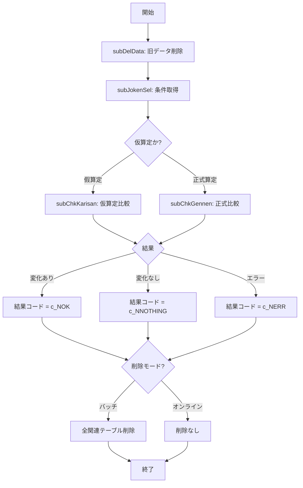

# ZLBSBUPCHK.SQL Wiki  
**ファイルパス**: `D:\code-wiki\projects\big\test_big_7\ZLBSBUPCHK.SQL`  

---

## 目次
1. [概要](#概要)  
2. [主要プロシージャ `ZLBSBUPCHK`](#主要プロシージャ-zlbsubpch)  
3. [サブプロシージャ](#サブプロシージャ)  
   - `subDelData`  
   - `subJokenSel`  
   - `subChkKarisan`  
   - `subChkGennen`  
   - `subChkKanen`  
4. [定数・戻りコード](#定数・戻りコード)  
5. [作業領域変数](#作業領域変数)  
6. [外部テーブル依存関係](#外部テーブル依存関係)  
7. [エラーハンドリング & 境界条件](#エラーハンドリング--境界条件)  
8. [ビジネスロジック詳細](#ビジネスロジック詳細)  
9. [更新／削除ロジック](#更新削除ロジック)  
10. [バージョン情報](#バージョン情報)  
11. [フローチャート](#フローチャート)  

---

## 概要
`ZLBSBUPCHK` は、課税計算が完了した後に **計算テーブル (CAL)** と **課税テーブル (N)** を比較し、**変化の有無** を判定して結果コードを返すストアドプロシージャです。  

| 戻りコード | 意味 |
|------------|------|
| `0` (`c_NOK`) | 変化あり |
| `1` (`c_NERR`) | エラー |
| `9` (`c_NNOTHING`) | 変化なし |

---

## 主要プロシージャ `ZLBSBUPCHK`

1. **データ削除** – `subDelData` を呼び出し、対象キーに紐づく計算・退職・介護・支援・子ども支援の明細をすべて削除。  
2. **条件取得** – `subJokenSel` でシステム条件表 `ZLBTJOKEN` から増減対象年度を取得し、内部で使用する年度フラグを設定。  
3. **仮算定・正式算定の比較** –  
   - `subChkKarisan` : 仮算定（「假算定」）段階の普通期割・特徴期割を比較。  
   - `subChkGennen` : 正式算定（現年）段階で、計算テーブルと課税テーブルの詳細比較を実施。  
4. **結果コード設定** – 各サブプロシージャで判定されたフラグに基づき `NlCHK_R` に `c_NOK` / `c_NNOTHING` / `c_NERR` を設定し、最終的に呼び出し元へ返却。

---

## サブプロシージャ

### `subDelData`
- **目的**: 指定された計算基本レコード (`i_NKIJUNBI` など) に紐づく全明細（計算、退職、介護、支援、子ども支援）を削除。  
- **対象テーブル**: `ZLBTKIHON_CAL`, `ZLBTTAI_CAL`, `ZLBTKIBETSU_N` など多数。  
- **エラーハンドリング**: `OTHERS` 例外捕捉 → `NlRTN := c_NERR`、エラーメッセージ `VlMSG` に格納。

### `subJokenSel`
- **目的**: `ZLBTJOKEN` から増減対象年度を取得し、内部定数 `c_NGENNEN` / `c_NKANEN` へマッピング。  
- **出力**: 年度フラグ変数（例: `NlNENDO_ZO`, `NlNENDO_GEN`）が設定され、後続比較ロジックで使用。

### `subChkKarisan`
- **対象**: 仮算定（「假算定」）段階の **普通期割** と **特徴期割**。  
- **処理**: 計算テーブルと課税テーブルの税額・人数等を集計比較し、差異があれば `NlCHK_R := c_NOK`。

### `subChkGennen`
- **対象**: 正式算定（現年）段階。  
- **主なフラグ**:  
  - `NwIRY_FLG` – 医療データ有無  
  - `NwKAI_FLG` – 介護データ有無  
  - `NwSIEN_FLG` – 支援データ有無  
  - `NwKDM_FLG` – 子ども支援金データ有無  
- **ロジック概要**:  
  1. 各テーブル (`*_CAL` と `*_N`) から税額・限度・減額・人数・所得等を取得。  
  2. `NO_DATA_FOUND` 捕捉でフラグを `1` に設定し、欠損データは比較対象外に。  
  3. **全フラグが 0** の場合、全項目を逐次比較。いずれか不一致 → `NlCHK_R := c_NOK`。  
  4. フラグの組み合わせに応じた分岐（例: `NwKAI_FLG=1 && NwSIEN_FLG=1 && NwKDM_FLG=0`）で、実際に存在するデータだけを比較。  

### `subChkKanen`
- **対象**: 前年（過年度）データの増減判定。  
- **判定基準**: 各フラグ (`NwIRY_KIHON_FLG` など) と税額比較 (`> N`, `< N`, `> 0`) により **増額・減額・無変化** を決定し、`NlCHK_R` に設定。  
- **トリガー**: `i_NNENDO_BUN` が閾値 (`NlNENDO_ZO`, `NlNENDO_GEN`) 以上の場合にのみ実行。

---

## 定数・戻りコード
| 定数 | 説明 |
|------|------|
| `c_NOK` | 変化あり (0) |
| `c_NERR` | エラー (1) |
| `c_NNOTHING` | 変化なし (9) |
| `c_NBATCH` | バッチ実行区分 |
| `c_NONLNIN` | オンライン/オフライン判別 |
| `c_NGENNEN` / `c_NKANEN` | 年度識別フラグ |

---

## 作業領域変数
- **数値型**: `NUMBER` 系変数多数（例: `NwTAIC_SEKISAN`, `NwKIHONN_GENDO_CHOKA`）で税額・限度・減額・人数・所得等を保持。  
- **文字列型**: `NVARCHAR2` 系で個人番号や区分コードを保持。  
- **論理型**: `BOOLEAN` 系でフラグ (`*_FLG`) を管理。  

---

## 外部テーブル依存関係
| カテゴリ | テーブル名 |
|----------|------------|
| 計算テーブル (CAL) | `ZLBTKIHON_CAL`, `ZLBTTAI_CAL`, `ZLBTKIBETSU_CAL`, `ZLBTKAI_KIHON_CAL`, `ZLBTKAI_TAI_CAL`, `ZLBTSIEN_KIHON_CAL`, `ZLBTSIEN_TAI_CAL`, `ZLBTKDM_KIHON_CAL` |
| 課税テーブル (N) | `ZLBTKIHON_N`, `ZLBTTAI_N`, `ZLBTKIBETSU_N`, `ZLBTKAI_KIHON_N`, `ZLBTKAI_TAI_N`, `ZLBTSIEN_KIHON_N`, `ZLBTSIEN_TAI_N`, `ZLBTKDM_KIHON_N` |
| 条件テーブル | `ZLBTJOKEN` |
| 補助テーブル | `ZLBTEXT_CAL`, `ZLBTEXT_N`（被扶養者・失業者区分） |
| その他 | `ZLBTKDM_KIHON_CAL/N`（子ども子育て支援金） |

---

## エラーハンドリング & 境界条件
- **例外捕捉**:  
  - `NO_DATA_FOUND` → 該当フラグを `1` に設定し、比較ロジックをスキップ。  
  - `OTHERS` → `NlRTN := c_NERR`、エラーメッセージ `VlMSG` に `SQLERRM` を格納し、ループやプロシージャから `EXIT`。  
- **パラメータデフォルト**: `i_NKIJUNBI` はデフォルト `0`（省略可能）。  
- **データ欠損**: フラグが `1` の場合は「データなし」とみなし、比較対象外にすることで誤検知を防止。  

---

## ビジネスロジック詳細

### 1. 変化判定の分岐
- **全データ有無** (`NwIRY_FLG = NwKAI_FLG = NwSIEN_FLG = NwKDM_FLG = 0`) → **全項目比較**。  
- **一部欠損** → フラグ組み合わせに応じた **部分比較**（例: 介護・支援は無、子どもだけあり）。  

### 2. 子ども子育て支援金ロジック
1. `ZLBTKDM_KIHON_CAL` から基本情報取得。無ければ `NwKDM_FLG := 1`。  
2. 有れば `ZLBTKDM_KIHON_N` から課税情報取得。`NO_DATA_FOUND` 捕捉で同様にフラグ設定。  
3. 4種データが全て揃ったら、**積算税額・限度超過額・減額合計・年税額・個人番号・均等人数・現在人数・申告区分・所得額** を逐次比較。  

### 3. 特徴状態・期別データチェック
- `JOTAI_KBN`（特徴状態）や `ZLBTKIBETSU_*`（期別テーブル）の件数・内容を比較し、**翌年度通知書番号** の変化も判定対象に含める。  

### 4. 被扶養者・失業者区分チェック
- `ZLBTEXT_CAL` と `ZLBTEXT_N` の `H_KBN` を比較。  
- 新データが `0` かつ旧データが `9` の場合、**拡張テーブルのゼロ条件** を集計し、変化判定に利用。  

---

## 更新／削除ロジック
- **変化なし (`c_NNOTHING`)** かつ **オンラインモード (`i_NJIKKOU_KBN = c_NONLNIN`)** の場合は **削除を実行しない**。  
- **変化あり (`c_NOK`)** かつ **バッチモード** の場合は、**全関連計算テーブル**（`*_CAL` 系）と **子ども支援金テーブル** (`ZLBTKDM_KIHON_CAL`) を一括削除。  
- 削除対象は **キー項目** (`KOKU_SETAI_NO`, `SANTEIDANTAI_CD`, `CHOTEI_NENDO`, `NENDO_BUN`, `TSUCHI_NO`, `SYS_TANMATSU_NO`) に基づく。  

---

## バージョン情報
| バージョン | 変更点 |
|------------|--------|
| 2025‑08 | 新機能追加（詳細は要確認） |

---

## フローチャート

---

## 参考リンク
- [subDelData](http://localhost:3000/projects/big/wiki?file_path=ZLBSBUPCHK.SQL#subDelData)  
- [subChkGennen](http://localhost:3000/projects/big/wiki?file_path=ZLBSBUPCHK.SQL#subChkGennen)  

---  

*この Wiki は提供された要約情報のみに基づいて作成されています。コードの詳細な実装や追加のビジネスロジックは、実際のソースコードをご確認ください。*