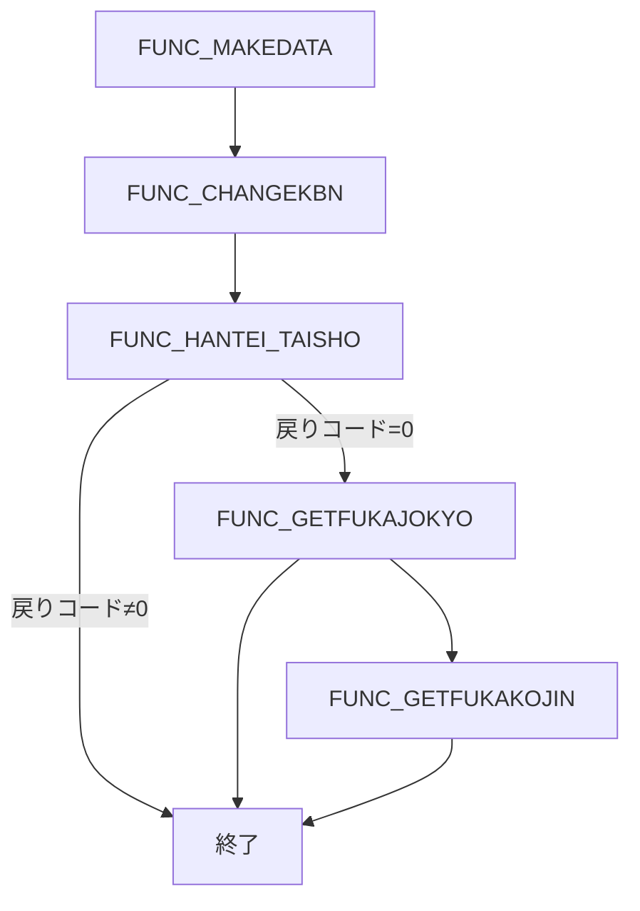

# 📄 ZLBSCSGKHHT.SQL Wiki（日本語）

---  

## 目次
1. [概要](#概要)  
2. [主な役割](#主な役割)  
3. [入出力パラメータ](#入出力パラメータ)  
4. [主要レコード型（カスタム構造）](#主要レコード型カスタム構造)  
5. [コアプロシージャ／関数一覧](#コアプロシージャ関数一覧)  
6. [処理フロー](#処理フロー)  
7. [エラーロギング](#エラーロギング)  
8. [外部依存表・プロシージャ](#外部依存表プロシージャ)  
9. [留意点・改善ポイント](#留意点改善ポイント)  
10. [参考リンク（内部 Wiki）](#参考リンク内部-wiki)  

---  

## 概要
`ZLBSCSGKHHT` は **国民健康保険税（ZLB）** 業務における「賦課決定期間の制限対象候補世帯判定処理」を実装した SQL パッケージです。  
計算基本テーブルと賦課基本テーブルの数値を比較し、対象世帯が制限対象かどうかを判定し、増減フラグと判定ログを記録します。

---  

## 主な役割
| # | 内容 |
|---|------|
| 1 | 計算基本（`計算基本`）と賦課基本（`賦課基本`）の比較により、**制限対象候補世帯** を判定 |
| 2 | 増減フラグ（`ZO`／`GEN`）を設定し、**判定ログ** を生成 |
| 3 | 判定結果を中間ワークテーブルへ書き込み、次工程へ引き継ぐ |

---  

## 入出力パラメータ
| パラメータ | 種別 | 説明 |
|------------|------|------|
| `i_NRENBAN` | IN | 登録番号 |
| `i_NCHOTEI_NENDO` | IN | 調定年度 |
| `i_NNENDO_HANI` | IN | 年度範囲 |
| `i_NSYS_SHOKUINKOJIN_NO` | IN | 更新職員番号 |
| `i_VMASIN_NO` | IN | 端末番号 |
| `o_NRTN` | OUT | プロシージャ戻りコード（`0`＝正常、`1`＝例外） |

---  

## 主要レコード型（カスタム構造）

| レコード名 | 主な項目 | 用途 |
|------------|----------|------|
| `KEIKIRECORD` / `KEIKIRECORD_KDM` | 均等、基準収入、各種割額、軽減額、月次資格人数等 | 賦課状況の保持 |
| `KOJINRECORD` | 個人資格人数の月次累計（医・支、介護、特同、特継、旧、非） | 個人別集計 |
| `JOKYO_ZOGENFLG_RECORD` / `JOKYO_ZOGENFLG_RECORD_KDM` | 増/減フラグ集合（項目単位） | 共通増減判定 |
| `KOJIN_ZOGENFLG_RECORD` | 個人増減フラグ集合（月次資格人数） | 個人増減判定 |
| `KYOTSU_ZOGENFLG_RECORD` | 共通増減フラグ、各種費用・資格等の比較結果 | 全体増減判定 |

---  

## コアプロシージャ／関数一覧

| 名称 | 種別 | 役割 |
|------|------|------|
| `PROCLOGOUT` | プロシージャ | ログテーブル `KKBPK5551.FSETOLOG` / `FSETBLOG` へ情報・例外を書き込む |
| `FUNC_GETHANTEIKEKA_LOG` | 関数 | 判定ログ文字列を結合（最大 1000 文字、全角スペース区切り） |
| `FUNC_COMPARE_ZO*` / `FUNC_COMPARE_GEN*` | 関数 | 計算基本と賦課基本の数値比較 → 増減フラグ設定 |
| `PROC_SETKYOTSU_ZOGEN_FLG` | プロシージャ | `KYOTSU_ZOGENFLG_RECORD` の比較結果から共通増減フラグ・ログを生成 |
| `PROC_SETKOJIN_ZOGEN_FLG` | プロシージャ | `KOJINRECORD`（計算）と `KOJINRECORD`（賦課）を比較し、個人増減フラグを生成 |
| `FUNC_GETFUKAKOJIN` | 関数 | 計算個人表 `ZLBWKOJIN_CAL_SKH` と最新賦課個人表 `ZLBTKOJIN_N` から集計データ取得、増減フラグ生成 |
| `FUNC_INSERT_WK_FUKAJOKYO` | 関数 | 計算結果・増減フラグ・ログ・メタデータを中間作業表 `ZLBWSEIGENKOHO_FJK` に一括書き込み |
| `PROC_SETJOKYO_ZOGEN_FLG` | プロシージャ | 基本・支援・子ども・介護 4 種類のレコードを対象に増減フラグを生成 |
| `FUNC_MAKESQL_KIHON` | 関数 | 基本情報取得用 SELECT 文を動的生成（子ども基本テーブルの場合は `KINTO_CNT_KDM18` 追加） |
| `FUNC_GETFUKAJOKYO` | 関数 | 計算基本/支援/子ども/介護 のレコード取得 → `PROC_SETJOKYO_ZOGEN_FLG` 呼び出し → `FUNC_INSERT_WK_FUKAJOKYO` 書き込み |
| `FUNC_HANTEI_TAISHO` | 関数 | 期間内の計算基本レコードを集計、最新賦課レコードの有無確認、システム条件チェック、候補世帯未登録なら `ZLBWSEIGENKOHO_SETAI` に INSERT |
| `FUNC_MAKEDATA` | 関数 | `KKAPK3000.FTRUNCATE` で作業表 `ZLBWKOJIN_CAL_SKH` をクリアし、`ZLBTKOJIN_CAL` を全量コピー |
| `FUNC_CHANGEKBN` | 関数 | `ZLBWKOJIN_CAL_SKH` と `ZLBTKANWA_TAISHO_TMP` の交差行に対し外部プロシージャ `ZLBSKCALCGKBN` を呼び出し、月次資格区分変換 |

---  

## 処理フロー

以下はパッケージ全体の主要フローです（匿名ブロックで実行されます）。

### 詳細ステップ

1. **データ準備**  
   - `FUNC_MAKEDATA` で作業表 `ZLBWKOJIN_CAL_SKH` を初期化し、`ZLBTKOJIN_CAL` の全データをコピー。  

2. **月次資格区分変換**  
   - `FUNC_CHANGEKBN` が `ZLBSKCALCGKBN` を呼び出し、各月の資格区分を変換。  

3. **候補世帯判定**  
   - `FUNC_HANTEI_TAISHO` が期間内の計算基本レコードを集計し、最新賦課レコードの有無・システム条件をチェック。  
   - 条件を満たす世帯が未登録の場合、`ZLBWSEIGENKOHO_SETAI` に INSERT。  

4. **賦課状況生成**  
   - `FUNC_GETFUKAJOKYO` が計算基本・支援・子ども・介護 のレコードを取得し、`PROC_SETJOKYO_ZOGEN_FLG` で増減フラグと判定ログを生成。  
   - `FUNC_INSERT_WK_FUKAJOKYO` が結果を中間作業表 `ZLBWSEIGENKOHO_FJK` に書き込む。  

5. **個人増減フラグ生成**  
   - `FUNC_GETFUKAKOJIN` が計算個人表と最新賦課個人表を比較し、`PROC_SETKOJIN_ZOGEN_FLG` にて増減フラグを作成。  

6. **終了**  
   - すべての処理が正常に完了すれば `o_NRTN = 0`、例外があれば `PROCLOGOUT` がエラーログを出力し `o_NRTN = 1` を返す。

---  

## エラーロギング
- **共通ロガー**: `PROCLOGOUT`  
  - 正常情報は `KKBPK5551.FSETOLOG`、例外情報は `FSETBLOG` に格納。  
  - 例外捕捉時は `SQLCODE` / `SQLERRM` を取得し、ログに付加。  

- **判定ログ結合**: `FUNC_GETHANTEIKEKA_LOG`  
  - 既存ログと新規ログを全角スペースで連結し、最大 1000 文字に切り詰めて保持。  

---  

## 外部依存表・プロシージャ
| 種類 | 名称 | 用途 |
|------|------|------|
| テーブル | `KKBPK5551.FSETOLOG` / `FSETBLOG` | ログ保存 |
| テーブル | `ZLBWSEIGENKOHO_FJK` | 賦課状況中間ワーク |
| テーブル | `ZLBWSEIGENKOHO_SETAI` | 制限対象候補世帯登録 |
| テーブル | `ZLBTKIHON_CAL/N`、`ZLBTSIEN_KIHON_CAL/N`、`ZLBTKDM_KIHON_CAL` | 計算・賦課基本データ |
| プロシージャ | `KKAPK3000.FTRUNCATE` | 作業表クリア |
| プロシージャ | `ZLBSKCALCGKBN` | 月次資格区分変換ロジック |
| 関数/プロシージャ | `ZLBSCSGKHHT` パッケージ内全体 | 本処理全体の実装 |

---  

## 留意点・改善ポイント
| 項目 | 現状 | 推奨改善 |
|------|------|----------|
| ログ文字列長 | `FUNC_GETHANTEIKEKA_LOG` が 1000 文字に切り詰め | 必要に応じて分割保存または外部テーブルに分割格納 |
| エラーハンドリング | 例外は `PROCLOGOUT` に委譲 | 例外種別別にリトライロジックを追加すると耐障害性向上 |
| 動的SQL生成 | `FUNC_MAKESQL_KIHON` がテーブル名に依存 | テーブルメタデータを統一管理し、SQLテンプレート化で保守性向上 |
| 増減フラグ命名 | `ZO`/`GEN` が略称で分かりにくい | コメントやドキュメントでフラグ意味を明示的に記載 |
| パッケージ分割 | 1 つのパッケージに多数のプロシージャが混在 | 機能別にサブパッケージへ分割し、インターフェースを明確化 |

---  

## 参考リンク（内部 Wiki）

| 内容 | リンク |
|------|--------|
| `PROCLOGOUT` の詳細実装 | [PROCLOGOUT](http://localhost:3000/projects/big/wiki?file_path=PROCLOGOUT) |
| 中間作業表 `ZLBWSEIGENKOHO_FJK` 定義 | [ZLBWSEIGENKOHO_FJK](http://localhost:3000/projects/big/wiki?file_path=ZLBWSEIGENKOHO_FJK) |
| `ZLBSKCALCGKBN` 外部プロシージャ | [ZLBSKCALCGKBN](http://localhost:3000/projects/big/wiki?file_path=ZLBSKCALCGKBN) |
| エラーログテーブル構造 | [FSETBLOG](http://localhost:3000/projects/big/wiki?file_path=FSETBLOG) |

---  

*本 Wiki は提供された要約情報のみに基づいて作成しています。実装の詳細や追加のビジネスロジックについては、実コードをご確認ください。*