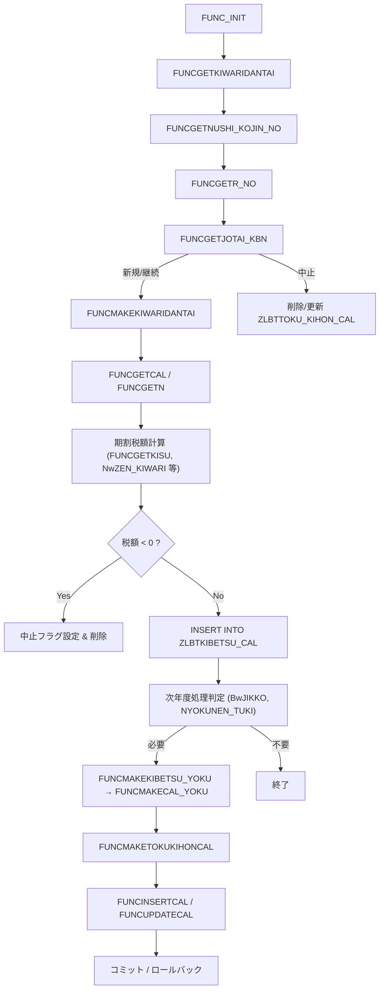

# ZLBSKCALKWTKST.SQL – 国民健康保険税（ZLB）計算特性期バッチ

**ファイルパス**  
`D:\code-wiki\projects\big\test_big_7\ZLBSKCALKWTKST.SQL`

---

## 目次
1. [概要](#概要)  
2. [主要定数・ステータスコード](#主要定数・ステータスコード)  
3. [主要関数一覧](#主要関数一覧)  
4. [処理フロー（全体像）](#処理フロー全体像)  
5. [特性（特徴）オブジェクトの CRUD](#特性特徴オブジェクトの-crud)  
6. [期割（期別）レコード生成ロジック](#期割期別レコード生成ロジック)  
7. [計算基本表への書き込み](#計算基本表への書き込み)  
8. [エラーハンドリングとログ](#エラーハンドリングとログ)  
9. [留意点・今後の拡張](#留意点今後の拡張)  

---

## 概要
本バッチは **国民健康保険税（ZLB）** の **特性期（特徴）** を作成・更新するための一連処理を実装しています。  
主な対象は以下のテーブルです。

| テーブル名 | 用途 |
|------------|------|
| `ZLBTKIBETSU_CAL` | 期割（期別）税額テーブル（現年度・翌年度） |
| `ZLBTKIBETSU_N`   | 期割基礎テーブル（前年度データ） |
| `ZLBTTOKU_KIHON_CAL` | 特性オブジェクト（義務者・年金コード等） |
| `ZLBTKIHON_CAL`、`ZLBTKAI_KIHON_CAL`、`ZLBTSIEN_KIHON_CAL`、`ZLBTKDM_KIHON_CAL` | 計算基本表（医療・介護・支援・子ども） |
| `ZLBTTOKU_IDO_CAL` | 異動レコード管理 |

---

## 主要定数・ステータスコード
| 定数 | 説明 |
|------|------|
| `c_IRETOK` / `c_IRETNG` | 処理結果ステータス（成功 / 失敗） |
| `c_NSTEPNO` | エラーログ STEP 番号 |
| 科目・科目明細コード | 各税目（医療、介護、支援、子ども）を識別 |
| 期割実行状態 | 期割処理の進行状況を管理 |
| 実務区分 | 本算定、月例、オンライン等の区分 |

---

## 主要関数一覧

| 関数名 | 主な役割 |
|--------|----------|
| **`FUNCGETKIWARIDANTAI`** | システム条件（不均一課税）に応じて使用する期割団体コードを取得 |
| **`FUNCGETNUSHI_KOJIN_NO`** | 世帯主（i_NSETAI）の個人番号取得。特性月が 8 月で基礎表に無い場合は主管理表へフォールバック |
| **`FUNCGETR_NO`** | 指定個人の次の履歴番号（`R_NO`）を取得 |
| **`FUNCGETJOTAI_KBN`** | 特性状態（新規／継続／中止）判定。特性月 10 月の期別金額が正かで判定 |
| **`FUNCMAKEKIWARIDANTAI`** | 期割団体コードを書き戻し（現年度・翌年度 `ZLBTKIBETSU_CAL`） |
| **`FUNCGETNEWTSUCHI` / `FUNCUPDATETSUCHI` / `FUNCMAKETSUCHI`** | 翌年度通知書番号（`TSUCHI_NO`）の生成・一括更新（計算基本・介護・支援・退職等） |
| **`FUNCMAKEKIBETSUCAL`** | 最新期別表 `ZLBTKIBETSU_N` を元に `ZLBTKIBETSU_CAL` を作成／補完 |
| **`FUNCMAKEIDOCAL`** | 未処理の異動レコードを「処理済」へ更新し、世帯主の異動レコードが必ず存在するよう保証 |
| **`FUNCNENREIKIJUNBI`** | 外部ライブラリ `KKAPK0020.FYOUBI` と `FDATECAL` を利用し、年金支給日を算出（週末・祝日・金融・官公休日除外） |
| **`FUNCGETKISU`** | 世帯主の生年月日・特性月・年金支給日から本年／翌年の期別、対象月、残期数（`NKISU`）を決定。75 歳到達ルールも処理 |
| **`FUNCSETTOKUKIHONCAL`** | `ZLBTTOKU_KIHON_CAL` に特性オブジェクトレコードを INSERT／UPDATE（義務者コード、年金コード、期別、状態等） |
| **`FUNCMAKETOKUKIHONCAL`** | `FUNCSETTOKUKIHONCAL` を呼び出し、**現年度** と **翌年度** の特性表レコードを作成 |
| **`FUNCGETCAL` / `FUNCGETN`** | 複数基礎表から計算基本・退職・介護・支援・子どもデータを取得。欠損時は 0 を返す |
| **`FUNCMAKEKIBETSU_ARI` / `FUNCMAKEKIBETSU_NASI`** | 既存の「特徴 11 期」有無で翌年度期別レコード生成ロジックを分岐 |
| **`FUNCMAKEKIBETSU_YOKU`** | 上記二関数を統合し、11 期の有無をチェックして適切なロジックへディスパッチ |
| **`FUNCINSERTCAL`** | 計算基本・介護基本・支援基本・子ども基本（退職表含む）を対応テーブルへ INSERT 前に同キー削除 |
| **`FUNCUPDATEKINGAKU`** | `DBMS_SQL` を用いて動的に `UPDATE <表> SET KINTO_WARI = KINTO_WARI + <増額>` を実行 |
| **`FUNCUPDATECAL`** | `FUNCUPDATEKINGAKU` を呼び出し、全基本表に対して増額がある場合に更新 |
| **`FUNCMAKECAL_YOKU` / `FUNCMAKECAL_GEN`** | 翌年度・現年度の期別税額を `ZLBTKIBETSU_CAL` から集計し、比例配分して基本表へ書き込み |
| **`FUNCKIWARIMAIN`** | 期割処理のメインスケジューラ。`i_NTOKU_TUKI`（通知月）と `NKISU` に基づき、特性作成・中止・次年度作成等のフローを決定 |
| **`FUNC_INIT`** | グローバル変数（特性/普征ロジック期、更正日、世帯主個人番号、期割団体コード、次年度通知書番号）を初期化 |

---

## 処理フロー（全体像）

1. **初期化** (`FUNC_INIT`) でロジック期・日付・キー情報を取得。  
2. **期割団体コード取得** (`FUNCGETKIWARIDANTAI`)。  
3. **世帯主個人番号取得** (`FUNCGETNUSHI_KOJIN_NO`) → **次履歴番号** (`FUNCGETR_NO`)。  
4. **特性状態判定** (`FUNCGETJOTAI_KBN`)。  
5. **期割コード更新** (`FUNCMAKEKIWARIDANTAI`)。  
6. **計算基本データ取得** (`FUNCGETCAL` / `FUNCGETN`)。  
7. **期別税額算出**（残期数 `NKISU`、割り当て係数 `NwZEN_KIWARI` 等）。  
8. **負税額チェック** → 中止処理または `INSERT`。  
9. **次年度処理**：必要に応じて `FUNCMAKEKIBETSU_YOKU` → `FUNCMAKECAL_YOKU`。  
10. **特性オブジェクトレコード作成** (`FUNCMAKETOKUKIHONCAL`)。  
11. **計算基本表への書き込み** (`FUNCINSERTCAL` / `FUNCUPDATECAL`)。  
12. **トランザクション完了**（コミット／ロールバック、エラーログ記録）。

---

## 特性（特徴）オブジェクトの CRUD

| 操作 | 使用関数 | 主な処理 |
|------|----------|----------|
| **INSERT / UPDATE** | `FUNCSETTOKUKIHONCAL` → `FUNCMAKETOKUKIHONCAL` | 既存有無で `INSERT` または `DELETE + INSERT`（UPDATE 相当）を実行。システム項目（作成日・更新日・端末番号）を設定。 |
| **DELETE** | `FUNCMAKETOKUKIHONCAL`（中止フラグ） | `BwSTOP`/`BwJIKKO` が `TRUE` の場合、`ZLBTTOKU_KIHON_CAL` と `ZLBTTOKU_IDO_CAL` から対象レコードを削除。 |
| **SELECT** | `FUNCGETNUSHI_KOJIN_NO`、`FUNCGETCAL` 系 | 世帯主番号や計算基本データを取得。 |

---

## 期割（期別）レコード生成ロジック

| 特徴月 | 対応関数 | 主な処理 |
|--------|----------|----------|
| **10 月** | `FUNCMAKEKIBETSU_10` | 10 月特有の期別税額計算、負税額チェック、レコード挿入。 |
| **12 月 / 2 月** | `FUNCMAKEKIBETSU_12` | 12 月／2 月の期別税額算出ロジック。 |
| **8 月** | `FUNCMAKEKIBETSU_8` | 8 月は前年度データを参照しつつ、期別税額を生成。 |
| **共通** | `FUNCKIWARIMAIN` | `i_NTOKU_TUKI` と `NKISU` に基づき、上記いずれかの関数へディスパッチ。 |

- **期別レコード挿入**は `INSERT INTO ZLBTKIBETSU_CAL` をループで実行（`NKISU` 回または固定期号）。  
- **負税額・中止判定**：`NwZEN_ZEIGAKU <= 0` で `BwSTOP`/`BwJIKKO` を `TRUE` にし、対象レコードを削除または更新。  
- **75 歳到達処理**：`FUNCGETKISU` 内で年齢チェックし、必要に応じて次年度処理をスキップ。

---

## 計算基本表への書き込み

1. **データ取得**  
   - `FUNCGETCAL` / `FUNCGETN` が `ZLBTKIHON_CAL`、`ZLBTKAI_KIHON_CAL`、`ZLBTSIEN_KIHON_CAL`、`ZLBTKDM_KIHON_CAL` から **医療・介護・支援・子ども** の基礎金額を取得。欠損は `0`。  

2. **レコード削除**  
   - 各テーブルは **同キー**（世帯番号、団体コード、年度、期別、通知書番号、システム端末番号）で `DELETE` してから `INSERT`。  

3. **INSERT**  
   - `FUNCINSERTCAL` が新レコードを `INSERT`。  
   - `FUNCUPDATECAL` は増額がある場合に `FUNCUPDATEKINGAKU` を呼び出し、`KINTO_WARI` に増額分を加算。  

4. **翌年度処理**  
   - `FUNCMAKECAL_YOKU` が `ZLBTKIBETSU_CAL` の期別税額を比例配分し、翌年度の基本表へ書き込み。  

5. **子ども子育て支援金拡張（2025/08/11 以降）**  
   - `RKDMKIHONCAL`（子ども）関連フィールドが追加され、変数 `NwKDM_ZEI` が新たに使用される。

---

## エラーハンドリングとログ

- 各処理ブロックは `BEGIN … EXCEPTION WHEN OTHERS THEN … END;` で囲まれ、例外発生時は:
  - 戻り値 `c_IRETNG` を設定  
  - エラーメッセージをグローバル変数 `VERROR` に追記  
  - 必要に応じてトランザクションをロールバックしつつ、エラーログ `c_NSTEPNO` にステップ情報を記録  

- **ログ出力**は主に `c_NSTEPNO` と `VERROR` に集約され、外部監査ツールで参照可能。

---

## 留意点・今後の拡張

| 項目 | 現状 | 今後の検討 |
|------|------|------------|
| **子ども子育て支援金** | 2025/08/11 から `RKDMKIHONCAL` が追加 | さらなる税率変更や補助金制度への対応 |
| **期割計算ロジック** | 10/12/8 月ごとに個別関数 | 共通化・パラメータ化による保守性向上 |
| **エラーハンドリング** | `WHEN OTHERS` で一括捕捉 | エラー種別別ハンドリング（例: データ不整合 vs DB 接続障害） |
| **テスト自動化** | 手動テストが中心 | Unit/Integration テストの自動化、テストデータセットの整備 |
| **パフォーマンス** | 大量レコードの `DELETE + INSERT` が中心 | バルク操作・パーティショニング検討 |

---

## 参考リンク

- [FUNCSETTOKUKIHONCAL の実装詳細](http://localhost:3000/projects/big/wiki?file_path=D:/code-wiki/projects/big/test_big_7/ZLBSKCALKWTKST.SQL)  
- [ZLBTKIBETSU_CAL テーブル定義](http://localhost:3000/projects/big/wiki?file_path=... ) *(※実際のパスはプロジェクト内で確認してください)*  

--- 

*本ドキュメントは提供された要約情報のみに基づいて作成しています。コードの詳細なロジックや未記載の例外ケースについては、実際の SQL ソースをご参照ください。*