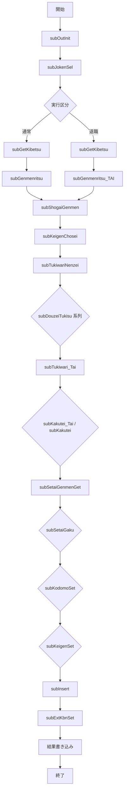

# ZLBSKCALMAIN.SQL – 国民健康保険税額計算プロシージャ

> **対象ファイル**  
> `D:\code-wiki\projects\big\test_big_7\ZLBSKCALMAIN.SQL`  

---

## 目次
1. [概要](#概要)  
2. [プロシージャの目的と実行モード](#プロシージャの目的と実行モード)  
3. [入出力パラメータ](#入出力パラメータ)  
4. [主要データ構造](#主要データ構造)  
5. [主要サブルーチン一覧](#主要サブルーチン一覧)  
6. [処理フロー](#処理フロー)  
7. [エラーハンドリングと境界条件](#エラーハンドリングと境界条件)  
8. [外部依存テーブル・パッケージ](#外部依存テーブル・パッケージ)  
9. [バージョン履歴](#バージョン履歴)  
10. [留意点・改善ポイント](#留意点改善ポイント)  
11. [関連 Wiki ページへのリンク](#関連-wiki-ページへのリンク)  

---

## 概要
`ZLBSKCALMAIN` は、個人単位の計算レコードから **国民健康保険（国保）** の「計算基本」(`ZLBTKIHON_CAL`) と「計算退職」(`ZLBTTAI_CAL`) の税額データを生成する PL/SQL プロシージャです。  

- **3 つの実行モード**  
  1. **通常課税**  
  2. **オンライン即時課税**  
  3. **税額試算**（外部から呼び出すシミュレーションモード）  

- **結果コード** `o_NRESULT`  
  - `0` : 正常終了  
  - `1` : 異常終了（例外捕捉）  

---

## プロシージャの目的と実行モード
| モード | 主な用途 |
|--------|----------|
| 通常課税 | 年度ごとの正式税額算出 |
| オンライン即時課税 | Web 画面等からリアルタイムに税額を取得 |
| 税額試算 | 税額シミュレーション／検証用に呼び出し側が結果を取得 |

---

## 入出力パラメータ
| パラメータ | 種別 | 説明 |
|------------|------|------|
| `i_NEN` | IN | 対象年度 |
| `i_NEN_BUN` | IN | 対象年度分 |
| `i_SETAI_KO` | IN | 世帯番号 |
| `i_TAN_KO` | IN | 算定団体コード |
| `i_KOJIN_KO` | IN | 世帯主個人コード |
| `i_EXEC_KBN` | IN | 実行区分（通常/即時/試算） |
| `i_CALL_KBN` | IN | 呼び出し区分 |
| `i_TENNO` | IN | 端末番号 |
| `i_TOROKU_RNO` | IN | 登録連番 |
| `o_NRESULT` | OUT | 結果コード（0‑正常、1‑異常） |

---

## 主要データ構造
| 型名 | 用途 |
|------|------|
| `MTNUMARRAY*` 系列 | 月別に資格・税額・減免等の中間値を保持 |
| `type_ZLBTGENMEN_KOJIN_CAL` | 減免関連フィールドをまとめたレコード型 |
| `Nl*`, `Ml*`, `Rl*` 系列変数 | 年度税額、限度額、均等割・平等割・年齢軽減等を格納 |
| `RwJOKEN`, `RwEXTJOKEN` | 条件テーブルから取得したシステムパラメータ格納領域 |

---

## 主要サブルーチン一覧
| サブルーチン | 主な役割 |
|--------------|----------|
| `subGetKibetsu` | `ZLBTJOKEN`・`ZLBTSHUNOJKNK` から条件取得し、加入月数・未到期期数等を算出 |
| `subGenmenritsu` / `subGenmenritsu_TAI` | `ZLBTEXT_N` から減免率取得し、基本・退職税額の減免額を計算 |
| `subShogaiGenmen` | 障害者減免ロジック（所得閾値 125万/400万/1000万 に対し 50%/30%/10%） |
| `subKeigenChosei` / `subKeigenChosei_TAI` | 軽減割（均等割・平等割）の四捨五入とクリア |
| `subTukiwariNenzei` / `subTukiwariNenzei_TAI` | 年額を 12 ヶ月に分割、丸め方式（四捨五入・切捨・単純除算） |
| `subDouzeiTukisu_*` 系列 | 同一税額月の統合（普通・累積・限度超過） |
| `subTukiwari_Tai` | 退職者向け月割計算ループ（係数・軽減・年齢減免等を総合） |
| `funcGenmenKojinGet` | 個人が減免対象か判定し、臨時テーブルをオープン |
| `subTukiwariMae_Tai` | 退職者の月割計算前準備（資格・係数・前回減免率配列取得） |
| `subOutInit` | `RlEXT` など出力領域の初期化 |
| `subKakutei` / `subKakutei_Tai` | 基本・退職税額の最終確定、減免率取得呼び出し |
| `subSetaiGenmenGet` | 世帯減免情報取得 |
| `subSetaiGaku`, `subKodomoSet`, `subKeigenSet` | 世帯税額・子ども人数・軽減情報の集計 |
| `subInsert` | `ZLBTKIHON_CAL`・`ZLBTTAI_CAL`・`ZLBTEXT_CAL` への INSERT |
| `subExtKbnSet` | 拡張テーブル `RlEXT` のフラグ設定（軽減・特定同一等） |
| `subJokenSel` | 条件テーブル（`ZLBTJOKEN` 系）読み込み |
| `funcSetGenmen_20010` / `funcSetGengaku_20010` | 上伊那地区の減免ロジック（対象判定・減免率適用） |

---

## 処理フロー
以下は **全体的な実行手順** を示すフローチャートです。個別サブルーチンは上記表を参照してください。

---

## エラーハンドリングと境界条件
| 項目 | 内容 |
|------|------|
| 例外捕捉 | すべてのサブルーチンで `OTHERS` 例外を捕捉し、エラーメッセージを `VlMSG` に格納、戻りコード `c_NERR` に設定 |
| 減免率未取得 | 取得失敗時は「調整年度/分」の代替クエリで再取得を試行 |
| 加入月数計算 | 資格コード `1,3,11,13,21,23` のみカウント、重複月は除外 |
| 障害者減免負値防止 | 税額・減免額が負になる場合は 0 に強制設定 |
| 条件テーブル未設定（2007 年以前） | 拡張条件が無くてもデフォルト `0` を設定、以降はエラー `c_NERR` に変換 |
| 月割丸め方式 | `ITSUKI_HASU_KBN` により四捨五入・切捨・保留を選択 |
| 同一税額月の統合 | `subDouzeiTukisu_*` 系列で連続月数を集計し、後続の係数適用に利用 |

---

## 外部依存テーブル・パッケージ
| 種類 | テーブル / パッケージ | 用途 |
|------|----------------------|------|
| データテーブル | `ZLBTKOJIN_CAL`、`ZLBTJOKEN`、`ZLBTSHUNOJKNK`、`ZLBTGENMEN_KOJIN_TMP`、`ZLBTGENMEN_KOJIN_CAL`、`ZLBTEXT_N`、`ZLBTSHOTOKU_CAL`、`ZLBTKOJIN_CAL` | 計算対象・条件・結果格納 |
| システムパラメータ | `A_CONS_PRM`（`ACONSPRM` 経由） | グローバル設定取得 |
| パッケージ | `ZLBSKCALPACK.FCKODOMO_HANTEI`、`ZLBPK00090.FCSETAIKODOMO_HANTEI`、`ZLBPK00010.FCFFJKN2`、`KKAPK0030.FPRMSHUTOKU`、`KKBPK5551.FSETBLOG` | 子ども判定、設定取得、ログ出力等 |
| カスタム関数 | `funcGenmenKojinExistChk`、`funcGenmenKojinUseChk`、`funcGenmenSetaiUseChk`、`funcGetGenmen`、`funcGetGenmen_TAI` | 減免対象チェック、基準金額取得 |

---

## バージョン履歴
| 日付 | バージョン | 主な変更点 |
|------|------------|------------|
| 2023‑08‑01 | 初版 | 基本計算ロジック実装 |
| 2024‑02‑29 | WizLIFE 二次開発 | 新規オンライン即時課税モード追加 |
| 2024‑05‑06 | 国保二次統合 | 退職・基本ロジック統合、障害者減免ロジック拡張 |
| 2024‑??‑?? | (未記載) | (要確認) |

---

## 留意点・改善ポイント
1. **例外情報の可視化**  
   - 現在は `VlMSG` に文字列を格納するだけなので、エラーログテーブルへも同時に書き込むとトラブル解析が容易になる。  

2. **減免率取得ロジックの統一**  
   - `subGenmenritsu` 系列と `funcSetGenmen_20010` で同様の「年度/分」フォールバックが散在。共通ユーティリティ化で保守性向上。  

3. **月割丸め方式の設定管理**  
   - `ITSUKI_HASU_KBN` がハードコードされている箇所がある。システムパラメータ化し、変更を一元管理できるようにする。  

4. **テストカバレッジ**  
   - 障害者減免の閾値ロジックは境界テストが必須（125万、400万、1000万）。自動テストスイートへの組み込みを推奨。  

5. **ドキュメント自動生成**  
   - 現在は手動でサマリを作成しているが、PL/SQL のコメントから自動抽出できるツールを導入すると、コード変更時のドキュメント乖離を防げる。  

---

## 関連 Wiki ページへのリンク
- [ZLBSKCALMAIN プロシージャ概要](http://localhost:3000/projects/big/wiki?file_path=D:/code-wiki/projects/big/test_big_7/ZLBSKCALMAIN.SQL)  
- [ZLBTKOJIN_CAL テーブル定義](http://localhost:3000/projects/big/wiki?file_path=テーブル定義/ZLBTKOJIN_CAL)  
- [ZLBTJOKEN 条件テーブル解説](http://localhost:3000/projects/big/wiki?file_path=テーブル定義/ZLBTJOKEN)  
- [ZLBSKCALPACK パッケージ](http://localhost:3000/projects/big/wiki?file_path=パッケージ/ZLBSKCALPACK)  

---  

*本ドキュメントは提供されたサマリ情報のみに基づいて作成しています。実装の詳細はソースコードをご参照ください。*