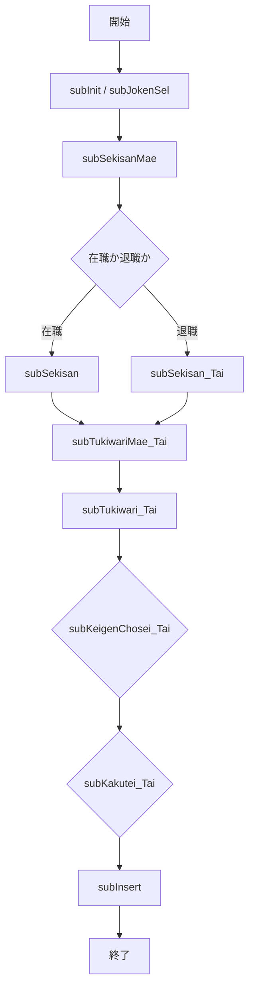

# ZLBSKCALMSIN.SQL – 国保税計算支援ストアドプロシージャ  

**ファイルパス**  
`D:\code-wiki\projects\big\test_big_7\ZLBSKCALMSIN.SQL`

---

## 目次
1. [概要](#概要)  
2. [入力 / 出力パラメータ](#入力--出力パラメータ)  
3. [主要定数・業務識別子](#主要定数業務識別子)  
4. [データ構造・型定義](#データ構造型定義)  
5. [主要サブプログラム](#主要サブプログラム)  
6. [処理フロー](#処理フロー)  
7. [例外・エラーハンドリング](#例外エラーハンドリング)  
8. [外部依存テーブル・関数](#外部依存テーブル関数)  
9. [特別処理・境界条件](#特別処理境界条件)  
10. [参考リンク](#参考リンク)  

---

## 概要
`ZLBSKCALMSIN` は **国民健康保険（国保）税額計算支援** 用のメインストアドプロシージャです。  
年度・世帯番号・算定団体・世帯主個人番号などの入力情報を基に、  
- 「計算支援基本」  
- 「計算支援退職」  

の 2 種類の結果レコードを生成します。  

---

## 入力 / 出力パラメータ
| パラメータ | 用途 | 備考 |
|------------|------|------|
| `i_NEN` | 対象年度 |  |
| `i_SETAI_NO` | 世帯番号 |  |
| `i_SANTAI_GRP` | 算定団体 |  |
| `i_KOJIN_NO` | 世帯主個人番号 |  |
| `i_EXEC_KBN` | 実行区分（バッチ／オンライン／試算） |  |
| `i_CALL_KBN` | 呼び出し区分（普通／課税期点／特殊処理） |  |
| `i_TENNO` | 端末番号 |  |
| `o_NRESULT` | 処理結果コード (0＝正常、1＝例外) |  |

※ それ以外の多数の内部配列・レコード型はサブプログラム間で受け渡しに使用されます。

---

## 主要定数・業務識別子
- **処理状態**: `c_NOK`、`c_NERR`（正常／エラー）  
- **ステップ番号**: `c_STEP_…` 系列  
- **税額端数**: `c_NHASU_…` 系列（端数処理方式）  
- **実行区分**: `c_EXEC_BATCH`、`c_EXEC_ONLINE`、`c_EXEC_TEST`  
- **呼び出し区分**: `c_CALL_NORMAL`、`c_CALL_TAXPOINT`、`c_CALL_SPECIAL`  
- **不均一課税・市区コード** など、業務ロジックで参照される定数が多数定義されています。

---

## データ構造・型定義
| 型名 | 内容 |
|------|------|
| `MTNUMARRAY*` 系列 | 月別・項目別に人数・税額・減免額等を格納する PL/SQL インデックステーブル |
| `type_ZLBTGENMEN_KOJIN_CAL` | 減免関連クエリ結果を保持するレコード型 |
| `RlKIHON`、`RlTAI`、`RlEXT` | 基本・退職・拡張出力領域（12 か月分の税基・係数等） |
| `ZLBTKOJIN_CAL%ROWTYPE`、`ZLBTKANWA_KOJIN_CAL%ROWTYPE` | 個人・世帯の税額・減免情報を保持する行タイプ |

---

## 主要サブプログラム

| サブプログラム | 役割 |
|----------------|------|
| **`subGetKibetsu`** | システム条件取得、当年度納付期数・未納期数・加入月数計算。減免区分に応じて `ZLBTGENMEN_KOJIN_TMP` と `ZLBTGENMEN_KOJIN_CAL` を更新。 |
| **`subGenmenritsu` / `subGenmenritsu_TAI`** | システム減免率に基づき、基本・退職税額の減免額を算出。 |
| **`subShogaiGenmen`** | 障害者がいる場合、障害減免率で減免額（基本・退職）を計算。 |
| **`funcGetGenmen` / `funcGetGenmen_TAI`** | `ZLBTSIEN_KIHON_N`、`ZLBTSIEN_TAI_N` から世帯の減免基準額取得。主税年度が無い場合は年度分へフォールバック。 |
| **`subKeigenChosei_Tai`** | 退職の軽減均等割・平等割の端数微調整（+0.01 → 整数化）。 |
| **`subTukiwariNenzei_Tai`** | 月割方式 `ITSUKI_HASU_KBN` に従い、12か月分の税額を累積し最終的に整数化。 |
| **`subDouzeiTukisu_*` 系列** | 12か月を走査し、同一税額月をカウントして配列 `MlTUKI*` に格納（普通・累積・限度超過）。 |
| **`subTukiwari_Tai`** | 各月の税額加減（均等割・平等割・所得割・資産割・軽減・年齢軽減・内部減免率）を実施し、減免額を集計。 |
| **`funcGenmenKojinGet`** | `ZLBTGENMEN_KOJIN_TMP`（または `ZLBTGENMEN_KOJIN`）を動的に検索し、対象個人が減免対象か判定。 |
| **`subTukiwariMae_Tai`** | 正式月割前に個人資格・応益・応能係数・減免率配列等を準備し、`NGENMEN_KOJIN_KBN` に応じて月次減免率を設定。 |
| **`subKeigenChosei`** | 軽減額（均等割・平等割・年齢軽減・6/4/2 割）の端数調整（+0.01 → `TRUNC`）後、作業領域をクリア。 |
| **`subSanChokaCal`** | 産前産後限度超過計算。軽減率・特定同一・旧扶養者・失業減免等多層条件で税額修正。 |
| **`subOutInit`** | 作業領域（`RlKIHON`、`RlTAI`、`RlEXT`）の初期化と拡張テーブル `ZLBTEXT_CAL` の読み込み。 |
| **`subInsert`** | 計算結果を `ZLBTSIEN_KIHON_CAL`、`ZLBTSIEN_TAI_CAL` へ書き込み、拡張項目も同期。 |
| **`subGenmenKojinDummyInsert`** | 減免レコードが欠損している場合、`ZLBTGENMEN_KOJIN_CAL` にダミー行を挿入。 |
| **`subKakutei` / `subKakutei_Tai`** | 月割累計結果・減免率・端数規則に基づき、年税額・減免額を確定し、端数誤差を修正。 |
| **`subSetaiGaku`** | 軽減区分に応じた軽減均等割・軽減平等割（基本・特定同一・特定同一(2)）を算出し、退職軽減均等割へも同期。 |
| **`subKodomoSet`** | `ZLBPK00090.FCSETAIKODOMO_HANTEI` を呼び出し、未就学児童人数を取得し `RlEXT` に格納。 |
| **`subSekisan`** | 所得割・資産割・均等割・平等割の応益係数計算。二段階所得割 (`NSHOTOKU_2DANKAI`) も対応。 |
| **`subSekisanMae`** | 個人レコードの最大届出日・事由・現存区分等を準備し、非課税対象を除外。 |
| **`subJokenSel`** | `ZLBTJOKEN` 系テーブルからシステム条件（上限、均等割、平等割、軽減係数等）を取得し作業領域へ格納。 |
| **`funcSetGenmen_20010`** | 上伊那地区（高遠市／長谷村）向け減免資格判定と減免率設定。 |
| **`funcSetGengaku_20010`** | `funcSetGenmen_20010` の減免率を用いて、在職・退職の暫定年税額・限度超過・余数 (`HASU`) を計算し結果を書き込む。 |
| **`subShogaiZenso`** | 在職人数が 0 で障害者人数 >0 の場合、障害者の収入を累積し軽減判定に利用。 |
| **`funcGenmenKojinExistChk`** | 世帯内に減免対象者がいるかを `ZLBTGENMEN_KOJIN_TMP`／`ZLBTGENMEN_KOJIN` で確認し、最初のレコードの減免パラメータを取得。 |

---

## 処理フロー

1. **初期化** (`subInit`, `subJokenSel`)  
2. **事前集計** (`subSekisanMae`) – 資格・係数・減免情報を取得  
3. **在職/退職別計算** (`subSekisan` / `subSekisan_Tai`)  
4. **月割前準備** (`subTukiwariMae_Tai`) – 資格・減免率配列設定  
5. **月割実行** (`subTukiwari_Tai`) – 各月の税額加減算  
6. **端数調整** (`subKeigenChosei_Tai`)  
7. **税額確定** (`subKakutei_Tai`) – 年税額・減免額の最終決定  
8. **結果書き込み** (`subInsert`)  

---

## 例外・エラーハンドリング
- ほとんどのサブプログラムは `WHEN OTHERS` を捕捉し、  
  - 戻り値 `c_NERR` を設定  
  - エラーメッセージを `VlMSG` に記録  
- `subGetKibetsu` は例外時に **例外を吸収**（`NULL` を返す）し、プロシージャ全体の中断を防止。  

---

## 外部依存テーブル・関数
| テーブル / パッケージ | 用途 |
|----------------------|------|
| `ZLBTKOJIN_CAL`、`ZLBTJOKEN`、`ZLBTEXTJOKEN`、`ZLBTGENMEN_KOJIN_TMP`、`ZLBTGENMEN_KOJIN_CAL`、`ZLBTGENMEN_SETAI`、`ZLBTKANWA_SETAI_CAL`、`ZLBTKANWA_KOJIN_CAL`、`ZLBTEXT_CAL`、`ZLBTSIEN_KIHON_N`、`ZLBTSIEN_TAI_N`、`ZLBTSIEN_KIHON_CAL`、`ZLBTSIEN_TAI_CAL` | 主データ・減免基準・条件設定 |
| `A_CONS_PRM` | システムパラメータ |
| `ZLBPK00090.FCSETAIKODOMO_HANTEI` | 子ども人数判定 |
| `ZLBPK00090.FCKODOMO_HANTEI` | 子ども判定（別名） |
| `ZLBPK00010.FCFFJKN2`、`KKAPK0030.FPRMSHUTOKU`、`KKBPK5551.F` | パラメータ取得・補助ロジック |
| `ZLBPK00090` 系列 | 障害者・子ども判定等のユーティリティ |

---

## 特別処理・境界条件
- **軽減区分** (`MlKEIGEN_KBN`) に応じた分岐で、基本・退職それぞれに異なる計算式を使用。  
- **特定同一・特定同一(2)** のフラグがある場合、軽減均等割・平等割の計算ロジックが変化。  
- **上限超過** (`NlJGENDOGAKU`) を超えると `GENDO_CHOKA` を算出し、箕面市等特定地域では退職側へ按分。  
- **端数処理** (`ITSUKI_HASU_KBN`) により `TRUNC`、`CEIL`、`+0.01 → TRUNC` などの丸めが選択される。  
- **障害者全免**: 在職人数が 0 で障害者人数がある場合、障害者の収入を累積し軽減判定に利用。  
- **二段階所得割** (`NSHOTOKU_2DANKAI`) が有効な場合、前後の差額を別途計算し `RlEXT` に格納。  

---

## 参考リンク
- [subGetKibetsu](http://localhost:3000/projects/big/wiki?file_path=ZLBSKCALMSIN.SQL#subGetKibetsu)  
- [subTukiwari_Tai](http://localhost:3000/projects/big/wiki?file_path=ZLBSKCALMSIN.SQL#subTukiwari_Tai)  
- [subKakutei_Tai](http://localhost:3000/projects/big/wiki?file_path=ZLBSKCALMSIN.SQL#subKakutei_Tai)  
- [funcSetGenmen_20010](http://localhost:3000/projects/big/wiki?file_path=ZLBSKCALMSIN.SQL#funcSetGenmen_20010)  

---  

*この Wiki は提供された要約情報のみに基づいて作成されています。コードの詳細なロジックや実装は、実際の `ZLBSKCALMSIN.SQL` ファイルをご参照ください。*