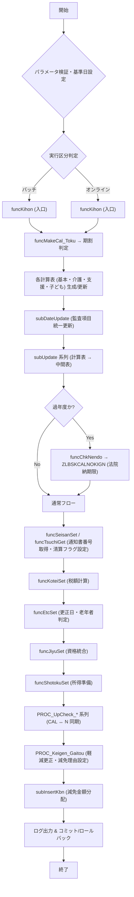

# ZLBSKCALPACK.SQL – 国保税課税計算制御パッケージ  

> **対象**：国民健康保険（ZLB）における課税計算全体を統括する PL/SQL パッケージ  
> **ファイルパス**：`D:\code-wiki\projects\big\test_big_7\ZLBSKCALPACK.SQL`  

---

## 目次
1. [概要](#概要)  
2. [主要機能と責務](#主要機能と責務)  
3. [主要プロシージャ／関数一覧](#主要プロシージャ関数一覧)  
4. [処理フロー](#処理フロー)  
5. [外部依存リソース](#外部依存リソース)  
6. [エラーハンドリングと例外処理](#エラーハンドリングと例外処理)  
7. [拡張ポイント・変更履歴](#拡張ポイント変更履歴)  
8. [注意点・既知の制約](#注意点既知の制約)  
9. [関連 Wiki へのリンク](#関連-wiki-へのリンク)  

---

## 概要
`ZLBSKCALPACK` は、国保税（ZLB）業務における **課税計算の全工程** を制御するパッケージです。  
- 基本・介護・支援・子ども支援 など、複数の中間計算テーブルを生成・更新し、必要に応じて期割・特徴中止・法院納期限といったサブプロシージャを呼び出します。  
- 計算結果は最終的に **中間テーブル（*_MID 系）** へ書き込み、以降の税務・補助処理で利用されます。  

---

## 主要機能と責務
| 項目 | 内容 |
|------|------|
| **課税計算制御** | `ZLBSKCALPACK` は、国保税の **全体フロー**（パラメータ検証 → 期割判定 → 各種計算表生成 → 監査項目更新 → 中間テーブル書き込み）を実装 |
| **中間計算表の生成** | 基本、介護、支援、子ども支援等 **8 大カテゴリ** の計算表を「存在しなければ 0 金額レコードを作成」し、欠損データを補完 |
| **期割・特徴中止処理** | `ZLBFKKIWARIHT`（期割判定）や `ZLBSKCALKWTKSP`（特徴中止）を呼び出し、年度跨ぎや中止対象を自動処理 |
| **法院納期限計算** | 過年度の場合は `ZLBSKCALNOKIGN` を呼び出し、法院納期限を算出 |
| **監査項目の統一更新** | `subDateUpdate` が全計算表の作成/更新日・担当者番号を統一し、拡張テーブルが全 0 かつ履歴が無い場合はレコード削除 |
| **エラーハンドリング** | 主要ブロックは `WHEN OTHERS` で捕捉し、戻りコード `c_NERR` とエラーメッセージ `VlMSG` を設定、必要に応じて `EXIT` で処理中断 |

---

## 主要プロシージャ／関数一覧
| プロシージャ／関数 | 役割 | 主な呼び出し元 |
|-------------------|------|----------------|
| `funcMakeCal_Toku` | 特徴オブジェクト表 `ZLBTTOKU_KIHON_N` → 計算特徴表 `ZLBTTOKU_KIHON_CAL` 生成、期割判定、特徴中止処理 | `ZLBSKCALPACK` のメインフロー |
| `FUNCGETGAPPEIBI` | 合併年度（後期高齢起算日）取得（外部関数 `KKAPK0030.FKYOTU`、`KKAPK0020.FDAYNENDO` 使用） | `funcMakeCal_Toku` など |
| `funcChkNendo` | 増減額ルールに基づき対象年度か判定 | `subUpdate`、`subUpdate2` |
| `subDateUpdate` | 作成/更新日・担当者番号の一括更新、全 0 かつ履歴なしレコードの削除 | 各計算表更新後 |
| `subUpdate` / `subUpdate2` / `subUpdate_KJ` | 計算表（`CwKIHON` カーソル）→ 中間表（`*_MID`、`*_KJ`）へのレコードコピー | `funcMakeCal` 系 |
| `subDelShotoku` | 通知書番号 0 の計算所得臨時データ削除 | `funcUpdateShotoku` 前処理 |
| `funcCpyShotoku` | 通知書番号 0 の計算所得を新通知書番号へコピー | `funcUpdateShotoku` |
| `funcUpdateShotoku` | 所得照会期間中に `i_SHOKAICHU` フラグで「未申告」マーク付与 | `funcMakeCal` |
| `funcMakeCal` | 欠損基本レコードの 0 金額占位行作成（子ども支援金列含む） | `funcMakeCal_Toku` の後続 |
| `funcSeisanSet` | 清算フラグ `SEISAN_KBN` を 1 に設定（未清算通知書があるか確認） | `funcTsuchiGet` 前 |
| `funcTsuchiGet` | 通知書番号取得、`ZLBFKGETTCH` 呼び出し、全計算表に番号付与 | `funcKoteiSet` 前 |
| `funcKoteiSet` | 個人計算表 `ZLBTKOJIN_CAL` に対し、税額（所得割・資産割・介護・支援・子ども支援）を計算・書き込み | `funcEtcSet` 前 |
| `funcEtcSet` | 更正日・事由更新、年齢算出（65 歳以上は老年者フラグ） | `funcKoteiSet` 後 |
| `funcJiyuSet` | 資格取得/喪失・更正情報統合、最終的な更正日・事由決定 | `funcKoteiSet` 後 |
| `funcShotokuSet` | 所得関連変数設定、後続所得計算の入力準備 | `funcKoteiSet` 後 |
| `PROC_UpCheck_*` 系列 | 計算表(CAL) と課税表(N) の税額差額 ≤ 100 円を検出し、CAL の内容を N に同期 | `funcShotokuSet` 後 |
| `PROC_Keigen_Gaitou` | 累計税額・月割減額が同一だが年税額が異なるケースを検出し、軽減更正・減免理由を設定 | `PROC_UpCheck_*` の補助 |
| `subInsertKbn` | 減免金額を論理期別に分配し、各計算表から減免分を差し引く | `funcKihon` 後 |
| `funcKihon` | 入口プロシージャ。軽減判定、各種計算サブパッケージ呼び出し、通知書番号取得、過年度税額計算、清算マーク更新 | - |
| `funcKojin` | 世帯メンバー単位で個人計算レコード作成・更新・喪失チェック等を実施 | `funcSetaiSet` |
| `funcSetaiSet` | 世帯単位で全計算データ（軽減判定日・清算区分・算定団体・個人計算レコード等）を生成 | `subKanen*` 系列 |
| `subCalClear` / `subTruncateTbl` | 計算/中間テーブルの削除・切り捨て（バッチ/オンラインモードのクリーンアップ） | 各モード開始時 |
| `FUNCSHIKAKU_CHECK` | 資格臨時テーブル `ZLBTSHIKAKU_TMP` の有無を判定し、処理継続可否を決定 | `subKanen*` |
| `subKanenSokuji` / `subKanenMain` / `subGennenMain` | オンライン単世帯、バッチ過年度、バッチ現年度の主ループ。世帯取得 → `funcSetaiSet` → 欠損計算表生成 → 監査項目更新 → 中間表コピー/課税表更新 | - |
| `PROC_LOG_SHORI` | エラー/ステータスログを `ZLBTCALLOG` に書き込み、例外時は `subCalClear` 実行 | 例外ハンドラ |
| `FUNC_SEIGEN_KOHO_HANTEI` | バッチ処理中に「課税決定期間制限候補世帯」判定を実施 | `subKanenMain` |
| `subGennenMain` | 本年度計算の実行部。`subKanen*` 系列と同様の流れだが、年度フラグが異なる | - |
| `subKanenMain` | 過年度バッチ処理の実行部。`subKanenSokuji` と同様だが、バッチフラグが設定される | - |
| `subKanenSokuji` | オンライン単世帯処理の実行部 | - |

> **注**：上記は要約に記載された主要プロシージャ／関数です。実装にはさらに多数の内部サブルーチンが存在します。

---

## 処理フロー
以下は全体の処理概要です。実装は **9 つの要約ブロック** に分割されていますが、概念的には次のように流れます。

### 各フェーズのポイント
| フェーズ | 主な処理 | 重要なサブルーチン |
|----------|----------|-------------------|
| **パラメータ検証** | 基準日・実行区分のデフォルト設定、長さチェック | `subDateUpdate`（基準日回退） |
| **期割判定** | `ZLBFKKIWARIHT` により期割が必要か判定 | `funcMakeCal_Toku` |
| **計算表生成** | 基本・介護・支援・子ども支援等の中間テーブル作成 | `funcMakeCal`、`subUpdate` 系列 |
| **監査項目統一** | 作成/更新日・担当者番号の一括更新、不要レコード削除 | `subDateUpdate` |
| **過年度処理** | `funcChkNendo` で対象年度判定、法院納期限計算 | `ZLBSKCALNOKIGN` |
| **通知書番号取得** | `funcTsuchiGet` が `ZLBFKGETTCH` を呼び出し、全表に番号付与 | `funcSeisanSet` |
| **税額計算** | 所得割・資産割・介護・支援・子ども支援の算出 | `funcKoteiSet` |
| **更正・老年者判定** | 更正日・事由更新、65 歳以上は老年者フラグ | `funcEtcSet` |
| **資格統合** | 取得・喪失・更正情報を統合し最終事由決定 | `funcJiyuSet` |
| **所得準備** | 所得関連変数設定、後続所得計算の入力準備 | `funcShotokuSet` |
| **CAL ↔ N 同期** | 差額 ≤ 100 円のレコードを CAL から N にコピー | `PROC_UpCheck_*` 系列 |
| **軽減更正・減免** | 税額差異に応じて軽減更正・減免理由を設定 | `PROC_Keigen_Gaitou` |
| **減免金額分配** | 論理期別に減免金額を割り当て、計算表から差し引く | `subInsertKbn` |
| **ログ・トランザクション** | 成功時は `COMMIT`、失敗時は `ROLLBACK`、エラーログは `PROC_LOG_SHORI` | `KKBPK5551.FSETBLOG`（バッチ） |

---

## 外部依存リソース
| 種類 | 名前 | 用途 |
|------|------|------|
| **外部パッケージ/関数** | `ZLBFKKIWARIHT` | 期割判定 |
|  | `ZLBSKCALKWTKSP` | 特徴中止処理 |
|  | `ZLBSKCALNOKIGN` | 法院納期限計算 |
|  | `ZLBFKGETTCH` | 通知書番号取得 |
|  | `KKAPK0030.FKYOTU` / `KKAPK0020.FDAYNENDO` | 合併年度取得 |
|  | `KKAPK0020.FAgeGet` | 年齢算出 |
|  | `KHSFKSHOTSKCHK` | 所得照会チェック |
|  | `KKBPK5551.FSETBLOG` | バッチログ書き込み |
| **テーブル（計算系）** | `ZLBTKIHON_CAL`、`ZLBTTAI_CAL`、`ZLBTKAI_KIHON_CAL`、`ZLBTKDM_KIHON_CAL`、`ZLBTEXT_CAL` など | 各種計算結果格納 |
| **テーブル（課税系）** | `ZLBTKIHON_N`、`ZLBTTAI_N`、`ZLBTKAI_KIHON_N`、`ZLBTKDM_KIHON_N`、`ZLBTEXT_N` | 課税（赋课）データ |
| **監査・ログテーブル** | `ZLBTCALLOG` | 処理ログ |
| **定数/グローバル変数** | `c_NOK`、`c_NERR`、`c_NBATCH`、`c_SHOTOKU_MISHINKOKU`、`c_KAZEIJOKYO`、`c_JITTAI_SETAI` など | 戻りコード・処理区分等 |

---

## エラーハンドリングと例外処理
- **共通パターン**：`BEGIN … EXCEPTION WHEN OTHERS THEN` で捕捉し、  
  - 戻りコード `c_NERR` を設定  
  - エラーメッセージ `VlMSG` に **プロシージャ名・世帯番号・`SQLERRM`** を組み立て格納  
  - 必要に応じて `EXIT;` でループ・プロシージャを中断  
- **トランザクション制御**（要約ブロック 9）  
  - 成功時 `COMMIT`、失敗時 `ROLLBACK` を `BEGIN … EXCEPTION` でラップ  
  - `COMMIT` が失敗した場合も `c_NERR` と `VlMSG` を設定  
- **ログ出力**  
  - バッチ実行時は `KKBPK5551.FSETBLOG` にエラーログを書き込む  
  - テストモード (`i_NTRENBAN = -1`) では `DBMS_OUTPUT.PUT_LINE` に出力  
- **更新系 DML の保護**  
  - `UPDATE …`、`INSERT … SELECT` すべて `EXCEPTION WHEN OTHERS THEN NULL END;` で囲み、単一レコードの失敗が全体に波及しないように設計  

---

## 拡張ポイント・変更履歴
| バージョン | 変更点 | 影響範囲 |
|------------|--------|----------|
| **2025‑08‑11** | `ZLBTKDM_KIHON_CAL`、`ZLBTKDM_KIHON_N`、`ZLBTEXT_CAL` に子ども支援金関連列を追加 | `funcMakeCal`、`funcJokenSel2`、`subKoteiGet`、`subShotokuGet` が新列を参照 |
| **2025‑09‑01** | `PROC_Keigen_Gaitou` で軽減更正・減免理由の自動判定ロジックを追加 | 差額チェック系 (`PROC_UpCheck_*`) の結果に対する追加処理 |
| **2025‑10‑15** | `funcKihon` に `ZLBSKCALKG`、`ZLBSKCLKWR`、`ZLBSKCALKWST` など新サブパッケージ呼び出しを統合 | 全体フローの入口ロジックが拡張 |
| **2026‑01‑20** | `subInsertKbn` が子ども支援金 `KDM_*` を考慮した減免金額分配ロジックに改修 | 減免金額の正確性向上 |

> **注意**：上記は要約に記載された変更点のみです。実装上の細部変更はコードベースをご確認ください。

---

## 注意点・既知の制約
1. **例外捕捉は全体を保護** していますが、`WHEN OTHERS` の汎用性により根本原因が隠蔽される恐れがあります。デバッグ時は `VlMSG` の内容を必ず確認してください。  
2. **差額チェックの閾値は 100 円** に固定されています。業務要件変更時は `PROC_UpCheck_*` 系列の定数を見直す必要があります。  
3. **子ども支援金関連テーブル** が 2025‑08‑11 以降に追加されたため、古いデータベースでは `NULL` になる可能性があります。マイグレーションスクリプトの適用が必須です。  
4. **バッチモードとオンラインモードの分岐** は `i_NCHOTEI_NENDO`、`i_NNENDO_BUN`、`i_NJIKKOU_KBN` で制御されます。パラメータ設定ミスは過年度/現年度の誤処理につながります。  
5. **トランザクションの二重例外捕捉**（`COMMIT`/`ROLLBACK`）により、例外が二重に上書きされるケースがあります。エラーログの重複に注意してください。  

---

## 関連 Wiki へのリンク
| 関数 / 手続き | Wiki リンク |
|---------------|-------------|
| `funcMakeCal_Toku` | [funcMakeCal_Toku](http://localhost:3000/projects/big/wiki?file_path=ZLBSKCALPACK.SQL) |
| `funcChkNendo` | [funcChkNendo](http://localhost:3000/projects/big/wiki?file_path=ZLBSKCALPACK.SQL) |
| `subUpdate` 系列 | [subUpdate](http://localhost:3000/projects/big/wiki?file_path=ZLBSKCALPACK.SQL) |
| `funcSeisanSet` | [funcSeisanSet](http://localhost:3000/projects/big/wiki?file_path=ZLBSKCALPACK.SQL) |
| `funcTsuchiGet` | [funcTsuchiGet](http://localhost:3000/projects/big/wiki?file_path=ZLBSKCALPACK.SQL) |
| `funcKoteiSet` | [funcKoteiSet](http://localhost:3000/projects/big/wiki?file_path=ZLBSKCALPACK.SQL) |
| `PROC_UpCheck_KAI` | [PROC_UpCheck_KAI](http://localhost:3000/projects/big/wiki?file_path=ZLBSKCALPACK.SQL) |
| `PROC_Keigen_Gaitou` | [PROC_Keigen_Gaitou](http://localhost:3000/projects/big/wiki?file_path=ZLBSKCALPACK.SQL) |
| `subInsertKbn` | [subInsertKbn](http://localhost:3000/projects/big/wiki?file_path=ZLBSKCALPACK.SQL) |
| `funcKihon` | [funcKihon](http://localhost:3000/projects/big/wiki?file_path=ZLBSKCALPACK.SQL) |
| `subKanenMain` | [subKanenMain](http://localhost:3000/projects/big/wiki?file_path=ZLBSKCALPACK.SQL) |
| `PROC_LOG_SHORI` | [PROC_LOG_SHORI](http://localhost:3000/projects/big/wiki?file_path=ZLBSKCALPACK.SQL) |

---

*本 Wiki は要約情報に基づいて作成されています。実装の詳細や最新の仕様は、実際の `ZLBSKCALPACK.SQL` ソースコードをご参照ください。*