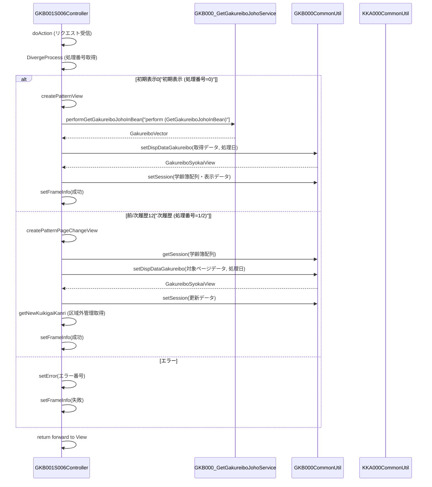

# GKB001S006Controller

## 1. 目的
`GKB001S006Controller` は学齢簿表示画面を担当する Web 層の **Controller** クラスです。  
主に学齢簿の初期表示、履歴ページング、エラー処理、画面遷移情報の設定を行います。  
**注意**: コードに業務シナリオのコメントはありません。上記の説明はクラス名と実装内容からの推測です。

## 2. 依存関係
| 依存クラス | 用途 |
|------------|------|
| [GKB000_GetGakureiboJohoService](http://localhost:3000/projects/test_jip/wiki?file_path=code/java/service/gkb000/GKB000_GetGakureiboJohoService.java) | 学齢簿情報取得サービス |
| [GKB000_GetMessageService](http://localhost:3000/projects/test_jip/wiki?file_path=code/java/service/gkb000/GKB000_GetMessageService.java) | エラーメッセージ取得サービス |
| [GKB000_GetKuikigaiService](http://localhost:3000/projects/test_jip/wiki?file_path=code/java/service/gkb000/GKB000_GetKuikigaiService.java) | 区域外管理情報取得サービス |
| [GKB000CommonUtil](http://localhost:3000/projects/test_jip/wiki?file_path=code/java/common/util/GKB000CommonUtil.java) | セッション操作・共通ユーティリティ |
| [KKA000CommonUtil](http://localhost:3000/projects/test_jip/wiki?file_path=code/java/common/util/KKA000CommonUtil.java) | 和暦⇔西暦変換等のユーティリティ |
| `BaseSessionSyncController` (継承元) | セッション同期処理の基底クラス |

## 3. 主要メソッド
| メソッド | 戻り値 | 説明 |
|----------|--------|------|
| `doAction` | `ModelAndView` | エントリーポイント。`REQUEST_MAPPING_PATH.do` で呼び出され、`execute` に委譲 |
| `doMainProcessing` | `ModelAndView` | メインフロー。`DivergeProcess` の結果で画面遷移先を決定し、フレーム情報を設定 |
| `DivergeProcess` | `String` | 画面イベント（初期表示・前履歴・次履歴）を処理番号で分岐 |
| `createPatternView` | `String` | 初期表示時に学齢簿データを取得し、セッションに格納 |
| `createPatternPageChangeView` | `String` | 前・次履歴ボタン押下時に対象ページの学齢簿データを取得し、セッションに格納 |
| `getArrayGakureibo` | `Vector` | 学齢簿情報取得サービスを呼び出し、学齢簿配列を取得 |
| `getNewKuikigaiKanri` | `KuikigaiKanriListView` | 区域外管理情報取得サービスを呼び出し、最新の管理情報を取得 |
| `setFrameInfo` | `void` | 成功/失敗に応じてフレーム制御情報（戻り先・再表示先）をセッションに設定 |
| `setError` | `String` | エラーメッセージ取得サービスを利用し、エラーメッセージを画面に設定 |

## 4. ビジネスフロー
以下のシーケンスは、**初期表示** → **ページング** → **エラー処理** の典型的な流れを示します。  
(ステップ数が 3 以上、関係コンポーネントが 3 つ以上あるため Mermaid を使用)

## 5. 例外処理
| 例外シナリオ | 発生箇所 | 対応 |
|--------------|----------|------|
| セッションタイムアウト | `DivergeProcess` → `gkb000CommonUtil.isTimeOut` | `setError` でタイムアウトエラー (`EQ_ERROR_TIMEOUT`) を設定 |
| 学齢簿取得失敗 | `getArrayGakureibo` のサービス呼び出し | 例外をキャッチし `e.printStackTrace()` のみ (画面側は `setError` でエラーメッセージ表示) |
| 区域外管理取得失敗 | `getNewKuikigaiKanri` のサービス呼び出し | 同上、例外をキャッチしスタックトレース出力 |

---