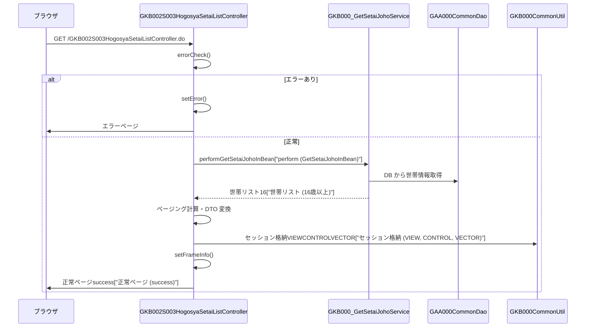

# GKB002S003HogosyaSetaiListController

## 1. 目的
`GKB002S003HogosyaSetaiListController` は **保護者情報一覧画面** を表示する Web 層 Controller です。  
学齢簿（学生情報）に紐付く世帯情報から 16 歳以上の保護者を抽出し、ページングして画面に渡します。  
**注意**: コードに業務シナリオのコメントは無いため、上記説明はクラス名と実装ロジックからの推測です。

## 2. 核心字段
| フィールド | 型 | 説明 |
|------------|----|------|
| `gkb000_GetSetaiJohoService` | `GKB000_GetSetaiJohoService` | 世帯情報取得サービス |
| `gkb000_GetMessageService` | `GKB000_GetMessageService` | メッセージ取得サービス（エラーメッセージ用） |
| `actionMappingConfigContext` | `ActionMappingConfigContext` | ActionMapping 定義取得ヘルパ |
| `gaa000CommonDao` | `GAA000CommonDao` | 各種コード（旧自治体・地区等）取得 DAO |
| `gkb000CommonUtil` | `GKB000CommonUtil` | セッション操作・共通ユーティリティ |
| `kka000CommonUtil` | `KKA000CommonUtil` | 日付・和暦変換ユーティリティ |
| `REQUEST_MAPPING_PATH` | `String` | 本コントローラの URL パス (`/GKB002S003HogosyaSetaiListController`) |

## 3. 主要方法
| メソッド | 戻り値 | 説明 |
|----------|--------|------|
| `doAction` | `ModelAndView` | エントリーポイント。`ActionMapping` を取得し `execute` を呼び出す |
| `doMainProcessing` | `ModelAndView` | 画面表示のメインロジック。`createPatternView` → `setFrameInfo` → フォワード決定 |
| `createPatternView` | `String` | エラーチェック → 世帯情報取得 → ページング → セッション格納 |
| `setDispDataSetai` | `HogosyaListView` | 1 件の世帯情報を画面用 DTO に変換 |
| `getArraySetaiList` | `Vector` | `GKB000_GetSetaiJohoService` を呼び出し、16 歳以上の保護者リストを取得 |
| `errorCheck` | `boolean` | セッションタイムアウト・必須データ欠如をチェックし、エラー時は `setError` を呼び出す |
| `setFrameInfo` | `void` | 成功／失敗に応じてフレーム制御情報（戻り先・再表示先）をセッションに格納 |
| `setError` | `String` | `GKB000_GetMessageService` でエラーメッセージを取得し、`ErrorMessageForm` に設定 |

## 4. 依赖关系
| 依赖 | 用途 |
|------|------|
| [`GKB000_GetSetaiJohoService`](http://localhost:3000/projects/test_jip/wiki?file_path=code/java/service/gkb000/GKB000_GetSetaiJohoService.java) | 世帯情報取得（保護者リスト） |
| [`GKB000_GetMessageService`](http://localhost:3000/projects/test_jip/wiki?file_path=code/java/service/gkb000/GKB000_GetMessageService.java) | エラーメッセージ取得 |
| [`ActionMappingConfigContext`](http://localhost:3000/projects/test_jip/wiki?file_path=code/java/app/base/ActionMappingConfigContext.java) | ActionMapping 定義取得 |
| [`GAA000CommonDao`](http://localhost:3000/projects/test_jip/wiki?file_path=code/java/dao/GAA000CommonDao.java) | 旧自治体・地区・行政区・班名取得 |
| [`GKB000CommonUtil`](http://localhost:3000/projects/test_jip/wiki?file_path=code/java/util/GKB000CommonUtil.java) | セッション操作・共通ロジック |
| [`KKA000CommonUtil`](http://localhost:3000/projects/test_jip/wiki?file_path=code/java/util/KKA000CommonUtil.java) | 和暦変換・日付処理 |
| [`BaseSessionSyncController`](http://localhost:3000/projects/test_jip/wiki?file_path=code/java/app/base/BaseSessionSyncController.java) | 本コントローラのスーパークラス（セッション同期機能） |
| [`GKB002S004GakureiboIdoForm`](http://localhost:3000/projects/test_jip/wiki?file_path=code/java/app/gkb0020/form/GKB002S004GakureiboIdoForm.java) | 学齢簿画面のフォーム |
| [`HogosyaListView`](http://localhost:3000/projects/test_jip/wiki?file_path=code/java/app/helper/HogosyaListView.java) | 保護者情報表示用 DTO |
| [`HogosyaListParaView`](http://localhost:3000/projects/test_jip/wiki?file_path=code/java/app/helper/HogosyaListParaView.java) | ページング制御情報 |
| [`SetaiList`](http://localhost:3000/projects/test_jip/wiki?file_path=code/java/common/helper/SetaiList.java) | 世帯情報エンティティ |
| [`GakureiboSyokaiView`](http://localhost:3000/projects/test_jip/wiki?file_path=code/java/common/helper/GakureiboSyokaiView.java) | 学齢簿表示情報 |
| [`ResultFrameInfo`](http://localhost:3000/projects/test_jip/wiki?file_path=code/java/fw/bean/view/ResultFrameInfo.java) | フレーム制御情報 |
| [`ScreenHistory`](http://localhost:3000/projects/test_jip/wiki?file_path=code/java/app/helper/ScreenHistory.java) | 画面遷移履歴 |
| [`MessageNo`](http://localhost:3000/projects/test_jip/wiki?file_path=code/java/common/helper/MessageNo.java) | エラーメッセージ番号 DTO |
| [`ErrorMessageForm`](http://localhost:3000/projects/test_jip/wiki?file_path=code/java/app/gkb000/form/ErrorMessageForm.java) | エラーメッセージ表示用 Form |
| [`KyoikuConstants`](http://localhost:3000/projects/test_jip/wiki?file_path=code/java/common/util/KyoikuConstants.java) | 定数定義（フォワード文字列等） |
| [`KyoikuMsgConstants`](http://localhost:3000/projects/test_jip/wiki?file_path=code/java/common/util/KyoikuMsgConstants.java) | エラーメッセージ番号定数 |

## 5. 业务流程

## 6. 异常处理
| 例外シナリオ | 発生箇所 | 対応 |
|--------------|----------|------|
| セッションタイムアウト | `errorCheck` → `gkb000CommonUtil.isTimeOut` | `setError` でタイムアウトメッセージ (`EQ_ERROR_TIMEOUT`) を設定 |
| 学齢簿情報がセッションに無い | `errorCheck` → `gkb000CommonUtil.isSession("GKB_011_01_VECTOR")` | `setError` で `EQ_GAKUREIBO_01` を設定 |
| 学齢簿表示情報がセッションに無い | `errorCheck` → `gkb000CommonUtil.isSession("GKB_011_01_VIEW")` | 同上 |
| 処理日が取得できない | `errorCheck` → `gkb000CommonUtil.isSession(CS_INPUT_PROCESSDATE)` | `setError` で `EQ_GAKUREIBO_67` を設定 |
| 世帯情報取得時例外 | `getArraySetaiList` の try‑catch | 例外をスタックトレース出力し、空リストを返す（画面側でエラー扱い） |

## 7. 设计特点
- **ページング**: 1 ページ最大行数 `CS_HOGOSYALIST_MAXROW`（定数）で区切り、前/次ボタン・ページコンボの有効/無効を制御。  
- **セッション管理**: 学齢簿情報・保護者リスト・画面制御情報を個別キーで保持し、画面遷移時に再利用。  
- **DI (依存性注入)**: `@Inject` によりサービス・DAO・ユーティリティを注入し、テスト容易性を確保。  
- **エラーメッセージ統一**: `GKB000_GetMessageService` でメッセージ番号からメッセージを取得し、`ErrorMessageForm` に格納。  
- **共通ユーティリティ活用**: `GKB000CommonUtil`・`KKA000CommonUtil` で日付変換・文字列 null → 空処理等を一元化。  

---