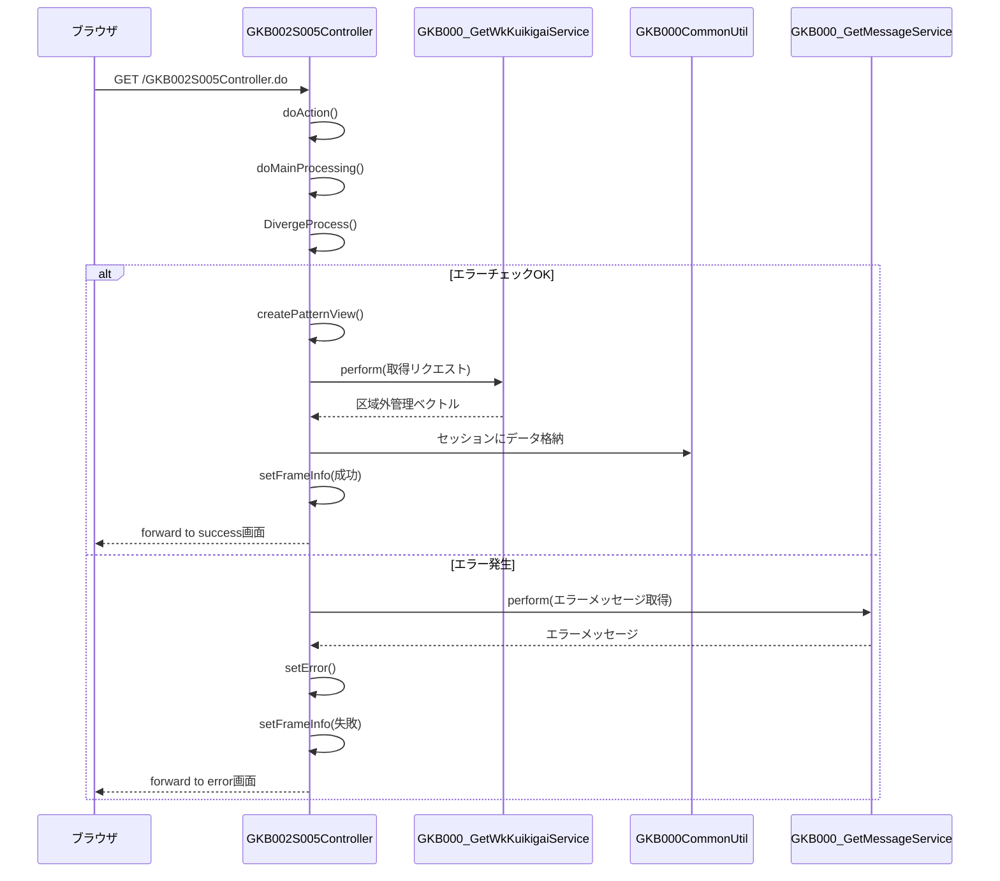

# GKB002S005Controller

## 1. 目的
`GKB002S005Controller` は **就学履歴画面** の表示・再表示・更新を担当する Web 層コントローラです。  
リクエストを受け取り、画面制御情報や就学履歴データをセッションに格納し、画面遷移先を決定します。

## コアフィールド
| フィールド | 型 | 用途 |
|------------|----|------|
| `service` | [GKB000_GetWkKuikigaiService](http://localhost:3000/projects/test_jip/wiki?file_path=code/java/jp/co/jip/gkb000/service/gkb000/GKB000_GetWkKuikigaiService.java) | 区域外管理情報取得サービス |
| `messageService` | [GKB000_GetMessageService](http://localhost:3000/projects/test_jip/wiki?file_path=code/java/jp/co/jip/gkb000/service/gkb000/GKB000_GetMessageService.java) | エラーメッセージ取得サービス |
| `gkb000CommonUtil` | [GKB000CommonUtil](http://localhost:3000/projects/test_jip/wiki?file_path=code/java/jp/co/jip/gkb000/common/dao/GKB000CommonUtil.java) | セッション操作・共通ユーティリティ |
| `kka000CommonUtil` | [KKA000CommonUtil](http://localhost:3000/projects/test_jip/wiki?file_path=code/java/jp/co/jip/wizlife/fw/kka000/dao/KKA000CommonUtil.java) | 和暦変換・日付フォーマットユーティリティ |
| `REQUEST_MAPPING_PATH` | `String` | コントローラの URL パス (`/GKB002S005Controller`) |

## 主要メソッド
| メソッド | 戻り値 | 説明 |
|----------|--------|------|
| `doAction` | `ModelAndView` | エントリーポイント。`/GKB002S005Controller.do` にマッピングされ、`execute` メソッドへ委譲。 |
| `doMainProcessing` | `ModelAndView` | 画面表示のメインロジック。`DivergeProcess` の結果でフレーム情報を設定し、遷移先を返す。 |
| `DivergeProcess` | `String` | 画面モード判定・エラーチェックを行い、`createPatternView` へ処理を分岐。 |
| `createPatternView` | `String` | 就学履歴データを取得・整形し、セッションに格納。成功時は `CS_FORWARD_SUCCESS` を返す。 |
| `getKuikigaiKanri` | `Vector` | 区域外管理テーブルのデータをサービス (`service.perform`) から取得し、表示用ヘルパへ変換。 |
| `getSRirekiParaView` | `KuikigaiKanriListParaView` | 画面制御情報（ボタン有効/無効）を作成。 |
| `getsRirekiForm` | `KuikigaiKanriListView` | 画面入力データを元に表示用オブジェクトを生成。 |
| `getSRirekiCount` | `int` | 就学履歴配列の有効件数をカウント。 |
| `errorCheck` | `boolean` | セッションタイムアウト、必須データ欠如、モード不正などを検証し、エラー時は `setError` を呼び出す。 |
| `setFrameInfo` | `void` | 成功／失敗に応じてフレーム遷移情報 (`ResultFrameInfo`) をセッションに格納。 |
| `setError` (2 overload) | `String` | エラーメッセージ取得サービスを呼び出し、`ErrorMessageForm` に設定して `CS_FORWARD_ERROR` を返す。 |

## 依存関係
| 依存クラス | 用途 |
|------------|------|
| [GKB000_GetWkKuikigaiService](http://localhost:3000/projects/test_jip/wiki?file_path=code/java/jp/co/jip/gkb000/service/gkb000/GKB000_GetWkKuikigaiService.java) | 区域外管理情報取得 |
| [GKB000_GetMessageService](http://localhost:3000/projects/test_jip/wiki?file_path=code/java/jp/co/jip/gkb000/service/gkb000/GKB000_GetMessageService.java) | エラーメッセージ取得 |
| [GKB000CommonUtil](http://localhost:3000/projects/test_jip/wiki?file_path=code/java/jp/co/jip/gkb000/common/dao/GKB000CommonUtil.java) | セッション操作・共通ロジック |
| [KKA000CommonUtil](http://localhost:3000/projects/test_jip/wiki?file_path=code/java/jp/co/jip/wizlife/fw/kka000/dao/KKA000CommonUtil.java) | 日付変換・フォーマット |
| Spring MVC (`@Controller`, `@RequestMapping`) | Web リクエストハンドリング |
| `HttpServletRequest` / `HttpServletResponse` | リクエスト・レスポンス情報取得 |

## ビジネスフロー

## 例外処理
| 例外シナリオ | 発生箇所 | 対応 |
|--------------|----------|------|
| セッションタイムアウト | `errorCheck` → `gkb000CommonUtil.isTimeOut` | `setError` でタイムアウトメッセージを設定し、`CS_FORWARD_ERROR` に遷移 |
| 必要データ未取得 (学齢簿情報) | `errorCheck` → `gkb000CommonUtil.isSession("GKB_011_01_VIEW")` | `setError` で `EQ_GAKUREIBO_01` エラーを設定 |
| 不正モード指定 | `errorCheck` → `sRirekiForm.getPrcsMode()` 範囲外 | `setError` で `EQ_ERROR_UNJUST_OPERATION` エラーを設定 |
| 区域外種別未選択 (更新時) | `errorCheck` → `sRirekiForm.getCurrentKuikigaisCd()` | `MessageNo(EQ_GAKUREIBO_104)` をエラーリストに追加 |
| 区域外開始日未入力 (更新時) | `errorCheck` → `sRirekiForm.getCurrentKgKaishibi()` | `MessageNo(EQ_GAKUREIBO_105)` をエラーリストに追加 |

---