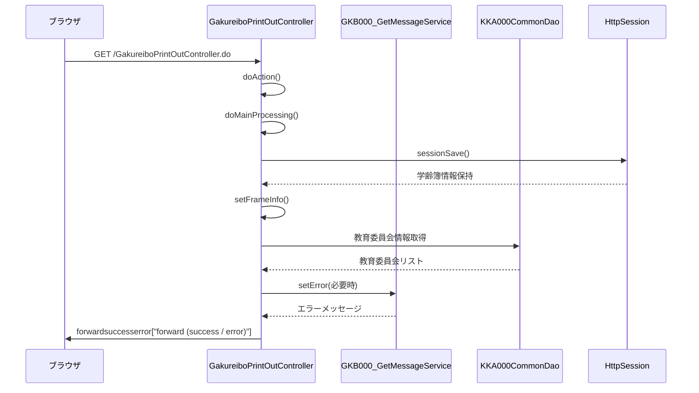

# GakureiboPrintOutController

## 1. 目的
`GakureiboPrintOutController` は **帳票発行画面の表示を行う Web 層** のコントローラです。  
画面遷移やセッション保持、エラーチェック、フレーム情報設定など、帳票発行画面の表示に必要な一連の処理を統括します。  

## 2. 核心字段

| フィールド | 型 | 説明 |
|------------|----|------|
| `REQUEST_MAPPING_PATH` | `String` | コントローラのリクエストマッピングパス (`/GakureiboPrintOutController`) |

## 3. 主要方法

| メソッド | 戻り値 | 説明 |
|----------|--------|------|
| `setUpForm(HttpServletRequest)` | `ActionForm` | アクションフォームを自動初期化し、`setModelAttribute` を呼び出す。 |
| `doAction(ActionForm, HttpServletRequest, HttpServletResponse, ModelAndView)` | `ModelAndView` | エントリーポイント。`execute` に委譲して処理を開始する。 |
| `doMainProcessing(ActionMapping, ActionForm, HttpServletRequest, HttpServletResponse, ModelAndView)` | `ModelAndView` | **メインフロー**：`sessionSave` → `setFrameInfo` → フォワード先決定 → `ModelAndView` を返す。 |
| `sessionSave(ActionForm, HttpServletRequest)` | `String` | 学齢簿情報をセッションに保持し、画面遷移先コード (`GakureiboSyokai` / `GakureiboIdo` / `GakureiboPrintOut`) を返す。 |
| `setFrameInfo(String, ActionForm, HttpServletRequest, HttpServletResponse)` | `void` | フレーム制御情報（戻る・再表示リンク）を `ResultFrameInfo` に設定し、セッションに保存する。 |
| `errorCheck(HttpServletRequest)` | `boolean` | セッションタイムアウト、学齢簿情報欠損、DV 規制チェック等を行い、エラーがあれば `setError` を呼び出す。 |
| `createLog(String, String, int, int, String, HttpServletRequest)` | `int` | 帳票発行処理のログを `KKA000CommonDao.accessLog` で記録する。 |
| `processDateCnv(String)` | `int` | 処理日（和暦）を西暦に変換するユーティリティ。 |
| `setError(HttpServletRequest, int)` | `String` | エラーメッセージ取得サービスを呼び出し、`ErrorMessageForm` を作成してセッションに格納する。 |
| `lnullToValue(String)` | `long` | `String` を `long` に安全変換するヘルパー。 |

## 4. 依存関係

| 依存クラス | 用途 |
|------------|------|
| [`GKB000_GetMessageService`](http://localhost:3000/projects/test_jip/wiki?file_path=code/java/jp/co/jip/gkb000/service/gkb000/GKB000_GetMessageService.java) | エラーメッセージ取得サービス（`setError` で使用）。 |
| [`KKA000CommonUtil`](http://localhost:3000/projects/test_jip/wiki?file_path=code/java/jp/co/jip/wizlife/fw/kka000/util/KKA000CommonUtil.java) | 和暦⇔西暦変換やその他共通ユーティリティ。 |
| [`GAA000CommonDao`](http://localhost:3000/projects/test_jip/wiki?file_path=code/java/jp/co/jip/gaa000/common/dao/GAA000CommonDao.java) | DV 規制取得 (`getDVShikaku`) に使用。 |
| [`KKA000CommonDao`](http://localhost:3000/projects/test_jip/wiki?file_path=code/java/jp/co/jip/wizlife/fw/kka000/dao/KKA000CommonDao.java) | 教育委員会情報取得、外字登録取得、ログ記録に使用。 |
| [`GKB000CommonUtil`](http://localhost:3000/projects/test_jip/wiki?file_path=code/java/jp/co/jip/gkb000/common/util/GKB000CommonUtil.java) | セッション操作、タイムアウト判定、数値変換等の共通処理。 |

## 5. ビジネスフロー

*フローは 5 ステップ以上で、`Client`, `Controller`, `Session`, `DAO`, `Service` の 5 コンポーネントが関与しています。*  

## 6. 例外処理

| 例外シナリオ | 発生箇所 | 対応 |
|--------------|----------|------|
| セッションタイムアウト | `errorCheck` → `gkb000CommonUtil.isTimeOut` | `setError` でタイムアウトエラー (`EQ_ERROR_TIMEOUT`) を設定 |
| 学齢簿情報欠損 | `errorCheck` → `gkb000CommonUtil.isSession` | `setError` で `EQ_GAKUREIBO_01` エラーを設定 |
| DV 規制警告/エラー | `errorCheck` → `gaa000CommonDao.getDVShikaku` | 警告は `EQ_WARNING_DV`、エラーは `EQ_ERROR_DV` を `setError` で設定 |
| ログ記録失敗 | `createLog` → `kka000CommonDao.accessLog` | 例外をキャッチしスタックトレースを出力（処理は継続） |

---