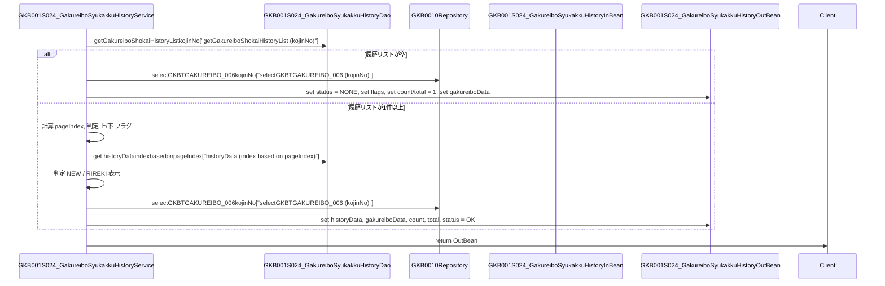

# GKB001S024_GakureiboSyukakkuHistoryService

## 1. 目的
`GKB001S024_GakureiboSyukakkuHistoryService` は **学齢簿情報取得サービス** です。  
入力された個人番号（`kojinNo`）に対して、就学変更履歴を取得し、最新・履歴の表示情報やページング情報を組み立てて返却します。

## 2. 主要方法

| 方法 | 戻り値 | 説明 |
|------|--------|------|
| `perform(GKB001S024_GakureiboSyukakkuHistoryInBean inBean)` | `GKB001S024_GakureiboSyukakkuHistoryOutBean` | 個人番号から就学変更履歴リストを取得し、ページング・表示フラグ・関連学齢簿データを設定して返す。 |

## 3. 依存関係

| 依存 | 用途 |
|------|------|
| `[GKB001S024_GakureiboSyukakkuHistoryDao](http://localhost:3000/projects/test_jip/wiki?file_path=code/java/GKB001S024_GakureiboSyukakkuHistoryDao.java)` | 履歴リスト取得（`getGakureiboShokaiHistoryList`） |
| `[GKB0010Repository](http://localhost:3000/projects/test_jip/wiki?file_path=code/java/GKB0010Repository.java)` | 学齢簿マスタデータ取得（`selectGKBTGAKUREIBO_006`） |
| `KyoikuConstants` | ステータス定数（`CN_STATUS_NONE`, `CN_STATUS_OK`） |
| `StringUtils`（Apache Commons Lang） | 文字列比較（`equals`） |
| `[GakureiboShokaiHistoryData](http://localhost:3000/projects/test_jip/wiki?file_path=code/java/GakureiboShokaiHistoryData.java)` | 履歴データ保持クラス |
| `[GkbtgakureiboData](http://localhost:3000/projects/test_jip/wiki?file_path=code/java/GkbtgakureiboData.java)` | 学齢簿マスタデータ保持クラス |
| `[GKB001S024_GakureiboSyukakkuHistoryInBean](http://localhost:3000/projects/test_jip/wiki?file_path=code/java/GKB001S024_GakureiboSyukakkuHistoryInBean.java)` | 入力パラメータ（個人番号、ページインデックス） |
| `[GKB001S024_GakureiboSyukakkuHistoryOutBean](http://localhost:3000/projects/test_jip/wiki?file_path=code/java/GKB001S024_GakureiboSyukakkuHistoryOutBean.java)` | 出力パラメータ（履歴データ、表示フラグ、ページ情報） |

## 4. 业务流程

このフローは、履歴が存在しない場合と存在する場合の二通りの処理を分岐し、ページング情報と表示フラグを適切に設定してクライアントへ返却します。