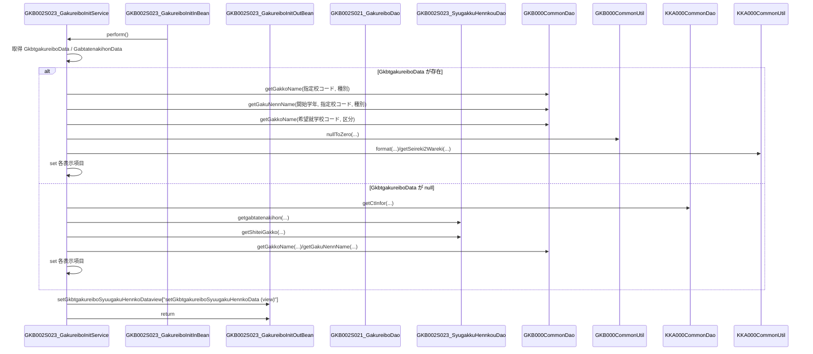

# GKB002S023_GakureiboInitService

## 1. 目的
`GKB002S023_GakureiboInitService` は **学年履歴就学学校変更初期処理** を行う Service クラスです。  
学齢簿データと児童基本情報を受け取り、就学指定校・就学変更情報などを画面表示用の `GkbtgakureiboSyuugakuHennkoData` に変換して返します。  

**注意**: コード中に業務シナリオの詳細なコメントはなく、クラス名と処理内容から推測した目的です。

## 2. 主要メソッド

| メソッド | 戻り値 | 説明 |
|----------|--------|------|
| `perform(GKB002S023_GakureiboInitInBean inBean)` | `GKB002S023_GakureiboInitOutBean` | 入力 Bean から学齢簿データと児童基本情報を取得し、就学指定校・就学変更情報等を設定した `GkbtgakureiboSyuugakuHennkoData` を `out` に格納して返す。 |
| `getDate(int date)` *(private)* | `String` | `int` 型の日付を和暦表記に変換し、表示用文字列を返す。 |
| `nullToZero(String value)` *(private)* | `int` | 空文字列または `null` を `0` に変換し、数値として返す。 |

## 3. 依存関係

| 依存クラス | 用途 |
|------------|------|
| [`GKB002S021_GakureiboDao`](http://localhost:3000/projects/test_jip/wiki?file_path=code/java/Dao_GKB002S021_GakureiboDao.java) | 学齢簿の基本情報取得（本クラスでは直接使用されていないが、将来的に利用される可能性あり） |
| [`KKA000CommonUtil`](http://localhost:3000/projects/test_jip/wiki?file_path=code/java/Util_KKA000CommonUtil.java) | 日付フォーマット等ユーティリティ |
| [`KKA000CommonDao`](http://localhost:3000/projects/test_jip/wiki?file_path=code/java/Dao_KKA000CommonDao.java) | 区域外就学管理区分取得 |
| [`GKB000CommonUtil`](http://localhost:3000/projects/test_jip/wiki?file_path=code/java/Util_GKB000CommonUtil.java) | 学校名取得や学年名取得のヘルパー |
| [`GKB000CommonDao`](http://localhost:3000/projects/test_jip/wiki?file_path=code/java/Dao_GKB000CommonDao.java) | 学校コードから学校名、学年名を取得 |
| [`GKB002S023_SyugakkuHennkouDao`](http://localhost:3000/projects/test_jip/wiki?file_path=code/java/Dao_GKB002S023_SyugakkuHennkouDao.java) | 児童基本情報取得、就学指定校リスト取得 |
| [`KKA100GetCTDao`](http://localhost:3000/projects/test_jip/wiki?file_path=code/java/Dao_KKA100GetCTDao.java) | CT 情報取得（本クラスでは使用されていない） |
| `GKBUtil` | Map から文字列取得のユーティリティ |
| `KyoikuConstants` | 業務コード定数 |

## 4. ビジネスフロー

### フロー概要
1. **入力取得**  
   - `inBean` から学齢簿データ (`GkbtgakureiboData`) と児童基本情報 (`GabtatenakihonData`) を取得。  

2. **学齢簿データがある場合**  
   - 指定校コードが空でないかつ `"0"` のときに学校名を取得。  
   - 開始学年が `"0"` のときに学年名を取得。  
   - 希望就学校コード・区分に応じて小学校・中学校の学校名を取得。  
   - 各種日付項目を `getDate` で和暦表記に変換。  

3. **学齢簿データが無い場合**  
   - 区域外就学管理区分を `KKA000CommonDao` から取得。  
   - 児童基本情報を `GKB002S023_SyugakkuHennkouDao` で取得し、管理区分を設定。  
   - `getShiteiGakko` で就学指定校リストを取得し、コード・名称を設定。  

4. **結果格納**  
   - 作成した `GkbtgakureiboSyuugakuHennkoData` を `out` に設定し返却。  

## 5. 例外処理
本クラスでは `try‑catch` 構文は使用していません。  
外部 DAO の呼び出しで例外が発生した場合は、Spring の例外伝搬メカニズムに委ねられます。  

---