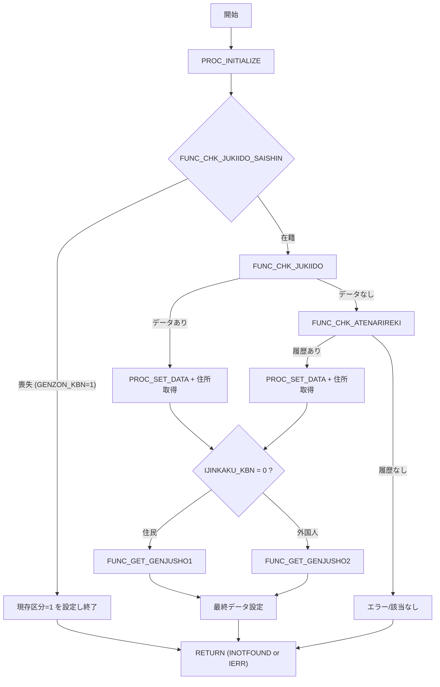

# GKBFKGZSHNT

## 1. 目的
基準日時点で対象者が現存しているかを判定し、必要な個人情報を取得して OUT パラメータに設定するサブルーチンです。  
（コードのコメントに記載された「現存者判定サブルーチン」からの説明です）

## 2. インターフェース

| パラメータ | モード | 型 | 説明 |
|------------|--------|----|------|
| `i_IKOJIN_NO` | IN | NUMBER | 個人番号 |
| `i_IKIJUN_BI` | IN | NUMBER | 基準日（西暦８桁） |
| `o_IGENZON_KBN` | OUT | PLS_INTEGER | 現存区分（0＝在籍、1＝喪失） |
| `o_JINKAKU_KBN` | OUT | PLS_INTEGER | 人格区分 |
| `o_VYUBIN_NO` | OUT | NVARCHAR2 | 郵便番号 |
| `o_VCHOMEI` | OUT | NVARCHAR2 | 町名 |
| `o_VBANCHI` | OUT | NVARCHAR2 | 番地 |
| `o_VKATAGAKI` | OUT | NVARCHAR2 | 肩書 |
| `o_VSHIMEI_KANA` | OUT | NVARCHAR2 | 氏名（かな） |
| `o_VSHIMEI_KANJI` | OUT | NVARCHAR2 | 氏名（漢字） |
| `o_SEINENGAPI` | OUT | PLS_INTEGER | 生年月日 |
| `o_SEIBETSU` | OUT | PLS_INTEGER | 性別 |
| `o_IGYOSEIKU_CD` | OUT | PLS_INTEGER | 行政区コード |
| `o_VGYOSEIKU_NM` | OUT | NVARCHAR2 | 行政区名 |
| `o_ICHUGAKU_CD` | OUT | PLS_INTEGER | 中学校区コード |
| `o_VCHUGAKU_NM` | OUT | NVARCHAR2 | 中学校区名 |
| `o_ISHOGAKU_CD` | OUT | PLS_INTEGER | 小学校区コード |
| `o_VSHOGAKU_NM` | OUT | NVARCHAR2 | 小学校区名 |
| `o_VTEL_NO` | OUT | NVARCHAR2 | 電話番号 |
| `o_ISANTEIDANTAI_CD` | OUT | PLS_INTEGER | 算定団体コード |
| `o_VSANTEIDANTAI_NM` | OUT | NVARCHAR2 | 算定団体名 |
| `o_VCUSTOM_BC` | OUT | NVARCHAR2 | カスタムバーコード |

## 3. 主なサブルーチン

| 名称 | 種別 | 目的 |
|------|------|------|
| `FUNC_JICHINAME` | 関数 | 算定団体コードから旧自治体名称を取得 |
| `PROC_INITIALIZE` | 手続き | すべてのローカル変数を初期化 |
| `PROC_SET_DATA` | 手続き | ローカル変数の内容を OUT パラメータへコピーし、名称系テーブルから補完情報を取得 |
| `FUNC_CHK_JUKIIDO_SAISHIN` | 関数 | 最新住民異動マスタで喪失かどうかをチェック |
| `FUNC_CHK_JUKIIDO` | 関数 | 基準日時点の住民異動情報を取得 |
| `FUNC_CHK_ATENARIREKI` | 関数 | 宛名履歴から最新データを取得 |
| `FUNC_GET_GENJUSHO1` | 関数 | 住民用の最終住所を取得 |
| `FUNC_GET_GENJUSHO2` | 関数 | 外国人用の最終住所を取得 |

## 4. 依存関係

| 依存パッケージ / テーブル | 用途 |
|---------------------------|------|
| `[GAAPK0030](http://localhost:3000/projects/test_jip/wiki?file_path=code/plsql/GAAPK0030.SQL)` | 行政区・学校区名称取得、旧自治体名称取得 |
| `[GAAPK0010](http://localhost:3000/projects/test_jip/wiki?file_path=code/plsql/GAAPK0010.SQL)` | カスタムバーコード生成 |
| `GABTJUKIIDO` | 住民異動マスタ |
| `GABTATENAKIHON` | 住民基本情報 |
| `GABTATENARIREKI` | 宛名履歴 |
| `GABTJUKIJUSHO` | 住民用最終住所テーブル |

## 5. ビジネスフロー

このフローは、**初期化 → 最新住民異動チェック → 在籍判定 → 必要に応じて履歴検索 → 住所取得 → データ設定 → 終了** の流れを示しています。  

---