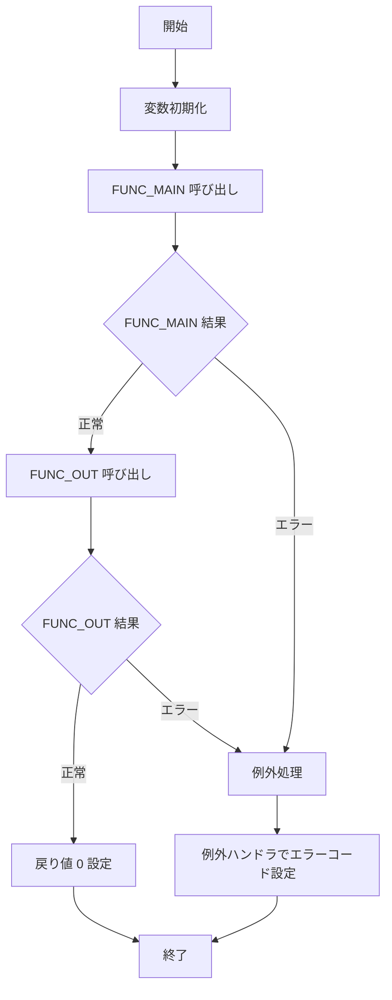

# GKBFKHMCTRL

## 1. 目的
取得した児童・生徒の宛名情報（氏名カナ・氏名漢字・生年月日）を、引数で指定された保護者区分・システム制御設定・帳票 ID に応じた表示形式で OUT パラメータに設定し、処理結果コードを返す関数です。  
**注意**: コードに業務シナリオの明示的なコメントはなく、上記説明は関数名と実装ロジックからの推測です。

## 2. インターフェース

| パラメータ | モード | 型 | 説明 |
|------------|--------|----|------|
| `i_nKOJIN_NO` | IN | NUMBER | 宛名番号（個人識別キー） |
| `i_sCHOHYOID` | IN | NVARCHAR2 | 帳票 ID |
| `i_nHOGOSYA_KAN` | IN | NUMBER | 保護者区分（0: 保護者制御しない、1: 保護者制御する） |
| `i_nSYS_KAN` | IN | NUMBER | システム制御設定 |
| `i_nRIREKI_RENBAN` | IN | NUMBER (デフォルト 0) | 履歴連番（省略可） |
| `o_sSHIMEIKANA` | OUT | NVARCHAR2 | 氏名カナ（表示用） |
| `o_sSHIMEI` | OUT | NVARCHAR2 | 氏名漢字（表示用） |
| `o_sBIRTHDAY` | OUT | NVARCHAR2 | 生年月日（和暦または西暦） |
| **戻り値** |  | PLS_INTEGER | 0=正常、1=エラー |

## 3. 主要サブプログラム

| サブプログラム | 種別 | 戻り値 | 说明 |
|----------------|------|--------|------|
| `FUNC_MAIN` | FUNCTION | NUMBER | 宛名基本・住基異動・学齢簿から児童・生徒の基本情報を取得し、内部変数へ格納 |
| `FUNC_OUT` | FUNCTION | NUMBER | 取得した情報と本名使用制御設定に基づき、OUT パラメータに最終表示データを設定 |
| `g_eOTHERS` | EXCEPTION | - | 例外捕获用の汎用例外 |

## 4. 依存関係

| 依存対象 | 用途 |
|----------|------|
| [GABTATENAKIHON](http://localhost:3000/projects/test_jip/wiki?file_path=code/plsql/GABTATENAKIHON.SQL) | 宛名基本テーブル（氏名・生年月日等） |
| [GABTJUKIIDO](http://localhost:3000/projects/test_jip/wiki?file_path=code/plsql/GABTJUKIIDO.SQL) | 住基異動テーブル（通称名） |
| [GKBTGAKUREIBO](http://localhost:3000/projects/test_jip/wiki?file_path=code/plsql/GKBTGAKUREIBO.SQL) | 学齢簿テーブル（通称名・保護者情報） |
| [GKBTSHIMEIJKN](http://localhost:3000/projects/test_jip/wiki?file_path=code/plsql/GKBTSHIMEIJKN.SQL) | 本名使用制御管理テーブル（設定コード取得） |
| [GKAPK00020](http://localhost:3000/projects/test_jip/wiki?file_path=code/plsql/GKAPK00020.SQL) | 生年月日フォーマットユーティリティ |
| [GKAPK0020](http://localhost:3000/projects/test_jip/wiki?file_path=code/plsql/GKAPK0020.SQL) | 生年月日変換ユーティリティ |

## 5. ビジネスフロー

## 6. 例外処理

* すべての主要処理 (`FUNC_MAIN`、`FUNC_OUT`、メインブロック) で `WHEN OTHERS THEN` を捕捉し、エラーコード (`SQLCODE`) を `g_nRTN` に設定して関数から返します。  
* 初期化段階で `g_nFCRTN` が 0 でない場合も同様に例外を発生させ、エラーハンドラへ遷移します。

## 7. 設計特徴

* **動的 SQL**：`FUNC_MAIN` で `sSQL` を組み立て、`OPEN cCURSOR FOR sSQL` により実行。保護者区分や履歴連番に応じた条件分岐が多数。
* **大量条件分岐**：`i_nSYS_KAN` と本名使用制御コード (`g_nHONMYO_KAN`) の組み合わせで 10 以上の分岐ロジックを実装。
* **統一例外ハンドリング**：`g_eOTHERS` 例外オブジェクトで全体のエラーハンドリングを一元化。  
* **外部ユーティリティ呼び出し**：`GKAPK00020`・`GKAPK0020` の日付変換関数を利用し、和暦・西暦のフォーマットを統一。