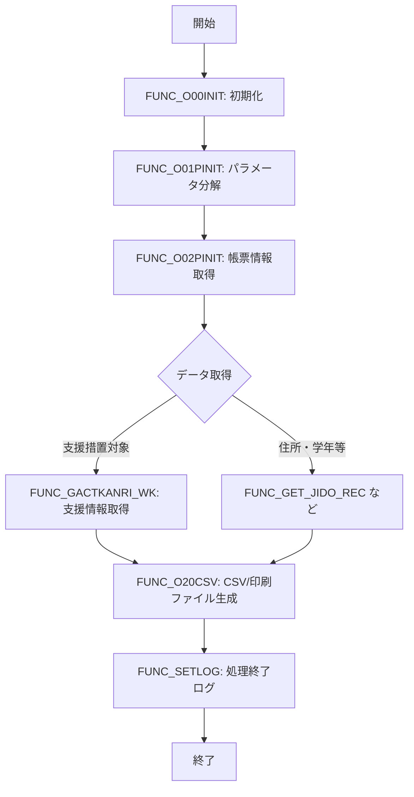

# GKBPA00040（学齢簿帳票情報出力）

## 1. 目的
`GKBPA00040` は、個人番号と履歴連番をキーに学齢簿情報を取得し、CSV および EMF／PDF の帳票ファイルとして出力する機能を提供します。  
**注意**: コード中に業務シナリオの詳細なコメントはありません。上記の説明はクラス名・ヘッダーコメントからの推測です。

## 核心字段

| フィールド | 型 | 説明 |
|------------|----|------|
| `c_ONLINE` | `PLS_INTEGER` | オンライン処理区分（定数 1） |
| `c_OK` | `PLS_INTEGER` | 正常終了コード（0） |
| `c_ERR` | `PLS_INTEGER` | 異常終了コード（-1） |
| `c_EMF` | `PLS_INTEGER` | 印刷ファイル区分 EMF（1） |
| `c_PDF` | `PLS_INTEGER` | 印刷ファイル区分 PDF（2） |
| `c_EMFANDPDF` | `PLS_INTEGER` | 印刷ファイル区分 EMF＋PDF（3） |
| `g_nJOBNUM` | `NUMBER` | ジョブ番号（パッケージレベル変数） |
| `g_sWSNUM` | `NVARCHAR2(63)` | 端末番号 |
| `g_sSTARTDATE` | `NVARCHAR2(23)` | 処理開始時刻 |
| `g_sKojinNo` | `NUMBER` | 個人番号（パラメータ受取） |
| `g_sRirekiRenban` | `NUMBER` | 履歴連番 |
| `g_sIinkai` | `NUMBER` | 帳票区分 |
| `g_sSIENJYUSYO` | `NVARCHAR2(1000)` | 支援措置対象住所 |
| `g_sHAKOUTEXT` | `NVARCHAR2(1000)` | 発行部数テキスト |
| `g_sCSV_RCNT` | `NVARCHAR2(1000)` | CSV 出力件数（累積） |
| `g_sCSVFILENAME` | `NVARCHAR2(1000)` | CSV ファイル名（累積） |
| `g_sPRTFILENAME` | `NVARCHAR2(1000)` | 印刷ファイル名（累積） |
| `g_rOPRT` | `KKATOPRT%ROWTYPE` | オンラインジョブステップ情報 |

## 主要メソッド

| メソッド | 戻り値 | 説明 |
|----------|--------|------|
| `FUNC_SETLOG` | `BOOLEAN` | ログ出力（ステップ名、デバッグフラグ、ステータス、SQLCODE/SQLERRM、メッセージ） |
| `FUNC_O00INIT` | `BOOLEAN` | 処理開始時に開始日時を取得し初期化 |
| `FUNC_O01PINIT` | `BOOLEAN` | パラメータ文字列（CSV 形式）を分解し、グローバル変数へ展開 |
| `FUNC_O02PINIT` | `BOOLEAN` | 帳票情報（業務コード・帳票番号）を取得し `g_rOPRT` に格納 |
| `FUNC_O20CSV` | `BOOLEAN` | CSV／印刷ファイルの生成ロジック。件数チェック、`KKBPK5551.FCSVPUT` 呼び出し、結果文字列の蓄積 |
| `PROC_GET_YMD` | - | 数字形式（YYYYMMDD）を和暦・西暦文字列に変換 |
| `FUNC_PRMFLGSET` | `NUMBER` | 氏名印字制御フラグを設定し内部ブール変数 `BPRMFLG_***` を更新 |
| `PROC_GET_YMD1` | - | `FUNC_PRMFLGSET` の結果に応じた日付表示ロジック |
| `FUNC_GET_ZENJUSHO` | `NVARCHAR2` | 前住所（転居前・転出前）を取得し文字列で返す |
| `FUNC_SET_SEIGYO` | `NVARCHAR2` | 氏名・本名の表示優先順位を制御し、最終的に出力文字列を決定 |
| `FUNC_GACTKANRI_WK` | `NUMBER` | 支援措置対象者情報を動的 SQL で取得し、複数レコードを配列に格納 |
| `FUNC_GET_JIDO_REC` | `NUMBER` | 児童・保護者住所・生年月日等の各種情報を取得し、内部レコードに格納 |

> **注**: ここに列挙したメソッドは、コード中にコメントで「機能概要」が付与されているものです。その他にも内部で使用される補助関数がありますが、主要ロジックとしては上記が中心です。

## 依存関係

| 依存パッケージ / テーブル | 用途 |
|---------------------------|------|
| `KKBPK5551` | ログ出力、CSV/印刷ファイル書き込み、パラメータ分解 |
| `KKAPK0020` | 日付変換ロジック（`FDAYEDIT`） |
| `GAAPK0010` | 住所文字列組み立て（`FADDRESSEDIT`） |
| `GKBPK00010` | 氏名漢字・かな取得（`FYMDEDT1`） |
| `GKBTSHUGAKURIREKI` | 支援措置対象者履歴テーブル（動的 SQL で参照） |
| `GKBTGAKUREIBO`、`GABTATENAKIHON`、`GABTATENAJUSHO` 等 | 学齢簿・住所情報の基礎テーブル |
| `GACTKANRI_SONOTAGYOMU`、`GACTKANRI_MOUSHIDE` | 支援措置対象者情報取得用ビュー |
| `KKATOPRT` | オンラインジョブステップ情報（`g_rOPRT`） |

## ビジネスフロー

*フローは 5 つ以上のステップで構成されているため、Mermaid 図を使用しています。*

---

**リンク**  
このパッケージ本体: [GKBPA00040](http://localhost:3000/projects/test_jip/wiki?file_path=code/plsql/GKBPA00040B.SQL)  

（他の依存パッケージは本リポジトリ内に存在しないため、個別リンクは省略しています。）