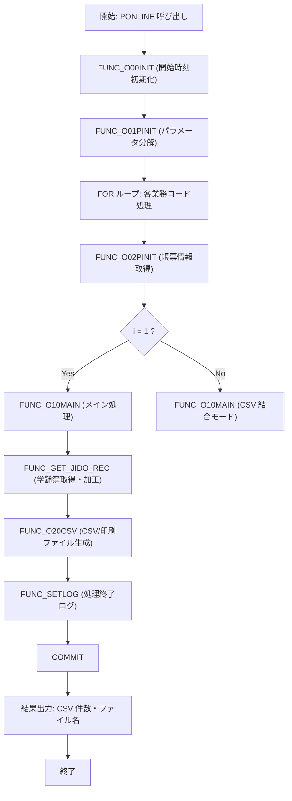

# GKBPA00050（就学時健康診断結果通知書即時）

## 1. 目的
就学時健康診断結果通知書（EMF／PDF）を作成し、CSV と印刷ファイルを出力するバッチ処理パッケージ。  
**注意**: コードに業務シナリオの詳細コメントは無く、上記はパッケージ名・機能概要からの推測です。

## 2. 核心フィールド
| フィールド | 型 | 説明 |
|------------|----|------|
| `c_ONLINE` | PLS_INTEGER | オンライン処理区分（定数 1） |
| `c_OK` | PLS_INTEGER | 正常終了コード（0） |
| `c_ERR` | PLS_INTEGER | 異常終了コード（-1） |
| `c_EMF` | PLS_INTEGER | 印刷ファイル区分 EMF（1） |
| `c_PDF` | PLS_INTEGER | 印刷ファイル区分 PDF（2） |
| `c_EMFANDPDF` | PLS_INTEGER | 印刷ファイル区分 EMF+PDF（3） |
| `g_nJOBNUM` | NUMBER | ジョブ番号 |
| `g_sTANTOCODE` | CHAR(12) | 担当者コード |
| `g_sWSNUM` | NVARCHAR2(63) | 端末番号 |
| `g_sRECUPDKBNCODE` | CHAR(2) | 更新処理区分コード |
| `g_sBUNSHONUMLIST` | NVARCHAR2(1000) | 文書番号リスト |
| `g_sMESSAGE` | NVARCHAR2(4000) | メッセージ返却用 |
| `g_rOPRT` | KKATOPRT%ROWTYPE | オンラインジョブステップ情報 |
| `g_sCSV_RCNT` | NVARCHAR2(1000) | CSV 出力件数 |
| `g_sCSVFILENAME` | NVARCHAR2(1000) | CSV ファイル名 |
| `g_sPRTFILENAME` | NVARCHAR2(1000) | 印刷ファイル名 |
| `g_sSTARTDATE` | NVARCHAR2(23) | 処理開始時刻 |
| `g_sNKOJIN_NO` | NUMBER | 個人番号 |
| `g_sNRIREKI_RENBAN` | NUMBER | 履歴連番 |
| `g_nCHOHYO_KBN` | NUMBER | 帳票区分 |
| `g_sNHASSO_BI` | NUMBER | 発送日 |
| `g_sNIINKAI` | NUMBER | 教育委員会連番 |
| `g_sBUNSHOLIST` | NVARCHAR2(1000) | 文書番号リスト |
| `g_nSHIENSOCHIKBN` | NUMBER | 支援措置対象住所非表示フラグ |
| `g_nHAKKOSU` | NUMBER | 発行部数 |
| `c_ISUCCESS` | PLS_INTEGER | 正常結果定数（0） |
| `c_INOT_SUCCESS` | PLS_INTEGER | 異常結果定数（-1） |
| `c_CHOHYO_KBN` | NUMBER(2) | 帳票区分（5＝健康診断通知書） |
| `I_RTN` | PLS_INTEGER | 戻り値格納変数 |
| `VKIJUNBI` | PLS_INTEGER | 年齢計算基準日 |
| `BRTN` | BOOLEAN | サブルーチン戻り値 |
| `ISAKUSEIBI` | PLS_INTEGER | 基準日（数値） |
| `HASSO_BI` | PLS_INTEGER | 発送日（数値） |
| `NNENDO` | PLS_INTEGER | 年度 |
| `VHYOUJINENDO` | NVARCHAR2(30) | 年度文字列 |
| `g_nRTN` | NUMBER | 外部制御関数戻り値 |
| `nGKBPA00050_INDEX` | NUMBER | 制御パラメータインデックス |
| `nGKBPA00050_CTL` | NUMBER | 制御フラグ |
| `o_sJIDO_SHIMEI_KANA` … `o_sHOGOSHA_SEINENGAPI` | NVARCHAR2(1000) | 氏名・生年月日等の一時格納変数 |
| `o_ACONSPRM` | A_CONS_PRM | 制御パラメータ配列 |
| `o_LENGTH` | NUMBER | 配列長カウンタ |
| `USER_MEI` … `VTANTO_TEL_NAISEN` | NVARCHAR2 | 教育委員会情報等 |
| `g_nRTN` | NUMBER | 制御関数戻り値 |

## 3. 主なメソッド
| メソッド | 種別 | 返値 | 説明 |
|----------|------|------|------|
| `FUNC_SETLOG` | 関数 | BOOLEAN | ログ出力（KKBPK5551.FSETOLOG） |
| `FUNC_O00INIT` | 関数 | BOOLEAN | 開始時刻初期化 |
| `FUNC_O01PINIT` | 関数 | BOOLEAN | パラメータ文字列を CSV に分解し、グローバル変数へ展開 |
| `FUNC_O02PINIT` | 関数 | BOOLEAN | 帳票区分・帳票 ID 取得 |
| `FUNC_O20CSV` | 関数 | BOOLEAN | CSV と印刷ファイル（EMF/PDF）生成 |
| `GET_EQRENRAKUSAKI` | 関数 | VARCHAR2 | 教育委員会連絡先取得 |
| `PROC_GET_YMD` | 手続き | - | 日付 → 和暦/西暦文字列変換 |
| `PROC_GET_YMD1` | 手続き | - | 年齢計算用日付変換 |
| `FUNC_PRMFLGSET` | 関数 | NUMBER | 本名使用制御フラグ設定 |
| `FUNC_GET_JIDO_REC` | 関数 | NUMBER | 学齢簿レコード取得・加工ロジック（カーソル使用） |
| `FUNC_O10MAIN` | 関数 | BOOLEAN | メインビジネスロジック（CSV 作成 → 帳票出力） |
| `PONLINE` | 手続き | - | エントリーポイント（バッチ実行） |

## 4. 依存関係
| 依存パッケージ / テーブル | 用途 |
|---------------------------|------|
| `KKBPK5551` | ログ出力、CSV 出力、分割文字列、文書番号取得 |
| `KKAPK0030` | 制御パラメータ取得 |
| `KKAPK0020` | 日付変換・年齢計算 |
| `GAAPK0030` | 住所・教育委員会情報取得 |
| `GKBFKHMCTRL` | 本名使用制御ロジック |
| `GKBPK00010` | 公印ファイル名取得 |
| `GKBTGAKUREIBO`、`GKBTTSUCHISHOKANRI`、`GKBTZOKUGARA`、`GKBTTSUCHISHOKANRI` | 学齢簿・通知書管理テーブル |
| `GABTATENAKIHON`、`GABTSOFUSAKI` | 住所・保護者情報 |
| `GKBTSHIMEIJKN` | 氏名印字制御情報 |
| `GKBWL060R001` | 出力先テーブル（CSV/印刷データ） |
| `GKBPK00010` | 公印パス取得 |
| `KKAPK0010` | 郵便番号変換・全角化 |
| `GAAPK0010` | 住所編集 |
| `GKBPK00010` | 教育委員会連絡先取得 |

## 5. ビジネスフロー

### フロー説明（コードに基づく要点）

1. **エントリーポイント** `PONLINE` が呼び出され、ジョブ番号・端末情報を初期化。  
2. `FUNC_O00INIT` で開始時刻を取得し、`FUNC_O01PINIT` が入力パラメータ文字列を CSV に分解し、グローバル変数へ展開。  
3. 業務コードリストを走査し、`FUNC_O02PINIT` で帳票区分・帳票 ID を取得。  
4. 1 件目は `FUNC_O10MAIN`（通常モード）を、2 件目以降は `FUNC_O10MAIN`（CSV 結合モード）を実行。  
5. `FUNC_O10MAIN` は基準日設定、`FUNC_GET_JIDO_REC` による学齢簿レコード取得・加工、`FUNC_O20CSV` による CSV と印刷ファイル（EMF/PDF）生成を行う。  
6. 各ステップで `FUNC_SETLOG` がログを出力し、例外は `WHEN OTHERS` で捕捉しエラーログを記録。  
7. 正常終了時に `COMMIT`、結果（CSV 件数・ファイル名）を呼び出し元へ返す。

## 6. 例外処理
- 各関数は `WHEN OTHERS THEN` で例外捕捉し、`FUNC_SETLOG` にエラーログを書き込み、`FALSE` を返す。  
- `FUNC_GET_JIDO_REC`、`PONLINE` でも `NO_DATA_FOUND` を正常終了として扱い、その他例外は `c_INOT_SUCCESS` を返す。  

## 7. 設計特徴
- **動的 SQL**: `FUNC_O20CSV` で `EXECUTE IMMEDIATE` により件数取得クエリを組み立て。  
- **カーソル利用**: `GAKUREIBO` カーソルで学齢簿レコードを逐次取得し、ループ内で加工。  
- **バッチ制御**: 定数 `c_ONLINE`、`c_OK`、`c_ERR` によるジョブステータス管理。  
- **ログ統合**: `KKBPK5551.FSETOLOG` を統一的に呼び出し、ステップ名・デバッグフラグ・ステータスを記録。  
- **制御フラグ**: `FUNC_PRMFLGSET`・`GKBFKHMCTRL` による本名使用・印字制御ロジック。  
- **複数出力形式**: CSV と EMF/PDF の同時出力（`c_EMFANDPDF`）をサポート。  

## 8. 依存テーブル（主なもの）
| テーブル | 用途 |
|----------|------|
| `GKBTGAKUREIBO` | 学齢簿データ |
| `GKBTTSUCHISHOKANRI` | 通知書管理 |
| `GKBTZOKUGARA` | 続柄情報 |
| `GABTATENAKIHON`、`GABTSOFUSAKI` | 住所・保護者情報 |
| `GKBTSHIMEIJKN` | 氏名印字制御 |
| `GKBWL060R001` | CSV/印刷データ格納テーブル |

---