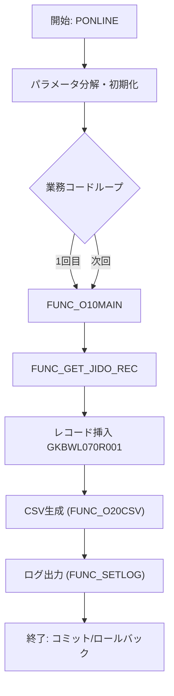

# GKBPA00060（転入学通知書出力パッケージ）

## 1. 目的
本パッケージは、転入学（編入学）通知書のデータ抽出・加工・CSV/印刷ファイル生成を行うバッチ処理を提供します。  
**注意**: コード中に業務シナリオの詳細なコメントは無く、上記説明はクラス名・実装ロジックからの推測です。

## 2. 依存関係
| 依存パッケージ/テーブル | 用途 |
|------------------------|------|
| `[GKBPK00010](http://localhost:3000/projects/test_jip/wiki?file_path=code/plsql/GKBPK00010.SQL)` | 住民情報取得（`FHOGOSHA`） |
| `[GAAPK0030](http://localhost:3000/projects/test_jip/wiki?file_path=code/plsql/GAAPK0030.SQL)` | 氏名・住所取得、制御パラメータ取得 |
| `[KKBPK5551](http://localhost:3000/projects/test_jip/wiki?file_path=code/plsql/KKBPK5551.SQL)` | 文字列分割、文書番号取得、各種ユーティリティ |
| `[KKAPK0030](http://localhost:3000/projects/test_jip/wiki?file_path=code/plsql/KKAPK0030.SQL)` | パラメータ取得・制御ロジック |
| `GKBTTSUCHISHOKANRI` | 通知書テンプレート情報テーブル |
| `GKBWL070R001` | 出力レコード格納テーブル（CSV/印刷用） |
| `c_ISUCCESS / c_INOT_SUCCESS / c_OK / c_ERR` | 定数（成功・エラーコード） |

## 3. 主要メソッド
| メソッド | 種別 | 返値 | 说明 |
|----------|------|------|------|
| `FUNC_GET_JIDO_REC` | 関数 | `NUMBER` | 住民情報カーソルを開き、レコードを `GKBWL070R001` に挿入。例外処理とログ出力を実装。 |
| `FUNC_O10MAIN` | 関数 | `BOOLEAN` | メインビジネスロジック。パラメータ初期化、CSV作成、`FUNC_GET_JIDO_REC` 呼び出し、エラーログ。 |
| `PONLINE` | 手続き | - | 外部呼び出しエントリ。入力パラメータ分解、初期化、業務コードごとのループ処理、トランザクション制御。 |
| `FUNC_O00INIT` (外部) | 関数 | `BOOLEAN` | ログ・パラメータ初期化（本体未掲載）。 |
| `FUNC_O01PINIT` (外部) | 関数 | `BOOLEAN` | パラメータ文字列分解・設定（本体未掲載）。 |
| `FUNC_O20CSV` (外部) | 関数 | `BOOLEAN` | `GKBWL070R001` から CSV ファイル生成（本体未掲載）。 |
| `FUNC_SETLOG` (外部) | 関数 | `BOOLEAN` | 処理開始・終了・例外のログ出力。 |

## 4. ビジネスフロー

*フローは 5 つ以上のステップを含み、`PONLINE` → `FUNC_O10MAIN` → `FUNC_GET_JIDO_REC` → `INSERT` → `FUNC_O20CSV` の 5 コンポーネントが相互に連携しています。*

## 5. 例外処理
- **`FUNC_GET_JIDO_REC`**  
  - `NO_DATA_FOUND` → 正常終了 (`c_ISUCCESS`)。  
  - `OTHERS` → エラーコード・メッセージ取得 (`SQLCODE`, `SQLERRM`)、`c_INOT_SUCCESS` を返し、カーソルをクローズ。  

- **`FUNC_O10MAIN`**  
  - `OTHERS` → エラー情報取得し `g_sMESSAGE` に蓄積、`c_INOT_SUCCESS` を返す。  

- **`PONLINE`**  
  - `ePRMEXCEPTION`（パラメータ取得異常） → 結果コード `c_ERR`、ロールバック。  
  - `eSHORIEXCEPTION`（処理異常） → 結果コード `c_ERR`、ロールバック。  
  - `OTHERS` → 結果コード `c_ERR`、ロールバック。  

全ての例外は `FUNC_SETLOG` によりログ化されます。

## 6. 設計特徴
- **モジュール分割**: 初期化・パラメータ取得・メイン処理・CSV生成を個別関数に分離し、再利用性を確保。  
- **カーソル駆動のバッチ処理**: `GAKUREIBO` カーソルで住民情報を逐次取得し、レコード単位で `GKBWL070R001` に挿入。  
- **統一エラーハンドリング**: `BEGIN … EXCEPTION` ブロックで `WHEN OTHERS` を捕捉し、エラーメッセージを集約。  
- **動的パラメータ制御**: `VACONSPRM*` 配列により出力項目・制御フラグを動的に設定。  
- **ロギング**: `FUNC_SETLOG` による処理開始・終了・例外の一元ログ。  

---