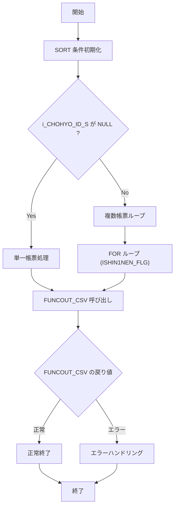

# GKBSKIDOTCH

## 1. 目的
異動通知の中間ファイル（`GKBWIDOTSUCHI`）から必要なデータを取得し、帳票種別（`i_CHOHYO_ID`）に応じた CSV ファイルを生成する手続きです。  
**注意**: コードに業務目的のコメントは無く、上記説明はクラス名・処理概要からの推測です。

## 2. コアフィールド
| パラメータ | モード | 型 | デフォルト | 説明 |
|-----------|--------|----|------------|------|
| `i_SHORI_BI` | IN | NUMBER |  | システム日付 |
| `i_SHORI_JIKAN` | IN | NUMBER |  | システム時間 |
| `i_TANMATU` | IN | VARCHAR2 |  | 端末番号 |
| `i_SHOKUIN_NO` | IN | VARCHAR2 |  | 職員個人番号 |
| `i_CHOHYO_ID` | IN | VARCHAR2 |  | 帳票 ID（例: `GKB090R001`） |
| `i_CHOHYO_ID_S` | IN | VARCHAR2 | NULL | 新 1 年生用帳票 ID（2 つの CSV を同時作成する際に使用） |
| `i_NRENBAN` | IN | NUMBER |  | ジョブ番号 |
| `i_vKOINFILENAME` | IN | VARCHAR2 |  | 認証コード名（CSV 作成時に使用） |
| `i_vKATAGAKI1` | IN | VARCHAR2 |  | 認証コード肩書 |
| `i_vSHUCHOMEI` | IN | VARCHAR2 |  | 市町村長名 |
| `i_BATCH` | IN | PLS_INTEGER | 2 | バッチ区分（デフォルト 2） |

## 3. 主な内部ロジック

| メソッド | 種別 | 戻り値 | 説明 |
|----------|------|--------|------|
| `FUNCOUT_CSV` | 関数 | BOOLEAN | 動的 SQL を組み立て、帳票種別に応じた CSV 作成関数を呼び出す。 |
| `FUNC_CREATE_CSV_004` | 関数 | BOOLEAN | `GKBWIDOTSUCHI` から取得したレコードを `GKBWL090R001` に変換し、INSERT する。 |
| `PROC_DAYEDIT` | 手続き | - | 日付文字列を整形し、全角スペース除去等の後処理を行う。 |

## 4. 依存関係
| 依存オブジェクト | 用途 |
|----------------|------|
| `GKBWIDOTSUCHI` | 異動通知の中間テーブル（SELECT 元） |
| `GKBWL090R001` | CSV 作成結果を格納するテーブル（INSERT 先） |
| `FUNC_CREATE_CSV_004`（同パッケージ内） | CSV 生成ロジック |
| `PROC_DAYEDIT`（同パッケージ内） | 日付文字列整形ユーティリティ |

## 5. ビジネスフロー

### フロー詳細
1. **SORT 条件初期化**  
   `VSORT_CLM` を空文字で初期化し、帳票種別に応じた ORDER BY 句を設定（`GKB290R002`／`GKB290R003` のみ）。
2. **帳票種別判定**  
   `i_CHOHYO_ID_S` が `NULL` なら単一帳票、そうでなければ新 1 年生用帳票を含む複数帳票を作成。
3. **単一帳票処理**  
   `FUNCOUT_CSV` を呼び出し、内部で動的 SQL を生成し `FUNC_CREATE_CSV_004`（認証コード取得版）へ委譲。
4. **複数帳票ループ**  
   `c_ISIN1NEN_FLG_NOT_SHIN1NEN`（0）から `c_ISIN1NEN_FLG_SHIN1NEN`（1）までのフラグでループし、各フラグごとに `FUNCOUT_CSV` を実行。
5. **FUNCOUT_CSV**  
   - `VSQL` に `SELECT * FROM GKBWIDOTSUCHI` を組み立て、必要に応じて `SHIN1NEN_REC_FLG` 条件を付加。  
   - `i_CHOHYO_ID` が `GKB090R001` の場合、`FUNC_CREATE_CSV_004` を呼び出す（認証コード名・肩書・市長名を引数として渡す）。  
   - 戻り値が `FALSE` の場合は例外を送出。
6. **FUNC_CREATE_CSV_004**  
   - カーソルで `VSQL` を実行し、レコードを 1 件ずつ取得。  
   - 各列を `GKBWL090R001%ROWTYPE` のフィールドへマッピング。  
   - 日付項目は `PROC_DAYEDIT` で整形。  
   - 変換後のレコードを `INSERT INTO GKBWL090R001` へ書き込む。  
   - 例外発生時は `FALSE` を返す。
7. **エラーハンドリング**  
   `FUNCOUT_CSV`／`FUNC_CREATE_CSV_004` が `FALSE` を返すか例外が捕捉された場合、`c_BERROR` を返して処理を中断。

## 6. 設計特徴
- **動的 SQL**: `FUNCOUT_CSV` で条件や並び順を動的に組み立て、汎用的な CSV 作成ロジックを実現。  
- **内部サブプログラム**: 日付整形は `PROC_DAYEDIT` に切り出し、重複ロジックを排除。  
- **バッチ処理**: `i_BATCH` パラメータによりバッチ区分を外部から指定可能。  
- **フラグ制御**: `ISHIN1NEN_FLG` で新旧区分（新1年生か否か）を切り替え、同一手続きで 2 種類の CSV を生成できる。  

---  

*このドキュメントはコードに基づいて自動生成されました。*