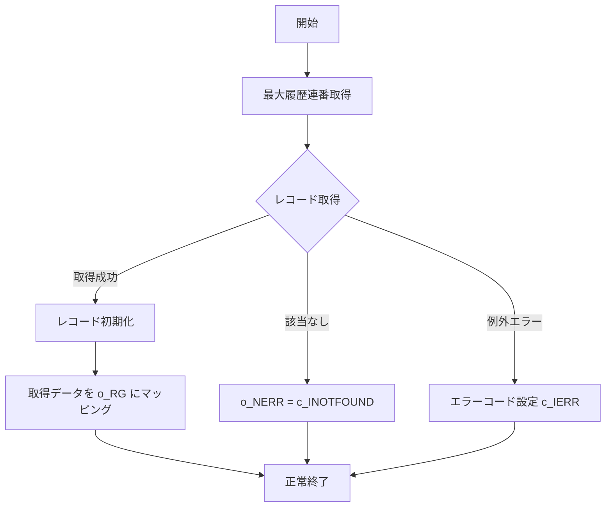

# GKBSKJDOG

## 1. 目的
`GKBSKJDOG` は、個人番号（児童番号）をキーに学齢簿（`GKBTGAKUREIBO`）のレコードを取得し、OUT パラメータ `o_RG` に返すサブプロシージャです。  
**注意**: コード中に業務目的のコメントはありませんが、コメントの「処理概要」から「個人番号をキーとして児童情報を返す」ことが目的と推測されます。

## 2. インターフェース
| パラメータ | モード | 型 | 説明 |
|------------|--------|----|------|
| `i_NKOJIN_NO` | IN | NUMBER | 児童個人番号 |
| `o_RG` | OUT | `GKBTGAKUREIBO%ROWTYPE` | 学齢簿レコード（取得結果） |
| `o_NERR` | OUT | NUMBER | 変換結果コード（0: 正常、1: 該当なし、2: その他エラー） |

## 3. 定数
| 定数 | 型 | 値 | 説明 |
|------|----|----|------|
| `c_BERROR` | BOOLEAN | FALSE | エラーフラグ（未使用） |
| `c_BNORMALEND` | BOOLEAN | TRUE | 正常終了フラグ（未使用） |
| `c_ISUCCESS` | PLS_INTEGER | 0 | 正常終了コード |
| `c_INOT_SUCCESS` | PLS_INTEGER | -1 | 異常終了コード |
| `c_IOK` | PLS_INTEGER | 0 | 正常戻り値 |
| `c_INOTFOUND` | PLS_INTEGER | 1 | 該当なしコード |
| `c_IERR` | PLS_INTEGER | 2 | その他エラーコード |

## 4. 変数
| 変数 | 型 | 用途 |
|------|----|------|
| `N_SQL_CODE` | NUMBER | SQL エラーコード取得 |
| `V_SQL_MSG` | NVARCHAR2(255) | SQL エラーメッセージ取得 |
| `I_RTN` | PLS_INTEGER | 関数 `FUNC_GET_JIDO_REC` の戻り値 |
| `IMRIREKI_RENBAN` | PLS_INTEGER | 取得対象の履歴連番（最大値） |

## 5. カーソル定義
```plsql
CURSOR CJIDO1(p_NKOJIN_NO IN NUMBER) IS
    SELECT ... FROM GKBTGAKUREIBO
    WHERE KOJIN_NO = p_NKOJIN_NO
      AND RIREKI_RENBAN = IMRIREKI_RENBAN;
```
※ SELECT 句は学齢簿の全カラムを取得し、取得対象は `KOJIN_NO` と `RIREKI_RENBAN` の組み合わせです。

## 6. 内部サブプログラム

| 種類 | 名前 | 用途 |
|------|------|------|
| 手続き | `PROC_REC_SHOKIKA` | `GKBTGAKUREIBO%ROWTYPE` の全フィールドをデフォルト値で初期化 |
| 関数 | `FUNC_GET_JIDO_REC` | カーソル `CJIDO1` を開き、取得したレコードを `o_RG` にマッピングしつつエラーハンドリングを行う |
| 手続き | メインブロック（`BEGIN … END GKBSKJDOG;`） | `FUNC_GET_JIDO_REC` を呼び出し、エラー時にレコードを再初期化 |

### 6‑1. `PROC_REC_SHOKIKA`
レコード `i_REC`（`GKBTGAKUREIBO%ROWTYPE`）の全フィールドを 0 または空文字で初期化します。大量のフィールドが対象で、レコードの再利用時に必須です。

### 6‑2. `FUNC_GET_JIDO_REC`
1. `IMRIREKI_RENBAN` に対象児童の最大履歴連番を取得  
2. カーソル `CJIDO1` を開き、レコードが存在すれば `PROC_REC_SHOKIKA` で初期化後、取得データを `i_REC` にコピー  
3. 取得成功時は `o_NERR` を `c_ISUCCESS` に設定し、`c_INOTFOUND`（該当なし）や `c_IERR`（その他エラー）を適切に設定  
4. 例外ハンドラで `NO_DATA_FOUND` と `OTHERS` を捕捉し、エラーコードを設定

### 6‑3. メインブロック
```plsql
BEGIN
    I_RTN := FUNC_GET_JIDO_REC(o_RG);
    IF I_RTN <> c_ISUCCESS OR o_NERR = c_INOTFOUND THEN
        PROC_REC_SHOKIKA(o_RG);
    END IF;
EXCEPTION
    WHEN OTHERS THEN
        o_NERR := c_IERR;
END GKBSKJDOG;
```
取得失敗または該当なしの場合にレコードを再初期化し、最終的にエラーコードを `o_NERR` に設定します。

## 7. 依存関係
| 依存対象 | 用途 |
|----------|------|
| `GKBTGAKUREIBO`（テーブル） | 学齢簿データの格納先・取得元 |
| `GKBSKJDOG`（本プロシージャ） | `[GKBSKJDOG](http://localhost:3000/projects/test_jip/wiki?file_path=code/plsql/GKBSKJDOG.SQL)` |

## 8. 処理フロー


このフローは、個人番号から学齢簿レコードを取得し、取得結果に応じて正常終了、該当なし、またはエラー処理へ分岐する流れを示しています。