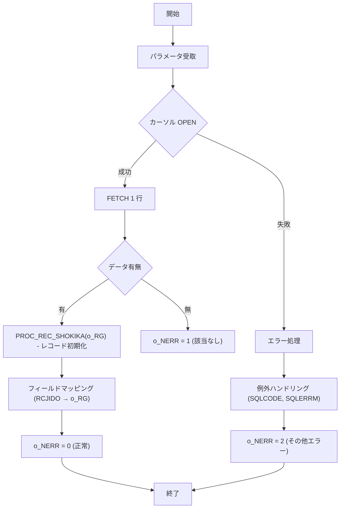

# GKBSKJDOG2

## 1. 目的
`GKBSKJDOG2` は、児童（個人）番号と履歴連番（枝番）をキーに、学齢簿テーブル **GKBTGAKUREIBO** から対象児童の詳細情報を取得し、`o_RG`（`GKBTGAKUREIBO%ROWTYPE`）に格納して返すサブルーチンです。  
取得結果は `o_NERR` にエラーコードとして出力されます。

**注意**: コード中に業務目的のコメントはありませんが、プロシージャ名・コメントから「児童情報取得サブ」という目的が推測されます。

## 2. インターフェース

| パラメータ | モード | 型 | 説明 |
|------------|--------|----|------|
| `i_NKOJIN_NO` | IN | NUMBER | 児童個人番号 |
| `i_RIREKI_RENBAN` | IN | NUMBER | 履歴連番 |
| `i_RIREKI_RENBAN_EDA` | IN | NUMBER | 児童履歴枝番（新WizLIFE 2次開発で追加） |
| `o_RG` | OUT | `GKBTGAKUREIBO%ROWTYPE` | 取得した児童情報レコード |
| `o_NERR` | OUT | NUMBER | 結果コード（0: 正常、1: 該当なし、2: その他エラー） |

## 3. 主要ロジック

### 処理フローの概要
1. **カーソル `CJIDO1` をオープン**  
   `i_NKOJIN_NO`, `i_RIREKI_RENBAN`, `i_RIREKI_RENBAN_EDA` を条件に `GKBTGAKUREIBO` から対象レコードを取得。

2. **レコード取得**  
   - 取得できなければ `o_NERR = 1`（該当なし）で終了。  
   - 取得できたら `PROC_REC_SHOKIKA` で `o_RG` を初期化。

3. **フィールドマッピング**  
   カーソルから取得した `RCJIDO` の全カラムを `o_RG` の同名フィールドへコピー。  
   （コード中に多数のカラムが列挙されている）

4. **正常終了**  
   `o_NERR = 0`（正常）を設定し、ループを抜けて終了。

5. **例外処理**  
   - `NO_DATA_FOUND` → 正常終了扱い（`o_NERR = 1`）  
   - `OTHERS` → `SQLCODE` と `SQLERRM` を取得し、`o_NERR = 2` を設定。

## 4. 依存関係

| 依存オブジェクト | 用途 |
|----------------|------|
| [`GKBTGAKUREIBO`](http://localhost:3000/projects/test_jip/wiki?file_path=code/plsql/GKBTGAKUREIBO.SQL) | 取得対象テーブル／レコード型 |
| [`PROC_REC_SHOKIKA`](#) | `o_RG` のレコード初期化（同ファイル内ローカル手続き） |
| [`FUNC_GET_JIDO_REC`](#) | 本プロシージャの内部ロジックで呼び出される関数（レコード取得ラッパー） |

## 5. 例外処理

| 例外 | 処理 |
|------|------|
| `NO_DATA_FOUND` | 正常終了として `o_NERR = 1`（該当なし）を設定 |
| `OTHERS` | `SQLCODE` と `SQLERRM` を取得し、`o_NERR = 2`（その他エラー）を設定 |

## 6. 設計特徴

- **動的 SQL なし**：静的 SELECT 文で必要カラムを全列取得。  
- **レコード初期化手続き**：`PROC_REC_SHOKIKA` により出力レコードをゼロクリアし、未設定項目のデフォルトを保証。  
- **一意レコード取得**：カーソルは 1 行だけを対象とし、取得後は即ループ抜ける設計。  
- **エラーハンドリング**：`WHEN OTHERS` で SQL エラー情報を捕捉し、呼び出し元にエラーコードを返す。  

---