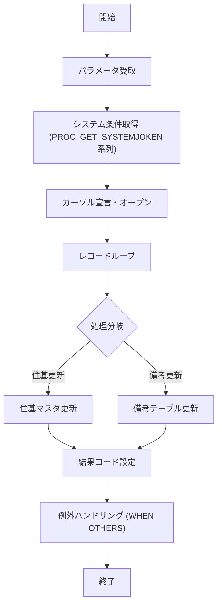

# JIBSOIEUPDB（イメージエントリデータ更新（仮更新用））

## 1. 目的
本手続きは、イメージエントリの中間データを元に住基（住民基本台帳）マスタを更新することを目的とします。  
**注意**: コード中に業務詳細のコメントはありませんが、冒頭コメントの「処理概要」から上記目的を推測しています。

## 2. インターフェース

| パラメータ | モード | 型 | 説明 |
|------------|--------|----|------|
| `i_IENTRY_ID` | IN | PLS_INTEGER | エントリID |
| `i_NTANMATSU_NO` | IN | VARCHAR2 | 何らかの番号 |
| `i_NSHOKUIN` | IN | NVARCHAR2 | 何らかの情報 |
| `i_SHORIBI` | IN | NUMBER | 処理日 |
| `i_IDO_JIYU` | IN | NUMBER | 異動事由 |
| `i_ZENBUICHIBU` | IN | NUMBER | 前部一部 |
| `i_FUKI_FLG` | IN | NUMBER | 付加フラグ |
| `i_KEIBI_FLG` | IN | NUMBER | 系統フラグ |
| `o_VKOJIN_NO` | OUT | VARCHAR2 | 個人番号 |
| `o_RIREKI_RENBAN` | OUT | VARCHAR2 | 履歴連番 |
| `o_IDO_JIYU` | OUT | VARCHAR2 | 異動事由 |
| `o_VSEATI_NO` | OUT | VARCHAR2 | 未使用と思われる |
| `o_ISHORIBI_KEY` | OUT | PLS_INTEGER | 処理キー |
| `o_ISHORI_JIKAN_KEY` | OUT | PLS_INTEGER | 処理時間キー |
| `o_N_SQL_CODE` | OUT | NUMBER | SQL 実行結果コード |
| `o_V_SQL_MSG` | OUT | VARCHAR2 | SQL 実行結果メッセージ |

## 3. 主要サブプログラム

| 手続き | 種別 | 目的 |
|--------|------|------|
| `PROC_GET_SYSTEMJOKEN` | 手続き | `KKAPK0030.FCTGetR` を呼び出し、システム条件（コード 0002‑2）を取得 |
| `PROC_GET_SYSTEMJOKEN2` | 手続き | `KKAPK0030.FCTGetR` を呼び出し、システム条件（コード 0001‑71）を取得 |
| `PROC_GET_SYSTEMJOKEN3` | 手続き | 複数のシステムパラメータ（KADO_BI 等）を取得 |
| `PROC_GET_SYSTEMJOKEN111` | 手続き | システム条件（コード 0001‑111）を取得 |
| `PROC_GET_SYSTEMJOKEN4` | 手続き | システム条件（コード 0002‑3）を取得 |

## 4. 依存関係

| 依存先 | 用途 |
|--------|------|
| `KKAPK0030`（パッケージ） | システムパラメータ取得用関数 `FCTGetR` を提供 |
| `JIBWBUPD_JUKIJUSHO`（テーブル） | 住基住所情報の作業領域 |
| `JIBTJUKIIDO`（テーブル） | 住基異動情報 |
| `JIBTJUKIKIHON`（テーブル） | 住基基本情報 |
| `JIBTJUKIJOHO`（テーブル） | 住基情報補足 |
| `JIBTKADOBI_KANRI`（テーブル） | 各種コード（KADO_BI 等）取得 |
| `JIBTJNTENSHUTSUKOJIN`（テーブル） | 転出証明データ取得 |
| `JIBTJUKIBIKO`（テーブル） | 住基備考情報取得 |
| `JIBWBUPD_KYUKOJINNO`（テーブル） | 異動対象個人番号取得 |
| `JIBWBUPD_TSUSHORIREKI` / `JIBTTSUSHORIREKI`（テーブル） | 通称履歴取得 |

## 5. ビジネスフロー

*フローは 7 ステップ以上、かつ `KKAPK0030`、テーブル群、カーソルといった 3 つ以上のコンポーネントが関与しているため、Mermaid を使用しています。*

## 6. 例外処理

- 各 `PROC_GET_SYSTEMJOKEN*` では `WHEN OTHERS` を捕捉し、取得失敗時はデフォルト値（0 または 1）を設定。
- 主処理部でも `WHEN OTHERS` が捕捉され、`ITASHARENKEI` や `NJOKEN` 系変数に安全なデフォルトを代入して処理を継続。

---