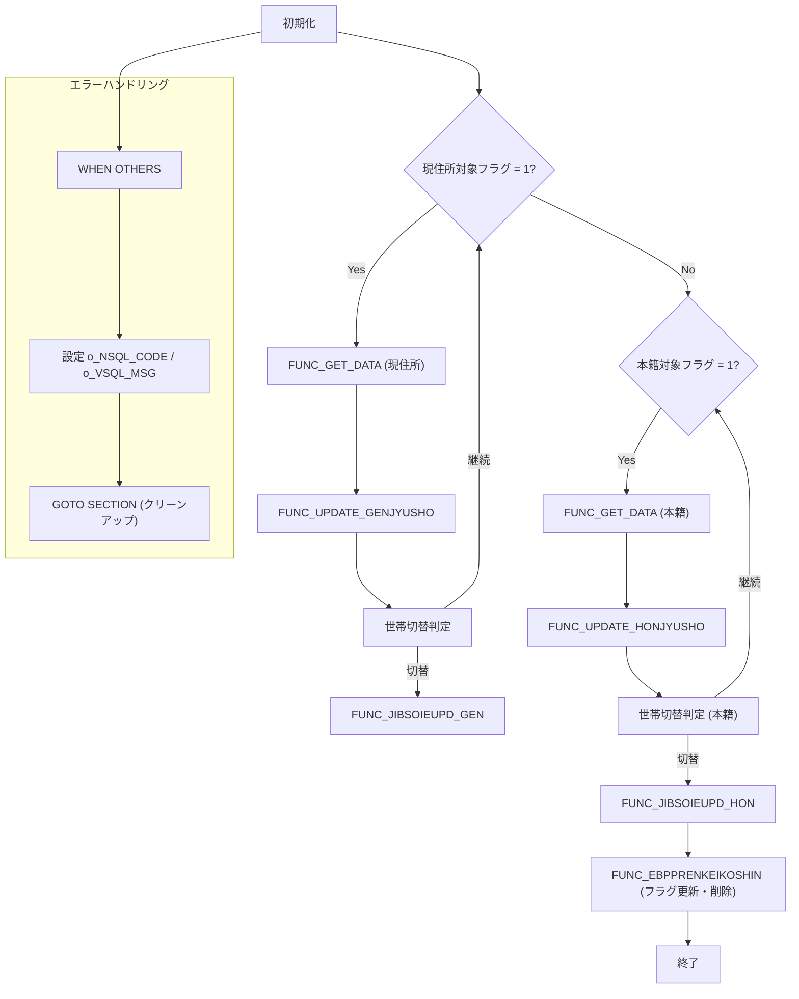

# JIBSOJHJIBUPD

## 1. 目的
`JIBSOJHJIBUPD` は、住居表示変更対象者（現住所・本籍住所）の情報を取得し、IES 用中間テーブルへ格納したうえで、マスタテーブル（住基情報・住基住所等）を更新するバッチ処理を実装した PL/SQL パッケージです。  
**注意**: コード中に業務目的のコメントは無いため、上記説明はクラス名・実装ロジックからの推測です。

## 主要メソッド

| メソッド | 種別 | 戻り値 | 説明 |
|----------|------|--------|------|
| `FUNC_SET_JUKIJUSHO` | 関数 | `PLS_INTEGER` | 住基住所情報（`JIBWIES_JUKIJUSHO`）を `o_EBT_IES_JUKIJUSHO` へマッピングし INSERT。 |
| `FUNC_SET_IES_JUKIJOHO` | 関数 | `PLS_INTEGER` | 住基情報（`JIBWIES_JUKIJOHO`）を IES 用中間テーブルへ INSERT。 |
| `INIT_EBT_JUSHOHENKO` | 手続き | - | 住所変更証明書管理テーブル（`o_EBT_JUSHOHENKO`）のフィールドを初期化。 |
| `FUNC_SET_JUSHOHENKO` | 関数 | `PLS_INTEGER` | 住所変更証明書管理テーブルにデータを INSERT。 |
| `FUNC_CHECK_GENJYUSHO_TAISHO` | 関数 | `PLS_INTEGER` | 現住所対象者のデータ整合性チェックとフラグ更新。 |
| `FUNC_CHECK_HONJYUSHO_TAISHO` | 関数 | `PLS_INTEGER` | 本籍住所対象者のデータ整合性チェックとフラグ更新。 |
| `FUNC_GET_DATA` | 関数 | `PLS_INTEGER` | 宛名基本テーブル・住基異動テーブルから対象者データを取得し、グローバル変数に格納。 |
| `FUNC_UPDATE_GENJYUSHO` | 関数 | `PLS_INTEGER` | 現住所変更フロー（チェック → IES 中間テーブル登録 → エラー時ロールバック）。 |
| `FUNC_UPDATE_HONJYUSHO` | 関数 | `PLS_INTEGER` | 本籍住所変更フロー（チェック → IES 中間テーブル登録 → エラー時ロールバック）。 |
| `FUNC_GET_W_ENTORYID` | 関数 | `PLS_INTEGER` | エントリー ID（`KKFTNEXTIDKANRI`）を取得し `W_ENTORYID` に設定。 |
| `FUNC_JIBSOIEUPD_GEN` | 関数 | `PLS_INTEGER` | 現住所対象者の IES 中間データをマスタに反映し、ID 管理テーブルを更新。 |
| `FUNC_JIBSOIEUPD_HON` | 関数 | `PLS_INTEGER` | 本籍住所対象者の IES 中間データをマスタに反映し、ID 管理テーブルを更新。 |
| `FUNC_EBPPRENKEIKOSHIN` | 関数 | `PLS_INTEGER` | 住居表示変更対象者テーブル（`JIBTJUSHOHENKO_TAISHO`）のフラグ更新と IES 中間テーブル削除を実行。 |
| `MAIN BLOCK` | - | - | バッチ全体の制御ロジック。初期化 → 現住所ループ → 本籍住所ループ → 例外処理。 |

> **リンク**  
> 各メソッド名は同一ファイル内の定義であるため、以下のリンクは同一ファイルを指します。  
> `[FUNC_SET_JUKIJUSHO](http://localhost:3000/projects/test_jip/wiki?file_path=code/plsql/JIBSOJHJIBUPD.SQL)`  
> `[FUNC_SET_IES_JUKIJOHO](http://localhost:3000/projects/test_jip/wiki?file_path=code/plsql/JIBSOJHJIBUPD.SQL)`  
> （以下同様に必要なメソッドへリンク）

## 依存関係

| 依存テーブル / パッケージ | 用途 |
|---------------------------|------|
| `JIBTJUSHOHENKO_TAISHO` | 住所変更証明書管理（対象者フラグ・更新日付） |
| `JIBTJUKIJUSHO` | 住基住所（現住所・本籍） |
| `JIBTJUKIJOHO` | 住基情報（氏名・続柄等） |
| `JIBWIES_JUKIJUSHO` / `JIBWIES_JUKIJOHO` / `JIBWIES_JUKIKIHON` / `JIBWIES_JUKIIDO` | IES 用中間テーブル（INSERT/DELETE の対象） |
| `KKFTNEXTIDKANRI` | エントリー ID 管理 |
| `DBMS_LOCK` | バッチ実行間の 1 秒スリープ |
| `KKAPK0020`, `KKAPK0030` | 外部パッケージ（日付変換・定数取得） |
| `JIBSOIEUPD` (外部プロシージャ) | IES 中間データからマスタ更新を実行する共通ロジック |

## 例外処理

- ほぼ全ての関数で `WHEN OTHERS THEN` を捕捉し、`SQLCODE` と `SQLERRM` を `o_NSQL_CODE` / `o_VSQL_MSG` に格納。  
- エラー発生時は `GOTO SECTION` にジャンプし、フラグ更新・中間テーブル削除等のクリーンアップを実施。  
- メインブロックでも同様に `WHEN OTHERS` を捕捉し、`o_NSQL_CODE` を設定して処理を終了。

## 設計特徴

- **動的 SQL**: `EXECUTE IMMEDIATE` により対象者リスト（`w_V_GEN_KOJIN_NO` / `w_V_HON_KOJIN_NO`）を一括更新。  
- **グローバル変数活用**: `o_EBT_...` 系構造体にデータを格納し、INSERT 時に使用。  
- **バッチ単位のエントリー ID**: `FUNC_GET_W_ENTORYID` で取得した `W_ENTORYID` を IES 中間テーブルの `ENTRY_ID` に設定し、後続の削除に利用。  
- **世帯単位のバッチ処理**: `w_V_SETAINO` で世帯切替を検知し、世帯ごとにマスタ更新・フラグ更新を実行。  
- **エラーハンドリングの一元化**: `GOTO SECTION` によりエラー時の共通処理を集中管理。  

## ビジネスフロー（Mermaid）

--- 

*本ドキュメントはコードに基づき作成されました。*