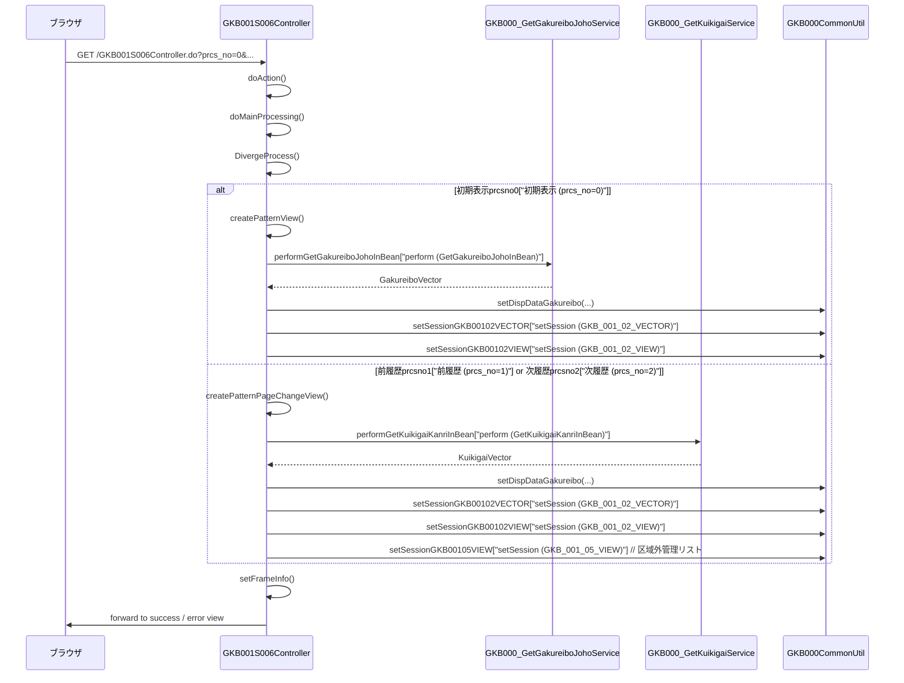

# GKB001S006Controller

## 1. 目的
`GKB001S006Controller` は学齢簿表示を行う Web 層の **Controller** クラスです。  
HTTP リクエストを受け取り、画面遷移や学齢簿データの取得・加工・セッション格納を統括します。

## 2. 主要メソッド

| メソッド | 戻り値 | 説明 |
|----------|--------|------|
| `doAction(ActionForm, HttpServletRequest, HttpServletResponse, ModelAndView)` | `ModelAndView` | エントリーポイント。`REQUEST_MAPPING_PATH.do` にマッピングされ、`execute` に委譲して処理を開始します。 |
| `doMainProcessing(ActionMapping, ActionForm, HttpServletRequest, HttpServletResponse, ModelAndView)` | `ModelAndView` | メインプロセス。`DivergeProcess` で処理分岐し、結果に応じてフレーム情報を設定して遷移先を決定します。 |
| `DivergeProcess(ActionForm, HttpServletRequest)` | `String` | 処理番号 (`prcs_no`) に基づき **初期表示 / 前履歴 / 次履歴** を振り分け、対応する画面生成メソッドを呼び出します。 |
| `createPatternView(ActionForm, HttpServletRequest)` | `String` | 初期表示用に学齢簿を取得し、表示用オブジェクトを作成してセッションに格納します。 |
| `createPatternPageChangeView(ActionForm, HttpServletRequest, int)` | `String` | 前・次履歴ボタンでページ切替時に呼び出され、指定ページの学齢簿を取得・加工してセッションに格納します。 |
| `getArrayGakureibo(HttpServletRequest, long, int)` | `Vector` | 学齢簿情報を **GKB000_GetGakureiboJohoService** から取得し、`Vector` で返します。 |
| `getNewKuikigaiKanri(HttpServletRequest, String, String)` | `KuikigaiKanriListView` | 区域外管理情報を **GKB000_GetKuikigaiService** から取得し、最新区分のデータを `KuikigaiKanriListView` に詰めて返します。 |
| `setFrameInfo(String, ActionForm, HttpServletRequest, HttpServletResponse)` | なし | 成功・失敗に応じてフレーム制御情報（戻り先・再表示先）を作成し、セッションに格納します。 |
| `setError(HttpServletRequest, int)` | `String` | エラーメッセージ取得サービス **GKB000_GetMessageService** を呼び出し、`ErrorMessageForm` に設定してエラーフレームへ遷移させます。 |

## 3. 依存関係

| 依存クラス | 種類 | 用途 |
|------------|------|------|
| `GKB000_GetGakureiboJohoService` | Service | 学齢簿情報取得サービス。`getArrayGakureibo` で使用。 |
| `GKB000_GetMessageService` | Service | エラーメッセージ取得サービス。`setError` で使用。 |
| `GKB000_GetKuikigaiService` | Service | 区域外管理情報取得サービス。`getNewKuikigaiKanri` で使用。 |
| `GKB000CommonUtil` | Util | セッション操作・共通処理ユーティリティ。多数メソッドで使用。 |
| `KKA000CommonUtil` | Util | 和暦⇔西暦変換ユーティリティ。日付変換で使用。 |
| `BaseSessionSyncController` | 親クラス | セッション同期機能を提供する基底コントローラ。 |
| `ActionForm` / `ActionMapping` | Framework | Spring MVC のリクエスト/レスポンスラッパー。 |
| `ResultFrameInfo` | Framework | フレーム制御情報オブジェクト。 |
| `ScreenHistory` | Framework | 画面遷移履歴管理ヘルパー。 |
| `GakureiboSyokaiForm` | Form | 学齢簿画面の入力/出力データ保持。 |
| `GakureiboSyokaiView` | View | 学齢簿表示用データオブジェクト。 |
| `KuikigaiKanriListView` | View | 区域外管理表示用データオブジェクト。 |
| `MessageNo` | DTO | エラーメッセージ番号ラップクラス。 |
| `ErrorMessageForm` | Form | エラーメッセージ一覧保持フォーム。 |
| `CasConstants` | Const | フレーム情報格納キー定数。 |
| `KyoikuConstants` / `KyoikuMsgConstants` | Const | 画面遷移・エラーメッセージ定数。 |
| `CommonGakureiboSyokai` | Helper | 学齢簿共通処理ヘルパークラス。 |

## 4. ビジネスフロー

**フロー概要**  
1. ブラウザからリクエストが届くと `doAction` が呼び出され、`doMainProcessing` に委譲。  
2. `DivergeProcess` が `prcs_no` を判定し、初期表示・前履歴・次履歴のいずれかの処理へ分岐。  
3. 学齢簿取得サービス (`GKB000_GetGakureiboJohoService`) からデータを取得し、`GKB000CommonUtil` が表示用オブジェクトへ変換・セッション格納。  
4. 履歴ページ変更時は区域外管理取得サービス (`GKB000_GetKuikigaiService`) も呼び出し、追加情報をセッションに格納。  
5. `setFrameInfo` が成功・失敗に応じたフレーム制御情報（戻り先・再表示先）を作成し、セッションに保存。  
6. 最終的に画面遷移（成功 or エラー）へフォワードして処理完了。

## 5. 例外処理

| メソッド | 例外シナリオ | 対応 |
|----------|--------------|------|
| `setError` | `GKB000_GetMessageService.perform` が例外 | 例外を捕捉しスタックトレースを出力。`ErrorMessageForm` にエラーメッセージを設定し、`CS_FORWARD_ERROR` を返す。 |
| `getArrayGakureibo` | サービス呼び出しで例外 | 例外を捕捉し `printStackTrace`。空の `Vector` を返すことで呼び出し側でエラーハンドリング。 |
| `getNewKuikigaiKanri` | サービス呼び出しで例外 | 同上。例外捕捉後、空の `KuikigaiKanriListView` を返す。 |
| `doMainProcessing` / `DivergeProcess` | セッションタイムアウト (`gkb000CommonUtil.isTimeOut`) | `setError` を呼び出し、エラーフレームへ遷移。 |

## 6. 設計特徴

- **MVC アーキテクチャ**: `@Controller` が Web 層、`Service` がビジネスロジック、`DAO`（内部 Service が呼び出す）でデータアクセスを分離。  
- **セッション中心の状態管理**: 取得した学齢簿・区域外管理情報をセッションに格納し、画面遷移間でデータを共有。  
- **ページングロジック**: `prcs_no` と `page` パラメータで前後履歴を制御し、`Vector` のインデックス計算でページ切替を実装。  
- **エラーハンドリングの一元化**: `setError` がメッセージ取得サービスと連携し、エラーメッセージを統一フォーマットで画面に表示。  
- **フレーム制御情報**: `ResultFrameInfo` に戻り先・再表示先を設定し、画面履歴 (`ScreenHistory`) と連動させてユーザビリティを向上。