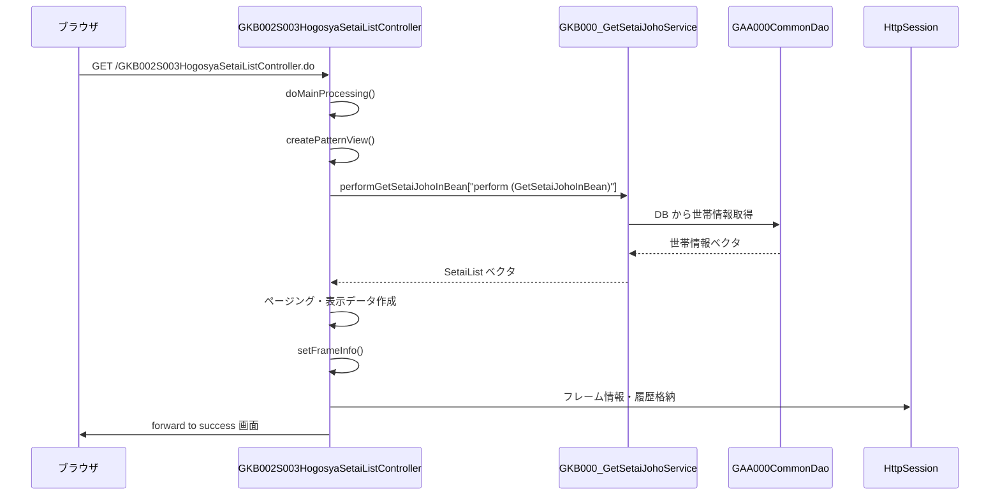

# GKB002S003HogosyaSetaiListController

## 1. 目的
`GKB002S003HogosyaSetaiListController` は保護者情報（世帯情報）を画面に表示する Web 層の Controller です。  
**注意**: コード中に業務目的のコメントはありませんが、クラス名と処理内容から「保護者情報一覧表示」を行うことが推測されます。

## 2. 主要メソッド
| メソッド | 戻り値 | 説明 |
|----------|--------|------|
| `setUpForm(HttpServletRequest)` | `ActionForm` | アクションフォームを自動初期化し、`MODELATTRIBUTE_NAME` に設定 |
| `doAction(ActionForm, HttpServletRequest, HttpServletResponse, ModelAndView)` | `ModelAndView` | エントリーポイント。`ActionMapping` を取得して `execute` を呼び出す |
| `doMainProcessing(ActionMapping, ActionForm, HttpServletRequest, HttpServletResponse, ModelAndView)` | `ModelAndView` | 画面表示のメインロジック。`createPatternView` → `setFrameInfo` → フォワード を実行 |
| `createPatternView(ActionForm, HttpServletRequest)` | `String` | エラーチェック、セッション取得、世帯情報取得、ページング、表示用データ作成、セッション格納 を行い処理結果コードを返す |
| `setDispDataSetai(SetaiList, int)` | `HogosyaListView` | 1 件の世帯情報を表示用オブジェクトに変換 |
| `getArraySetaiList(HttpServletRequest, long, String)` | `Vector` | `GKB000_GetSetaiJohoService` を呼び出し、16 歳以上の世帯情報配列を取得 |
| `errorCheck(HttpServletRequest)` | `boolean` | セッションタイムアウトや必須データ欠如をチェックし、エラー時は `setError` を呼び出す |
| `setFrameInfo(String, ActionForm, HttpServletRequest, HttpServletResponse)` | `void` | 成功/失敗に応じて `ResultFrameInfo` と画面履歴をセッションに格納 |
| `setError(HttpServletRequest, int)` | `String` | エラーメッセージ取得サービスを呼び出し、`ErrorMessageForm` に設定してエラーフォワードコードを返す |
| `getKyuJititai(int)` 〜 `getChugakoku(int, int)` | `String` | 各種コードから名称（旧自治体、地区、行政区、班、小・中学校区）を取得 |

## 3. 依存関係
| 依存クラス | 用途 |
|------------|------|
| `GKB000_GetSetaiJohoService` | 世帯情報取得サービス |
| `GKB000_GetMessageService` | エラーメッセージ取得サービス |
| `ActionMappingConfigContext` | `ActionMapping` の取得 |
| `GAA000CommonDao` | コード変換・名称取得（自治体、地区等） |
| `GKB000CommonUtil` | セッション操作・ユーティリティ |
| `KKA000CommonUtil` | 日付変換・フォーマット |
| `BaseSessionSyncController` | 画面遷移・フレーム制御の基底クラス |
| `ActionForm`、`ActionMapping`、`ModelAndView` | Spring MVC の標準コンポーネント |
| `Gakureibo`、`GakureiboSyokaiView`、`SetaiList`、`HogosyaListView`、`HogosyaListParaView` | 画面表示データオブジェクト |
| `CommonGakureiboIdo`、`CommonFunction` | ビジネスロジック補助 |
| `KyoikuConstants`、`KyoikuMsgConstants` | 定数定義 |
| `ResultFrameInfo`、`ScreenHistory` | フレーム制御・画面履歴 |
| `MessageNo`、`ErrorMessageForm` | エラーメッセージ格納 |
| `DateUtil` | 日付フォーマット |

*リンク例*（実際の Wiki パスはプロジェクト構成に合わせて調整してください）  
`[GKB002S003HogosyaSetaiListController](http://localhost:3000/projects/test_jip_1/wiki?file_path=code/java/Controller_GKB002S003HogosyaSetaiListController.java)`  
`[GKB000_GetSetaiJohoService](http://localhost:3000/projects/test_jip_1/wiki?file_path=code/java/service/GKB000_GetSetaiJohoService.java)`  
（以下同様に各依存クラスへリンク）

## 4. ビジネスフロー

**フロー概要**  
1. クライアントからコントローラへリクエストが届く。  
2. `doMainProcessing` が呼び出され、`createPatternView` が実行される。  
3. `createPatternView` はエラーチェック後、セッションから学齢簿情報を取得し、`GKB000_GetSetaiJohoService` で世帯情報を取得。  
4. 取得した世帯情報をページングし、表示用オブジェクトに変換してセッションに格納。  
5. `setFrameInfo` でフレーム制御情報と画面履歴をセッションに保存し、成功フォワードで画面を表示。

## 5. 例外処理
| メソッド | 例外シナリオ | 対応 |
|----------|--------------|------|
| `errorCheck` | セッションタイムアウト、必須データ欠如 | `setError` を呼び出しエラーフォワードへ |
| `getArraySetaiList` | DAO 呼び出し失敗、例外スロー | `catch (Exception e)` でスタックトレース出力、空リストを返す |
| `setError` | メッセージ取得サービス失敗 | `catch (Exception ex)` でスタックトレース出力し、エラーフォワードコードを返す |
| `doMainProcessing` / `doAction` | 例外スロー時は上位で捕捉され `execute` が例外処理を行う（コード上では明示されていない） |

## 6. 設計特徴
- **MVC アーキテクチャ**: `@Controller` が Web 層、サービス層 (`GKB000_GetSetaiJohoService`) がビジネスロジック、DAO がデータアクセスを担当。  
- **セッション中心の状態管理**: 画面表示に必要な学齢簿情報・世帯情報・制御情報をすべて HTTP セッションに格納し、ページ遷移間で共有。  
- **ページング制御**: 最大行数 (`CS_HOGOSYALIST_MAXROW`) を基にページ数・現在ページ・ボタン有効化を計算し、`HogosyaListParaView` に設定。  
- **ヘルパークラス活用**: `CommonGakureiboIdo`、`CommonFunction`、`GKB000CommonUtil` などが共通処理を集約。  
- **エラーハンドリングの一元化**: `errorCheck` → `setError` の流れでエラーメッセージ取得サービスを利用し、`ErrorMessageForm` に格納。  
- **依存性注入 (DI)**: `@Inject` によるサービス・DAO の注入でテスト容易性と結合度低減を実現。  
- **フレーム制御情報**: `ResultFrameInfo` と `ScreenHistory` を用いて「戻る」・「再表示」リンクを動的に生成。