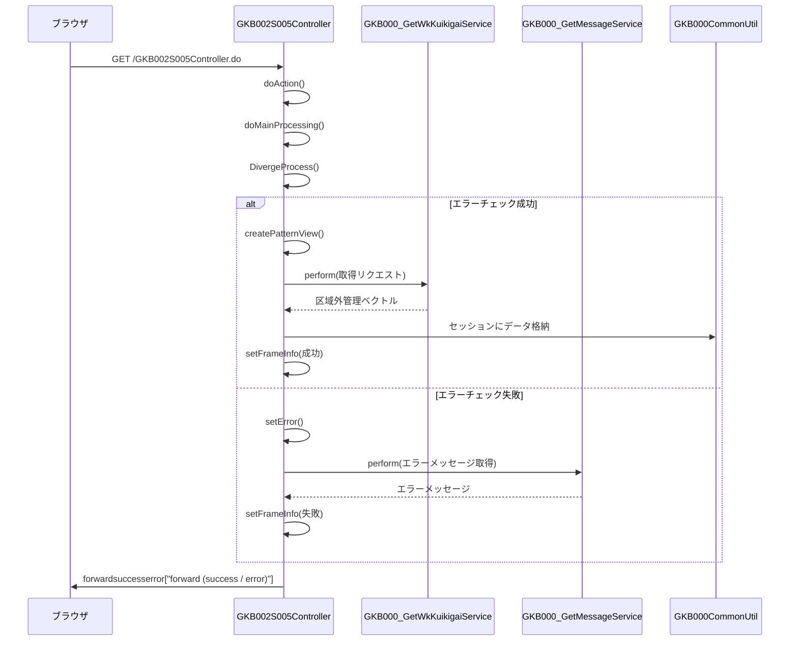

# GKB002S005Controller

## 1. 目的
`GKB002S005Controller` は **就学履歴画面** の表示・制御を行う Web 層の Controller です。  
画面遷移、セッション情報の保持、エラーハンドリング、サービス層への委譲を担当します。  

**注意**: コード中に業務目的のコメントはありません。上記の説明はクラス名・実装内容からの推測です。

## 2. 主要メソッド
| メソッド | 戻り値 | 説明 |
|----------|--------|------|
| `doAction` | `ModelAndView` | エントリーポイント。`REQUEST_MAPPING_PATH.do` にマッピングされ、`execute` メソッドへ委譲。 |
| `doMainProcessing` | `ModelAndView` | メイン処理。`DivergeProcess` で分岐し、`setFrameInfo` でフレーム情報を設定後、遷移先を返す。 |
| `DivergeProcess` | `String` | 画面モード（表示・追加・修正・削除）に応じて処理を分岐。エラーチェック後、`createPatternView` で画面データを生成。 |
| `createPatternView` | `String` | 学齢簿・就学履歴情報を取得し、セッションに格納。表示件数が 10 件を超える場合は 10 件に切り詰めて格納。 |
| `getKuikigaiKanri` | `Vector` | 区域外管理情報をサービス層 (`GKB000_GetWkKuikigaiService`) から取得し、表示用ヘルパークラスに変換。 |
| `errorCheck` | `boolean` | セッションタイムアウト、必須データ欠損、モード不正などをチェックし、エラー時は `setError` を呼び出す。 |
| `setFrameInfo` | なし | 成功・失敗に応じてフレーム制御情報（戻り先・再表示先）を `ResultFrameInfo` に設定し、セッションへ保存。 |
| `setError` | `String` | エラーメッセージ取得サービス (`GKB000_GetMessageService`) を呼び出し、`ErrorMessageForm` に格納してエラーフォワードを返す。 |

## 3. 依存関係
| 依存クラス | 用途 |
|------------|------|
| [`GKB000_GetWkKuikigaiService`](http://localhost:3000/projects/test_jip_1/wiki?file_path=code/java/jp/co/jip/gkb000/service/gkb000/GKB000_GetWkKuikigaiService.java) | 区域外管理情報取得（就学履歴データ取得） |
| [`GKB000_GetMessageService`](http://localhost:3000/projects/test_jip_1/wiki?file_path=code/java/jp/co/jip/gkb000/service/gkb000/GKB000_GetMessageService.java) | エラーメッセージ取得 |
| [`GKB000CommonUtil`](http://localhost:3000/projects/test_jip_1/wiki?file_path=code/java/jp/co/jip/gkb000/common/dao/GKB000CommonUtil.java) | セッション操作・共通ユーティリティ |
| [`KKA000CommonUtil`](http://localhost:3000/projects/test_jip_1/wiki?file_path=code/java/jp/co/jip/wizlife/fw/kka000/dao/KKA000CommonUtil.java) | 和暦変換・フォーマット |
| `BaseSessionSyncController` | 画面遷移・フレーム制御の基底クラス |
| `ActionForm` / `ActionMapping` | フレームワークのリクエスト/レスポンスラッパー |
| `ModelAndView` | Spring MVC のモデル・ビュー保持 |
| `HttpServletRequest` / `HttpServletResponse` | HTTP リクエスト・レスポンス |
| [`GKB002S005Form`](http://localhost:3000/projects/test_jip_1/wiki?file_path=code/java/jp/co/jip/gkb0000/app/gkb0020/form/GKB002S005Form.java) | 画面の入力データ・状態保持 |
| [`GakureiboSyokaiView`](http://localhost:3000/projects/test_jip_1/wiki?file_path=code/java/jp/co/jip/gkb000/common/helper/GakureiboSyokaiView.java) | 学齢簿表示情報 |
| [`KuikigaiKanriList`](http://localhost:3000/projects/test_jip_1/wiki?file_path=code/java/jp/co/jip/gkb000/common/helper/KuikigaiKanriList.java) | 区域外管理情報（ドメインオブジェクト） |
| [`KuikigaiKanriListView`](http://localhost:3000/projects/test_jip_1/wiki?file_path=code/java/jp/co/jip/gkb000/common/helper/KuikigaiKanriListView.java) | 区域外管理情報の表示ヘルパー |
| [`KuikigaiKanriListParaView`](http://localhost:3000/projects/test_jip_1/wiki?file_path=code/java/jp/co/jip/gkb000/common/helper/KuikigaiKanriListParaView.java) | 画面制御情報（ボタン有効/無効） |
| [`PageView`](http://localhost:3000/projects/test_jip_1/wiki?file_path=code/java/jp/co/jip/gkb000/app/helper/PageView.java) | ページ表示フラグ管理 |
| [`ResultFrameInfo`](http://localhost:3000/projects/test_jip_1/wiki?file_path=code/java/jp/co/jip/wizlife/fw/kka000/consts/ResultFrameInfo.java) | フレーム制御情報（戻り先・再表示先） |
| [`ScreenHistory`](http://localhost:3000/projects/test_jip_1/wiki?file_path=code/java/jp/co/jip/wizlife/fw/kka000/helper/ScreenHistory.java) | 画面遷移履歴ヘルパー |
| `MessageNo` | エラーメッセージ番号保持クラス |
| `ErrorMessageForm` | エラーメッセージ・警告メッセージ保持フォーム |

## 4. ビジネスフロー

**フロー概要**  
1. ブラウザから `GET /GKB002S005Controller.do` が呼び出され、`doAction` が `execute` に委譲。  
2. `doMainProcessing` が実行され、`DivergeProcess` で画面モードに応じた分岐処理を行う。  
3. 正常系では `createPatternView` が呼び出され、学齢簿・就学履歴情報を取得し、セッションに格納。  
4. 区域外管理情報は `GKB000_GetWkKuikigaiService` から取得し、表示用ヘルパーに変換。  
5. エラーチェックで問題があれば `setError` が呼び出され、`GKB000_GetMessageService` でエラーメッセージを取得。  
6. 最後に `setFrameInfo` が成功/失敗に応じたフレーム制御情報を設定し、画面遷移（フォワード）を実行。

## 5. 例外処理
| メソッド | 例外シナリオ | 対応 |
|----------|--------------|------|
| `errorCheck` | セッションタイムアウト | `setError` にてタイムアウトエラーメッセージを設定し、`error` フォワードへ遷移 |
| `errorCheck` | 必要セッションデータ欠損 | `setError` にて該当エラーメッセージを設定 |
| `errorCheck` | 不正な画面モード | `setError` にて「不正操作」エラーメッセージを設定 |
| `errorCheck` (更新モード) | 区域外種別未選択、開始日未入力 | `MessageNo` でエラーメッセージ番号をリスト化し、`setError` で表示 |
| `getKuikigaiKanri` | サービス呼び出し例外 | `e.printStackTrace()` のみで例外情報を標準出力（処理は継続） |
| `setError` | メッセージ取得サービス例外 | `ex.printStackTrace()` のみで例外情報を標準出力（エラーフォワードは返す） |

## 6. 設計特徴
- **MVC アーキテクチャ**: `@Controller` が Web 層、`service` がビジネスロジック層、`Util` が共通ユーティリティ層として分離。  
- **セッション中心の状態管理**: 画面表示に必要なデータ（学齢簿、就学履歴、フレーム情報）をすべて HTTP セッションに格納し、画面遷移間で共有。  
- **複数 DAO（サービス）連携**: `GKB000_GetWkKuikigaiService` から取得したベクトルをヘルパークラスに変換し、表示ロジックに利用。  
- **エラーハンドリングの一元化**: `setError` がメッセージ取得サービスを呼び出し、`ErrorMessageForm` に集約して画面へ渡す。  
- **フレーム制御情報の統一管理**: `ResultFrameInfo` に戻り先・再表示先を設定し、`CasConstants.CAS_FRAME_INFO` に保存することで、フレーム遷移を一元管理。