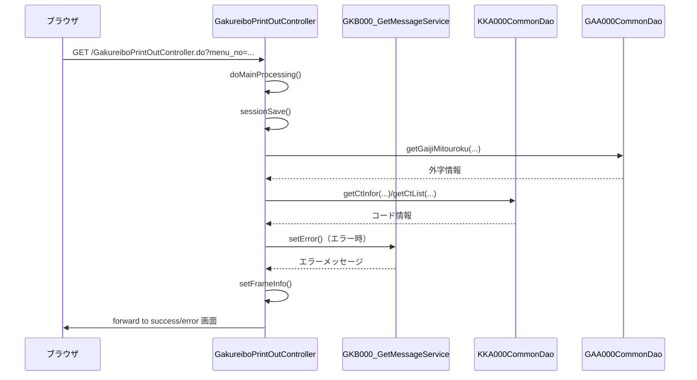

# GakureiboPrintOutController

## 1. 目的
`GakureiboPrintOutController` は帳票発行画面の表示・制御を行う **Web 層の Controller** です。  
画面遷移やセッション情報の保持、エラーハンドリング、ログ出力を行い、最終的に帳票発行画面へフォワードします。  
**注意**: コードに業務シナリオのコメントはありませんが、クラス名と実装内容から帳票発行画面を担当することが推測されます。

## 2. 主要メソッド

| メソッド | 戻り値 | 説明 |
|----------|--------|------|
| `setUpForm(HttpServletRequest)` | `ActionForm` | アクションフォームを自動初期化し、`setModelAttribute` を呼び出す。 |
| `doAction(ActionForm, HttpServletRequest, HttpServletResponse, ModelAndView)` | `ModelAndView` | エントリーポイント。`execute` に委譲して処理を開始。 |
| `doMainProcessing(ActionMapping, ActionForm, HttpServletRequest, HttpServletResponse, ModelAndView)` | `ModelAndView` | 画面表示のメインプロセス。`sessionSave` → `setFrameInfo` → フォワード を実行。 |
| `sessionSave(ActionForm, HttpServletRequest)` | `String` | 学齢簿情報を取得しセッションに格納。エラーチェック後、遷移先フラグを返す。 |
| `createLog(String, String, int, int, String, HttpServletRequest)` | `int` | 帳票発行処理のログを `KKA000CommonDao.accessLog` で記録。 |
| `errorCheck(HttpServletRequest)` | `boolean` | セッションタイムアウトや学齢簿情報欠損をチェックし、必要に応じて `setError` を呼び出す。 |
| `setFrameInfo(String, ActionForm, HttpServletRequest, HttpServletResponse)` | `void` | フレーム制御情報（戻り先・再表示先）を `ResultFrameInfo` に設定しセッションへ保存。 |
| `processDateCnv(String)` | `int` | 処理日（和暦）を西暦に変換。 |
| `setError(HttpServletRequest, int)` | `String` | エラーメッセージ取得サービスを呼び出し、`ErrorMessageForm` を作成してセッションに格納。 |

## 3. 依存関係

| 依存クラス | 種別 | 用途 |
|------------|------|------|
| `GKB000_GetMessageService` | Service | エラーメッセージ取得サービス。`setError` で使用。 |
| `KKA000CommonUtil` | Util | 和暦→西暦変換や各種共通処理に使用。 |
| `GAA000CommonDao` | DAO | 外字登録情報取得 (`getGaijiMitouroku`) に使用。 |
| `KKA000CommonDao` | DAO | 各種コード情報取得、ログ出力に使用。 |
| `GKB000CommonUtil` | Util | セッション操作・共通ユーティリティ全般。 |
| `BaseSessionSyncController` | 親クラス | セッション同期制御を提供。 |
| `ActionForm` / `ActionMapping` | フレームワーククラス | Spring MVC のリクエストマッピングに使用。 |
| `PrintOutView` | View オブジェクト | 帳票発行画面の表示情報を保持。 |
| `GakureiboSyokaiView` | View オブジェクト | 学齢簿画面情報の保持・取得に使用。 |
| `CodeHelper` | Util | 教育委員会コード情報の保持に使用。 |
| `ResultFrameInfo` | Util | フレーム制御情報（戻り先・再表示先）を保持。 |
| `ScreenHistory` | Util | 画面遷移履歴管理に使用。 |
| `MessageNo` | DTO | エラーメッセージ番号ラップに使用。 |
| `ModalDialogAction` | Util | エラーダイアログ遷移情報に使用。 |
| `CommonFunction` / `CommonGakureiboIdo` | Util | 各種共通ロジックに使用。 |

## 4. ビジネスフロー

**フロー概要**  
1. `doMainProcessing` が呼び出され、`sessionSave` で学齢簿情報取得・セッション格納。  
2. 必要に応じて `GAA000CommonDao`・`KKA000CommonDao` からコード情報や外字情報を取得。  
3. エラーが検出された場合は `GKB000_GetMessageService` を通じてメッセージ取得し、`setError` でエラーフォームを作成。  
4. `setFrameInfo` がフレーム制御情報（戻り先・再表示先）を設定し、セッションに保存。  
5. 最終的に成功またはエラー画面へフォワードして処理完了。

## 5. 例外処理

| メソッド | 例外シナリオ | 対応 |
|----------|--------------|------|
| `createLog` | `KKA000CommonDao.accessLog` が例外をスロー | 例外を捕捉し `printStackTrace`。ログ作成失敗は無視して処理を継続。 |
| `setError` | `GKB000_GetMessageService.perform` が例外 | 例外を捕捉し `printStackTrace`。エラーメッセージ取得失敗時はデフォルトのエラー遷移 (`CS_FORWARD_ERROR`) を返す。 |
| `errorCheck` | セッションタイムアウト、学齢簿情報欠損、DV 規制警告/エラー | `setError` を呼び出しエラーメッセージを設定し、`true` を返して上位でエラーフローへ遷移。 |
| `sessionSave` | `gaa000CommonDao.getGaijiMitouroku` が例外 | 例外を捕捉し空配列で代替。外字情報取得失敗はデフォルト `0` として処理を続行。 |

## 6. 設計特徴

- **MVC アーキテクチャ**: `@Controller` が Web 層、`Service` がビジネスロジック、`DAO` がデータアクセスを担当。 |
- **セッション中心の状態管理**: 学齢簿情報、帳票発行情報、教育委員会リストなどをすべて `HttpSession` に格納し、画面間で共有。 |
- **フレーム制御情報の一元管理**: `ResultFrameInfo` に戻り先・再表示先を設定し、`CasConstants.CAS_FRAME_INFO` に保存。 |
- **エラーハンドリングの統一**: `setError` でメッセージ取得サービスを利用し、`ErrorMessageForm` と `ModalDialogAction` を組み合わせて画面にエラーを表示。 |
- **ログ出力**: `createLog` で帳票発行処理の操作ログを `KKA000CommonDao.accessLog` に記録。 |
- **コードヘルパーによる動的リスト生成**: 教育委員会コードを `CodeHelper` に格納し、セッションで保持。 |
- **和暦 ↔ 西暦変換ユーティリティ**: `KKA000CommonUtil.getWareki2Seireki` を利用し、処理日を西暦に変換。 |