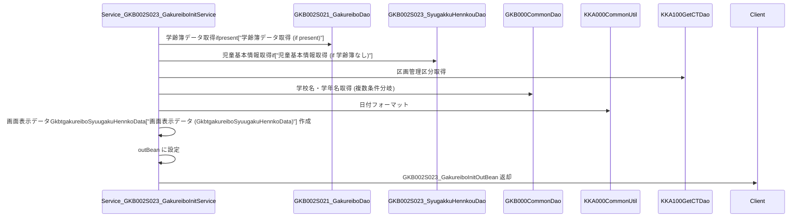

# Service_GKB002S023_GakureiboInitService

## 1. 目的
`Service_GKB002S023_GakureiboInitService` は **学年履歴就学学校変更初期処理** を行うサービスクラスです。  
学齢簿データと児童基本情報を元に、就学指定校や就学変更情報を画面表示用データ (`GkbtgakureiboSyuugakuHennkoData`) に変換し、`GKB002S023_GakureiboInitOutBean` に格納して返します。  

**注意**: コード中に業務目的のコメントはありませんが、クラス名・メソッド実装から上記の目的と推測しています。

## 2. 主要メソッド

| メソッド | 戻り値 | 説明 |
|----------|--------|------|
| `perform(GKB002S023_GakureiboInitInBean inBean)` | `GKB002S023_GakureiboInitOutBean` | 入力ビーンから学齢簿・児童基本情報を取得し、就学指定校・就学変更情報を画面用データに変換して返す。 |

## 3. 依存関係

| 依存クラス | 用途 |
|------------|------|
| `GKB002S021_GakureiboDao` | 学齢簿データ取得 DAO (`[GKB002S021_GakureiboDao](http://localhost:3000/projects/test_jip_1/wiki?file_path=code/java/GKB002S021_GakureiboDao.java)`) |
| `KKA000CommonUtil` | 日付フォーマットユーティリティ (`[KKA000CommonUtil](http://localhost:3000/projects/test_jip_1/wiki?file_path=code/java/KKA000CommonUtil.java)`) |
| `KKA000CommonDao` | 区画管理区分取得 DAO (`[KKA000CommonDao](http://localhost:3000/projects/test_jip_1/wiki?file_path=code/java/KKA000CommonDao.java)`) |
| `GKB000CommonUtil` | 学校名取得ユーティリティ (`[GKB000CommonUtil](http://localhost:3000/projects/test_jip_1/wiki?file_path=code/java/GKB000CommonUtil.java)`) |
| `GKB000CommonDao` | 学校名・学年名取得 DAO (`[GKB000CommonDao](http://localhost:3000/projects/test_jip_1/wiki?file_path=code/java/GKB000CommonDao.java)`) |
| `GKB002S023_SyugakkuHennkouDao` | 児童基本情報取得 DAO (`[GKB002S023_SyugakkuHennkouDao](http://localhost:3000/projects/test_jip_1/wiki?file_path=code/java/GKB002S023_SyugakkuHennkouDao.java)`) |
| `KKA100GetCTDao` | 区画管理区分取得 DAO (`[KKA100GetCTDao](http://localhost:3000/projects/test_jip_1/wiki?file_path=code/java/KKA100GetCTDao.java)`) |
| `GKBUtil` | 文字列操作ユーティリティ (`[GKBUtil](http://localhost:3000/projects/test_jip_1/wiki?file_path=code/java/GKBUtil.java)`) |
| `KyoikuConstants` | 定数クラス (`[KyoikuConstants](http://localhost:3000/projects/test_jip_1/wiki?file_path=code/java/KyoikuConstants.java)`) |

## 4. ビジネスフロー

**フロー概要**  
1. `perform` が呼び出され、入力ビーンから学齢簿データと児童基本情報を取得。  
2. 学齢簿が存在すれば就学指定校・就学変更情報を直接取得し、画面用データに設定。  
3. 学齢簿が無い場合は区画管理区分を取得し、`GKB002S023_SyugakkuHennkouDao` で児童基本情報を取得。取得した情報から就学指定校リストを取得し、画面用データに設定。  
4. 取得した日付情報は `KKA000CommonUtil.format` で表示用文字列に変換。  
5. すべての情報を `GKB002S023_GakureiboInitOutBean` に格納し、呼び出し元へ返却。

## 5. 設計特徴

- **セッション中心の状態管理**: 入力ビーンに保持された学齢簿・児童基本情報を基に、画面表示用データを生成し、アウトビーンで返すことで画面遷移間の状態を保持。  
- **複数 DAO の組み合わせ**: 学齢簿取得、児童基本情報取得、区画管理区分取得、学校名・学年名取得と、5 つ以上の DAO/Util が協調して処理を実行。  
- **条件分岐による柔軟なデータ取得**: 学齢簿の有無、就学指定校コードの有無、学年コードの「0」チェックなど、細かい条件分岐で取得ロジックを切り替える。  
- **日付フォーマットの一元化**: `KKA000CommonUtil.format` と `KKA000CommonUtil.getSeireki2Wareki` により、和暦変換・表示形式統一を実現。  
- **ユーティリティメソッドの活用**: `nullToZero` で Null/空文字列を安全に数値へ変換し、例外発生を防止。  

---