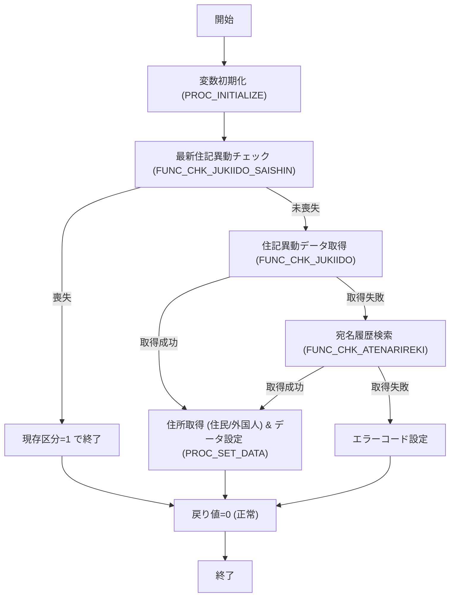

# GKBFKGZSHNT

## 1. 目的
基準日時点で対象者が現存しているかを判定し、各種属性情報（住所・氏名・性別・行政区コード等）を OUT パラメータに設定して返すサブルーチンです。  
**注意**: コード中に業務詳細のコメントはありませんが、ヘッダーコメントの「現存者判定サブルーチン」から上記の目的を推測しています。

## 2. インターフェース

| パラメータ | モード | 型 | 説明 |
|-----------|--------|----|------|
| `i_IKOJIN_NO` | IN | NUMBER | 個人番号 |
| `i_IKIJUN_BI` | IN | NUMBER | 基準日（YYYYMMDD） |
| `o_IGENZON_KBN` | OUT | PLS_INTEGER | 現存区分（0＝正常、1＝喪失） |
| `o_JINKAKU_KBN` | OUT | PLS_INTEGER | 人格区分 |
| `o_VYUBIN_NO` | OUT | NVARCHAR2(10) | 郵便番号 |
| `o_VCHOMEI` | OUT | NVARCHAR2(40) | 町名 |
| `o_VBANCHI` | OUT | NVARCHAR2(40) | 番地 |
| `o_VKATAGAKI` | OUT | NVARCHAR2(60) | 肩書 |
| `o_VSHIMEI_KANA` | OUT | NVARCHAR2(100) | 氏名（かな） |
| `o_VSHIMEI_KANJI` | OUT | NVARCHAR2(100) | 氏名（漢字） |
| `o_SEINENGAPI` | OUT | PLS_INTEGER | 生年月日 |
| `o_SEIBETSU` | OUT | PLS_INTEGER | 性別 |
| `o_IGYOSEIKU_CD` | OUT | PLS_INTEGER | 行政区コード |
| `o_VGYOSEIKU_NM` | OUT | NVARCHAR2 | 行政区名 |
| `o_ICHUGAKU_CD` | OUT | PLS_INTEGER | 中学校区コード |
| `o_VCHUGAKU_NM` | OUT | NVARCHAR2 | 中学校区名 |
| `o_ISHOGAKU_CD` | OUT | PLS_INTEGER | 小学校区コード |
| `o_VSHOGAKU_NM` | OUT | NVARCHAR2 | 小学校区名 |
| `o_VTEL_NO` | OUT | NVARCHAR2(20) | 電話番号 |
| `o_ISANTEIDANTAI_CD` | OUT | PLS_INTEGER | 算定団体コード |
| `o_VSANTEIDANTAI_NM` | OUT | NVARCHAR2 | 算定団体名 |
| `o_VCUSTOM_BC` | OUT | NVARCHAR2 | カスタムバーコード |
| **戻り値** | - | PLS_INTEGER | 0＝正常、1＝該当なし、9＝エラー |

## 3. 主なサブルーチン

| 種類 | 名前 | 用途 |
|------|------|------|
| 関数 | `FUNC_JICHINAME` | 旧自治体名称取得 |
| 手続き | `PROC_INITIALIZE` | すべてのローカル変数を初期化 |
| 手続き | `PROC_SET_DATA` | OUT パラメータへローカル変数を設定 |
| 関数 | `FUNC_CHK_JUKIIDO_SAISHIN` | 住記異動（最新）で喪失判定 |
| 関数 | `FUNC_CHK_JUKIIDO` | 住記異動データ取得 |
| 関数 | `FUNC_CHK_ATENARIREKI` | 宛名履歴検索 |
| 関数 | `FUNC_GET_GENJUSHO1` | 住民用最終住所取得 |
| 関数 | `FUNC_GET_GENJUSHO2` | 外国人用最終住所取得 |

## 4. 依存関係

| 依存先 | 用途 |
|--------|------|
| [`GAAPK0030`](http://localhost:3000/projects/test_jip_1/wiki?file_path=code/plsql/GAAPK0030.SQL) | 行政区・学校区名称取得、旧自治体名称取得 |
| [`GAAPK0010`](http://localhost:3000/projects/test_jip_1/wiki?file_path=code/plsql/GAAPK0010.SQL) | カスタムバーコード生成 |
| [`GABTJUKIIDO`](http://localhost:3000/projects/test_jip_1/wiki?file_path=code/plsql/GABTJUKIIDO.SQL) | 住記異動マスタ |
| [`GABTATENAKIHON`](http://localhost:3000/projects/test_jip_1/wiki?file_path=code/plsql/GABTATENAKIHON.SQL) | 住民基本情報 |
| [`GABTJUKIJUSHO`](http://localhost:3000/projects/test_jip_1/wiki?file_path=code/plsql/GABTJUKIJUSHO.SQL) | 住民住所情報 |
| [`GABTATENARIREKI`](http://localhost:3000/projects/test_jip_1/wiki?file_path=code/plsql/GABTATENARIREKI.SQL) | 宛名履歴テーブル |

## 5. 処理フロー

*フロー概要*  
1. 変数を初期化し、最新住記異動で喪失か判定。  
2. 喪失であれば即座に現存区分＝1 で終了。  
3. 喪失でなければ住記異動データを取得し、住所情報を再取得（住民／外国人別）。  
4. 住記異動が無い場合は宛名履歴を検索し、同様にデータを設定。  
5. いずれのパスでも最終的に戻り値コードを設定し終了。