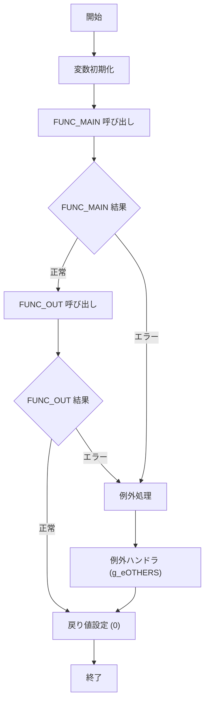

# GKBFKHMCTRL

## 1. 目的
`GKBFKHMCTRL` は、宛名番号・システム制御設定・帳票 ID などの入力情報に基づき、氏名カナ・氏名漢字・生年月日を取得し、OUT パラメータに設定して返す PL/SQL 関数です。  
**注意**: コードに業務目的のコメントはありません。上記説明はクラス名・コメントからの推測です。

## 2. インターフェース

| パラメータ | モード | 型 | 説明 |
|------------|--------|----|------|
| `i_nKOJIN_NO` | IN | NUMBER | 宛名番号 |
| `i_sCHOHYOID` | IN | NVARCHAR2 | 帳票 ID |
| `i_nHOGOSYA_KAN` | IN | NUMBER | 保護者区分 (0: 保護者制御なし、1: 保護者制御) |
| `i_nSYS_KAN` | IN | NUMBER | システム制御設定 |
| `o_sSHIMEIKANA` | OUT | NVARCHAR2 | 氏名カナ |
| `o_sSHIMEI` | OUT | NVARCHAR2 | 氏名漢字 |
| `o_sBIRTHDAY` | OUT | NVARCHAR2 | 生年月日 |
| `i_nRIREKI_RENBAN` | IN (DEFAULT 0) | NUMBER | 履歴連番（省略可） |

**戻り値**: `PLS_INTEGER` – 0: 正常、1: エラー

## 3. 主要サブルーチン

| 種類 | 名前 | 用途 |
|------|------|------|
| 関数 | `FUNC_MAIN` | 基本情報取得・変数設定のメインロジック |
| 関数 | `FUNC_OUT` | 本名使用制御設定に応じた OUT パラメータの設定 |
| 例外 | `g_eOTHERS` | 例外捕捉用ハンドラ |

## 4. 依存関係

| 依存先 | 用途 |
|--------|------|
| [`GABTATENAKIHON`](http://localhost:3000/projects/test_jip_1/wiki?file_path=code/plsql/GABTATENAKIHON.SQL) | 宛名基本テーブル（氏名・生年月日等） |
| [`GABTJUKIIDO`](http://localhost:3000/projects/test_jip_1/wiki?file_path=code/plsql/GABTJUKIIDO.SQL) | 住基異動テーブル（通称名） |
| [`GKBTGAKUREIBO`](http://localhost:3000/projects/test_jip_1/wiki?file_path=code/plsql/GKBTGAKUREIBO.SQL) | 学齢簿テーブル（通称名・保護者情報） |
| [`GKBTSHIMEIJKN`](http://localhost:3000/projects/test_jip_1/wiki?file_path=code/plsql/GKBTSHIMEIJKN.SQL) | 本名使用制御管理テーブル |
| `GKAPK00020` | 生年月日フォーマットユーティリティ |
| `KKAPK0020` | 日付変換・文字列操作ユーティリティ |
| `KKAPK0020.FDAYEDIT20` | 日付文字列編集関数 |
| `KKAPK0020.FDateFmt` | 日付フォーマット関数 |
| `KKAPK0020.FGETSEINENGHYOUJI` | 生年月日取得補助関数 |

## 5. ビジネスフロー

### フロー概要
1. **開始** – 関数エントリ。  
2. **変数初期化** – `g_nFCRTN` などのローカル変数をリセット。  
3. **FUNC_MAIN 呼び出し** – 宛名基本・住基異動・学齢簿から情報を取得し、内部変数に格納。  
4. **FUNC_OUT 呼び出し** – 本名使用制御設定 (`g_nHONMYO_KAN`) とシステム制御設定 (`i_nSYS_KAN`) に応じて、取得した情報を OUT パラメータに割り当て。  
5. **戻り値設定** – 正常終了時は `0`、エラー時は `1` を返す。  

## 6. 例外処理

| メソッド | 例外シナリオ | 対応 |
|----------|--------------|------|
| `GKBFKHMCTRL` 本体 | `WHEN OTHERS` (任意の例外) | `g_nRTN` にエラーコード (`SQLCODE`) を設定し、例外を再送出 |
| `FUNC_MAIN` | `WHEN OTHERS` | `NRTN` にエラーコードを設定 |
| `FUNC_OUT` | `WHEN OTHERS` | `NRTN` にエラーコードを設定 |

## 7. 設計特徴

- **動的 SQL**: `sSQL` 文字列を組み立てて複数テーブルを結合し、保護者区分や履歴連番に応じた条件分岐を実装。  
- **多段条件分岐**: `i_nSYS_KAN` と `g_nHONMYO_KAN` の組み合わせにより、氏名・生年月日の取得ロジックが細分化。  
- **例外一元化**: `g_eOTHERS` 例外ハンドラで全体のエラーハンドリングを統一。  
- **外部ユーティリティ利用**: 日付変換・文字列加工は `GKAPK00020`・`KKAPK0020` の関数に委譲し、ロジックの再利用性を確保。  