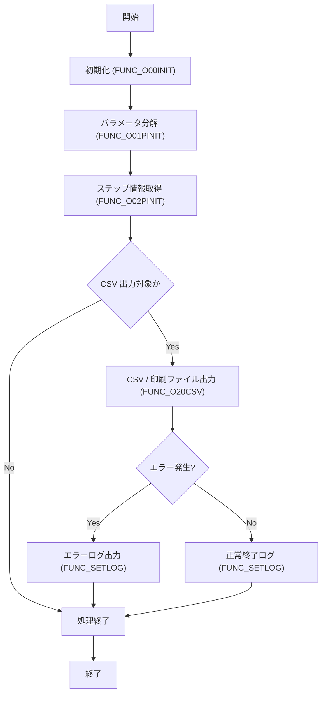

# GKBPA00040（学齢簿帳票情報出力）

## 1. 目的
学齢簿情報を個人番号と履歴連番をキーに取得し、CSV および印刷ファイル（EMF / PDF）へ出力するパッケージです。  
**注意**: コード中に業務シナリオの詳細なコメントはありません。上記説明はファイル冒頭のコメントからの推測です。

## 2. インターフェース

| パラメータ | モード | 型 | 説明 |
|-----------|--------|----|------|
| `i_sSTEP_NANE` | IN | NVARCHAR2 | 処理単位に付与するステップ名 |
| `i_nDEBUG_KBN` | IN | NUMBER | デバッグモード (1=デバッグ、0=通常) |
| `i_nSTATUSID` | IN | NUMBER | ログステータス (1=異常、0=情報) |
| `i_sSQLCODE` | IN | NVARCHAR2 | 異常時の SQLCODE |
| `i_sSQLERRM` | IN | NVARCHAR2 | 異常時の SQLERRM |
| `i_sERRMSG` | IN | NVARCHAR2 | エラーメッセージ文字列 |
| `i_sPARAM` | IN | NVARCHAR2 | CSV 形式の処理パラメータ文字列 |
| `i_sGYOUMUCODE` | IN | NVARCHAR2 | 業務コード |
| `i_TBLNAME` | IN | NVARCHAR2 | テーブル名 |
| `g_sIinkai` | IN | NVARCHAR2 | 帳票区分（内部で使用） |
| `i_KOJIN_NO` | IN | NUMBER | 個人番号 |
| `i_RIREKI_RENBAN` | IN | NUMBER | 履歴連番 |
| `i_KBN` | IN | NUMBER | 日付変換種別 |
| `i_YMD` | IN | NUMBER | 日付 (YYYYMMDD) |
| `i_NAIYO_CD_PRM` | IN | NUMBER | 内容コード（フラグ設定用） |
| `o_YMD` | OUT | NVARCHAR2 | 変換後の日付文字列 |
| `o_NAIYO_CD` | OUT | NUMBER | 内容コード取得結果 |
| `o_sCSV_RCNT` | OUT | NVARCHAR2 | CSV 出力件数 |
| `o_sCSVFILENAME` | OUT | NVARCHAR2 | CSV ファイル名 |
| `o_sPRTFILENAME` | OUT | NVARCHAR2 | 印刷ファイル名 |

## 3. コアフィールド

| フィールド | 型 | 説明 |
|------------|----|------|
| `c_ONLINE` | CONSTANT PLS_INTEGER | オンライン処理フラグ (1) |
| `c_OK` | CONSTANT PLS_INTEGER | 正常終了コード (0) |
| `c_ERR` | CONSTANT PLS_INTEGER | 異常終了コード (-1) |
| `c_EMF` | CONSTANT PLS_INTEGER | 印刷ファイル区分 EMF (1) |
| `c_PDF` | CONSTANT PLS_INTEGER | 印刷ファイル区分 PDF (2) |
| `c_EMFANDPDF` | CONSTANT PLS_INTEGER | 印刷ファイル区分 EMF+PDF (3) |
| `g_nJOBNUM` | NUMBER | ジョブ番号 |
| `g_sTANTOCODE` | CHAR(12) | 担当者コード |
| `g_sWSNUM` | NVARCHAR2(63) | 端末番号 |
| `g_sRECUPDKBNCODE` | CHAR(2) | 更新処理区分コード |
| `g_sBUNSHONUMLIST` | NVARCHAR2(1000) | 文書番号リスト |
| `g_sMESSAGE` | NVARCHAR2(4000) | メッセージ返却用 |
| `g_rOPRT` | KKATOPRT%ROWTYPE | オンラインジョブステップ情報 |
| `g_sCSV_RCNT` | NVARCHAR2(1000) | CSV 出力件数累積 |
| `g_sCSVFILENAME` | NVARCHAR2(1000) | CSV ファイル名累積 |
| `g_sPRTFILENAME` | NVARCHAR2(1000) | 印刷ファイル名累積 |
| `g_sSTARTDATE` | NVARCHAR2(23) | 処理開始日時 |
| `g_sKojinNo` | NUMBER | 個人番号（パラメータ展開用） |
| `g_sRirekiRenban` | NUMBER | 履歴連番（パラメータ展開用） |
| `g_sIinkai` | NUMBER | 帳票区分（パラメータ展開用） |
| `g_sSIENJYUSYO` | NVARCHAR2(1000) | 支援措置対象住所 |
| `g_sHAKOUTEXT` | NVARCHAR2(1000) | 発行部数テキスト |
| `BPRMFLG_001`〜`BPRMFLG_004` | BOOLEAN | フラグ制御用変数 |
| `BRTN` | BOOLEAN | 関数戻り値格納変数 |
| `RECGAKUREIBO` | GAKUREIBO%ROWTYPE | カーソルレコード型 |

## 4. 主なメソッド（3 以上）

| メソッド | 種別 | 戻り値 | 説明 |
|----------|------|--------|------|
| `FUNC_SETLOG` | 関数 | BOOLEAN | ログ出力ユーティリティ（`KKBPK5551.FSETOLOG` 呼び出し） |
| `FUNC_O00INIT` | 関数 | BOOLEAN | オンライン処理の開始日時初期化 |
| `FUNC_O01PINIT` | 関数 | BOOLEAN | パラメータ文字列を CSV に分解し、グローバル変数へ展開 |
| `FUNC_O02PINIT` | 関数 | BOOLEAN | ステップ情報取得（`KKBPK5551.FOPRTGet`） |
| `FUNC_O20CSV` | 関数 | BOOLEAN | CSV および印刷ファイル出力ロジック |
| `FUNC_PRMFLGSET` | 関数 | NUMBER | 制御フラグ設定ロジック |
| `PROC_GET_YMD` | 手続き | - | 日付変換（`KKAPK0020.FDAYEDIT` 呼び出し） |
| `PROC_GET_YMD1` | 手続き | - | 追加日付変換ロジック |

## 5. 依存関係

| 依存先 | 用途 |
|--------|------|
| [`KKBPK5551`](http://localhost:3000/projects/test_jip_1/wiki?file_path=code/plsql/KKBPK5551.SQL) | ログ出力、CSV 書き込み、ステップ情報取得 |
| [`KKAPK0020`](http://localhost:3000/projects/test_jip_1/wiki?file_path=code/plsql/KKAPK0020.SQL) | 日付変換ユーティリティ |
| `GKBTGAKUREIBO` | 学齢簿主テーブル（SELECT / MAX） |
| `GABTATENAKIHON` (B1, B2) | 保護者・本人情報取得 |
| `GKBTGAKUREIBO` (R) | 履歴情報取得（最新履歴） |
| `GKBTCHUGAKKO` (H) | 中学校区情報 |
| `GKBTKUIKIGAI` (I) | 区域外学校情報 |
| `GKBTYOGOGAKKO` (J) | 養護学校情報 |
| `GKBTZOKUGARA` (F1‑F4) | 保護者続柄（コメントアウト） |
| `GKBTTSHUGAKURIREKI` | 履歴更新情報（MAX 取得） |
| `KKATOPRT` | オンラインジョブステップ情報（ROWTYPE） |

## 6. ビジネスフロー

**フロー説明**  
1. `FUNC_O00INIT` で処理開始日時を取得。  
2. `FUNC_O01PINIT` が呼び出され、入力パラメータ文字列を CSV に分解し、個人番号・履歴連番・帳票区分等をグローバル変数へ展開。  
3. `FUNC_O02PINIT` がステップ情報（帳票名・印刷区分等）を取得。  
4. `FUNC_O20CSV` が実行され、対象テーブルの件数を取得し、0 件なら CSV 出力をスキップ。件数がある場合は `KKBPK5551.FCSVPUT` を用いて CSV と印刷ファイル（EMF / PDF）を生成。  
5. 途中で例外が捕捉された場合は `FUNC_SETLOG` で異常ログを出力し、`FALSE` を返す。正常終了時も `FUNC_SETLOG` で情報ログを出力。  

## 7. 例外処理

| メソッド | 例外シナリオ | 対応 |
|----------|--------------|------|
| `FUNC_SETLOG` | `WHEN OTHERS` | `FALSE` を返す |
| `FUNC_O00INIT` | `WHEN OTHERS` | `FALSE` を返す |
| `FUNC_O01PINIT` | `WHEN OTHERS` | `FALSE` を返す |
| `FUNC_O02PINIT` | `WHEN OTHERS` | `FALSE` を返す |
| `FUNC_O20CSV` | `WHEN OTHERS` | エラーログ出力後 `FALSE` を返す |
| `FUNC_PRMFLGSET` | `WHEN OTHERS` | `0` を返す |
| `PROC_GET_YMD` / `PROC_GET_YMD1` | `WHEN OTHERS` | 空文字列またはデフォルト値を設定 |

## 8. 設計特徴

- **定数とグローバル変数の分離**: 定数は `CONSTANT` で宣言し、可変情報は `g_` プレフィックスの変数に保持。  
- **ログ一元化**: すべての処理開始・終了・例外は `FUNC_SETLOG` 経由で `KKBPK5551.FSETOLOG` に委譲。  
- **動的 SQL**: CSV 出力件数取得やテーブル名組み立ては文字列結合で `EXECUTE IMMEDIATE` を使用。  
- **フラグ制御**: `FUNC_PRMFLGSET` で業務フラグを複数の条件分岐に基づき設定し、後続ロジックで参照。  
- **レコード型カーソル**: `RECGAKUREIBO` などの `%ROWTYPE` を利用し、テーブル構造変更に対してロバスト。  
- **例外捕捉の統一**: 主要メソッドはすべて `WHEN OTHERS` で捕捉し、ログ出力後に安全に終了。  

---