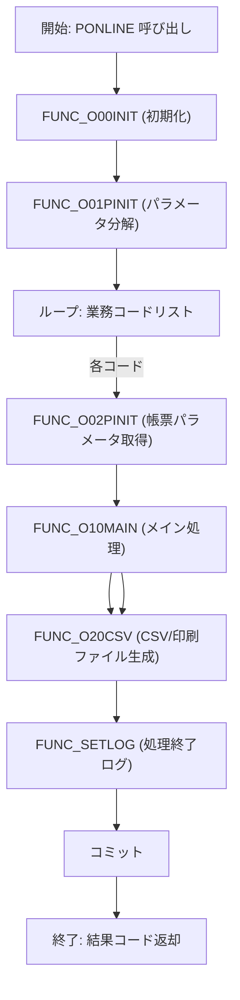

# GKBPA00050（就学時健康診断結果通知書即時）

## 1. 目的
就学時健康診断結果通知書即時を作成し、CSV および印刷ファイル（EMF／PDF）として出力するバッチ処理です。  
**注意**: 具体的な業務シナリオはコード中のコメントに記載がなく、上記説明はクラス名・コメントからの推測です。

## 2. コアフィールド

| フィールド | 型 | 説明 |
|------------|----|------|
| `c_ONLINE` | `PLS_INTEGER` | オンライン処理区分（1） |
| `c_OK` | `PLS_INTEGER` | 正常終了コード（0） |
| `c_ERR` | `PLS_INTEGER` | 異常終了コード（-1） |
| `c_EMF` | `PLS_INTEGER` | 印刷ファイル区分 EMF（1） |
| `c_PDF` | `PLS_INTEGER` | 印刷ファイル区分 PDF（2） |
| `c_EMFANDPDF` | `PLS_INTEGER` | 印刷ファイル区分 EMF+PDF（3） |
| `g_nJOBNUM` | `NUMBER` | ジョブ番号 |
| `g_sTANTOCODE` | `CHAR(12)` | 担当者コード |
| `g_sWSNUM` | `NVARCHAR2(63)` | 端末番号 |
| `g_sRECUPDKBNCODE` | `CHAR(2)` | 更新処理区分コード |
| `g_sBUNSHONUMLIST` | `NVARCHAR2(1000)` | 文書番号リスト |
| `g_sMESSAGE` | `NVARCHAR2(4000)` | メッセージ返却用 |
| `g_rOPRT` | `KKATOPRT%ROWTYPE` | オンラインジョブステップ情報 |
| `g_sCSV_RCNT` | `NVARCHAR2(1000)` | CSV 出力件数 |
| `g_sCSVFILENAME` | `NVARCHAR2(1000)` | CSV ファイル名 |
| `g_sPRTFILENAME` | `NVARCHAR2(1000)` | 印刷ファイル名 |
| `g_sSTARTDATE` | `NVARCHAR2(23)` | 処理開始時刻 |
| `g_sNKOJIN_NO` | `NUMBER` | 個人番号 |
| `g_sNRIREKI_RENBAN` | `NUMBER` | 履歴連番 |
| `g_nCHOHYO_KBN` | `NUMBER` | 帳票区分 |
| `g_sNHASSO_BI` | `NUMBER` | 発送日 |
| `g_sNIINKAI` | `NUMBER` | 教育委員会連番 |
| `g_sBUNSHOLIST` | `NVARCHAR2(1000)` | 文書番号リスト |
| `g_nSHIENSOCHIKBN` | `NUMBER` | 支援措置対象住所非表示フラグ |
| `g_nHAKKOSU` | `NUMBER` | 発行部数 |
| `c_ISUCCESS` | `PLS_INTEGER` | 正常（0） |
| `c_INOT_SUCCESS` | `PLS_INTEGER` | 異常（-1） |
| `c_CHOHYO_KBN` | `NUMBER(2)` | 健康診断通知書区分（5） |
| `I_RTN` | `PLS_INTEGER` | 戻り値格納変数 |
| `VKIJUNBI` | `PLS_INTEGER` | 年齢計算基準日 |
| `BRTN` | `BOOLEAN` | サブルーチン戻り値 |
| `ISAKUSEIBI` | `PLS_INTEGER` | 基準日（数値） |
| `NNENDO` | `PLS_INTEGER` | 年度 |
| `VHYOUJINENDO` | `NVARCHAR2(30)` | 年度文字列 |
| `DATE_IN` | `NUMBER` | 日付変数 |
| `USER_MEI` | `NVARCHAR2(1000)` | 教育委員会名 |
| `VTANTO_YAKUSHOKU_MEI` | `NVARCHAR2(1000)` | 役職名 |
| `VTANTO_SHUTHOU_MEI` | `NVARCHAR2(1000)` | 首長名 |
| `VTANTO_RITSU_MEI` | `NVARCHAR2(1000)` | ○○立 |
| `VTANTO_YUBIN_NO` | `NVARCHAR2(1000)` | 郵便番号 |
| `VTANTO_JUSHO` | `NVARCHAR2(1000)` | 住所 |
| `VTANTO_TEL` | `NVARCHAR2(1000)` | 電話番号 |
| `VTANTO_TEL_NAISEN` | `NVARCHAR2(1000)` | 内線 |
| `o_ACONSPRM` | `A_CONS_PRM` | 制御パラメータ配列 |
| `o_LENGTH` | `NUMBER` | 配列長 |
| `g_sCSV_RCNT` | `NVARCHAR2(1000)` | CSV 出力件数（累積） |
| `g_sCSVFILENAME` | `NVARCHAR2(1000)` | CSV ファイル名（累積） |
| `g_sPRTFILENAME` | `NVARCHAR2(1000)` | 印刷ファイル名（累積） |
| `g_sMESSAGE` | `NVARCHAR2(4000)` | エラーメッセージ格納 |

## 3. 主なメソッド

| メソッド | 種別 | 戻り値 | 说明 |
|----------|------|--------|------|
| `FUNC_SETLOG` | 関数 | `BOOLEAN` | ログ出力ユーティリティ |
| `FUNC_O00INIT` | 関数 | `BOOLEAN` | 初期化処理（開始時刻設定） |
| `FUNC_O01PINIT` | 関数 | `BOOLEAN` | パラメータ文字列（CSV）分解・グローバル変数展開 |
| `FUNC_O02PINIT` | 関数 | `BOOLEAN` | 帳票パラメータ取得 |
| `FUNC_O20CSV` | 関数 | `BOOLEAN` | CSV／印刷ファイル生成ロジック |
| `GET_EQRENRAKUSAKI` | 関数 | `VARCHAR2` | 教育委員会連絡先取得 |
| `PROC_GET_YMD` | 手続き | - | 日付 → 和暦変換 |
| `PROC_GET_YMD1` | 手続き | - | 和暦変換（区分別） |
| `FUNC_PRMFLGSET` | 関数 | `NUMBER` | 本名使用制御フラグ設定 |
| `FUNC_GET_JIDO_REC` | 関数 | `NUMBER` | 児童・保護者情報取得・レコード作成 |
| `FUNC_O10MAIN` | 関数 | `BOOLEAN` | メインビジネスロジック（CSV 作成・帳票出力） |
| `PONLINE` | 手続き | - | エントリーポイント：全体フロー制御 |

## 4. 依存関係

| 依存先 | 用途 |
|--------|------|
| [`KKBPK5551`](http://localhost:3000/projects/test_jip_1/wiki?file_path=code/plsql/KKBPK5551.SQL) | ログ出力、CSV 出力、パラメータ分解、印刷ファイル制御 |
| [`KKAPK0030`](http://localhost:3000/projects/test_jip_1/wiki?file_path=code/plsql/KKAPK0030.SQL) | 本名使用制御フラグ取得 |
| [`KKAPK0020`](http://localhost:3000/projects/test_jip_1/wiki?file_path=code/plsql/KKAPK0020.SQL) | 年齢計算、日付変換 |
| [`GKBFKHMCTRL`](http://localhost:3000/projects/test_jip_1/wiki?file_path=code/plsql/GKBFKHMCTRL.SQL) | 本名使用制御判定ロジック |
| [`GKBPK00010`](http://localhost:3000/projects/test_jip_1/wiki?file_path=code/plsql/GKBPK00010.SQL) | 教育委員会連絡先取得ユーティリティ |
| `GKBTGAKUREIBO` | 学齢簿テーブル（児童情報） |
| `GABTATENAKIHON` | 保護者・児童住所テーブル |
| `GKBTTSUCHISHOKANRI` | 通知書管理テーブル |
| `GKBTZOKUGARA` | 続柄テーブル |
| `GKBTTSUCHISHOKANRI` | 通知書条件管理 |
| `GKBTSHIMEIJKN` | 本名使用制御マスタ |
| `GKBTKUIKIGAI` | 区域外学校テーブル |
| `GKBTYOGOGAKKO` | 盲聾養護学校テーブル |
| `GKBTTSUCHISHOKANRI` | 通知文・様式番号取得 |
| `GKBWL060R001` | 出力先テーブル（CSV／印刷結果） |
| `A_CONS_PRM` | 制御パラメータ配列型 |

## 5. ビジネスフロー

### フロー詳細（手順）

1. **エントリーポイント** `PONLINE` が呼び出され、入力引数（業務コード・帳票番号・パラメータ等）を受け取ります。  
2. **初期化** `FUNC_O00INIT` が実行され、処理開始時刻 `g_sSTARTDATE` が設定されます。  
3. **パラメータ取得** `FUNC_O01PINIT` が実行され、`i_sPARAM`（CSV 形式文字列）を `KKBPK5551.FSplitStr` で分解し、グローバル変数へ展開します。  
4. **業務コードリスト** を `KKBPK5551.FSplitStr` で配列化し、`FOR` ループで各コードを処理します。  
5. **帳票パラメータ取得** `FUNC_O02PINIT` が実行され、帳票 ID と帳票番号を取得します。  
6. **メインロジック** `FUNC_O10MAIN` が呼び出され、  
   - 基準日・発送日設定  
   - `FUNC_GET_JIDO_REC` により児童・保護者情報取得・レコード作成  
   - `FUNC_O20CSV` による CSV／印刷ファイル生成  
   - `FUNC_SETLOG` で開始・終了ログを出力  
7. ループが完了したら `COMMIT` を実行し、出力件数・ファイル名・エラーメッセージを `OUT` パラメータに設定します。  
8. 正常終了コード `c_OK` を返して処理終了。

## 6. 主な内部サブプログラム

| 種別 | 名前 | 説明 |
|------|------|------|
| 関数 | `FUNC_SETLOG` | ログテーブル `GKBTTSUCHISHOKANRI` へ処理開始・終了・異常情報を書き込む |
| 関数 | `FUNC_O00INIT` | `g_sSTARTDATE` に現在日時を設定 |
| 関数 | `FUNC_O01PINIT` | 入力文字列 `i_sPARAM` を CSV 形式で分解し、グローバル変数へ展開 |
| 関数 | `FUNC_O02PINIT` | 業務コードと帳票番号から帳票パラメータを取得 |
| 関数 | `FUNC_O20CSV` | CSV と印刷ファイル（EMF／PDF）を生成し、ファイル名・件数を累積 |
| 関数 | `GET_EQRENRAKUSAKI` | 教育委員会連絡先（電話・郵便番号・住所）を取得 |
| 手続き | `PROC_GET_YMD` | 日付（数値） → 和暦文字列へ変換 |
| 手続き | `PROC_GET_YMD1` | 区分別に和暦変換ロジックを呼び出す |
| 関数 | `FUNC_PRMFLGSET` | 本名使用制御フラグ（1:使用, 0:非使用）を判定 |
| 関数 | `FUNC_GET_JIDO_REC` | 児童・保護者情報を取得し、`GKBWL060R001` へレコード挿入 |
| 関数 | `FUNC_O10MAIN` | メインロジック：`FUNC_GET_JIDO_REC` → `FUNC_O20CSV` の順に実行 |
| 手続き | `PONLINE` | エントリーポイント：全体フローを統括し、例外時はロールバック |

---

**備考**  
- 本パッケージは大量のテーブル・外部パッケージに依存しており、業務コードごとに複数レコードを生成する点が特徴です。  
- 例外処理は `WHEN NO_DATA_FOUND` を正常終了、`WHEN OTHERS` を異常終了として統一的に `c_ISUCCESS`／`c_INOT_SUCCESS` を返します。  
- ログ出力は `FUNC_SETLOG` を通じて統一的に管理され、処理開始・終了・異常時に必ず記録されます。  