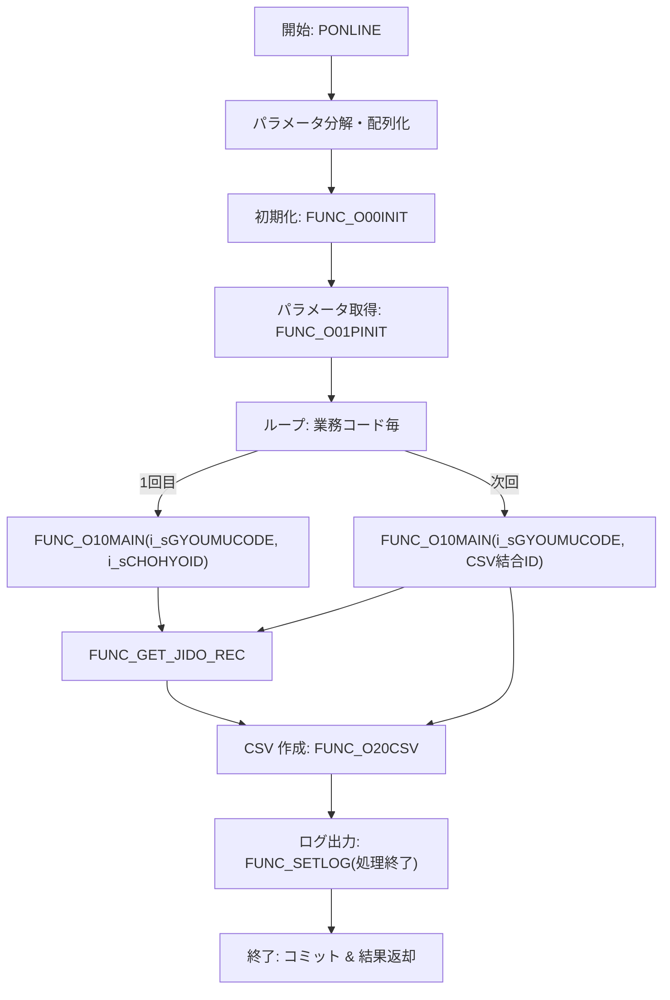

# GKBPA00060（パッケージボディ）

## 1. 目的
`GKBPA00060` は、転入・転学通知書（CSV／印刷ファイル）を生成する業務ロジックを提供するパッケージです。  
**注意**: コードに業務概要のコメントはありません。上記説明はクラス名・実装内容からの推測です。

## 2. 核心フィールド（主要なパッケージ変数）

| フィールド | 型 | 用途 |
|------------|----|------|
| `g_nKOJIN_NO` | NUMBER | 個人（本人）識別番号 |
| `g_NKOJIN_NO` | NUMBER | 住居者（保護者）識別番号 |
| `g_NHASSOBI` | NUMBER | 発送日（指定が無い場合は当日） |
| `g_sDATEED` | NVARCHAR2 | 文書日付（文書番号印字有無に応じて設定） |
| `g_vTOIAWASESAKI1` 〜 `g_vTOIAWASESAKI3` | NVARCHAR2 | 教育委員会名・住所・電話番号 |
| `g_rBUNNUMEDITKEKA` | RECORD | 文書番号編集結果（番号・印字フラグ） |
| `g_sWSNUM` | NVARCHAR2 | 端末番号（ログイン情報） |
| `g_sTANTOCODE` | NVARCHAR2 | 担当者コード |
| `g_sMESSAGE` | NVARCHAR2 | エラーメッセージ蓄積領域 |

## 3. 主要メソッド

| メソッド | 種別 | 戻り値 | 目的 |
|----------|------|--------|------|
| `FUNC_GET_JIDO_REC` | 関数 | NUMBER (`c_ISUCCESS` / `c_INOT_SUCCESS`) | 住居者情報取得カーソルを開き、レコードを `r_CHOHYO_001` にマッピングし CSV 用テーブル `GKBWL070R001` に挿入 |
| `FUNC_O10MAIN` | 関数 | BOOLEAN | メインビジネスロジック：パラメータ初期化 → 住居者情報取得 → CSV 作成 → ログ出力 |
| `PONLINE` | 手続き | - | エントリーポイント：入力パラメータ分解 → ループで業務コード毎に `FUNC_O10MAIN` を呼び出し → CSV/印刷ファイル生成・結果返却 |

## 4. 依存関係

| 依存先 | 種類 | 用途 |
|--------|------|------|
| [`KKBPK5551`](http://localhost:3000/projects/test_jip_1/wiki?file_path=code/plsql/KKBPK5551.SQL) | パッケージ | 文字列分割、文書番号取得、定数定義 |
| [`KKAPK0030`](http://localhost:3000/projects/test_jip_1/wiki?file_path=code/plsql/KKAPK0030.SQL) | パッケージ | パラメータ取得・制御フラグ取得 |
| [`GAAPK0030`](http://localhost:3000/projects/test_jip_1/wiki?file_path=code/plsql/GAAPK0030.SQL) | パッケージ | 住居者・保護者名取得 |
| [`KKAPK0010`](http://localhost:3000/projects/test_jip_1/wiki?file_path=code/plsql/KKAPK0010.SQL) | パッケージ | 郵便番号変換 |
| [`GKBPK00010`](http://localhost:3000/projects/test_jip_1/wiki?file_path=code/plsql/GKBPK00010.SQL) | パッケージ | 住居者番号取得（`FHOGOSHA`） |
| [`GKBFKHMCTRL`](http://localhost:3000/projects/test_jip_1/wiki?file_path=code/plsql/GKBFKHMCTRL.SQL) | パッケージ | 氏名・生年月日制御ロジック |
| [`GKBFKZKGMGET`](http://localhost:3000/projects/test_jip_1/wiki?file_path=code/plsql/GKBFKZKGMGET.SQL) | パッケージ | 続柄名称取得 |
| `c_ISUCCESS`、`c_INOT_SUCCESS`、`c_ONLINE`、`c_OK`、`c_ERR` | 定数 | 成功・エラーコード |
| `GKBWL070R001` | テーブル | CSV 出力用一時テーブル |
| `GKBTTSUCHISHOKANRI` | テーブル | 帳票管理マスタ |

## 5. ビジネスフロー

**フロー概要**  
1. `PONLINE` が呼び出され、入力文字列を分割して配列化。  
2. 初期化処理 (`FUNC_O00INIT`) とパラメータ取得 (`FUNC_O01PINIT`) を実行。  
3. 業務コードリストを走査し、各コードで `FUNC_O10MAIN` を実行。  
4. `FUNC_O10MAIN` 内で `FUNC_GET_JIDO_REC` が住居者情報を取得し、CSV 用テーブルに挿入。  
5. CSV 作成 (`FUNC_O20CSV`) 後、処理開始・終了をログに記録。  
6. すべてのループが完了したらコミットし、結果コードを返す。

## 6. 例外処理

| メソッド | 例外シナリオ | 対応 |
|----------|--------------|------|
| `FUNC_GET_JIDO_REC` | `NO_DATA_FOUND`（対象レコードなし） | 正常終了 (`c_ISUCCESS`) として処理を継続 |
| `FUNC_GET_JIDO_REC` | `OTHERS`（その他例外） | エラーコード・メッセージを `o_NSQLCODE` / `o_VSQLMSG` に格納し `c_INOT_SUCCESS` を返す |
| `FUNC_O10MAIN` | `OTHERS`（内部例外） | エラー情報取得後 `ERR` 例外を再送出 |
| `PONLINE` | `ePRMEXCEPTION`（パラメータ取得失敗） | 結果コード `c_ERR`、ロールバック、メッセージ返却 |
| `PONLINE` | `eSHORIEXCEPTION`（業務ロジック失敗） | 結果コード `c_ERR`、ロールバック、メッセージ返却 |
| `PONLINE` | `OTHERS`（予期しない例外） | 結果コード `c_ERR`、ロールバック、メッセージ返却 |

## 7. 設計特徴

- **パッケージ分割**: 業務ロジック (`FUNC_O10MAIN`)、データ取得 (`FUNC_GET_JIDO_REC`)、エントリーポイント (`PONLINE`) を明確に分離。  
- **動的 SQL とカーソル**: `OPEN GAKUREIBO` カーソルで住居者情報を取得し、`FOR i IN 1..g_nHAKKOSU LOOP` でレコードを逐次処理。  
- **例外一元化**: 各メソッドで `EXCEPTION` ブロックを設置し、エラー情報を共通変数 `g_sMESSAGE` に蓄積。  
- **外部パッケージ活用**: 文字列分割、パラメータ取得、氏名制御などを専用パッケージに委譲し、再利用性を確保。  
- **定数駆動**: 成功・エラーコード (`c_ISUCCESS` など) を定数で管理し、可読性と保守性を向上。  
- **CSV/印刷ファイル生成**: `FUNC_O20CSV` で CSV を生成し、`FUNC_SETLOG` で処理開始・終了をログに残す。  
- **条件分岐の細分化**: 住居者・保護者の有無、郵便番号の有無、氏名制御フラグなど多数の分岐で柔軟な帳票生成を実現。  