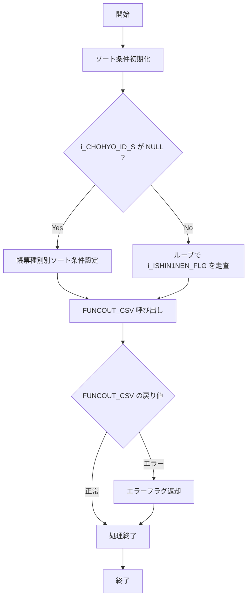

# GKBSKIDOTCH

## 1. 目的
異動通知の中間ファイルから CSV ファイルを作成する手続きです。  
**注意**: コード中に業務目的の詳細なコメントはありませんが、ヘッダーコメントの「異動通知CSV作成」から推測しています。

## 2. インターフェース
| パラメータ | モード | 型 | 説明 |
|------------|--------|----|------|
| `i_SHORI_BI` | IN | NUMBER | システム日付 |
| `i_SHORI_JIKAN` | IN | NUMBER | システム時間 |
| `i_TANMATU` | IN | VARCHAR2 | 端末番号 |
| `i_SHOKUIN_NO` | IN | VARCHAR2 | 職員個人番号 |
| `i_CHOHYO_ID` | IN | VARCHAR2 | 帳票 ID（定義体名） |
| `i_CHOHYO_ID_S` | IN | VARCHAR2 | 帳票 ID（新 1 年生用定義体名）※省略可 |
| `i_NRENBAN` | IN | NUMBER | ジョブ番号 |
| `i_vKOINFILENAME` | IN | VARCHAR2 | 認証コード名（2025/05/20 追加） |
| `i_vKATAGAKI1` | IN | VARCHAR2 | 認証コード肩書（2025/05/20 追加） |
| `i_vSHUCHOMEI` | IN | VARCHAR2 | 市町村長名（2025/05/20 追加） |
| `i_BATCH` | IN (デフォルト 2) | PLS_INTEGER | バッチ区分 |

## 3. 依存関係
| 依存先 | 種類 | 用途 |
|--------|------|------|
| [`c_BERROR`](http://localhost:3000/projects/test_jip_1/wiki?file_path=code/plsql/constants.sql) | 定数 | エラー状態の戻り値 |
| [`c_BNORMALEND`](http://localhost:3000/projects/test_jip_1/wiki?file_path=code/plsql/constants.sql) | 定数 | 正常終了の戻り値 |
| [`c_ISIN1NEN_FLG_SHIN1NEN`](http://localhost:3000/projects/test_jip_1/wiki?file_path=code/plsql/constants.sql) | 定数 | 新年度フラグ（TRUE） |
| [`c_ISIN1NEN_FLG_NOT_SHIN1NEN`](http://localhost:3000/projects/test_jip_1/wiki?file_path=code/plsql/constants.sql) | 定数 | 新年度フラグ（FALSE） |
| [`PROC_DAYEDIT`](http://localhost:3000/projects/test_jip_1/wiki?file_path=code/plsql/utilities.sql) | 手続き | 日付文字列の整形 |
| [`JIBSKDAYEDIT2`](http://localhost:3000/projects/test_jip_1/wiki?file_path=code/plsql/utilities.sql) | 手続き | 日付文字列の整形（代替） |
| [`FUNC_CREATE_CSV_004`](http://localhost:3000/projects/test_jip_1/wiki?file_path=code/plsql/GKBSKIDOTCH.SQL) | 関数 | 認証コード名取得を含む CSV 作成ロジック |
| `GKBWIDOTSUCHI` | テーブル | 異動通知中間ファイルの元データ |
| `GKBWL090R001` | テーブル | CSV 出力先テーブル（教育異動通知書） |
| `GKBWL290R001` | テーブル | CSV 出力先テーブル（旧版） |
| `GKBWL290R002` | テーブル | CSV 出力先テーブル（変更通知書） |
| `GKBWL290R003` | テーブル | CSV 出力先テーブル（変更通知リスト） |

## 4. ビジネスフロー

**フロー説明**  
1. **開始**: 手続きが呼び出される。  
2. **ソート条件初期化**: `VSORT_CLM` を空文字で初期化。  
3. **帳票種別判定**: `i_CHOHYO_ID_S` が未指定の場合、`i_CHOHYO_ID` に応じてソート条件を設定（変更通知書・変更通知リスト）。  
4. **CSV 作成**: `FUNCOUT_CSV` を呼び出し、内部で動的 SQL を組み立て `GKBWIDOTSUCHI` からデータ取得。帳票 ID が `GKB090R001` のときは `FUNC_CREATE_CSV_004`（認証コード名取得版）を実行。  
5. **結果判定**: `FUNCOUT_CSV` が `c_BNORMALEND` を返せば正常終了、`c_BERROR` ならエラーフラグを返す。  
6. **終了**: 手続きが終了する。

## 5. 例外処理
- 手続き全体と `FUNCOUT_CSV` 内で `WHEN OTHERS` を捕捉し、エラー時は `c_BERROR` を返すだけで詳細はロギングせずに終了します。

## 6. 設計特徴
- **定数管理**: エラー・正常終了コード、フラグはパッケージレベル定数で一元管理。  
- **動的 SQL**: `VSQL` に条件・ソートを組み立て、汎用的な SELECT 文を生成。  
- **バッチ処理**: `i_BATCH`、`i_NRENBAN` でバッチ区分・ジョブ番号を受け取り、出力レコードに埋め込む。  
- **拡張ポイント**: 2025/05/20 で追加された認証コード取得パラメータ (`i_vKOINFILENAME` など) により、同一手続きで新旧帳票を切り替えて利用可能。  
- **例外統一**: `WHEN OTHERS` で例外を捕捉し、エラーコードだけを返すシンプルな例外処理。  
- **内部サブルーチン**: `PROC_DAYEDIT`、`JIBSKDAYEDIT2` で日付文字列の正規化を行い、文字列操作の重複を排除。