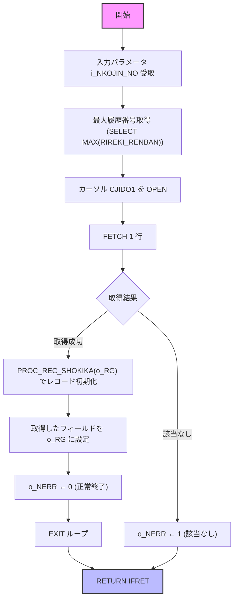

# GKBSKJDOG

## 1. 目的
個人番号（`i_NKOJIN_NO`）をキーに、児童情報テーブル **GKBTGAKUREIBO** から該当レコードを取得し、`o_RG`（`GKBTGAKUREIBO%ROWTYPE`）に設定して返すサブルーチンです。取得結果は `o_NERR` にエラーコードで示されます。

**注意**: コード中に業務内容のコメントはありません。上記の説明はコード構造からの推測です。

## 2. インターフェース

| パラメータ | モード | 型 | 説明 |
|------------|--------|----|------|
| `i_NKOJIN_NO` | IN | NUMBER | 児童個人番号（検索キー） |
| `o_RG` | OUT | `GKBTGAKUREIBO%ROWTYPE` | 取得した児童情報レコード |
| `o_NERR` | OUT | NUMBER | 結果コード 0 = 正常終了 1 = 該当なし 2 = その他エラー |

## 3. 主なサブルーチン

| 種類 | 名前 | 用途 |
|------|------|------|
| 手続き | `PROC_REC_SHOKIKA` | `o_RG` の全フィールドを初期化（0 または空文字） |
| 関数 | `FUNC_GET_JIDO_REC` | カーソル `CJIDO1` で児童情報を取得し、`o_RG` にマッピングする |
| 手続き | 本体（`BEGIN … END GKBSKJDOG;`） | エラーハンドリングを含むメインフロー |

## 4. 依存関係

| 依存先 | 用途 |
|--------|------|
| [`GKBTGAKUREIBO`](http://localhost:3000/projects/test_jip_1/wiki?file_path=code/plsql/GKBSKJDOG.SQL) | 児童情報テーブル（`%ROWTYPE` と SELECT の対象） |
| [`GKBSKJDOG`](http://localhost:3000/projects/test_jip_1/wiki?file_path=code/plsql/GKBSKJDOG.SQL) | 本手続き自身（再帰的に呼び出すことは無いが、同一ファイル内で定義） |

## 5. ビジネスフロー

**フロー説明**  
1. 入力された個人番号で最新の履歴番号を取得。  
2. カーソル `CJIDO1` を開き、該当レコードを取得。  
3. 取得できなければ `o_NERR` に「該当なし」(1) を設定し終了。  
4. 取得できた場合は `PROC_REC_SHOKIKA` で `o_RG` を初期化し、取得した各カラムを `o_RG` にマッピング。  
5. 正常終了コード (0) を `o_NERR` に設定し、処理を終了。  
6. 例外 (`NO_DATA_FOUND`、`OTHERS`) はそれぞれ `o_NERR` に適切なエラーコードを設定。

## 6. 例外処理

| メソッド | 例外シナリオ | 対応 |
|----------|--------------|------|
| `FUNC_GET_JIDO_REC` | `NO_DATA_FOUND` | `o_NERR ← 1`（該当なし） |
| `FUNC_GET_JIDO_REC` | `OTHERS` | `o_NERR ← 2`（その他エラー） |
| 本体 (`BEGIN … END`) | `OTHERS` | `o_NERR ← 2`（その他エラー） |

---