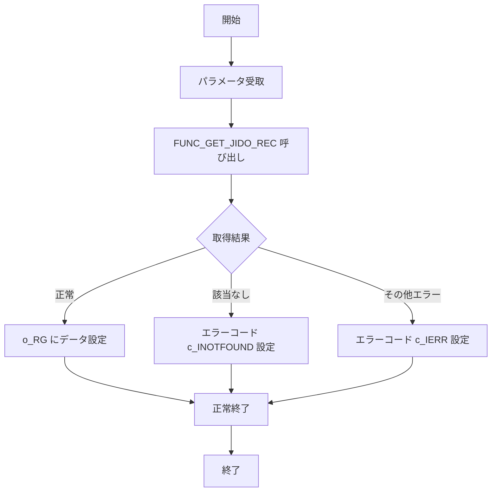

# GKBSKJDOG2（児童情報取得サブ）

## 1. 目的
個人番号（`i_NKOJIN_NO`）と履歴連番（`i_RIREKI_RENBAN`、`i_RIREKI_RENBAN_EDA`）をキーに、児童の学籍情報を取得し、`o_RG`（`GKBTGAKUREIBO%ROWTYPE`）に格納して返すサブルーチンです。  
**注意**: コード中に業務目的のコメントはありません。上記説明はクラス名・パラメータ・処理概要からの推測です。

## 2. コアフィールド（主要出力項目）

| フィールド | 型 | 説明 |
|------------|----|------|
| `KOJIN_NO` | NUMBER | 児童個人番号 |
| `RIREKI_RENBAN_EDA` | NUMBER | 児童履歴枝番 |
| `GENZON_KBN` | NUMBER | 在籍区分 |
| `ZO_JIYU_CD` | NUMBER | 在籍理由コード |
| `TOKUSOKU_JIYU1` 〜 `TOKUSOKU_JURI_BI10` | NUMBER / NVARCHAR2 | 各種特別措置情報 |
| `YUYO_JIYU_CD` | NUMBER | 受容理由コード |
| `MENJO_JIYU_CD` | NUMBER | 面接理由コード |
| `GAKKO_KBN_CD` | NUMBER | 学校区分コード |
| `GAKUKYU_CD` | NUMBER | 学級コード |
| `SEIBETSU` | NUMBER | 性別 |
| `JOTAI` | NUMBER | 状態 |
| `SYS_SAKUSEIBI` | NUMBER | 作成日 |
| `SYS_KOSHINBI` | NUMBER | 更新日 |
| `SYS_JIKAN` | NUMBER | 更新時間 |
| `SYS_SHOKUINKOJIN_NO` | NVARCHAR2 | 更新職員個人番号 |
| `SYS_TANMATU_NO` | NUMBER | 更新端末番号 |

> **注**: 上記は代表的な項目であり、`GKBTGAKUREIBO` テーブルに定義された全カラムが出力されます。

## 3. 主なサブルーチン

| 種類 | 名前 | 用途 |
|------|------|------|
| 手続き | `PROC_REC_SHOKIKA` | `o_RG`（`GKBTGAKUREIBO%ROWTYPE`）の全フィールドを初期化 |
| 関数 | `FUNC_GET_JIDO_REC` | カーソル `CJIDO1` で取得したレコードを `o_RG` にマッピングし、処理結果コードを返す |
| 手続き | `GKBSKJDOG2`（本体） | パラメータ受取 → `FUNC_GET_JIDO_REC` 呼び出し → エラーハンドリング |

## 4. 依存関係

| 依存先 | 用途 |
|--------|------|
| [`GKBTGAKUREIBO`](http://localhost:3000/projects/test_jip_1/wiki?file_path=code/plsql/GKBTGAKUREIBO.SQL) | 出力レコード型・取得対象テーブル |
| `CJIDO1` カーソル | `i_NKOJIN_NO`、`i_RIREKI_RENBAN`、`i_RIREKI_RENBAN_EDA` で検索する SELECT 文 |
| `PROC_REC_SHOKIKA`（同ファイル内） | 出力レコードの初期化 |
| `FUNC_GET_JIDO_REC`（同ファイル内） | データ取得ロジック |

## 5. ビジネスフロー

**フロー概要**  
1. **開始** – 手続き `GKBSKJDOG2` が呼び出される。  
2. **パラメータ受取** – `i_NKOJIN_NO`、`i_RIREKI_RENBAN`、`i_RIREKI_RENBAN_EDA` を取得。  
3. **FUNC_GET_JIDO_REC 呼び出し** – カーソル `CJIDO1` を開き、対象レコードを取得。  
4. **取得結果判定**  
   - 正常取得 → 取得したレコードを `o_RG` にマッピング。  
   - 該当なし → `o_NERR` に `c_INOTFOUND` を設定。  
   - その他エラー → `o_NERR` に `c_IERR` を設定し、SQL エラー情報を取得。  
5. **終了** – 呼び出し元へ結果コードと `o_RG` を返す。  

## 6. 例外処理

| メソッド | 例外シナリオ | 対応 |
|----------|--------------|------|
| `FUNC_GET_JIDO_REC` | `NO_DATA_FOUND`（該当レコードなし） | `c_INOTFOUND` を `o_NERR` に設定し、正常終了として扱う |
| `FUNC_GET_JIDO_REC` | `OTHERS`（その他例外） | `c_IERR` を `o_NERR` に設定し、`SQLCODE` と `SQLERRM` を取得 |
| `GKBSKJDOG2` 本体 | `OTHERS`（手続き全体の例外） | `c_IERR` を `o_NERR` に設定 |

---