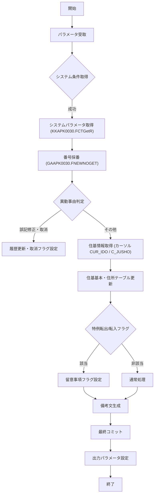

# JIBSOIEUPDB（イメージエントリデータ更新（仮更新用））

## 1. 目的
`JIBSOIEUPDB` は、イメージエントリの中間データを基に住基（住民基本情報）マスタを更新するプロシージャです。  
**注意**: コード中に業務シナリオの詳細な記述はありません。上記説明はクラス名・コメントからの推測です。

## 2. インターフェース

| パラメータ | モード | 型 | 説明 |
|------------|--------|----|------|
| `i_IENTRY_ID` | IN | PLS_INTEGER | エントリ ID（対象レコード） |
| `i_NTANMATSU_NO` | IN | VARCHAR2 | 端末番号 |
| `i_NSHOKUIN` | IN | NVARCHAR2 | 職員コード |
| `i_SHORIBI` | IN | NUMBER | 処理日（YYYYMMDD） |
| `i_IDO_JIYU` | IN | NUMBER | 異動事由コード |
| `i_ZENBUICHIBU` | IN | NUMBER | 全部一致部フラグ |
| `i_FUKI_FLG` | IN | NUMBER | 付随フラグ |
| `i_KEIBI_FLG` | IN | NUMBER | 経緯フラグ |
| `o_VKOJIN_NO` | OUT | VARCHAR2 | 更新後の個人番号 |
| `o_RIREKI_RENBAN` | OUT | VARCHAR2 | 更新後の履歴連番 |
| `o_IDO_JIYU` | OUT | VARCHAR2 | 更新後の異動事由 |
| `o_VSEATI_NO` | OUT | VARCHAR2 | SEATI 番号 |
| `o_ISHORIBI_KEY` | OUT | PLS_INTEGER | 処理日キー |
| `o_ISHORI_JIKAN_KEY` | OUT | PLS_INTEGER | 処理時間キー |
| `o_N_SQL_CODE` | OUT | NUMBER | SQL 実行結果コード |
| `o_V_SQL_MSG` | OUT | VARCHAR2 | SQL 実行結果メッセージ |

## 3. 依存関係

| 依存先 | 種類 | 用途 |
|--------|------|------|
| [`KKAPK0030`](http://localhost:3000/projects/test_jip_1/wiki?file_path=code/plsql/KKAPK0030.SQL) | パッケージ | システムパラメータ取得・番号採番 |
| [`GAAPK0030`](http://localhost:3000/projects/test_jip_1/wiki?file_path=code/plsql/GAAPK0030.SQL) | パッケージ | 番号採番ユーティリティ |
| `JIBWBUPD_JUKIKIHON` | テーブル | 宛名基本情報（作業用） |
| `JIBTJUKIIDO` | テーブル | 住基異動情報 |
| `JIBTJUKIKIHON` | テーブル | 住基基本情報 |
| `JIBTJUKIJUSHO` | テーブル | 住基住所情報 |
| `JIBTJUKIRIREKI` | テーブル | 住基履歴情報 |
| `JIBTJUKIBIKO` | テーブル | 住基備考情報 |
| `JIBWBUPD_JUKIIDO` | テーブル | 住基異動中間テーブル |
| `JIBWBUPD_KYUKOJINNO` | テーブル | 住基旧個人番号管理 |
| `JIBWBUPD_TSUSHORIREKI` | テーブル | 通称履歴（BUPD 用） |
| `JIBTTSUSHORIREKI` | テーブル | 通称履歴 |
| `JIBTJNTENSHUTSUKOJIN` | テーブル | 転出証明データ |
| `JIBTJNTENSHUTSUKOJIN` | テーブル | 転出証明データ（詳細） |
| `JIBTJUKIBIKO` | テーブル | 住基備考情報 |
| `JIBTKADOBI_KANRI` | テーブル | カード管理情報 |
| `JIBTJUKIJOHO` | テーブル | 住基住基情報 |
| `JIBTJUKIJOHO` | テーブル | 住基住基情報 |
| `JIBTJUKIJOHO` | テーブル | 住基住基情報 |
| `JIBTJUKIJOHO` | テーブル | 住基住基情報 |

> **注**: 上記テーブル・パッケージは同プロジェクト内の PL/SQL オブジェクトです。実際のファイルパスはプロジェクト構成に合わせて調整してください。

## 4. ビジネスフロー

**フロー概要**  
1. **開始** – プロシージャが呼び出され、入力パラメータを受け取る。  
2. **システム条件取得** – `PROC_GET_SYSTEMJOKEN*` 系列でシステムパラメータ（フラグ・番号）を取得。  
3. **番号採番** – `GAAPK0030.FNEWNOGET` により新規個人番号・世帯番号を取得（必要に応じて）。  
4. **異動事由判定** – 異動事由コードに応じて履歴更新・取消フラグを設定、または住基情報取得へ分岐。  
5. **住基情報取得** – カーソル `CUR_IDO`、`C_JUSHO` 等で住基異動・住所情報を取得。  
6. **住基テーブル更新** – 取得したデータを `JIBWBUPD_JUKIKIHON`、`JIBTJUKIIDO` などに INSERT / UPDATE。  
7. **特例転出/転入フラグ処理** – 留意事項が特例転出・転入の場合、フラグ `RIREKI_SENTAKUFUKA_FLG` を設定。  
8. **備考文生成** – 異動項目・留意事項から備考文 `T_BIKO_BUN` を組み立て。  
9. **最終コミット** – すべての DML が正常に完了したら COMMIT。  
10. **出力パラメータ設定** – 更新後の個人番号・履歴連番・異動事由等を OUT パラメータに設定。  
11. **終了** – プロシージャが正常終了。

## 5. 例外処理

| メソッド/サブルーチン | 例外シナリオ | 対応 |
|----------------------|--------------|------|
| `PROC_GET_SYSTEMJOKEN*` 系列 | `WHEN OTHERS` | フラグをデフォルト（0）に設定し続行 |
| 各 `SELECT ... INTO` | `NO_DATA_FOUND` / `OTHERS` | 変数に `NULL` またはデフォルト値を代入 |
| `GAAPK0030.FNEWNOGET` 呼び出し | `NRTN <> 0` | `o_N_SQL_CODE` にエラーコード、`o_V_SQL_MSG` にメッセージを設定し `RETURN` |
| カーソル取得時 | `WHEN OTHERS` | 例外を捕捉し処理を継続（ロジック上はフラグで分岐） |
| `INSERT / UPDATE` 文 | `WHEN OTHERS` | 例外が発生した場合はロールバックし、エラーコード/メッセージを OUT に設定 |

## 6. 設計特徴

- **分層アーキテクチャ**: プロシージャは「データ取得」「ビジネスロジック」「データ更新」の三層に分割され、カーソルでデータ取得、ロジック部で判定・加工、DML で永続化を行う。  
- **動的 SQL の回避**: ほとんどの処理は静的 SQL で実装され、パフォーマンスと保守性を確保。  
- **例外統一処理**: `WHEN OTHERS` での例外捕捉が多数配置され、エラー時のデフォルト値設定とログ出力（`ITASHARENKEI` 変数）を統一。  
- **フラグ駆動ロジック**: システムパラメータや異動事由コードに基づくフラグ (`NKADO_BI5`、`NJOKEN111` など) が多数使用され、条件分岐が集中。  
- **大量変数宣言**: 業務ロジックで使用する多数のローカル変数・配列が宣言され、可読性は低いが一括管理が意図されている。  
- **履歴管理**: 履歴連番・枝番 (`RIREKI_RENBAN`、`RIREKI_EDABAN`) の更新ロジックが複数箇所に散在し、履歴の正確性を担保。  
- **外部パッケージ依存**: 番号採番・システムパラメータ取得は外部パッケージ (`KKAPK0030`、`GAAPK0030`) に委譲し、共通ロジックを再利用。  